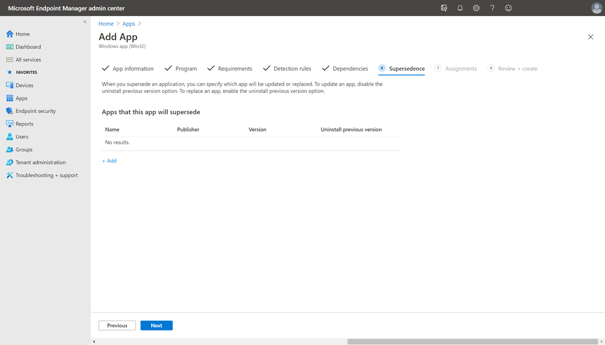
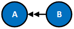
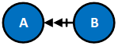
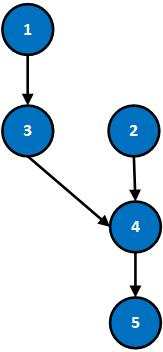

# Add Win32 app supersedence

After you [add a Win32 app to Intune](apps-win32-add.md), you can use Intune to create one or more supersedence relationships between apps. In general, supersedence is where you update or replace something. In Intune, supersedence enables you to update and replace existing Win32 apps with newer versions of the same app or an entirely different Win32 app. This article provides an overview of the supersedence feature.

> [!IMPORTANT]
> Supersedence, which enables you to update and replace a version of a Win32 app, doesn't currently allow you to interchange the Win32 app with an app dependency. For more information about app dependencies, see [Dependencies](../apps/apps-win32-add.md#step-5-dependencies).

Supersedence relationships can be created when adding or modifying a Win32 app within Intune. The **Supersedence** steps allow you to specify any supersedence relationships related to the Win32 app.

   

## Prerequisites

App supersedence can only be applied to Win32 apps. For more information, see [Add a Win32 app](apps-win32-add.md) to Intune.

A Microsoft Intune permission is required to create and edit Win32 app supersedence and dependency relationships with other apps. The permission is available under the **Mobile apps** category by selecting **Relate**. Starting in the **2202** service release, Intune administrators need this permission to add supersedence and dependency apps when creating or editing a Win32 app in Microsoft Intune admin center. To find this permission in [Microsoft Intune admin center](https://go.microsoft.com/fwlink/?linkid=2109431), choose **Tenant administration** > **Roles** > **All roles** > **Create**.

This Win32 app supersedence permission is added to the following built-in roles:

- Application Manager
- School administrator

> [!NOTE]
> To use auto-update to automatically update a superseded app, see [Use auto-update with app supersedence](#use-auto-update-with-app-supersedence).

## Create a Supersedence relationship in Intune

The following steps help you create a supersedence relationship between apps:

1. Sign in to the [Microsoft Intune admin center](https://go.microsoft.com/fwlink/?linkid=2109431).
2. Select **Apps** > **All apps**, and then select a Win32 app from the list. To add a Win32 app, see [add a Win32 app to Intune](apps-win32-add.md).
3. After you select the existing Win32 app, select **Properties**.
4. In the **Supersedence** section, select **Edit** > **Add** to choose apps that should be superseded.

    > [!NOTE]
    > There can be a maximum of 10 nodes in a supersedence relationship in Intune.

5. Find and select the apps to apply the supersedence relationship in the **Add Apps** pane. Click **Select** to add the apps to your supersedence list.
6. In the list of superseded apps, modify the **Uninstall previous version** option for each selected app to specify whether an uninstall command is sent by Intune to each selected app. If the installer of the current app updates the selected app automatically, then it isn't necessary to send an uninstall command. When replacing a selected app with a different app, it might be necessary to turn on the **Uninstall previous version** option to remove and replace the older app.
7. Once this step is finalized, select **Review + save** > **Save**.

    > [!IMPORTANT]
    > Superseding apps don't get automatic targeting. Each app must have explicit targeting to take effect. Superseding apps that aren't targeted are ignored by the agent. If the superseding app is targeted to a device with a superseded app, then the supersedence takes place regardless of whether the superseded app has targeting or not. For more information on Supersedence behavior, see the matrix below. This behavior is in direct contrast to dependencies, which doesn't require targeting. Additionally, only apps that are targeted show install statuses in Microsoft Intune admin center.

## Supersedence behavior

A *superseding app* is an app that updates or replaces other apps. A *superseded app* is an app that is being updated or replaced. Supersedence behavior can be illustrated based on the following scenarios.

| Scenarios | Targeting for required intent | Targeting for available intent |
|-|-|-|
| **Scenario   1:**  The superseded app exists on the device and **Uninstall previous version** is set to **Yes**. | The superseded app is uninstalled, and the superseding app are installed on the device.
 **NOTE:** Even if the superseded app isn't targeted, it's uninstalled. | Only superseding apps are shown in the company portal and can be installed. |
| **Scenario   2:** The superseded app exists on the device and **Uninstall previous version** is set to **No**. | The superseding app will be installed on the device. Whether the superseded app will be uninstalled or not is dependent on the superseding app's installer. | Only superseding apps are shown in the company portal and can be installed. |
| **Scenario   3:** The superseded app doesn't exist on the device. | The superseding app is   installed. | The new app appears in the   Company Portal. |

### Understand app update versus app replacement within supersedence

Given that an app could have multiple superseded apps, it's possible for an app to update a set of apps while replacing another set of apps at the same time.

> [!NOTE]
> End-users won't be able to check whether a specific Win32 app supersedence operation is an update or replacement in the Company Portal. In addition, when multiple apps supersede an app with available targeting in the Company Portal, the superseded app's details page navigates to the app page of the first superseding app that was set up. For example, if app A is superseded by apps B and C, and app B supersedes app A first, then app A's detail page in the Company Portal will navigate to App B.

Understanding how supersedence is applied when updating an app versus replacing an app can be illustrated based on the following scenario.

| Customer   scenario | Description | Expected behavior | Additional information |
|-|-|-|-|
| App   update | IT admin wants to update an app   with a newer version of the same app. | The installer of the newer   version of the app (the superseding app) will automatically update the older   version of the app to the newer version. | Since the installer completes the updating, it isn't necessary to send down an uninstall command   to the older version. Hence, the Uninstall previous version is toggled off. |
| App   replacement | IT admin wants to replace an app   with an entirely different app. | The superseded app is   uninstalled and the superseding app will be installed. Both install and   uninstall will be based on IT Pro's defined install/uninstall command line. | Since the two apps are different,   the admin can turn the Uninstall previous version toggle on to uninstall the   older app from the device. |

### Understand in-place app update versus supersedence app update

In the following scenarios, you should review app detection rules after performing either type of the following updates.

| Update   type | Update description and details |
|-|-|
| In-place   app update | <ul><li>With an   in-place app update, admin can only swap the app content, update the   metadata, and change the detection and install commands.</li>      <li>Admin can't change any of the fields that aren't stored on the   app with an in-place app update.  For   example, the admin can't modify targeting at the same time as an   update.</li>      <li>Admin can only perform the in-place app update one app at a   time.</li></ul> |
| Supersedence   app update | <ul><li>Admin can   update an app in its entirety with a new set of   configurations.</li>      <li>Admin can elect to send down an uninstall command to uninstall   previous app versions.</li>      <li>Admin can update devices containing multiple app versions to the   newest app version with one Supersedence configuration. The admin also   maintains access to older version of the app.</li></ul> |

### Understand interactions between dependencies and supersedence

Interactions between dependencies and supersedence include the following:

- Supersedence and dependency relationships can be created in the same app subgraph.
- Enforcement prefers supersedence over dependency, but if there's a conflict state, Intune will report it.
    - **Specific example:** A depends on B, C supersedes B. A will report a conflict state.
    - **Specific example #2:** A depends on B, C replaces A; C installs and A gets replaced. B gets left.
- Supersedence won't go through in specific scenarios. 
    - **Example:** A depends on B and C, and B supersedes C.  

## Basic Supersedence Examples

For the purposes of this document, we assume that all apps are targeted (either device or user targeting) and are applicable.

### Legend for supersedence example scenarios

| Legend | Definition |
|-|-|
|   | A is superseded by B via app update. |
|   | A is superseded by B via app   replacement. |
|   | A is present on the device,   fully installed, and   passes the defined detection rules. |
|   | A isn't present on the device. |

### Case and resolution supersedence examples

| Case | Resolution | Notes |
|-|-|-|
|  | **Scenario:** Neither app is   detected  on the device. A is superseded by B via app   update.
**Result:** Install B. | App   update means that admin chose not to uninstall the superseded app during the   configuration stage. See above in the Supersedence Step   in App Deployment. |
|  | **Scenario:** Only A is detected   on the device. A is superseded by B via app update.
**Result:**   Install B. | Since admin   chose not to uninstall the previous version during configuration, A isn't   explicitly uninstalled by Intune. A may be uninstalled based on the behavior   of B's installer. |
|  | **Scenario:** Only B is detected   on the device. A is superseded by B via app update.
**Result:**   Nothing. | Since B is   already detected on the device, no action is taken. |
|  | **Scenario:** Both apps are   detected on the device. A is superseded by B via app   update.
**Result:** Nothing. | Since B is   already detected on the device, no action is taken. Admin chose not to   uninstall the previous version when configuring, hence A isn't uninstalled. |
|  | **Scenario:** Neither apps are   detected on the device. A is superseded by B via app   replacement.
**Result:** Install B. | App replacement   means that admin chose to uninstall the superseded app during the   configuration stage. See above in the Supersedence Step   in App Deployment. |
|  | **Scenario:** Only A is detected   on the device. A is superseded by B via app replacement.
**Result:**   Uninstall A, then install B. | A will be   uninstalled and once the agent detects that A is no longer present on the   device, it installs B. If the detection continues to detect A as present,   then the agent won't install B. Whether B is installed on the device is   predicated on whether A is detected on the device. |
|  | **Scenario:** Only B is detected   on the device. A is superseded by B via app replacement.
**Result:**   None | No actions are   taken because B is already installed and A doesn't exist on the device. |
|  | **Scenario:** Both apps are   detected on the device. A is superseded by B via app   replacement.
**Result:** Uninstall A. | A is   uninstalled as part of the app replacement process.  Detection of a replaced app after the replacing app is already   installed will incur a remediation enforcement. |

## Behavior for Chained Supersedence Scenarios

Supersedence chains occur when multiple apps are part of a supersedence relationship. For example, an IT admin could configure App A to be superseded by App B, and then later configure App B to be superseded by App C. In this scenario, a supersedence chain is created between App A, B, and C (as shown in the first case below). Supersedence chains can have a maximum of 10 related nodes in the chain. For more information about this maximum, see [Supersedence Limitations](#supersedence-limitations).

>The behavior for supersedence chains can summarized as the following:
>
> - All apps in a supersedence chain will be superseded by the superseding app of the chain. In the example given above, the superseding app of the chain is App C.

To better understand the behavior of a supersedence chain, the following table provides a list of cases and resolutions. When reviewing these supersedence chains, assume all apps are targeted and are applicable to the device.

| Case | Resolution | Notes |
|-|-|-|
|  | **Scenario:**   None of the apps exist on the device. The relationship between apps is one of   app update.
**Result:** Install C. | Since   none of the apps exist on the device, we install the superseding app: App C.   The superseding app refers to the app that supersedes all other apps in the   chain. |
|  | **Scenario:**   Only Apps A and C exist on the device. The relationship between apps is one   of app update.
**Result:** None. | Since App C   already exists on the device and this is an app update scenario, App A isn't   uninstalled. |
|  | **Scenario:**   Only App A exists on the device. The relationship between apps is one of app   update.
**Result:** Install C. | Install App C. App A isn't uninstalled because it's an app update scenario.  C's installer may or may not   have behavior to remove A, where "remove" means A is no longer detected via   its detection rules (due to version detection). |
|  | **Scenario:** Only App C exists   on the device. The relationship between apps is one of app   update.
**Result:** None. | Since App C,   the superseding app, already exists on the device, and this case is an app update   scenario, no action is taken. |
|  | **Scenario:** None of the apps   exist on the device. The relationship between apps is one of app   replacement.
**Result:** Install C. | Since none of   the apps exist on the device, install the superseding app, App C. |
|  | **Scenario:** Apps A and C exist   on the device. The relationship between apps is one of app   replacement.
**Result:** Uninstall A. | Since App C   exists on the device and this case is an app replacement scenario, uninstall App A. |
|  | **Scenario:** Only App A exists   on the device. The relationship between apps is one of app   replacement.
**Result:** Uninstall A, then install C. | Since this case is   an app replacement scenario, App A is uninstalled and App C, the superseding   app, is installed. |
|  | **Scenario:** Only App C exists   on the device. The relationship between apps is one of app   replacement.
**Result:** None. | Since the   superseding app, App C, exists on the device and none of the other superseded   apps exist, no action is taken. |

## Supersedence Limitations

There can only be a maximum of 11 nodes in a single supersedence graph. The nodes include the superseding app, the superseded apps, and all subsequent related apps. 
In the following Supersedence diagram, there are five nodes in total. Hence, five more nodes could be created until the max node count is reached.

Other supersedence limitations:
- Azure Virtual Desktop multi-session only supports supersedence relationships with system-context (device-based) apps.
- Only apps that are targeted will show install statuses in Microsoft Intune admin center.

## Use auto-update with app supersedence

You can automatically update Win32 applications on an enrolled end user's device that have been deployed from the Company Portal. These Win32 apps that have been deployed as *available* can automatically be updated by setting both a supersedence relationship for the app and selecting **Auto-update** when setting the assignment. Additionally, the assignment type must be **Available for enrolled devices**. 

Users who had the superseded app installed from the Company Portal will automatically receive the superseding app. The supersedence auto-update only applies for *available* assignments, meaning users who have the superseded app through *required* intent won't receive the superseding app.

The following steps help you create an auto-update supersedence relationship between apps:

1. Add a Win32 app to supersede another Win32 app using the following steps:
   [Create a Supersedence relationship in Intune](#create-a-supersedence-relationship-in-intune)
2. On the **Supersedence** step, add the app that is updated.

   :::image type="content" alt-text="Screenshot of the Add Apps pane when superseding an app" source="./media/apps-win32-supersedence/apps-win32-supersedence-06.png" :::

3. On the **Assignments** step, add a group of users or devices under the **Available for enrolled devices** section.
4. Select the current setting for the group in the **Auto-update** column. The **Edit assignment** pane is displayed.

   :::image type="content" alt-text="Screenshot of the Edit assignment pane when setting auto-update" source="./media/apps-win32-supersedence/apps-win32-supersedence-07.png" :::

5. Select the **Auto-update** option.
6. Select **OK** to close the pane.
7. Select **Next** > **Create** to create your supersedence relationship to auto-update your Win32 app.

### Auto-update performance

In order for the user to receive the auto-update for the superseding app, two device check-ins for available apps are required.  

The first available check-in will commonly happen between 1-8 hours after the assignment is created. The second available check-in will commonly happen 8 hours after the first check-in. The total time to receive the superseding app will be 8-16 hours. In the best case scenario, auto-update performance is quicker.

### Auto-update limitations

A Win32 app can have a maximum of 10 superseding apps. User must be logged in to the device to receive the superseding app.

When an app is targeted with available intent to a group that contains the user, and the user requested the app install from the Company Portal, Intune creates a device based assignment to track both the user consent and internal targeting to process the app during check-in. This device based assignment is used to install the app on the devices. However, in situations where the targeting changes during the lifecycle of the app, a few scenarios can occur. If you take any of the following actions once the app is already installed on the device, Intune will remove user consent and the app will no longer be targeted with available intent:

1.	You remove the user from the Group membership of the targeted group in the Microsoft Entra admin center.
2.	You removed the assignment to the targeted group.
3.	You changed the intent of the app from **Available** to something else. For example, you could change the intent to **Unintall** or **Exclude**. 

It’s important to note that even if you re-target the app with **Available** intent later, the auto-update supersedence won't occur because user consent has been removed. 

> [!NOTE]
> The **Uninstall** intent takes precedence over **Available** intent.

### Auto-update retry behavior

If the superseding app failed to auto-update and install for any reason, Intune will retry indefinitely until the user requests an install of the app from the Company Portal. When the user requests to install the app, Intune will change the request type in the backend to reflect that the user installed and stop installation retries from continuing. 

### Auto-update scenarios

Below are specific cases where app B has been created to supersede app A.

| Case | Scenario | Result |
|---|---|---|
| App A   is still present on the device. | The upgrade is already triggered   after first available check-in, but before app B gets installed on the   device, the admin removes the relationship between app A and app B, making   them independent apps.  | During the second available   check-in, both apps are sent down to the device and app B will be   installed as an independent app.   |
| Auto   update setting changes  | The upgrade is already triggered   after first available check-in, but before app B gets installed on the   device, the admin changes the auto-update setting for app B to false.  | During the second available   check-in, app B is sent down to the device and app A will be upgraded   with app B on the device. |
| Uninstall   superseded app after superseding app entities created  | The upgrade is already triggered   after first available check-in, but before app B gets installed on the   device, the user requests an uninstall of app A and app A is removed from the   device. | During the second available   check-in, app B is sent down to the device and app A will be upgraded   with app B on the device.  |
| Uninstall   after supersedence update | App A was auto-updated to app B,   but app A wasn't removed from the device. Later, the user requests an   uninstall of app B from the device and app B is uninstalled successfully. | App A is still present on the   device. |
| Upgrade   failure  | Intune attempts to auto-update   app A to app B but the installation of app B failed and app A was already   removed from the device. | Users won't be able to   reinstall app A from the Company Portal as it's superseded by app B, but are   able to try to reinstall app B from the Company Portal. |

## Next steps

- [Troubleshoot Win32 app issues](apps-win32-troubleshoot.md)
- [Monitor app information and assignments with Microsoft Intune](apps-monitor.md)
- [Win32 app management in Microsoft Intune](apps-win32-app-management.md)
