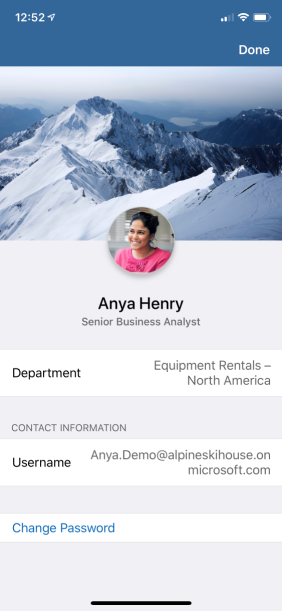
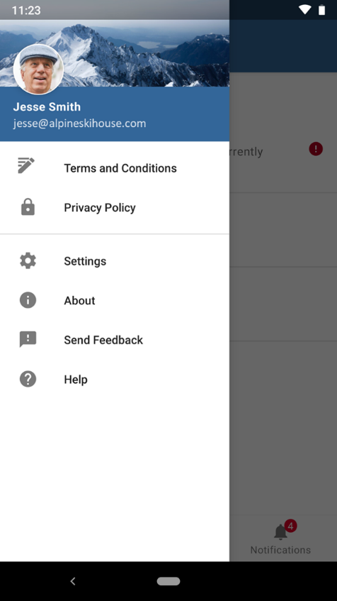
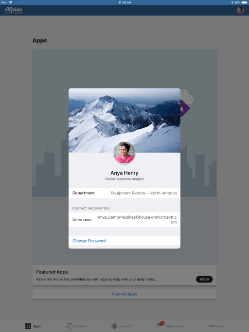
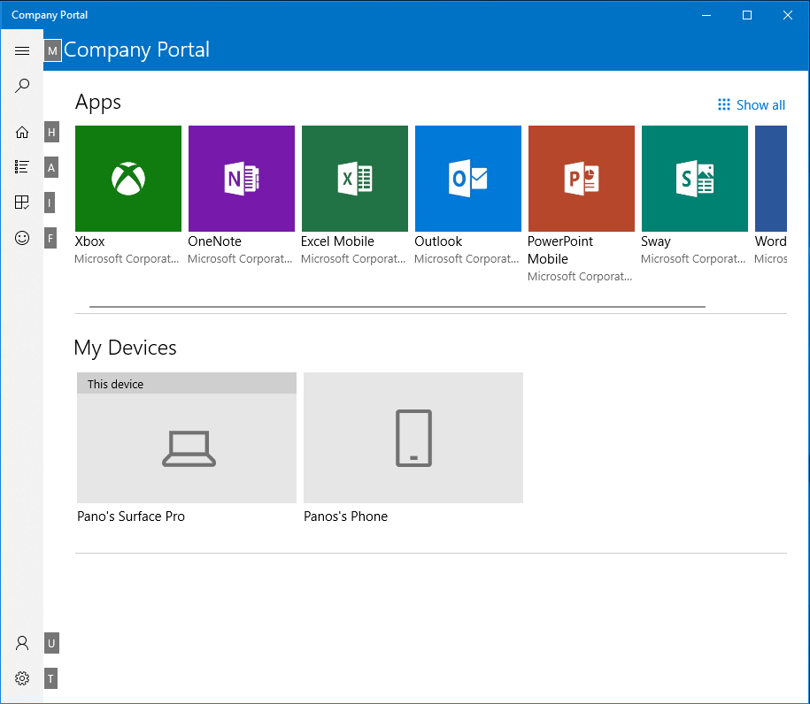

---
# required metadata

title: How to configure the Intune Company Portal apps, Company Portal website, and Intune app
titleSuffix: Microsoft Intune
description: Learn how you can configure the Intune Company Portal apps, Company Portal website, and Intune app.
keywords:
author: Erikre
ms.author: erikre
manager: dougeby
ms.date: 01/26/2023
ms.topic: how-to
ms.service: microsoft-intune
ms.subservice: apps
ms.localizationpriority: high
ms.technology:
ms.assetid: dec6f258-ee1b-4824-bf66-29053051a1ae

# optional metadata

#ROBOTS:
#audience:

ms.reviewer: abstarr
ms.suite: ems
search.appverid: MET150
#ms.tgt_pltfrm:
ms.custom: intune-azure
ms.collection:
- tier1
- M365-identity-device-management
- highpri
---

# How to configure the Intune Company Portal apps, Company Portal website, and Intune app

The Company Portal apps, Company Portal website, and Intune app on Android are where users access company data and can do common tasks. Common task may include enrolling devices, installing apps, and locating information (such as for assistance from your IT department). Additionally, they allow users to securely access company resources. The end-user experience provides several different pages, such as Home, Apps, App details, Devices, and Device details. To quickly find apps within the Company Portal, you can filter the apps on the Apps page.

> [!NOTE]
> The Company Portal supports Configuration Manager applications. This feature allows end users to see both Configuration Manager and Intune deployed applications in the Company Portal for co-managed customers. This new version of the Company Portal will display Configuration Manager deployed apps for all co-managed customers. This support will help administrators consolidate their different end user portal experiences. For more information, see [Use the Company Portal app on co-managed devices](../../configmgr/comanage/company-portal.md).
>
> The minimum supported version of the iOS Company Portal app is v4.16.0. If users are running v4.14.1 or below, they will be prompted for an update at login.

## Customizing the user experience

By customizing the end-user experience, you will help provide a familiar and helpful experience for your end users. To do this, navigate to [Microsoft Intune admin center](https://go.microsoft.com/fwlink/?linkid=2109431), and select **Tenant Administration** > **Customization**, where you can either edit the default policy or create up to 10 group targeted policies. These settings will apply to the Company Portal apps, Company Portal website, and Intune app on Android.

## Branding

The following table provides the branding customization details for the end-user experience:

| Field name | More information |
|---|---|---|
| **Organization name** | This name is displayed throughout the messaging in the end-user experience. It can be set to display in headers as well using the **Show in header** setting. Max length   is 40 characters. |
| **Color** | Choose **Standard** to choose from five standard colors. Choose **Custom** to select a specific color   based on a hex code value. |
| **Theme color** | Set theme color to show across end-user experience. We'll   automatically set the text color to black or white so that it's most visible   on top of your selected theme color. |
| **Show in header** | Select whether the header in the end-user experiences   should display the **Organization logo and name**, the **Organization logo only**, or the **Organization name only**. The preview boxes below will only show the logos, not the   name.  |
| **Upload logo for theme color background** | Upload the logo you want to show on top of your selected   theme color. For the best appearance, upload a logo with a transparent   background. You can see how this will look in the preview box below the   setting.
Recommended image height: Greater than 72 px Maximum file size:   750KB File type: PNG, JPG, or JPEG |
| **Upload logo for white or light background** | Upload the logo you want to show on top of white or light-colored backgrounds. For the best appearance, upload a logo with a   transparent background. You can see how this will look on a white background   in the preview box below the setting.
Recommended image height: Greater than 72 px Maximum file size: 750KB File type: PNG, JPG, or JPEG |
| **Upload brand image** | Upload an image that reflects   your organization's brand.
<ul><li>Recommended image   width: Greater than 1125 px</li><li>Maximum image size: 1.3 MB</li><li>File   type: PNG, JPG, or JPEG</li><li>It is displayed in these   locations:</li><ul><li>iOS/iPadOS Company Portal: Background image on   the user's profile page.</li><li>Windows Company Portal: Background image on the user's profile page.</li><li>Company Portal website:   Background image on the user's profile page.</li><li>Android   Intune app: In the drawer and as a background image on the user's profile   page.</li></ul></ul> |

> [!NOTE]
> When a user is installing an iOS/iPadOS application from the Company Portal they will receive a prompt. This occurs when the iOS/iPadOS app is linked to the app store, linked to a volume-purchase program (VPP), or linked to a line-of-business (LOB) app. The prompt allows the users to accept the action or allow management of the app. The prompt will display your company name, or when your company name is unavailable, **Company Portal** will be displayed.

### Brand image best practices

The right brand image can enhance the user's trust by presenting a strong sense of your organization's brand. Here are some tips you may want to consider for acquiring, choosing, and optimizing the image for the display locations.

- Reach out to your marketing or art department. They may already have an approved set of brand images. They may also be able to help you optimize images as needed.
- Consider both landscape and portrait composition. The image should have sufficient background surrounding the focal point. The image may be cropped differently based on device size, orientation, and platform.
- Avoid using a generic, stock image. The image should reflect your organization's brand and feel familiar to users. If you don't have one, it's better to not use one than use a generic one that has no meaning to your user.
- Remove unnecessary metadata. Image file can come with metadata such as camera profile, geo location, title, caption, and so on. Use an image optimization tool to strip out this information to maintain quality while meeting file size limit.

### Brand image examples

The following image shows an example of the brand image on an iPhone:

The following shows an example of the brand image in the Intune app for Android:

## Support information

Enter your organization's support information, so employees can reach out with questions. This support information will be displayed on **Support**, **Help & Support**, and **Helpdesk** pages across the end-user experience.

| Field name | Maximum length | More information |
|------------------------|----------------|-----------------------------------------------------------------------------------------------------------------------------------------------------------------------------------------------------------------------------------|
| Contact name | 40 | This name is who users will reach when they contact support. |
| Phone number | 20 | This number enables users to call for support. |
| Email address | 40 | This email address is where users can send emails for   support. You must enter a valid email address in the format `alias@domainname.com`. |
| Website name | 40 | This is the friendly name that is displayed in some   locations for the URL to the support website. If you specify a support   website URL and no friendly name, then the URL itself is displayed in the end-user experiences.  |
| Website URL | 150 | The support website that users should use. The URL must be   in the format `https://www.contoso.com`.  |
| Additional information | 120 | Include any additional support-related messaging to users   here. |

## Configuration

You can configure the Company Portal experience specifically for enrollment, privacy, notifications, device categories, app sources, and self-service actions.

### Enrollment

The following table provides enrollment-specific configuration details:

| Field name | Maximum length | More information |
|------------------------------------------------------|----------------|----------------------------------------------------------------------------------------------------------------------------------------------------------------------------------------------------------|
| Device enrollment | N/A | Specify if and how users should be prompted to enroll into mobile device management. For more information, see [Device enrollment setting options](../apps/company-portal-app.md#device-enrollment-setting-options). |

#### Device enrollment setting options

Support for the device enrollment setting requires end users have these Company Portal versions:
- Company Portal on iOS/iPadOS: version 4.4 or later
- Company Portal on Android: version 5.0.4715.0 or later 

> [!IMPORTANT]
> The following settings do not apply to iOS/iPadOS devices configured to enroll with [Automated Device Enrollment](../enrollment/device-enrollment-program-enroll-ios.md). Regardless of how these setting are configured, iOS/iPadOS devices configured to enroll with Automated Device Enrollment will enroll during the out of box flow and users will be prompted to sign in when they launch the Company Portal.
> 
> The following settings do apply to Android devices configured with [Samsung Knox Mobile Enrollment](../enrollment/android-samsung-knox-mobile-enroll.md) (KME). If a device has been configured for KME and device enrollment is set to Unavailable, the device will not be able to enroll during the out of box flow.
>
> For the Android Company Portal app, if Intune detects that the user's device is set up for [app protection policies without enrollment](../fundamentals/deployment-guide-enrollment-mamwe.md), the user will not get prompted to enroll in the Company Portal, even if the device enrollment setting is configured to prompt enrollment. This applies to all Android device types except Surface Duo devices.

|    Device enrollment   options    |    Description    |    Checklist prompts    |    Notification    |    Device details status    |    App visibility (for an app that requires enrollment)    |
|-----------------------------------|-------------------------------------------------------------------------------------------------------------------------|-------------------------|--------------------|-----------------------------|--------------------------------------------------------------------|
|    Available, with prompts    |    The default experience with prompts to enroll in all   possible locations.    |    Yes    |    Yes    |    Yes    |    Yes    |
|    Available, no prompts    |    User can enroll via the status in device details for   their current device or from apps that require enrollment.    |    No    |    No    |    Yes    |    Yes    |
|    Unavailable    |    There is no way for users to enroll. Apps requiring enrollment will be hidden.    |    No    |    No    |    No    |    No    |

### Privacy

The following table provides privacy-specific configuration details:

| Field name | Maximum length | More information |
|------------------------------------------------------|----------------|----------------------------------------------------------------------------------------------------------------------------------------------------------------------------------------------------------|
| Privacy statement URL | 79 | Set your organization's privacy statement to appear when   users click on privacy links. You must enter a valid URL in the format `https://www.contoso.com`. This is a mandatory field. |
| Privacy message about what support can't see or do (iOS/iPadOS) | 520 | Keep the default message or customize the message to list the items that your organization can't see on managed iOS/iPadOS devices. You can use markdown to add bullets, bolding, italics, and links.  |
| Privacy message about what support can see or do (iOS/iPadOS) | 520 | Keep the default message or customize the message to list the items that your organization can see on managed iOS/iPadOS devices. You can use markdown to add bullets, bolding, italics, and links.  |

For related information, see [Configure feedback settings for Company Portal and Microsoft Intune apps](../apps/company-portal-app.md#configure-feedback-settings-for-company-portal-and-microsoft-intune-apps).  

### Device categories  

You can allow or block the device category prompt in Intune Company Portal.  

| Field name | Maximum length | More information |
|------------------------------------------------------|----------------|----------------------------------------------------------------------------------------------------------------------------------------------------------------------------------------------------------|
| Let users select device categories in the Company Portal| N/A | If your tenant has device categories set up, users on targeted devices are prompted to choose a category when they sign in to Company Portal. Select **Block** to hide the prompt across all platforms. Select **Allow** to show the prompt.  Category selection is only offered once to end users for each device.     This setting is intended to be used with device categories. If there are no device categories in your tenant, no selection prompt will appear. For more information about creating device categories, see [Categorize devices into groups](../enrollment/device-group-mapping.md).  

### App sources

You can choose which additional app sources will be shown in Company Portal.

> [!NOTE]
> The Company Portal supports Configuration Manager applications. This feature allows end users to see both Configuration Manager and Intune deployed applications in the Company Portal for co-managed customers. For more information, see [Use the Company Portal app on co-managed devices](../../configmgr/comanage/company-portal.md).

The following table provides app source specific configuration details:

| Field name | Maximum length | More information |
|------------------------------------------------------|----------------|----------------------------------------------------------------------------------------------------------------------------------------------------------------------------------------------------------|
| Azure AD Enterprise Applications | N/A | Select **Hide** or **Show** to display **Azure AD Enterprise applications** in the Company Portal for each end user. For more information, see [App source setting options](../apps/company-portal-app.md#app-source-setting-options). |
| Office Online Applications | N/A | Select **Hide** or **Show** to display **Office Online applications** in the Company Portal for each end user. For more information, see [App source setting options](../apps/company-portal-app.md#app-source-setting-options). |
| Configuration Manager Applications | N/A | Select **Hide** or **Show** to display **Configuration Manager applications** in the Company Portal for each end user. For more information, see [App source setting options](../apps/company-portal-app.md#app-source-setting-options). |

#### App source setting options

> [!NOTE]
> The display of apps from the **Configuration Manager Applications** app source is only displayed in the Windows Company Portal. However, the display of apps from either the **Azure AD Enterprise Applications** app source or the **Office Online Applications** app source are displayed in the Windows Company Portal and the Company Portal website.

You can hide or show **Azure AD Enterprise applications**, **Office Online applications**, and **Configuration Manager applications** in the Company Portal for each end user. **Show** will cause the Company Portal to display the entire applications catalog from the chosen Microsoft service(s) assigned to the user. **Azure AD Enterprise applications** are registered and assigned via the [Microsoft Intune admin center](https://go.microsoft.com/fwlink/?linkid=2109431). **Office Online applications** are assigned using the licensing controls available in the [M365 Admin Center](https://admin.microsoft.com). In the [Microsoft Intune admin center](https://go.microsoft.com/fwlink/?linkid=2109431), select **Tenant administration** > **Customization** to find this configuration setting. By default, each additional app source will be set to **Hide**. 

### Customizing Remove and Reset device actions 

You can customize visibility of the **Remove** and **Reset** self-service device actions for Windows and iOS devices that are shown to end users across platforms in the Company Portal app, Company Portal website, and Intune app on Android. To prevent users from removing or resetting corporate Windows and iOS devices, you can hide these actions in **Tenant Administration** > **Customization**.

The following actions are available:
- Hide **Remove** button on corporate Windows devices. (This setting will always show as disabled because the **Remove** button for corporate Windows devices is always hidden.)
- Hide **Reset** button on corporate Windows devices.
- Hide **Remove** button on corporate iOS/iPadOS devices.
- Hide **Reset** button on corporate iOS/iPadOS devices.

> [!NOTE]
> These actions can be used to restrict device actions in the Company Portal app and website and do not implement any device restriction policies. To restrict users from performing factory reset or MDM removal from settings, you must configure device restriction policies.
> 
> Also, these customizations are only available in the default Customization policy, not in the group targeted Customization policies.

### Device compliance status in Company Portal website
End users can see the compliance status of their devices from the Company Portal website. End users can navigate to the [Company Portal](https://portal.manage.microsoft.com/devices) website and select the **Devices** page to see device status. Devices will be listed with a status of **Can access company resources**, **Checking access**, or **Can't access company resources**. For related information, see [Manage apps from the Company Portal website](../user-help/manage-apps-cpweb.md).

## Opening Web Company Portal applications
For Web Company Portal applications, if the end user has the Company Portal application installed, the end users will see a dialog box asking how they want to open the application when opening outside of the browser. If the app is not in the path of the Company Portal, then the Company Portal will open the homepage. If the app is in the path, then the Company Portal will open the specific app. 

Upon selecting the Company Portal, the user will be directed to the corresponding page in the application when the URI path is one of the following:

- `/apps` - The Web Company Portal will open the Apps page that lists all of the apps.
- `/apps/[appID]` - The Web Company Portal will open the Details page of the corresponding app.
- *The URI path is different or unexpected* - The Web Company Portal home page will be displayed.

If the user does not have the Company Portal app installed, the user will be taken to the Web Company Portal. 

> [!NOTE]
> To improve page load performance on the Company Portal website, app icons will now load in batches. End users may temporarily see a placeholder icon for some of their applications while loading the Company Portal website. 

For feedback related information, see [Configure feedback settings for Company Portal and Microsoft Intune apps](../apps/company-portal-app.md#configure-feedback-settings-for-company-portal-and-microsoft-intune-apps).

## Company Portal and Apple Setup Assistant for iOS/iPadOS

For iOS/iPadOS devices running 13.0 and later, when creating an Automated Device Enrollment profile, you can now choose a new authentication method: **Setup Assistant with modern authentication**. This method provides all the security from authenticating with the Company Portal but avoids the issue of leaving end users stuck on a device that they can't use while the Company Portal installs on the device. The user has to authenticate using Azure AD credentials during the setup assistant screens. This will require an additional Azure AD login post-enrollment in the Company Portal app to gain access to corporate resources protected by Conditional Access and for Intune to assess device compliance. The correct Company Portal version will automatically be sent down as a required app to the device for iOS/iPadOS, which we recommend choosing a VPP token for from the enrollment profile.

Enrollment is completed once the user lands on the home screen, and users can freely use the device for resources not protected by Conditional Access. User affinity is established when users complete the additional Azure AD login into the Company Portal app on the device. If the tenant has multi-factor authentication turned on for these devices or users, the users will be asked to complete multi-factor authentication during enrollment during Setup Assistant. Multi-factor authentication is not required, but it is available for this authentication method within Conditional Access if needed. 

## Company Portal derived credentials for iOS/iPadOS devices

Intune supports Personal Identity Verification (PIV) and Common Access Card (CAC) Derived Credentials in partnership with credential providers DISA Purebred, Entrust, and Intercede. End users will go through additional steps post-enrollment of their iOS/iPadOS device to verify their identity in the Company Portal application. Derived Credentials will be enabled for users by first setting up a credential provider for your tenant, then targeting a profile that uses Derived Credentials to users or devices.

> [!NOTE]
> The user will see instructions about derived credentials based on the link that you have specified via Intune.

For more information about derived credentials for iOS/iPadOS devices, see [Use derived credentials in Microsoft Intune](../protect/derived-credentials.md).

## Dark Mode for the Company Portal

Dark Mode is available for the iOS/iPadOS, macOS, and Windows Company Portal. Users can download apps, manage their devices, and get IT support in the color scheme of their choice based on device settings. The iOS/iPadOS, macOS, and Windows Company Portal will automatically match the end user's device settings for dark or light mode.

## Windows Company Portal keyboard shortcuts

End users can trigger navigation, app, and device actions in the Windows Company Portal using keyboard shortcuts (accelerators).

The following keyboard shortcuts are available in the Windows Company Portal app.

| Area | Description | Keyboard shortcut |
|--------------------|----------------|-------------------|
| Navigation menu | Navigation | Alt+M |
|  | Home | Alt+H |
|  | All apps | Alt+A |
|  | All devices | Alt+D |
|  | Downloads & updates | Alt+U |
|  | Send feedback | Alt+F |
|  | My profile | Alt+P |
|  | Settings | Alt+T |
| Device tile | Rename | F2 |
|  | Remove | Ctrl+D or Delete |
|  | Check access | Ctrl+M or F9 |
| Device details | Rename | F2 |
|  | Remove | Ctrl+D or Delete |
|  | Check access | Ctrl+M or F9 |
| App details | Install | Ctrl+I |
| Apps list tile | Install | Ctrl+I |
| Apps list item | Install | Ctrl+I |

End users will also be able to see the available shortcuts in the Windows Company Portal app.

## User self-service device actions from the Company Portal

Users can perform actions on their local or remote devices via the Company Portal app, Company Portal website, or the Intune app on Android. The actions that a user can perform vary based on device platform and configuration. In all cases, the remote device actions can only be performed by device's Primary User.  

Available self-service device actions include the following:

- **Retire** – Removes the device from Intune Management. In the company portal app and website, this shows as **Remove**.
- **Wipe** – This action initiates a device reset. In the company portal website this is shown as **Reset**, or **Factory Reset** in the iOS/iPadOS Company Portal App.
- **Rename** – This action changes the device name that the user can see in the Company Portal. It does not change the local device name, only the listing in the Company Portal.
- **Sync** – This action initiates a device check-in with the Intune service. This shows as **Check Status** in the Company Portal.
- **Remote Lock** – This locks the device, requiring a PIN to unlock it.
- **Reset Passcode** – This action is used to reset device passcode. On iOS/iPadOS devices the passcode will be removed and the end user will be required to enter a new code in settings. On supported Android devices, a new passcode is generated by Intune and temporarily displayed in the Company Portal.
- **Key Recovery** – This action is used to recover a personal recovery key for encrypted macOS devices from the Company Portal website. 

To customize the available user self-service actions, see [Customizing user self-service actions for the Company Portal](../apps/company-portal-app.md#customizing-remove-and-reset-device-actions).

### Self-Service Actions

Some platforms and configurations do not allow self-service device actions. This table below provides further details about self-service actions:

| Action | Windows 10(3) | iOS/iPadOS(3) | macOS(3) | Android(3) |
|----------------------|--------------------------|-------------------|-----------------------------------|-------------------------|
| Retire | Available(1) | Available(9) | Available | Available(7) |
| Wipe | Available | Available(5)(9) | NA | Available(7) |
| Rename(4) | Available | Available | Available | Available |
| Sync | Available | Available | Available | Available |
| Key Recovery | NA | NA | Available(2) | NA |

(1) **Retire** is always blocked on Azure AD Joined Windows devices. 
(2) **Key Recovery** for macOS is only available via the Web Portal. 
(3) All remote actions are disabled if using a Device Enrollment Manager enrollment. 
(4) **Rename** only changes the device name in the Company Portal app or Web Portal, not on the device. 
(5) **Wipe** is not available on User Enrolled iOS/iPadOS devices. 
(6) **Reset Passcode** is not supported on some Android and Android Enterprise configurations. For more information, see [Reset or remove a device passcode in Intune](../remote-actions/device-passcode-reset.md). 
(7) **Retire** and **Wipe** are not available on Android Enterprise Device Owner scenarios (COPE, COBO, COSU). 
(8) **Reset Passcode** is not supported on User Enrolled iOS/iPadOS devices. 
(9)All iOS/iPadOS Automated Device Enrollment devices (formerly known as DEP)  have **Retire** and **Wipe** options disabled.

### App logs  

App users can share their logs with you when requesting help through the Intune Company Portal app or Microsoft Intune app. If you're using Azure Government, users get to select their sharing preference when they initiate the sharing process. If you're not using Azure Government, user-submitted logs are sent directly to Microsoft support or the admin center.

> [!IMPORTANT]
> Support for accessing mobile app diagnostics in the admin center is in public preview. For more information, see [Public preview in Microsoft Intune](../fundamentals/public-preview.md).  

You can download user-submitted mobile app diagnostics in the admin center for the Android, AOSP, and Windows versions of the Company Portal app. To download user-submitted logs, go to **Troubleshooting + support** > **Diagnostics**. For more information, see [Use the troubleshooting dashboard to help users at your company](../fundamentals/help-desk-operators.md).   

> [!NOTE]
> Consistent with Microsoft and Apple policy, we do not sell any data collected by our service to any third parties for any reason.

## Company Portal app notifications

The Company Portal app can store, as well as display, push notifications sent to your users' devices from the Microsoft Intune admin center. Users who have opted in to receive Company Portal push notifications can view and manage the customized stored messages that you send to their devices in the **Notifications** tab of the Company Portal.

> [!NOTE]
> Users must updated to recent versions of the Android Company Portal (version 5.0.5291.0, released in October 2021) or Android Intune app (version 2021.09.04, released in September 2021) to receive custom notifications on Android devices. If users do not update prior to Intune's November (2111) service release and they are sent a custom notification, they will instead receive a notification telling them to update their app to view the notification. Once they update their app, they will see the message sent by your organization in the Notifications section in the app.

Notifications from the iOS/iPadOS Company Portal app are now delivered to devices using the default Apple sound, rather than being delivered silently. To turn the notification sound off from the iOS/iPadOS Company Portal app, select **Settings** > **Notifications** > **Comp Portal** and select the **Sound** toggle.

For more information about notifications, see [Receive a custom notification](../remote-actions/custom-notifications.md#receive-a-custom-notification).

## Configure feedback settings for Company Portal and Microsoft Intune apps

There are a number of M365 enterprise policies which affect whether feedback must be enabled or disabled for currently logged users. These policies are available via the [Microsoft 365 Apps admin center](https://config.office.com/). In relation to Microsoft Intune, these policies affect feedback and surveys for the Intune Company Portal app, the Web Company Portal, and Microsoft Intune app.

M365 feedback policies include the following policies:

| Policy   Name | Default State | Policy Summary |
|---|---|---|
| Allow the use of connected experiences in Office | Enabled | Controls whether clients can use the suite of connected experiences, including feedback. |
| Allow users to submit feedback to Microsoft | Enabled | Controls the feedback entry points across applications. |
| Allow users to receive and respond to in-product surveys from Microsoft | Enabled | Controls the survey prompts within the product. |
| Allow users to include screenshots and attachments when they submit feedback to Microsoft | Disabled | Controls the metadata the user can decide to submit with the feedback and survey. |
| Allow Microsoft to follow up on feedback submitted by users | Disabled | Controls whether the user can share contact info with the feedback and survey. |
| Allow users to include log files and content samples when feedback is submitted to Microsoft | Disabled | Controls the metadata the user can decide to submit with the feedback and survey. |

To configure feedback policy settings:

1. Go to [Microsoft 365 Apps admin center](https://config.office.com/) and login.
2. Select **Customization** > **Policy Management** > **Create**.
3. Enter **name** and **description**.
4. Choose the type of user that this policy will apply.
5. Choose the group for your tenant that this policy will apply.
6. Search for **Feedback** and **Survey** to find and select the policies.
7. For each policy listed, set the value to either **Enabled** or **Disabled**.

## Next steps

- [Configure your organization's logo and brand color for new tab pages in Microsoft Edge for iOS and Android](manage-microsoft-edge.md#organization-logo-and-brand-color)
- [Add apps](apps-add.md)
