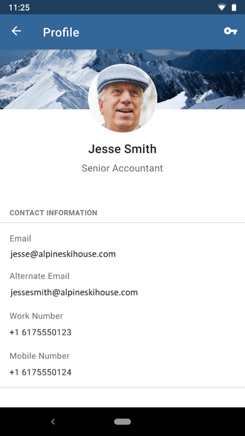

---
# required metadata

title: How to customize the Intune Company Portal apps, Company Portal website, and Intune app
titleSuffix: Microsoft Intune
description: Learn how you can apply company-specific branding to the Intune Company Portal apps, Company Portal website, and Intune app.
keywords:
author: Erikre
ms.author: erikre
manager: dougeby
ms.date: 05/07/2020
ms.topic: conceptual
ms.service: microsoft-intune
ms.subservice: apps
ms.localizationpriority: high
ms.technology:
ms.assetid: dec6f258-ee1b-4824-bf66-29053051a1ae

# optional metadata

#ROBOTS:
#audience:

ms.reviewer: esthermsft
ms.suite: ems
search.appverid: MET150
#ms.tgt_pltfrm:
ms.custom: intune-azure
ms.collection: M365-identity-device-management
---

# How to customize the Intune Company Portal apps, Company Portal website, and Intune app

The Company Portal apps, Company Portal website, and Intune app on Android are where users access company data and can do common tasks. Common task may include enrolling devices, installing apps, and locating information (such as for assistance from your IT department). Additionally, they allow users to securely access company resources. The end-user experience provides several different pages, such as Home, Apps, App details, Devices, and Device details. To quickly find apps within the Company Portal, you can filter the apps on the Apps page.

## Customizing the user experience

By customizing the end-user experience, you will help provide a familiar and helpful experience for your end users. To do this, navigate to [Microsoft Endpoint Manager admin center](https://go.microsoft.com/fwlink/?linkid=2109431), and select **Tenant Administration** > **Customization**, where you can either edit the default policy or create up to 10 group targeted policies. These settings will apply to the Company Portal apps, Company Portal website, and Intune app on Android.

## Branding

The following table provides the branding customization details for the end-user experience:

| Field name | More information |
|---|---|---|
| **Organization name** | This name is displayed throughout the messaging in the end-user experience. It can be set to display in headers as well using the **Show in header** setting. Max length   is 40 characters. |
| **Color** | Choose **Standard** to choose from five standard colors. Choose **Custom** to select a specific color   based on a hex code value. |
| **Theme color** | Set theme color to show across end-user experience. We'll   automatically set the text color to black or white so that it's most visible   on top of your selected theme color. |
| **Show in header** | Select whether the header in the end-user experiences   should display the **Company logo and name**, the **Company logo only**, or the **Company name only**. The preview boxes below will only show the logos, not the   name.  |
| **Upload logo for theme color background** | Upload the logo you want to show on top of your selected   theme color. For the best appearance, upload a logo with a transparent   background. You can see how this will look in the preview box below the   setting.
Maximum image size: 400 x 400 px Maximum file size:   750KB File type: PNG, JPG, or JPEG |
| **Upload logo for white or light background** | Upload the logo you want to show on top of white or light-colored backgrounds. For the best appearance, upload a logo with a   transparent background. You can see how this will look on a white background   in the preview box below the setting.
Maximum image size: 400 x 400   px Maximum file size: 750KB File type: PNG, JPG, or JPEG |
| **Upload brand image** | Upload an image that reflects   your organization's brand.
<ul><li>Recommended image   width: Greater than 1125 px (required to be at least 650   px)</li><li>Maximum image size: 1.3 MB</li><li>File   type: PNG, JPG, or JPEG</li><li>It is displayed in these   locations:</li><ul><li>iOS/iPadOS Company Portal: Background image on   the user's profile page.</li><li>Company Portal website:   Background image on the user's profile page.</li><li>Android   Intune app: In the drawer and as a background image on the user's profile   page.</li></ul></ul> |

> [!NOTE]
> When a user is installing an iOS/iPadOS application from the Company Portal they will receive a prompt. This occurs when the iOS/iPadOS app is linked to the app store, linked to a volume-purchase program (VPP), or linked to a line-of-business (LOB) app. The prompt allows the users to accept the action or allow management of the app. The prompt will display your company name, or when your company name is unavailable, **Company Portal** will be displayed.

### Brand image best practices

The right brand image can enhance the user's trust by presenting a strong sense of your organization's brand. Here are some tips you may want to consider for acquiring, choosing, and optimizing the image for the display locations.

- Reach out to your marketing or art department. They may already have an approved set of brand images. They may also be able to help you optimize images as needed.
- Consider both landscape and portrait composition. The image should have sufficient background surrounding the focal point. The image may be cropped differently based on device size, orientation, and platform.
- Avoid using a generic, stock image. The image should reflect your organization's brand and feel familiar to users. If you don't have one, it's better to not use one than use a generic one that has no meaning to your user.
- Remove unnecessary metadata. Image file can come with metadata such as camera profile, geo location, title, caption, and so on. Use an image optimization tool to strip out this information to maintain quality while meeting file size limit.

### Brand image examples

The following image shows an example of the brand image on an iPhone:

The following shows an example of the brand image in the Intune app for Android:

## Support information

Enter your organization's support information, so employees can reach out with questions. This support information will be displayed on **Support**, **Help & Support**, and **Helpdesk** pages across the end-user experience.

| Field name | Maximum length | More information |
|------------------------|----------------|-----------------------------------------------------------------------------------------------------------------------------------------------------------------------------------------------------------------------------------|
| Contact name | 40 | This name is who users will reach when they contact support. |
| Phone number | 20 | This number enables users to call for support. |
| Email address | 40 | This email address is where users can send emails for   support. You must enter a valid email address in the format `alias@domainname.com`. |
| Website name | 40 | This is the friendly name that is displayed in some   locations for the URL to the support website. If you specify a support   website URL and no friendly name, then the URL itself is displayed in the end-user experiences.  |
| Website URL | 150 | The support website that users should use. The URL must be   in the format `https://www.contoso.com`.  |
| Additional information | 120 | Include any additional support-related messaging to users   here. |

## Configuration

The following table provides additional configuration details:

| Field name | Maximum length | More information |
|------------------------------------------------------|----------------|----------------------------------------------------------------------------------------------------------------------------------------------------------------------------------------------------------|
| Privacy statement URL | 79 | Set your organization's privacy statement to appear when   users click on privacy links. You must enter a valid URL in the format `https://www.contoso.com`. |
| Privacy message in the Company Portal for iOS/iPadOS | 520 | Keep the Default or set   a Custom message to list the items that your organization can or can't see on managed iOS/iPadOS devices. You can use markdown to add bullets, bolding, italics, and links. |
| Device enrollment | N/A | Specify if and how users should be prompted to enroll into   mobile device management. Details below. |
| Device ownership notification | N/A | Send a push notification to both your Android and iOS Company Portal users when their device ownership type has been changed from personal to corporate. By default, this push notification is set to off. When device ownership is set to corporate ownership, Intune has greater access to the device, which include the full app inventory, FileVault key rotation, phone number retrieval, and a select few remote actions. For more information, see [Change device ownership](../enrollment/corporate-identifiers-add.md#change-device-ownership).  |

### Device enrollment setting options

> [!NOTE]
> Support for the device enrollment setting requires end users have these Company Portal versions:
> - Company Portal on iOS/iPadOS: version 4.4 or later
> - Company Portal on Android: version 5.0.4715.0 or later 

|    Device enrollment   options    |    Description    |    Checklist prompts    |    Notification    |    Device details status    |    App details status    (of an app that   requires enrollment)    |
|-----------------------------------|-------------------------------------------------------------------------------------------------------------------------|-------------------------|--------------------|-----------------------------|--------------------------------------------------------------------|
|    Available, with prompts    |    The default experience with prompts to enroll in all   possible locations.    |    Yes    |    Yes    |    Yes    |    Yes    |
|    Available, no prompts    |    User can enroll via the status in device details for   their current device or from apps that require enrollment.    |    No    |    No    |    Yes    |    Yes    |
|    Unavailable    |    There is no way for users to enroll.    |    No    |    No    |    No    |    No(1)    |

(1) **Known issue:** If you set apps to require enrollment for install and also set device enrollment to "Unavailable," the Company Portal app on Android will still guide users to enroll. This will be removed shortly.

> [!NOTE]
> If you are using Azure Government, app logs are offered to the end user to decide how they will share when they initiate the process to get help with an issue. However, if you are not using Azure Government, the Company Portal will send app logs directly to Microsoft when the user initiates the process to get help with an issue. Sending the app logs to Microsoft will make it easier to troubleshoot and resolve issues.

> [!NOTE]
> Consistent with Microsoft and Apple policy, we do not sell any data collected by our service to any third parties for any reason.

## Company Portal derived credentials for iOS/iPadOS devices

Intune supports Personal Identity Verification (PIV) and Common Access Card (CAC) Derived Credentials in partnership with credential providers DISA Purebred, Entrust Datacard, and Intercede. End users will go through additional steps post-enrollment of their iOS/iPadOS device to verify their identity in the Company Portal application. Derived Credentials will be enabled for users by first setting up a credential provider for your tenant, then targeting a profile that uses Derived Credentials to users or devices.

> [!NOTE]
> The user will see instructions about derived credentials based on the link that you have specified via Intune.

For more information about derived credentials for iOS/iPadOS devices, see [Use derived credentials in Microsoft Intune](../protect/derived-credentials.md).

## Dark Mode for iOS/iPadOS Company Portal

Dark Mode is available for the iOS/iPadOS Company Portal. Users can download apps, manage their devices, and get IT support in the color scheme of their choice based on device settings. The iOS/iPadOS Company Portal will automatically match the end user's device settings for dark or light mode.

## Windows Company Portal keyboard shortcuts

End users can trigger navigation, app, and device actions in the Windows Company Portal using keyboard shortcuts (accelerators).

The following keyboard shortcuts are available in the Windows Company Portal app.

| Area | Description | Keyboard shortcut |
|:------------------:|:--------------:|:-----------------:|
| Navigation menu | Navigation | Alt+M |
|  | Home | Alt+H |
|  | All apps | Alt+A |
|  | Installed apps | Alt+I |
|  | Send feedback | Alt+F |
|  | My profile | Alt+U |
|  | Settings | Alt+T |
| Home - Device tile | Rename | F2 |
|  | Remove | Ctrl+D or Delete |
|  | Check access | Ctrl+M or F9 |
| Device details | Rename | F2 |
|  | Remove | Ctrl+D or Delete |
|  | Check access | Ctrl+M or F9 |
| App details | Install | Ctrl+I |
| Devices | Available | Ctrl+D |

End users will also be able to see the available shortcuts in the Windows Company Portal app.

## User self-service device actions from the Company Portal

Users can perform actions on their local or remote devices via the Company Portal app, Company Portal website, or the Intune app on Android. The actions that a user can perform vary based on device platform and configuration. In all cases, the remote device actions can only be performed by device's Primary User.  

Available self-service device actions include the following:

- **Retire** – Removes the device from Intune Management. In the company portal app and website, this shows as **Remove**.
- **Wipe** – This action initiates a device reset. In the company portal website this is shown as **Reset**, or **Factory Reset** in the iOS/iPadOS Company Portal App.
- **Rename** – This action changes the device name that the user can see in the Company Portal. It does not change the local device name, only the listing in the Company Portal.
- **Sync** – This action initiates a device check-in with the Intune service. This shows as **Check Status** in the Company Portal.
- **Remote Lock** – This locks the device, requiring a PIN to unlock it.
- **Reset Passcode** – This action is used to reset device passcode. On iOS/iPadOS devices the passcode will be removed and the end user will be required to enter a new code in settings. On supported Android devices, a new passcode is generated by Intune and temporarily displayed in the Company Portal.
- **Key Recovery** – This action is used to recover a personal recovery key for encrypted macOS devices from the Company Portal website. 

To customize the available user self-service actions, see [Customizing user self-service actions for the Company Portal](../apps/company-portal-app.md#customizing-user-self-service-actions-for-the-company-portal).

### Self-Service Actions

Some platforms and configurations do not allow self-service device actions. This table below provides further details about self-service actions:

|  | Windows 10(3) | iOS/iPadOS(3) | MacOS(3) | Android(3) |
|----------------------|--------------------------|-------------------|-----------------------------------|-------------------------|
| Retire | Available(1) | Available | Available | Available(7) |
| Wipe | Available | Available(5) | NA | Available(7) |
| Rename(4) | Available | Available | Available | Available |
| Sync | Available | Available | Available | Available |
| Remote Lock | Windows Phone only | Available | Available | Available |
| Reset Passcode | Windows Phone only | Available(8) | NA | Available(6) |
| Key Recovery | NA | NA | Available(2) | NA |

(1) **Retire** is always blocked on Azure AD Joined Windows devices. 
(2) **Key Recovery** for MacOS is only available via the Web Portal. 
(3) All remote actions are disabled if using a Device Enrollment Manager enrollment. 
(4) **Rename** only changes the device name in the Company Portal app or Web Portal, not on the device. 
(5) **Wipe** is not available on User Enrolled iOS/iPadOS devices. 
(6) **Reset Passcode** is not supported on some Android and Android Enterprise configurations. For more information, see [Reset or remove a device passcode in Intune](../remote-actions/device-passcode-reset.md). 
(7) **Retire** and **Wipe** are not available on Android Enterprise Device Owner scenarios (COPE, COBO, COSU). 
(8) **Reset Passcode** is not supported on User Enrolled iOS/iPadOS devices.

## Customizing user self-service actions for the Company Portal

You can customize the available self-service device actions that are shown to end-users in the Company Portal app and website. To help prevent unintended device actions, you can configure settings for the Company Portal app by selecting **Tenant Administration** > **End User Experiences** > **Branding and Customization** > **Company Portal customization** > **Hide features**. 

The following actions are available:
- Hide **Remove** button on corporate Windows devices.
- Hide **Reset** button on corporate Windows devices.
- Hide **Reset** button on corporate iOS devices.
- Hide **Remove** button on corporate iOS devices.

> [!NOTE]
> These actions can be used to restrict device actions in the Company Portal app and website and do not implement any device restriction policies. To restrict users from performing factory reset or MDM removal from settings, you must configure device restriction policies. 

## Next steps

- [Add apps](apps-add.md)
