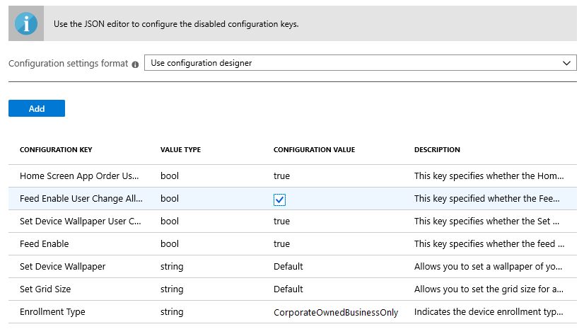
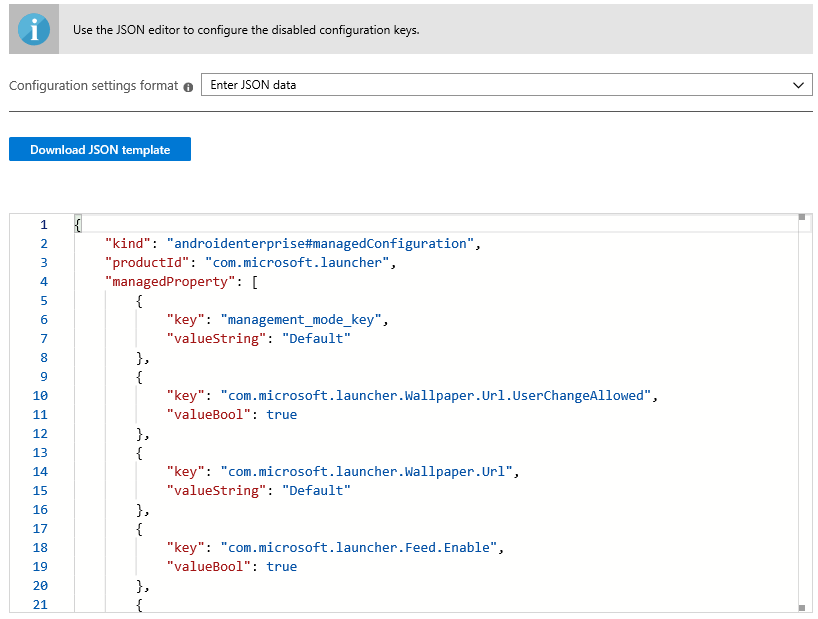

---
# required metadata

title: Configure Microsoft Launcher for Android Enterprise with Intune 
titleSuffix: 
description: Use Intune configuration policies with Microsoft Launcher. 
keywords:
author: Erikre
ms.author: erikre
manager: dougeby
ms.date: 02/27/2024
ms.topic: how-to
ms.service: microsoft-intune
ms.subservice: apps
ms.localizationpriority: medium
ms.assetid: 

# optional metadata

#ROBOTS:
#audience:

ms.reviewer: priyar
ms.suite: ems
search.appverid: MET150
#ms.tgt_pltfrm:
ms.collection:
- tier2
- M365-identity-device-management
- Android
ms.custom: intune-azure
---

# Configure Microsoft Launcher

Microsoft Launcher is an Android application that lets users personalize their phone, stay organized on the go, and transfer from working from their phone to their PC.

On Android Enterprise fully managed devices, Launcher allows enterprise IT admins to customize managed device home screens by selecting the wallpaper, apps, and icon positions. This standardizes the look and feel of all managed Android devices across different OEM devices and system versions.

## How to configure the Microsoft Launcher app

Once the Microsoft Launcher application has been [added to Intune](../apps/apps-add.md), navigate to the [Microsoft Intune admin center](https://go.microsoft.com/fwlink/?linkid=2109431) and select **Apps** > **Configuration**. Add a configuration policy for **Managed devices** running **Android** and choose **Microsoft Launcher** as the associated app. Click on **Configuration settings** to configure the different available Microsoft Launcher settings.

## Choosing a Configuration Settings Format

There are two methods that you can use to define configuration settings for Microsoft Launcher:

- **Configuration designer** allows you to configure settings with an easy-to-use UI that lets you toggle features on or off and set values. In this method, there are a few disabled configuration keys with value type BundleArray. These configuration keys can only be configured by entering JSON data.

- **JSON data** allows you to define all possible configuration keys using a JSON script.

If you add properties with **Configuration Designer**, you can automatically convert these properties to JSON by selecting **Enter JSON data** from the **Configuration settings format** dropdown list as shown below.

   

   > [!NOTE]
   > Once properties are configured via the Configuration Designer, the JSON data will also be updated to only reflect these properties. To add additional configuration keys into the JSON Data, use the [JSON script example](../apps/configure-microsoft-launcher.md#microsoft-launcher-configuration-example) to copy the necessary lines for each configuration key.

When editing previously created app configuration policies, if complex properties have been configured, the edit process will display the JSON Data editor. All previously configured settings will be preserved and you can switch to use the configuration designer to modify supported settings.

## Using Configuration Designer

Configuration designer allows you to select pre-populated settings and their associated values.

   

The following table lists the Microsoft Launcher available configuration keys, value types, default values, and descriptions. The description provides the expected device behavior based on the selected values. Configuration keys that are disabled in Configuration Designer aren't listed in the table.

|    Configuration Key    |    Value type    |    Default value    |    Description     |
|---------------------------------------------------|------------------|---------------------|-------------------------------------------------------------------------------------------------------------------------------------------------------------------------------------------------------------------------------------------------------------------------------------------------------------------------------------------------------------------------------------------------------------------------------------------------------------------------------------------------------------------------------------------------------------------------------|
|    Enrollment Type    |    String     |    Default    |    Allows you to set   the enrollment type this policy should apply to. Currently, the value **Default** refers to **CorporateOwnedBusinessOnly**. There are no other supported   enrollment types at present.        JSON key name: management_mode_key        |
|    Home Screen App Order User Change   Allowed    |    Boolean    |    True    |    Allows you to specify if the **Home Screen App Order** setting can be changed by the end user.<ul><li>If set to **True**, the app order defined in the policy will only be enforced for the initial deployment. Subsequently, the policy won't be enforced to respect any changes the user may have made.</li><li>If set to **False**, the app order will be enforced on every sync.</li></ul><br>**Note:** The Home Screen App order can only be configured via the JSON editor.<br><br>JSON key name:<br>`com.microsoft.launcher.HomeScreen.AppOrder.UserChangeAllowed`    |
|    Set Grid Size    |    String    |    Auto    |    Allows you to   set the grid size for apps to be positioned on the home screen. You can set   the number of app rows and columns to define grid size in the following format: `columns;rows`. If you   define the grid size, the maximum number of apps that will be shown in a row   on the home screen would be the number of rows you set and the maximum number   of apps that will be shown in a column in the home screen would be the number   of columns you set.<br><br>        JSON key name:<br>`com.microsoft.launcher.HomeScreen.GridSize`    |
|    Set Device Wallpaper    |    String    |    Null    |    Allows you to set a wallpaper of your choice by   entering the URL of the image that you want to set as a wallpaper.<br><br>JSON key name:<br>`com.microsoft.launcher.Wallpaper.URL`    |
|    Set Device Wallpaper User Change   Allowed    |    Boolean    |    True    |    Allows you to specify if the Set Device   Wallpaper setting can be changed by the end user.<ul><li>If set to **True**, the wallpaper in the policy will only be enforced for the initial deployment. Later, the policy won't be enforced to respect any changes the user may have made.</li><li>If set to **False**, the wallpaper will be enforced on every sync.</li></ul><br>JSON key name:<br>`com.microsoft.launcher.Wallpaper.URL.UserChangeAllowed`        |
|    Feed Enable    |    Boolean    |    True    |    Allows you to enable the launcher feed on the device when the user swipes to the right on the home screen.<ul><li>If set to **True**, the feed will be enabled.</li><li>If set to **False**, the feed will be disabled.</li></ul><br>JSON key name:<br>`com.microsoft.launcher.Feed.Enabled`    |
|    Feed Enable User Change Allowed    |    Boolean    |    True    |     Allows you to specify if the **Feed Enable** setting can be changed by the end user.<ul><li>If set to **True**, the feed will only be enforced for the initial deployment. Later, the policy won't be enforced to respect any changes the user may have made.</li><li>If set to **False**, the feed will be enforced on every sync.</li></ul><br>JSON key name:`com.microsoft.launcher.Feed.Enabled.UserChangeAllowed`    |
|    Search Bar Placement   |    String    |    Bottom    |  Allows you to specify the **placement of search bar** on the home screen. <ul><li>If set to **Bottom**, the search bar will be located on the bottom of the home screen.</li><li>If set to **Top**, the search bar will be located on the top of the home screen.</li><li>If set to **Hidden**, the search bar will be removed from the home screen.</li></ul><br>JSON key name:<br>`com.microsoft.launcher.Search.SearchBar.Placement`    |
|    Search Bar Placement User Change Allowed   |    Boolean    |    True    |  Allows you to specify if the **Search Bar Placement** setting can be changed by the end user. <ul><li>If set to **True**, the search bar placement will only be enforced for the initial deployment. Later, the policy won't be enforced to respect any changes the user may have made.</li><li>If set to **False**, the placement of search bar will be enforced on every sync.</li></ul><br>JSON key name:<br>`com.microsoft.launcher.Search.SearchBar.Placement.UserChangeAllowed`<p>**NOTE:** For Microsoft Launcher v 6.2 and later, this setting will no longer be enforced. Therefore, setting this value to `True` will have no effect. Your end users won't be able to customize the location of the search bar placement on their device.    |
|    Dock Mode  |    String    |    Show    | Allows you to enable the dock on the device when the user swipes up from the bottom on the home screen.<ul><li>If set to **Show**, the dock will be enabled.</li><li>If set to **Hidden**, the dock will hide from the home screen, but the user can display it when it's needed.</li><li>If set to **Disabled**, the dock will be disabled.</li></ul><br>JSON key name:<br>`com.microsoft.launcher.Dock.Mode`    |
|   Dock Mode User Change Allowed   |    String    |    True    |  Allows you to specify if the Dock Mode setting can be changed by the end user.<ul><li>If set to **True**, the dock mode setting will only be enforced for the initial deployment. Later, the policy won't be enforced to respect any changes the user may have made.</li><li>If set to **False**, the dock mode setting will be enforced on every sync.</li></ul><br>JSON key name:<br>`com.microsoft.launcher.Dock.Mode.UserChangeAllowed`    |

## Enter JSON Data

Enter JSON data to configure all available settings for Microsoft Launcher, and the settings disabled in **Configuration Designer**, as shown below.

   

In addition to the list of configurable settings listed in the Configuration Designer table (above), the following table provides the configuration keys you can only configure via JSON data.

|    Configuration Key    |    Value type    |    Default value    |    Description     |
|----------------------------------------------------------------------------------------------------|-------------------|-------------------------------------------------------------------------------------|------------------------------------------------------------------------------------------------------------------------------------------------------------------------------------------------------------------------------------------------------------------------------------------------------------------------------------------------------------------------------------------------------------------------------------------------------------------------------------------------------------------------------------------------------------------------------------------------------------------------------------------------------------------------------------|
|    Set Allow-Listed Applications<br>JSON key:`com.microsoft.launcher.HomeScreen.Applications`    |    BundleArray    | See: [Set allow-listed applications](configure-microsoft-launcher.md#set-allow-listed-applications)</sup>    |    Allows you to  define the set of apps visible on the home screen from amongst the apps   installed on the device. You can define the apps by entering the app package   name of the apps that you would like to make visible, for example, `com.android.settings` would make settings accessible on the home screen. The apps that you allow-list in this section should already be installed on the   device in order to be visible on the home screen.<br><p>Properties:<ul><li>**Package:** The application package name</li><li>**Class:** The application activity, which is specific to a certain app page. It would use the default app page if this value is empty.</li></ul>      |
|    Home Screen App Order<br>JSON key: `com.microsoft.launcher.HomeScreen.AppOrder`    |    BundleArray    |    See: [Home screen app order](configure-microsoft-launcher.md#home-screen-app-order)      |    Allows you to specify the app order on the home screen.<br><p>Properties:<br><ul><li>**Type:** If you want to specify positions of apps, the only type supported is `application`. If you want to specify positions of web links, the type is `weblink`.</li><li>**Position:** This specifies application icon slot on home screen. This starts from position 1 on the top left, and goes left to right, top to bottom.</li><li>**Package:** This is application package name used for specifying app order.</li><li>**Class:** The is an application activity, which is specific to a certain app page. The default app page will be used if this value is empty. This property is used for app.</li><li>**Label:** The is an application activity, which is specific to a certain app page. The default app page will be used if this value is empty. This property is used for app.</li><li>**Link:** The url to be launched after end user clicks the web link icon. This property is used for web link.</li></ul>    |
|    Set Pinned Web Links<br>JSON key: `com.microsoft.launcher.HomeScreen.WebLinks`    |    BundleArray    |    N/A      |    This key allows you to pin website to the home screen as quick launch icon. That way you can make sure that end user can have quick and easy access to essential websites. You can modify location of each web link icon in 'Home Screen App Order' configuration.<br><p>Properties:<br><ul><li>**Label:** The weblink title displayed on MS Launcher home screen.</li><li>**Link:** The url to be launched after end user clicks the web link icon.</li></ul>    |
|    Set Folder Icon Shape, Open Format, and Scroll Direction<br>JSON key: `com.microsoft.launcher.Folder.Style`    |    BundleArray    |    N/A      |    Allows you to define appearance of folder icon and way of opening a folder on the Microsoft Launcher home screen and dock.<br><p>Properties:<br><ul><li>**folderShape:** This key can be set as one of the five values: `Rounded_square`, `Square`, `Squircle`, `Round`, and `Teardrop`.</li><li>**openFullScreen:** This key can be set as one of the values: `True` or `False`. If it set to `True`, the folder will be opened in the full screen. If it set to `False`, the folder won't be opened in the full screen.</li><li>**folderScroll:** This key can be set as one of the values: `vertical` or `horizontal`. The default value is set as `vertical`.</li></ul>    |
|    Set Folder Icon Shape, Open Format, and Scroll Direction User Change Allowed<br>JSON key: `com.microsoft.launcher.Folder.Style.UserChangeAllowed`    |    Boolean    |    True      |    Allows you to specify if the Folder Style setting can be changed by the end user.<br><p><ul><li>If set to `True`, the shape of folder, the way the folder opens, and the way the folder scrolls as defined in the policy will only be enforced for the initial deployment. Later, the policy won't be enforced to respect any changes the user may have made later.</li><li>If set to `False`, the shape of folder, the way the folder opens, and the way the folder scrolls will be enforced on every sync.</li></ul>    |

### Set allow-listed applications

```JSON
{
    "key": "com.microsoft.launcher.HomeScreen.Applications",
    "valueBundleArray": 
    [
        {
            "managedProperty": [
                {
                    "key": "package",
                    "valueString": "com.android.settings"
                },
                {
                    "key": "class",
                    "valueString": ""
                }
            ]
        }
    ]
}
```

### Home screen app order

```JSON
{
    "key": "com.microsoft.launcher.HomeScreen.AppOrder",
    "valueBundleArray": 
    [
        {
            "managedProperty": [
                {
                    "key": "type",
                    "valueString": "application"
                },
                {
                    "key": "position",
                    "valueInteger": 1
                },
                {
                    "key": "package",
                    "valueString": "com.android.settings"
                },
                {
                    "key": "class",
                    "valueString": ""
                }
            ]
        }
    ]
}
```

### Set Pinned Web link

```JSON
{ 
    "key": "com.microsoft.launcher.HomeScreen.WebLinks",  
    "valueBundleArray": [ 
        { 
            "managedProperty": [ 
                { 
                    "key": "label",
                    "valueString": "weblink" 
                },  
                { 
                    "key": "link", 
                    "valueString": "https://www.microsoft.com" 
                } 
            ] 
        }
    ] 
},
{ 
    "key": "com.microsoft.launcher.HomeScreen.AppOrder",  
    "valueBundleArray": [ 
        { 
            "managedProperty": [ 
                { 
                    "key": "type",  
                    "valueString": "weblink" 
                },  
                { 
                    "key": "position",  
                    "valueInteger": 2
                },  
                { 
                    "key": "label",  
                    "valueString": "Microsoft" 
                },  
                { 
                    "key": "link",  
                    "valueString": "https://www.microsoft.com" 
                } 
            ] 
        }
    ] 
}
```

### Microsoft Launcher configuration example

The following is an example JSON script with all the available configuration keys included:

```JSON
{
    "kind": "androidenterprise#managedConfiguration", 
    "productId": "app:com.microsoft.launcher", 
    "managedProperty": [
        {
            "key": "management_mode_key", 
            "valueString": "Default"
        }, 
        {
            "key": "com.microsoft.launcher.Feed.Enable.UserChangeAllowed", 
            "valueBool": false
        }, 
        {
            "key": "com.microsoft.launcher.Feed.Enable", 
            "valueBool": true
        }, 
        {
            "key": "com.microsoft.launcher.Wallpaper.Url.UserChangeAllowed", 
            "valueBool": false
        }, 
        {
            "key": "com.microsoft.launcher.Wallpaper.Url", 
            "valueString": "http://www.contoso.com/wallpaper.png"
        }, 
        {
            "key": "com.microsoft.launcher.HomeScreen.GridSize", 
            "valueString": "5;5"
        }, 
        {
            "key": "com.microsoft.launcher.HomeScreen.Applications", 
            "valueBundleArray": [
                {
                    "managedProperty": [
                        {
                            "key": "package", 
                            "valueString": "com.ups.mobile.android"
                        }, 
                        {
                            "key": "class", 
                            "valueString": ""
                        }
                    ]
                }, 
                {
                    "managedProperty": [
                        {
                            "key": "package", 
                            "valueString": "com.microsoft.teams"
                        }, 
                        {
                            "key": "class", 
                            "valueString": ""
                        }
                    ]
                }, 
                {
                    "managedProperty": [
                        {
                            "key": "package", 
                            "valueString": "com.microsoft.bing"
                        }, 
                        {
                            "key": "class", 
                            "valueString": ""
                        }
                    ]
                }
            ]
        }, 
        { 
            "key": "com.microsoft.launcher.HomeScreen.WebLinks",  
            "valueBundleArray": [ 
                { 
                    "managedProperty": [ 
                        { 
                            "key": "label",
                            "valueString": "News" 
                        },  
                        { 
                            "key": "link", 
                            "valueString": "https://www.contoso.com" 
                        } 
                    ] 
                }
            ] 
        },
        {
            "key": "com.microsoft.launcher.HomeScreen.AppOrder.UserChangeAllowed", 
            "valueBool": false
        }, 
        {
            "key": "com.microsoft.launcher.HomeScreen.AppOrder", 
            "valueBundleArray": [
                {
                    "managedProperty": [
                        {
                            "key": "type", 
                            "valueString": "application"
                        }, 
                        {
                            "key": "position", 
                            "valueInteger": 17
                        }, 
                        {
                            "key": "package", 
                            "valueString": "com.ups.mobile.android"
                        }, 
                        {
                            "key": "class", 
                            "valueString": ""
                        }
                    ]
                }, 
                {
                    "managedProperty": [
                        {
                            "key": "type", 
                            "valueString": "application"
                        }, 
                        {
                            "key": "position", 
                            "valueInteger": 18
                        }, 
                        {
                            "key": "package", 
                            "valueString": "com.microsoft.teams"
                        }, 
                        {
                            "key": "class", 
                            "valueString": ""
                        }
                    ]
                }, 
                {
                    "managedProperty": [
                        {
                            "key": "type", 
                            "valueString": "application"
                        }, 
                        {
                            "key": "position", 
                            "valueInteger": 19
                        }, 
                        {
                            "key": "package", 
                            "valueString": "com.microsoft.bing"
                        }, 
                        {
                            "key": "class", 
                            "valueString": ""
                        }
                    ]
                },
                {
                    "managedProperty": [
                        {
                            "key": "type", 
                            "valueString": "weblink"
                        }, 
                        {
                            "key": "position", 
                            "valueInteger": 20
                        }, 
                        {
                            "key": "label", 
                            "valueString": "News"
                        }, 
                        {
                            "key": "link", 
                            "valueString": "https://www.contoso.com"
                        }
                    ]
                }
            ]
        }
    ]
}

```

## Next steps

- For more information about Android Enterprise fully managed devices, see [Set up Intune enrollment of Android Enterprise fully manage devices](../enrollment/android-fully-managed-enroll.md).
