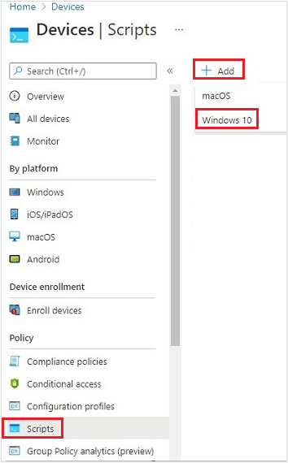
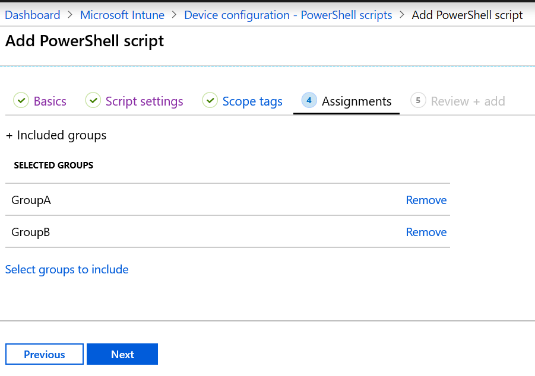

---
# required metadata

title: Add PowerShell scripts to Windows 10/11 devices in Microsoft Intune
description: Create and run PowerShell scripts, assign the script policy to Microsoft Entra groups, and use reports to monitor the scripts. See the steps to delete scripts you add on Windows 10/11 devices in Microsoft Intune. Read common issues and resolutions. 
keywords:
author: Erikre
ms.author: erikre
manager: dougeby
ms.date: 08/21/2024
ms.topic: how-to
ms.service: microsoft-intune
ms.subservice: apps
ms.localizationpriority: high
ms.assetid: 768b6f08-3eff-4551-b139-095b3cfd1f89

# optional metadata

#ROBOTS:
#audience:
ms.reviewer: bryanke
ms.suite: ems
search.appverid: MET150
#ms.tgt_pltfrm:
ms.custom: intune-azure
ms.collection:
- tier1
- M365-identity-device-management
- Windows
- highpri
- FocusArea_Apps_Win32
---

# Use PowerShell scripts on Windows 10/11 devices in Intune

Use the Microsoft Intune management extension to upload PowerShell scripts in Intune. Then, run these scripts on Windows 10 devices. The management extension enhances Windows device management (MDM), and makes it easier to move to modern management.

> [!IMPORTANT]
> To support expanded functionality and bug fixes, use .NET Framework 4.7.2 or higher with the Intune Management Extension on Windows clients. If a Windows client continue to use an earlier version of the .NET Framework, the Intune Management Extension will continue to function. The .NET Framework 4.7.2 is available from Windows Update as of July 10, 2018, which is included in Win10 1809 (RS5) and newer. Note that multiple version of the .NET Framework versions can coexist on a device.

This feature applies to:

- Windows 10 and later (excluding Windows 10 Home)

> [!NOTE]
> Once the Intune management extension prerequisites are met, the Intune management extension is installed automatically when a PowerShell script or Win32 app, Microsoft Store apps, Custom compliance policy settings or Proactive remediations is assigned to the user or device. For more information, see Intune Management Extensions [prerequisites](../apps/intune-management-extension.md#prerequisites).
>
> PowerShell scripts, which are not officially supported on Workplace join (WPJ) devices, can be deployed to WPJ devices. Specifically, device context PowerShell scripts work on WPJ devices, but user context PowerShell scripts are ignored by design. User context scripts will be ignored on WPJ devices and will not be reported to the Microsoft Intune admin center.

## Move to modern management

User computing is going through a digital transformation. Traditional IT focuses on a single device platform, business-owned devices, users that work from the office, and different manual, reactive IT processes. The modern workplace uses many platforms that are user and business owned. It allows users to work from anywhere, and provides automated and proactive IT processes.

MDM services, such as Microsoft Intune, can manage mobile and desktop devices running Windows 10. The built-in Windows 10 management client communicates with Intune to run enterprise management tasks. There are some tasks that you might need, such as advanced device configuration and troubleshooting. For Win32 app management, you can use the [Win32 app management](app-management.md) feature on your Windows 10 devices.

The Intune management extension supplements the in-box Windows 10 MDM features. You can create PowerShell scripts to run on Windows 10 devices. For example, create a PowerShell script that does advanced device configurations. Then, upload the script to Intune, assign the script to a Microsoft Entra group, and run the script. You can then monitor the run status of the script from start to finish.

## Before you begin

- When scripts are set to user context and the end user has administrator rights, by default, the PowerShell script runs under the administrator privilege.

- End users aren't required to sign in to the device to execute PowerShell scripts.

- The Intune management extension agent checks after every reboot for any new scripts or changes. After you assign the policy to the Microsoft Entra groups, the PowerShell script runs, and the run results are reported. Once the script executes, it doesn't execute again unless there's a change in the script or policy. If the script fails, the Intune management extension agent retries the script three times for the next three consecutive Intune management extension agent check-ins.

- For shared devices, the PowerShell script will run for every new user that signs in.

- PowerShell scripts are executed before Win32 apps run. In other words, PowerShell scripts execute first. Then, Win32 apps execute.

- PowerShell scripts time out after 30 minutes.

> [!IMPORTANT]
> Best practices for privacy awareness when using PowerShell scripts and Remediation scripts include the following:
> - Do not include any type of sensitive information in scripts (such as passwords)
> - Do not include Personally Identifiable Information (PII) in scripts
> - Do not use scripts to collect PII from devices
> - Always follow privacy best practices
>
> For related information, see [Remediations](../fundamentals//remediations.md).

## Prerequisites

The Intune management extension has the following prerequisites. Once they're met, the Intune management extension installs automatically when a PowerShell script or Win32 app is assigned to the user or device.

- Devices running Windows 10 version 1607 or later. If the device is enrolled using [bulk auto-enrollment](../enrollment/windows-bulk-enroll.md), devices must run Windows 10 version 1709 or later. The Intune management extension isn't supported on Windows 10 in S mode, as S mode doesn't allow running non-store apps.

- Devices joined to Microsoft Entra ID, including:

  - Microsoft Entra hybrid joined: Devices joined to Microsoft Entra ID, and also joined to on-premises Active Directory (AD). See [Plan your Microsoft Entra hybrid join implementation](/azure/active-directory/devices/hybrid-azuread-join-plan) for guidance.

  - Microsoft Entra registered/Workplace joined (WPJ): Devices [registered](/azure/active-directory/user-help/user-help-register-device-on-network) in Microsoft Entra ID, see [Workplace Join as a seamless second factor authentication](/windows-server/identity/ad-fs/operations/join-to-workplace-from-any-device-for-sso-and-seamless-second-factor-authentication-across-company-applications#BKMK_DRS) for more information. Typically these are Bring Your Own Device (BYOD) devices which have had a work or school account added via Settings>Accounts>Access work or school.

- Devices enrolled in Intune, including:

  - Devices enrolled in a group policy (GPO). See [Enroll a Windows 10 device automatically using Group Policy](/windows/client-management/mdm/enroll-a-windows-10-device-automatically-using-group-policy) for guidance.

  - Devices manually enrolled in Intune, which is when:

    - [Auto-enrollment to Intune](../enrollment/quickstart-setup-auto-enrollment.md) is enabled in Microsoft Entra ID. Users sign in to devices using a local user account, and manually join the device to Microsoft Entra ID. Then, they sign in to the device using their Microsoft Entra account.

    OR  

    - User signs in to the device using their Microsoft Entra account, and then enrolls in Intune.

  - Co-managed devices that use Configuration Manager and Intune. When installing Win32 apps, make sure the **Apps** workload is set to **Pilot Intune** or **Intune**. PowerShell scripts will be run even if the **Apps** workload is set to **Configuration Manager**. The Intune management extension will be deployed to a device when you target a PowerShell script to the device. Remember, the device must be a Microsoft Entra ID or Microsoft Entra hybrid joined device. And, it must be running Windows 10 version 1607 or later. See the following articles for guidance:
  
    - [What is co-management](/configmgr/comanage/overview)
    - [Client apps workload](/configmgr/comanage/workloads#client-apps)
    - [How to switch Configuration Manager workloads to Intune](/configmgr/comanage/how-to-switch-workloads)
- Scripts deployed to clients running the Intune management extension will fail to run if the device's system clock is exceedingly out of date by months or years. Once the system clock is brought up to date, script will run as expected.  

> [!NOTE]
> For information about using Window 10 VMs, see [Using Windows 10 virtual machines with Intune](../fundamentals/windows-10-virtual-machines.md).

## Create a script policy and assign it

1. Sign in to the [Microsoft Intune admin center](https://go.microsoft.com/fwlink/?linkid=2109431).
2. Select **Devices** > **Scripts and remediations** > **Platform scripts** > **Add** > **Windows 10 and later**.

    

3. In **Basics**, enter the following properties, and select **Next**:
    - **Name**: Enter a name for the PowerShell script.
    - **Description**: Enter a description for the PowerShell script. This setting is optional, but recommended.
4. In **Script settings**, enter the following properties, and select **Next**:
    - **Script location**: Browse to the PowerShell script. The script must be less than 200 KB (ASCII).
    - **Run this script using the logged on credentials**: Select **Yes** (default) to run the script with the user's credentials on the device. Choose **No** to run the script in the system context. Many administrators choose **Yes**. If the script is required to run in the system context, choose **No**.
    - **Enforce script signature check**: Select **Yes** (default) if the script must be signed by a trusted publisher. Select **No** if there isn't a requirement for the script to be signed.
    - **Run script in 64-bit PowerShell host**: Select **Yes** to run the script in a 64-bit PowerShell host on a 64-bit client architecture. Select **No** (default) runs the script in a 32-bit PowerShell host.

      When setting to **Yes** or **No**, use the following table for new and existing policy behavior:

      | Run script in 64-bit host | Client architecture | New script | Existing policy script |
      | --- | --- | --- | --- |
      | No | 32-bit  | 32-bit PowerShell host supported | Runs only in 32-bit PowerShell host, which works on 32-bit and 64-bit architectures. |
      | Yes | 64-bit | Runs script in 64-bit PowerShell host for 64-bit architectures. When ran on 32-bit, the script runs in a 32-bit PowerShell host. | Runs script in 32-bit PowerShell host. If this setting changes to 64-bit, the script opens (it doesn't run) in a 64-bit PowerShell host, and reports the results. When ran on 32-bit, the script runs in 32-bit PowerShell host. |

5. Select **Scope tags**. Scope tags are optional. [Use role-based access control (RBAC) and scope tags for distributed IT](../fundamentals/scope-tags.md) has more information.

    To add a scope tag:

    1. Choose **Select scope tags** > select an existing scope tag from the list > **Select**.

    2. When finished, select **Next**.

6. Select **Assignments** > **Select groups to include**. An existing list of Microsoft Entra groups is shown.

    1. Select one or more groups that include the users whose devices receive the script. Choose **Select**. The groups you chose are shown in the list, and will receive your policy.

        > [!NOTE]
        > PowerShell scripts in Intune can be targeted to Microsoft Entra device security groups or Microsoft Entra user security groups.
        > However, when targeting workplace joined (WPJ) devices, only Microsoft Entra device security groups can be used (user targeting will be ignored).

    2. Select **Next**.

        

7. In **Review + add**, a summary is shown of the settings you configured. Select **Add** to save the script. When you select **Add**, the policy is deployed to the groups you chose.

### Failure to run script example

8 AM

- Check in
- Run script **ConfigScript01**
- Script fails

9AM

- Check in
- Run script **ConfigScript01**
- Script fails (retry count = 1)

10 AM

- Check in
- Run script **ConfigScript01**
- Script fails (retry count = 2)
  
11 AM

- Check in
- Run script **ConfigScript01**
- Script fails (retry count = 3)

12 PM

- Check in
- No additional attempts are made to run **ConfigScript01**script.
- If no additional changes are made to the script, then no additional attempts are made to run the script.

## Monitor run status

You can monitor the run status of PowerShell scripts for users and devices in the portal.

In **PowerShell scripts**, select the script to monitor, choose **Monitor**, and then choose one of the following reports:

- **Device status**
- **User status**

## Intune management extension logs

Agent logs on the client machine are typically in `C:\ProgramData\Microsoft\IntuneManagementExtension\Logs`. You can use [CMTrace.exe](/configmgr/core/support/cmtrace) to view these log files.

  

In addition, you can use the log file *AppWorkload.log* to help troubleshoot and analyze Win32 app management events on the client. This log file contains all logging information related to app deployment activities conducted by the IME.

## Delete a script

In **PowerShell scripts**, right-click the script, and select **Delete**.

## Common issues and resolutions

### Issue: Intune management extension doesn't download

**Possible resolutions**:

- The device isn't joined to Microsoft Entra ID. Be sure the devices meet the [prerequisites](#prerequisites) (in this article).
- There are no PowerShell scripts or Win32 apps assigned to the groups that the user or device belongs.
- The device can't check in with the Intune service. For example, there's no internet access, no access to Windows Push Notification Services (WNS), and so on.
- The device is in S mode. The Intune management extension isn't supported on devices running in S mode.

To see if the device is auto-enrolled, you can:

  1. Go to **Settings** > **Accounts** > **Access work or school**.
  2. Select the joined account > **Info**.
  3. Under **Advanced Diagnostic Report**, select **Create Report**.
  4. Open the `MDMDiagReport` in a web browser.
  5. Search for the **MDMDeviceWithAAD** property. If the property exists, the device is auto-enrolled. If this property doesn't exist, then the device isn't auto-enrolled.

[Enable Windows 10 automatic enrollment](../enrollment/windows-enroll.md#enable-windows-automatic-enrollment) includes the steps to configure automatic enrollment in Intune.

### Issue: PowerShell scripts do not run

**Possible resolutions**:

- The PowerShell scripts don't run at every sign in. They run:

  - When the script is assigned to a device
  - If you change the script, upload it, and assign the script to a user or device
  
    > [!TIP]
    > The **Microsoft Intune Management Extension** is a service that runs on the device, just like any other service listed in the Services app (services.msc). After a device reboots, this service may also restart, and check for any assigned PowerShell scripts with the Intune service. If the **Microsoft Intune Management Extension** service is set to Manual, then the service may not restart after the device reboots.

- Be sure devices are [joined to Microsoft Entra ID](/azure/active-directory/user-help/user-help-join-device-on-network). Devices that are only joined to your workplace or organization ([registered](/azure/active-directory/user-help/user-help-register-device-on-network) in Microsoft Entra ID) won't receive the scripts.
- Confirm the Intune management extension is downloaded to `%ProgramFiles(x86)%\Microsoft Intune Management Extension`.
- Scripts don't run on Surface Hubs or Windows 10 in S mode.
- Review the logs for any errors. See [Intune management extension logs](#intune-management-extension-logs) (in this article).
- For possible permission issues, be sure the properties of the PowerShell script are set to `Run this script using the logged on credentials`. Also check that the signed in user has the appropriate permissions to run the script.

- To isolate scripting problems, you can:

  - Review the PowerShell execution configuration on your devices. See the [PowerShell execution policy](/powershell/module/microsoft.powershell.security/set-executionpolicy) for guidance.
  - Run a sample script using the Intune management extension. For example, create the `C:\Scripts` directory, and give everyone full control. Run the following script:

    ```powershell
    write-output "Script worked" | out-file c:\Scripts\output.txt
    ```

    If it succeeds, output.txt should be created, and should include the "Script worked" text.

  - To test script execution without Intune, run the scripts in the System account using the [psexec tool](/sysinternals/downloads/psexec) locally:

    `psexec -i -s`  

  - If the script reports that it succeeded, but it didn't actually succeed, then it's possible your antivirus service may be sandboxing AgentExecutor. The following script always reports a failure in Intune. As a test, you can use this script:
  
    ```powershell
    Write-Error -Message "Forced Fail" -Category OperationStopped
    mkdir "c:\temp" 
    echo "Forced Fail" | out-file c:\temp\Fail.txt
    ```

    If the script reports a success, look at the `AgentExecutor.log` to confirm the error output. If the script executes, the length should be >2.

  - To capture the `.error` and `.output` files, the following snippet executes the script through AgentExecutor to PowerShell x86 (`C:\Windows\SysWOW64\WindowsPowerShell\v1.0`). It keeps the logs for your review. Remember, the Intune Management Extension cleans up the logs after the script executes:
  
    ```powershell
    $scriptPath = read-host "Enter the path to the script file to execute"
    $logFolder = read-host "Enter the path to a folder to output the logs to"
    $outputPath = $logFolder+"\output.output"
    $errorPath =  $logFolder+"\error.error"
    $timeoutPath =  $logFolder+"\timeout.timeout"
    $timeoutVal = 60000 
    $PSFolder = "C:\Windows\SysWOW64\WindowsPowerShell\v1.0"
    $AgentExec = "C:\Program Files (x86)\Microsoft Intune Management Extension\agentexecutor.exe"
    &$AgentExec -powershell  $scriptPath $outputPath $errorPath $timeoutPath $timeoutVal $PSFolder 0 0
    ```

## Next steps

[Monitor](../configuration/device-profile-monitor.md) and [troubleshoot](../configuration/device-profile-troubleshoot.md) your profiles.
