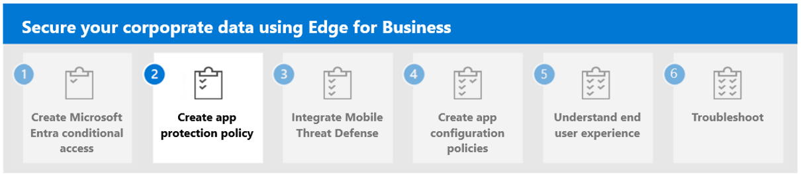

---
# required metadata

title: Step 1. Create Microsoft Entra Conditional Access with Microsoft Edge for Business
titleSuffix:
description: Step 1. Create Microsoft Entra Conditional Access with Microsoft Edge for Business.
keywords:
author: Erikre
ms.author: erikre
manager: dougeby
ms.date: 03/26/2024
ms.topic: article
ms.service: microsoft-intune
ms.subservice: apps
ms.localizationpriority: high

# optional metadata

#audience:
#ROBOTS: 
ms.reviewer: samarti
ms.suite: ems
search.appverid: MET150
#ms.tgt_pltfrm:
ms.custom: 
ms.collection:
- tier1
- highpri
- highseo
- FocusArea_Apps_AppManagement
---

# Step 1. Create Microsoft Entra Conditional Access with Microsoft Edge for Business

The modern security perimeter extends beyond an organization's network perimeter to include user and device identity. Organizations now use identity-driven signals as part of their access control decisions. Microsoft Entra Conditional Access brings signals together to help enforce organizational policies. It's Microsoft's Zero Trust policy engine that takes signals from various sources into account when enforcing policy decisions.

Conditional Access policies at their simplest include *if-then* statements. If a user wants to access a resource, then they must complete an action. For example, if a user wants to access an application or service such as Microsoft 365, then they must perform multifactor authentication to gain access.

Identity-driven signals may include:

- User or group membership
- IP Location information
- Device compliance
- Application
- Real-time and calculated risk detection

:::image type="content" alt-text="Conditional Access Policy Decision Making.." source="./media/securing-data-edge-for-business/securing-data-edge-for-businessCA.png" lightbox="./media/securing-data-edge-for-business/securing-data-edge-for-businessCA.png":::

Conditional Access is enforced after initial authentication is completed. It isn't intended to be an organization's frontline of defense for scenarios like denial-of-service (DoS) attacks, but it can use signals from these events to determine access.

## Conditional Access compliance

Protecting your organizational data involves preventing data loss. Data Loss Prevention (DLP) is effective only when your organizational data can’t be accessed from any unprotected system or device. App protection policies can be used with Conditional Access (CA) to ensure that these policies aren’t only supported but also enforced in a client application before granting access to protected resources, such as organizational data. This approach allows end-users with personal devices, including Windows, Android, and iOS, to use APP-managed applications, including Microsoft Edge for Business, to access Microsoft Entra resources without the need for full management of their personal device.

Secure your Microsoft Edge for Business with Microsoft Entra Conditional Access policies by using the following steps.

In this scenario, you'll create a Conditional Access policy using Microsoft Intune. To create the policy, you must perform the following steps:

1. Navigate to the [Microsoft Intune admin center](https://go.microsoft.com/fwlink/?linkid=2109431).

2. Select **Endpoint security** > **Conditional Access** > **New policy**.

3. On the **Conditional Access policy** pane, set the following details:

    - **Name:** Secure Enterprise Browser Policy
    - **Users:** All Users or Specific Group dedicated to using the policy.
    - **Target Resources:** Cloud Apps - Office 365
    - **Conditions:**
        - **Device platforms:** Include - Windows, Android and iOS
        - **Client Apps:** Browser
        - **Filter for devices:** Exclude - is Compliant Equals True
    - **Grant:** Require app protection policy
    - **Session:** N/A

    > [!NOTE]
    > Set **Report-only** to **On** until you confirm that the policy is working as expected. Once confirmed, set this setting to **Off**.

4. Select **Create** to enable the policy. 

## Browser only access for Windows BYOD

In an era where Bring Your Own Device (BYOD) has become the norm, implementing Conditional Access policies specifically for browser-only access is critical towards securing your digital boundaries and ensuring seamless user experience.

In the previous steps, you implemented Conditional Access as a required app protection policy. In the following steps, you'll configure a policy to ensure that same resources (O365 in this example) are not accessed from desktop apps. A similar approach could be taken for mobile apps. However, mobile apps also support app protection policies, so it is important look at the scenario rather than block access from mobile apps and allow browser access only.

1. Navigate to the [Microsoft Intune admin center](https://go.microsoft.com/fwlink/?linkid=2109431).

2. Select **Endpoint security** > **Conditional Access** > **New policy**.

4. On this new policy, you'll restrict access from desktop apps to managed devices only. You'll select target resources and select apps once they select **Office 365** to follow the example in this page.

    :::image type="content" alt-text="Conditional Access policy - Microsoft Intune admin center." source="./media/securing-data-edge-for-business/securing-data-edge-for-business57.png" lightbox="./media/securing-data-edge-for-business/securing-data-edge-for-business57.png":::
    
5. Select the **device Platform** and select **Windows**.

    :::image type="content" alt-text="Device Platform - Conditional Access policy - Microsoft." source="./media/securing-data-edge-for-business/securing-data-edge-for-business58.png" lightbox="./media/securing-data-edge-for-business/securing-data-edge-for-business58.png":::

6. Select **Client Apps** and select **Mobile apps and desktop clients**.

    > [!NOTE]
    > For legacy authentication clients, maybe create a third CA to just block them. That's up to the customer. For this example, I will only affect Desktop apps. *
    
    :::image type="content" alt-text="Device Platform - Conditional Access policy - Microsoft Intune admin center." source="./media/securing-data-edge-for-business/securing-data-edge-for-business59.png" lightbox="./media/securing-data-edge-for-business/securing-data-edge-for-business59.png":::
    
7. Select **Grant** and select **Require device to be marked as compliant.** This will provide access through desktop apps only for enrolled and compliant devices.

    :::image type="content" alt-text="Grant - Conditional Access policy - Microsoft Intune admin center." source="./media/securing-data-edge-for-business/securing-data-edge-for-business60.png" lightbox="./media/securing-data-edge-for-business/securing-data-edge-for-business60.png":::

    > [!NOTE] 
    > Probably to this last control, customers should add also MFA or other options as well.*

8. Select **Done** \> select **Create** and complete the Conditional Access policy creation as you performed on the previous step.

## Next step

Continue with [Step 2](mamedge-2-app.md) to create an app protection policy.
