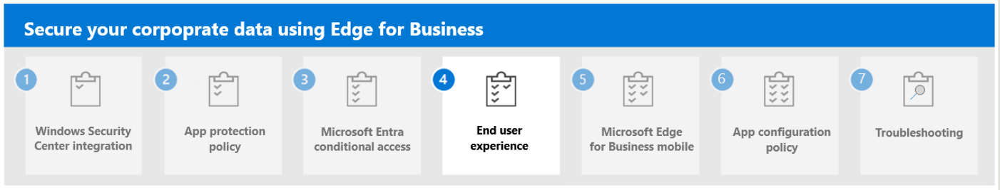

---
# required metadata

title: Understand Microsoft Entra Conditional Access with Microsoft Edge for Business
titleSuffix:
description: Understand Microsoft Entra Conditional Access with Microsoft Edge for Business.
keywords:
author: Erikre
ms.author: erikre
manager: dougeby
ms.date: 03/04/2024
ms.topic: overview
ms.service: microsoft-intune
ms.subservice: apps
ms.localizationpriority: high

# optional metadata

#audience:
#ROBOTS: 
ms.reviewer: samarti
ms.suite: ems
search.appverid: MET150
#ms.tgt_pltfrm:
ms.custom: 
ms.collection:
- tier1
- highpri
- highseo
- FocusArea_Apps_AppManagement
---

# Microsoft Entra Conditional Access with Microsoft Edge for Business

The modern security perimeter extends beyond an organization's network perimeter to include user and device identity. Organizations now use identity-driven signals as part of their access control decisions. Microsoft Entra Conditional Access brings signals together, to make decisions, and enforce organizational policies. It's Microsoft's Zero
Trust policy engine that takes signals from various sources into account when enforcing policy decisions.

Conditional Access policies at their simplest are if-then statements; if a user wants to access a resource, then they must complete an action. For example, if a user wants to access an application or service like Microsoft 365, then they must perform multifactor authentication to gain access.

These signals include:

- User or group membership
- IP Location information
- Device and Intune device compliance
- Application
- Real-time and calculated risk detection

:::image type="content" alt-text="Conditional Access Policy Decision Making.." source="./media/securing-data-edge-for-business/securing_data_edge_for_businessCA.png" lightbox="./media/securing-data-edge-for-business/securing_data_edge_for_businessCA.png":::

Conditional Access is enforced after first-factor authentication is completed. It isn't intended to be an organization's frontline of defense for scenarios like denial-of-service (DoS) attacks, but it can use signals from these events to determine access.

**Conditional Access Compliance**

Preventing data loss is a part of protecting your organizational data. Data loss prevention (DLP) is only effective if your org data can't be accessed from any unprotected system or device. App Protection Conditional Access uses Conditional Access (CA) to ensure App protection policies (APP) are supported and enforced in a client application before allowing access to protected resources (such as org data). APP CA allows end-users with personal Windows devices to use APP managed applications, including Microsoft Edge for Business**,** to access Microsoft Entra resources without fully managing their personal device.

This MAM service syncs compliance state per user, per app, and per device to the Microsoft Entra CA service. This includes the threat information received from the Mobile Threat Defense (MTD) vendors starting with Windows Security Center.

Secure your Microsoft Edge for Business with Microsoft Entra Conditional Access Policies. 

In this scenario, you will create a conditional access policy using Microsoft Intune. To create the policy, we need to perform the following steps:

1. Navigate to the [Microsoft Intune admin center](https://go.microsoft.com/fwlink/?linkid=2109431).

2. Select **Devices** > **Conditional Access** > **Create a new Policy**.

3. On the **Conditional Access policy** pane, set the following details:

    - **Name:** Secure Enterprise Browser Policy
    - **Users:** All Users or Specific Group dedicated to using the policy.
    - **Target Resources:** Cloud Apps - Office 365
    - **Conditions:**
        - **Device platforms:** Include - Windows
        - **Client Apps:** Browser
        - **Filter for devices:** Exclude - is Compliant Equals True
    - **Grant:** Require app protection policy
    - **Session:** N/A

    > [!NOTE]
    > Set **Report-only** to **On** until you confirm that the policy is working as expected. Once confirmed, set this setting to **Off**.
    
4. Select **Create** to enable the policy. 

## Conditional access policies for BYOD - browser only access

In an era where Bring Your Own Device (BYOD) has become the norm, implementing conditional access policies specifically for browser-only access is a critical towards securing our digital boundaries and ensuring seamless user experience.

In the previous steps we show you how to create a conditional access policy to support App Protection Policies, in the following we'll guide you to configure a policy for Browser only access.

1. Navigate to the [Microsoft Intune admin center](https://go.microsoft.com/fwlink/?linkid=2109431).

2. Select **Devices** > **Conditional Access** > **Create a new Policy**.

4. On this new policy, you'll restrict access from desktop apps to managed devices only. You'll select target resources and select apps once they select **Office 365**.

    :::image type="content" alt-text="Conditional Access policy - Microsoft Intune admin center." source="./media/securing-data-edge-for-business/securing_data_edge_for_business57.png" lightbox="./media/securing-data-edge-for-business/securing_data_edge_for_business57.png":::
    
5. Select the **device Platform** and select **Windows**.

    :::image type="content" alt-text="Device Platform - Conditional Access policy - Microsoft." source="./media/securing-data-edge-for-business/securing_data_edge_for_business58.png" lightbox="./media/securing-data-edge-for-business/securing_data_edge_for_business58.png":::

6. Select **Client Apps** and select **Mobile apps and desktop clients**.

    > [!NOTE]
    > For legacy authentication clients, maybe create a third CA to just block them. That's up to the customer. For this example, I will only affect Desktop apps. *
    
    :::image type="content" alt-text="Device Platform - Conditional Access policy - Microsoft Intune admin center." source="./media/securing-data-edge-for-business/securing_data_edge_for_business59.png" lightbox="./media/securing-data-edge-for-business/securing_data_edge_for_business59.png":::
    
7. Select **Grant** and select **Require device to be market as compliant.**

    :::image type="content" alt-text="Grant - Conditional Access policy - Microsoft Intune admin center." source="./media/securing-data-edge-for-business/securing_data_edge_for_business60.png" lightbox="./media/securing-data-edge-for-business/securing_data_edge_for_business60.png":::

    > [!NOTE] 
    > Probably to this last control, customers should add also MFA or other options as well.*

8. Select **Conditions** \> Client **apps** and select **Browser.**

    :::image type="content" alt-text="Client apps - Conditional Access policy - Microsoft Intune admin center." source="./media/securing-data-edge-for-business/securing_data_edge_for_business61.png" lightbox="./media/securing-data-edge-for-business/securing_data_edge_for_business61.png":::

    > [!NOTE] 
    > To filter out corporate devices is a bit complicated because the CA filters will be applied only to devices that are already registered (at least) in Entra ID. Entra recommends using negative operator if the rule is going to apply potentially to devices not registered yet, Maybe some companies will not need all these conditions and they can use Enrollment profile or other instead.

9. Select **Conditions** \> Select **Filter for Devices.**

    :::image type="content" alt-text="Filter for devices - Conditional Access policy - Microsoft Intune admin center." source="./media/securing-data-edge-for-business/securing_data_edge_for_business62.png" lightbox="./media/securing-data-edge-for-business/securing_data_edge_for_business62.png":::

10. Select **Done** \> select **Create** and complete the conditional access policy creation as you performed on the previous step.

## Next step

Continue with [Step 4](mamedge-4-end-user-experience.md) to the Microsoft Edge for Business end user experience.