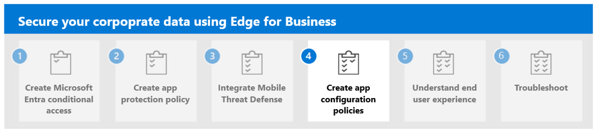

---
# required metadata

title: Step 3. Integrate Mobile Threat Defense for App Protection Policy
titleSuffix:
description: Step 3. Integrate Microsoft Entra conditional access with Microsoft Edge for Business.
keywords:
author: Erikre
ms.author: erikre
manager: dougeby
ms.date: 03/26/2024
ms.topic: article
ms.service: microsoft-intune
ms.subservice: apps
ms.localizationpriority: high

# optional metadata

#audience:
#ROBOTS: 
ms.reviewer: samarti
ms.suite: ems
search.appverid: MET150
#ms.tgt_pltfrm:
ms.custom: 
ms.collection:
- tier1
- highpri
- highseo
- FocusArea_Apps_AppManagement
---

# Step 3. Integrate Mobile Threat Defense

The Microsoft Mobile Threat Defense (MTD) connector is a feature in Microsoft Intune that creates a channel of communication between Intune and your chosen MTD vendor, regardless of the device’s operating system. There are various supported MTD partners for both Windows and mobile devices. Intune integrates data from an MTD vendor as an information source for device compliance policies and device conditional access rules. The information provided by this communication channel can help protect corporate resources, such as Exchange and SharePoint data, by blocking access from compromised devices.

Mobile Application Management (MAM) threat detection can be integrated with various MTD partners, including Windows Security Center. This integration provides a client device health assessment to Intune application protection policies (APP) via a service-to-service connector. This assessment supports gating the flow and access to organizational data on personal unmanaged devices.

The health assessment and state includes the following details:

- **User, app, and device identifiers**
- **A predefined health state**
- **The time of last health state update**

Only users enrolled in Mobile Application Management send health state data. If end users want to stop sending data, they can sign out of their organization account in the protected applications. Similarly, administrators can stop data transmission by removing the MTD connector from Microsoft Intune.

## Intune app protection policies

Intune app protection policies help secure organizational data and help ensure client devices are healthy. It also can perform additional client health verification via Windows Security Center. This involves designating the Windows Security Center risk level for allowing end users to access corporate resources. In addition, it also involves setting up tenant-based connectors to Microsoft Intune for Windows Security Center.

- **Apps**: Select the apps that you want to target from app protection policies. For this feature set, these apps are blocked or selectively wiped based on device risk assessment from your chosen Mobile Threat Defense vendor.
- **Health Checks**: Under **Device conditions** you can select **Max allowed device threat level**.

    :::image type="content" alt-text="Health Check - App protection policy for Windows." source="./media/securing-data-edge-for-business/securing-data-edge-for-business1.png" lightbox="./media/securing-data-edge-for-business/securing-data-edge-for-business1.png":::

### Options for the threat level

You can select one of the following threat level values:

- **Secured**: This level is the most secure. The device can't have any threats present and still access company resources. If any threats are found, the device is evaluated as noncompliant.
- **Low**: The device is compliant if only low-level threats are present. Anything higher puts the device in a noncompliant status.
- **Medium**: The device is deemed compliant if the threats found on the device are of low or medium level. If high-level threats are detected, the device is marked as noncompliant.
- **High**: This level is the least secure and allows all threat levels, using Mobile Threat Defense for reporting purposes only. Devices are required to have the MTD app activated with this setting.

### Options for Action

You can select one of the following **Action** options:

- **Block access:** Will prevent the users from performing any activity until they're back in compliance.
- **Wipe data:** This removes any information stored in the application related to the corporate data. It doesn't affect personal data on the personal profile.

### Assignments

Assign the policy to groups of users. The devices used by the group's members are evaluated for access to corporate data on targeted apps via Intune app protection.

> [!IMPORTANT]
> If you create an app protection policy for any protected app, the device's threat level is assessed. Depending on the configuration, devices that do not meet an acceptable level are either blocked or selectively wiped through conditional launch. If blocked, they are prevented from accessing corporate resources until the threat on the device is resolved and reported to Intune by the chosen MTD vendor.

## Configure the MTD Connector

Use the following steps to configure the MTD Connector.

1. Navigate to the [Microsoft Intune admin center](https://go.microsoft.com/fwlink/?linkid=2109431).

2. Select **Tenant Administrator** > **Connectors and tokens** > **Mobile Threat Defense**.

    :::image type="content" alt-text="Connectors and tokens - Mobile Threat Defense - Microsoft Intune admin center" source="./media/securing-data-edge-for-business/securing-data-edge-for-business3.png" lightbox="./media/securing-data-edge-for-business/securing-data-edge-for-business3.png":::

3. Select **Add** to display the **Add Connector** pane.

4. From the **Select the Mobile Threat Defense connector to setup** dropdown box, select **Windows Security Center**.
   
    > [!NOTE]
    > In this example, you have selected **Windows Security Center**. For the full list of MTD Partners, see [Mobile Threat Defense partners](../protect/mobile-threat-defense.md#mobile-threat-defense-partners).

    :::image type="content" alt-text="Connectors and tokens - Mobile Threat Defense - Add Connector - Microsoft Intune admin center" source="./media/securing-data-edge-for-business/securing-data-edge-for-business4.png" lightbox="./media/securing-data-edge-for-business/securing-data-edge-for-business4.png":::

5. >  select **Create** to create the connector.

> [!IMPORTANT]
> The connector is now created. It's important to note that the **Connection status** remains **Unavailable** until the first App Protection Policy arrives to the user or the first MAM user is enrolled to your Intune tenant. For more information, see [Connector status](../protect/mobile-threat-defense.md#connector-status).

## Next step

Continue with [Step 4](mamedge-4-acp-edge.md) to create app configuration policies for Microsoft Edge for Business.
