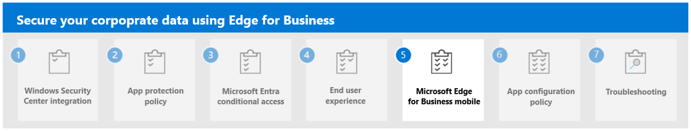

---
# required metadata

title: Understand Microsoft Edge for Business end user experience 
titleSuffix:
description: Understand Microsoft Edge for Business end user experience.
keywords:
author: Erikre
ms.author: erikre
manager: dougeby
ms.date: 03/04/2024
ms.topic: overview
ms.service: microsoft-intune
ms.subservice: apps
ms.localizationpriority: high

# optional metadata

#audience:
#ROBOTS: 
ms.reviewer: samarti
ms.suite: ems
search.appverid: MET150
#ms.tgt_pltfrm:
ms.custom: 
ms.collection:
- tier1
- highpri
- highseo
- FocusArea_Apps_AppManagement
---

# Microsoft Edge for Business end user experience

Now that you've configured your Microsoft Entra conditional access policy and created your first app protection policy for Windows, you can launch **Microsoft Edge for Business** using a manage or unmanage device.

The end user experience for Secure Enterprise Browser in Microsoft Edge for Business is designed to be productive, secure, and user-friendly:

1. **Visually Distinct Work Browsing Experience**: Microsoft Edge for Business provides a visually distinct work browsing experience with refreshed visual treatment. This helps users easily distinguish between their work and personal browsing sessions.

2. **Enterprise Personal Browsing Experience**: Microsoft Edge for Business offers a lightly managed personal browsing experience that lets users access their favorite nonwork sites and services without compromising safety for the enterprise. It also automatically switches from work-related navigation into the work browser.

3. **Automatic Switching**: This feature helps enforce context separation between work and personal browsing. It ensures that work-related content doesn't get intermingled with personal browsing, preventing users from accidentally sharing sensitive information with unintended audiences.

4. **Company Branding**: This feature, which is coming soon, will increase familiarity and trust with company branding in the work browser window.

5. **Security**: It has powerful, built-in defenses against phishing and malware and natively supports hardware isolation on Windows.

Microsoft Edge for Business provides dedicated work browsing experience that is visually distinct, secure, and user-friendly. It separates work and personal browsing into dedicated browser windows with their own favorites, separate cache, and storage locations.

## Enrollment Experience

To evaluate the enrollment experience, launch **Microsoft Edge** from the desktop and perform the sign-in process in your browser. It's important to consider that the device can't be managed by any MDM solution, otherwise we won't be able to enroll into the MAM Service.

1. Locate **Microsoft Edge** on the desktop.
2. Select the **Microsoft Edge** icon and wait for it to load. Once loaded, you will see a user icon at the top, left of the browser window.
3. Select the user icon to display your managed account details.
4. Select **Sign in to sync data.**

    :::image type="content" alt-text="Sign in to sync data  -  Microsoft Edge." source="./media/securing-data-edge-for-business/securing_data_edge_for_business19.png" lightbox="./media/securing-data-edge-for-business/securing_data_edge_for_business19.png":::

5. Enter your **email address** for the tenant.

    :::image type="content" alt-text="Let us get you signed in  -  Microsoft Edge." source="./media/securing-data-edge-for-business/securing_data_edge_for_business20.png" lightbox="./media/securing-data-edge-for-business/securing_data_edge_for_business20.png":::

6. Enter your **password** for the account.

	> [!NOTE] 
	> The sign-in process within your organization may vary. Regardless of the method, completing the sign-in process is essential to add your user profile to Microsoft Edge.

7. Uncheck **Allow my organization to manage my device** and select **OK**.

	:::image type="content" alt-text="Stay signed in to all your apps window  -  Microsoft Edge." source="./media/securing-data-edge-for-business/securing_data_edge_for_business22.png" lightbox="./media/securing-data-edge-for-business/securing_data_edge_for_business22.png":::

    > [!IMPORTANT] 
    > You need to make sure the checkmark is unselected otherwise you will enroll the device into Intune, you also need to avoid clicking on **No, sign in the app only** as this will not enroll or ensure MAM is operational for the browser.

8. Wait until you see the message, **You're all set!** Then, select **Done.**

	:::image type="content" alt-text="You're all set  -  Microsoft Edge for Business." source="./media/securing-data-edge-for-business/securing_data_edge_for_business23.png" lightbox="./media/securing-data-edge-for-business/securing_data_edge_for_business23.png":::

9. Confirm that you're signed-in by clicking on the user icon again.

	> [!NOTE]
	> Now that enrollment is complete your browser is protecting your corporate data.

## App protection notifications

When Intune determines that your applied app protection policy has failed any health check, you'll see an **App access blocked** message.

:::image type="content" alt-text="App Access Blocked  -  Microsoft Edge for Business." source="./media/securing-data-edge-for-business/securing_data_edge_for_business25.png" lightbox="./media/securing-data-edge-for-business/securing_data_edge_for_business25.png":::

When Intune determines that your applied Level 3 app protection policy has failed a protection check that prevents you from copying content, you'll see the message: **Your organization prevents you from copying content from this website.**

:::image type="content" alt-text="Copying prevention by app protection policy  -  Microsoft Edge for Business." source="./media/securing-data-edge-for-business/securing_data_edge_for_business26.png" lightbox="./media/securing-data-edge-for-business/securing_data_edge_for_business26.png":::

When Intune determines that your applied Level 3 app protection policy has failed the printing check, you'll see the message: **Your organization prevents you from printing this website.**

:::image type="content" alt-text="Printing prevention by app protection policy  -  Microsoft Edge for Business." source="./media/securing-data-edge-for-business/securing_data_edge_for_business27.png" lightbox="./media/securing-data-edge-for-business/securing_data_edge_for_business27.png":::

When Intune determines that your applied Level 3 app protection policy has failed downloading apps check, you'll see the message: **Your organization prevents you from downloading this file.**

:::image type="content" alt-text="Download prevention by app protection policy  -  Microsoft Edge for Business." source="./media/securing-data-edge-for-business/securing_data_edge_for_business28.png" lightbox="./media/securing-data-edge-for-business/securing_data_edge_for_business28.png":::

When Intune determines that you have been logged in for an extended period without use, you'll see the message: **Offline Grace Period Expired.**

:::image type="content" alt-text="Offline Grace Period Expired  -  Microsoft Edge for Business." source="./media/securing-data-edge-for-business/securing_data_edge_for_business29.png" lightbox="./media/securing-data-edge-for-business/securing_data_edge_for_business29.png":::

## Next step

Continue with [Step 5](mamedge-5-edge-mobile.md) to understand Microsoft Edge for Business Mobile.
