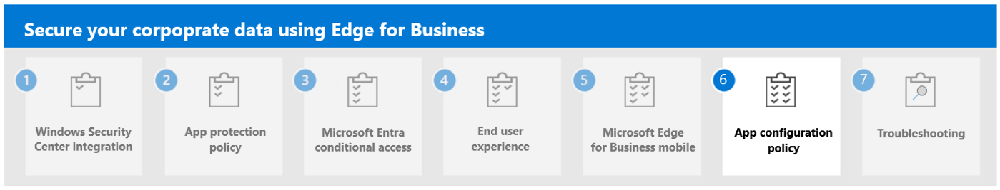

---
# required metadata

title: Understand Microsoft Edge for Business Mobile
titleSuffix:
description: Understand Microsoft Edge for Business Mobile.
keywords:
author: Erikre
ms.author: erikre
manager: dougeby
ms.date: 03/04/2024
ms.topic: overview
ms.service: microsoft-intune
ms.subservice: apps
ms.localizationpriority: high

# optional metadata

#audience:
#ROBOTS: 
ms.reviewer: samarti
ms.suite: ems
search.appverid: MET150
#ms.tgt_pltfrm:
ms.custom: 
ms.collection:
- tier1
- highpri
- highseo
- FocusArea_Apps_AppManagement
---

# Microsoft Edge for Business Mobile

Incorporate Microsoft Edge for Business into your existing data security and management strategy. By securing the enterprise browser configuration for mobile devices, you can ensure safer and more efficient web browsing experiences.

Microsoft Edge for Business provide benefits for both management and security:

- **Management**: Microsoft Edge for Business is the only mobile browser natively supported by Microsoft Intune with seamless integration. To secure productivity for your organization, App level management allows IT to configure the right balance between data protection and access.
- **Security**: Data protection and leakage prevention are based on conditional access and user identities. Microsoft 365 security features extend to Microsoft Edge for Business mobile including Microsoft Entra Conditional Access, and Data Loss Prevention. For organizations utilizing VPN solutions, Microsoft Edge mobile offers support for identity-enlightened per-app VPN. This includes the integration of Microsoft Tunnel with Intune for a seamless and secure connection. Additionally, solutions that don't require a VPN are also available.

## App protection policies for Mobile

App protection policies (APP) define which apps are allowed and the actions they can take with your organization's data. The choices available in APP enable organizations to tailor the protection to their specific needs. For some, it may not be obvious which policy settings are required to implement a complete scenario. To help organizations prioritize mobile client endpoint hardening, Microsoft has introduced taxonomy for its APP data protection framework for iOS and Android mobile app management.

The APP data protection framework is organized into three distinct configuration levels, as mentioned earlier in **Step 2**. Each level builds off the previous level:

- **Enterprise basic data protection** (Level 1) ensures that apps are protected with a PIN, encrypted, and allows selective wipe operations. For Android devices, this level validates Android device attestation.
- **Enterprise enhanced data protection** (Level 2) introduces APP data leakage prevention mechanisms and minimum OS requirements. This is the configuration that is applicable to most mobile users accessing work or school data.
- **Enterprise high data protection** (Level 3) introduces advanced data protection mechanisms, enhanced PIN configuration, and APP Mobile Threat Defense. This configuration is desirable for users that are accessing high risk data.

To see the specific recommendations for each configuration level and the minimum apps that must be protected, review [Data protection framework using app protection policies](../apps/app-protection-framework.md).

During this example, we create a **Level 3** App protection policy for Microsoft Edge from Microsoft Intune admin center.

To create the app protection policy, follow these steps:

1. Navigate to the [Microsoft Intune admin center](https://go.microsoft.com/fwlink/?linkid=2109431) and select **Apps** > **App protection policies** > **Create policy**.

2. Select **Create policy** > **Android** or **iOS/iPadOS**. Next, enter the following information:

    - **Name**: Level 3 secure enterprise browser.
    - **Description**: The following is a Level 3 app protection policy framework.

3. Click **Selected apps** > **public apps**. Find **Microsoft Edge**.

4. Select **Data Protection** and configure the **settings** based on the following table:

    |     Setting    |     Setting description    |     Value    |     Platform    |     Level    |
    |---|---|---|---|---|
    |     Data Transfer    |     Transfer   telecommunication data to    |     Any policy-managed   dialer app    |     Android    |     3    |
    |     Data Transfer    |     Transfer   telecommunication data to    |     A specific dialer app    |     iOS/iPadOS    |     3    |
    |     Data Transfer    |     Dialer App URL Scheme    |     replace_with_dialer_app_url_scheme    |     iOS/iPadOS    |     3    |
    |     Data transfer    |     Receive data from   other apps    |     Policy managed apps    |     iOS/iPadOS, Android    |     3    |
    |     Data transfer    |     Open data into Org   documents    |     Block    |     iOS/iPadOS, Android    |     3    |
    |     Data transfer    |     Allow users to open   data from selected services    |     OneDrive for Business,   SharePoint, Camera, Photo Library    |     iOS/iPadOS, Android    |     3    |
    |     Data transfer    |     Third-party keyboards    |     Block    |     iOS/iPadOS    |     3    |
    |     Data transfer    |     Approved keyboards    |     Require    |     Android    |     3    |
    |     Data transfer    |     Select keyboards to   approve    |     add/remove keyboards    |     Android    |     3    |
    |     Data Transfer    |     Back up org data to…    |     Block    |     iOS/iPadOS, Android    |     3    |
    |     Data Transfer    |     Send org data to other   apps    |     Policy managed apps    |     iOS/iPadOS, Android    |     3    |
    |     Data Transfer    |     Select apps to exempt    |     Default /   skype;app-settings;calshow;itms;itmss;itms-apps;itms-appss;itms-services;    |     iOS/iPadOS    |     3    |
    |     Data Transfer    |     Save copies of org   data    |     Block    |     iOS/iPadOS, Android    |     3    |
    |     Data Transfer    |     Allow users to save   copies to selected services    |     OneDrive for Business,   SharePoint Online, Photo Library    |     iOS/iPadOS, Android    |     3    |
    |     Data Transfer    |     Transfer   telecommunication data to    |     Any dialer app    |     iOS/iPadOS, Android    |     3    |
    |     Data Transfer    |     Restrict cut, copy,   and paste between apps    |     Policy managed apps   with paste in    |     iOS/iPadOS, Android    |     3    |

5. Review the **Encryption** section **settings** based on the following table:
  
    |     Setting    |     Setting description    |     Value    |     Platform    |     Level    |
    |---|---|---|---|---|
    |     Encryption    |     Encrypt org data    |     Require    |     iOS/iPadOS, Android    |     3    |

6. Review the **Functionality** section **settings** based on the following table:

    |     Setting    |     Setting description    |     Value    |     Platform    |     Level    |
    |---|---|---|---|---|
    |     Functionality    |     Printing org data    |     Block    |     iOS/iPadOS, Android,   Windows    |     3    |
    |     Functionality    |     Sync app with native   contacts app    |     Allow    |     iOS/iPadOS, Android    |     3    |
    |     Functionality    |     Org data notifications    |     Block Org Data    |     iOS/iPadOS, Android    |     3    |
    |     Functionality    |     Restrict web content   transfer with other apps    |     Microsoft Edge    |     iOS/iPadOS, Android    |     3    |
    |     Functionality    |     Sync policy managed   app data with native apps or add ins    |     Allow    |     iOS/iPadOS, Android    |     3    |

7. Once you've completed all three sections, select **Next**.

8. Review the **Access Requirements** section **settings** based on the following table:

    |     Setting    |     Setting description    |     Value    |     Platform    |     Level    |
    |---|---|---|---|---|
    |     Access requirements    |     Simple PIN    |     Block    |     iOS/iPadOS, Android    |     3    |
    |     Access requirements    |     Select Minimum PIN   length    |     6    |     iOS/iPadOS, Android    |     3    |
    |     Access requirements    |     PIN reset after number   of days    |     Yes    |     iOS/iPadOS, Android    |     3    |
    |     Access requirements    |     Require device lock    |     High/Block Access    |     Android    |     3    |
    |     Access requirements    |     Jailbroken/rooted   devices    |     N/A / Wipe data    |     iOS/iPadOS, Android    |     3    |
    |     Access requirements    |     Max OS version    |     Format: Major.Minor    |     Android    |     3    |
    |     Access requirements    |     Samsung Knox device   attestation    |     Wipe data    |     Android    |     3    |
    |     Access requirements    |     Back up org data to…    |     Block    |     iOS/iPadOS, Android    |     3    |
    |     Access requirements    |     Allow users to save   copies to selected services    |     OneDrive for Business,   SharePoint Online, Photo Library    |     iOS/iPadOS, Android    |     3    |
    |     Access requirements    |     Restrict cut, copy,   and paste between apps    |     Policy managed apps   with paste in    |     iOS/iPadOS, Android    |     3    |
    |     Access requirements    |     Save copies of org   data    |     Block    |     iOS/iPadOS, Android    |     3    |
    |     Access requirements    |     Screen capture and   Google Assistant    |     Block    |     Android    |     3    |
    |     Access requirements    |     Select apps to exempt    |     Default /   skype;app-settings;calshow;itms;itmss;itms-apps;itms-appss;itms-services;    |     iOS/iPadOS    |     3    |
    |     Access requirements    |     Send org data to other   apps    |     Policy managed apps    |     iOS/iPadOS, Android    |     3    |
    |     Access requirements    |     App PIN when device   PIN is set    |     Require    |     iOS/iPadOS, Android    |     3    |
    |     Access requirements    |     Biometric instead of   PIN for access    |     Allow    |     iOS/iPadOS, Android    |     3    |
    |     Access requirements    |     SafetyNet device   attestation    |     Basic integrity and   certified devices / Block access    |     Android    |     3    |
    |     Access requirements    |     Require threat scan on   apps    |     N/A / Block access    |     Android    |     3    |
    |     Access requirements    |     Require device lock    |     Low/Warn    |     Android    |     3    |
    |     Access requirements    |     Min OS version    |     Format:   Major.MinorExample: 9.0 / Block access    |     Android    |     3    |
    |     Access requirements    |     Min patch version    |     Format: YYYY-MM-DD    |     Android    |     3    |
    |     Access requirements    |     Required SafetyNet   evaluation type    |     Hardware-backed key    |     Android    |     3    |
    |     Access requirements    |     Encrypt org data    |     Require    |     iOS/iPadOS, Android    |     3    |
    |     Access requirements    |     Encrypt org data on   enrolled devices    |     Require    |     Android    |     3    |
    |     Access requirements    |     Sync app with native   contacts app    |     Allow    |     iOS/iPadOS, Android    |     3    |
    |     Access requirements    |     Restrict web content   transfer with other apps    |     Microsoft Edge    |     iOS/iPadOS, Android    |     3    |
    |     Access requirements    |     Org data notifications    |     Block Org Data    |     iOS/iPadOS, Android    |     3    |
    |     Access requirements    |     Override biometrics   with PIN after timeout    |     Require    |     iOS/iPadOS, Android    |     3    |
    |     Access requirements    |     PIN for access    |     Require    |     iOS/iPadOS, Android    |     3    |
    |     Access requirements    |     PIN type    |     Numeric    |     iOS/iPadOS, Android    |     3    |
    |     Access requirements    |     Recheck the access   requirements after (minutes of inactivity)    |     30    |     iOS/iPadOS, Android    |     3    |
    |     Access requirements    |     Select number of   previous PIN values to maintain    |     0    |     Android    |     3    |
    |     Access requirements    |     Timeout (minutes of   activity)    |     720    |     iOS/iPadOS, Android    |     3    |
    |     Access requirements    |     Offline grace period    |     Allow    |     iOS/iPadOS    |     3    |
    |     Access requirements    |     Work or school account   credentials for access    |     Not required    |     iOS/iPadOS, Android    |     3    |

9. Select **Next**.

10. Review the **Conditional Launch** section **settings** based on the following table:

|     Setting    |     Setting description    |     Value    |     Platform    |     Level    |
|---|---|---|---|---|
|     App conditions    |     Max allowed threat   level    |     Secured / Block access    |     iOS/iPadOS, Android    |     3    |
|     App conditions    |     Max OS version    |     Format:   Major.Minor.Build    |     iOS/iPadOS    |     3    |
|     App conditions    |     Max PIN attempts    |     5 / Reset PIN    |     iOS/iPadOS, Android    |     3    |
|     App conditions    |     Offline grace period    |     720 / Block access   (minutes)    |     iOS/iPadOS, Android    |     3    |
|     App conditions    |     Offline grace period    |     90 / Wipe data (days)    |     iOS/iPadOS, Android    |     3    |
|     App conditions    |     Disabled account    |     N/A / Block access    |     iOS/iPadOS, Android    |     3    |
|     App conditions    |     Min OS version    |     Format:   Major.Minor.Build    |     iOS/iPadOS    |     3    |
|     App conditions    |     Max PIN attempts    |     5 / Reset PIN    |     iOS/iPadOS, Android    |     3    |
|     App conditions    |     Offline grace period    |     90 / Wipe data (days)    |     iOS/iPadOS, Android    |     3    |
|     App conditions    |     Disabled account    |     N/A / Block access    |     iOS/iPadOS, Android    |     3    |
|     App conditions    |     Offline grace period    |     720 / Block access   (minutes)    |     iOS/iPadOS, Android    |     3    |

11. Select **Next** after you've completed the **Conditional launch** step.

12. Review the **Scope Tags** step.

    > [!NOTE]
    > Review and configure scope tags
    

13. Select **Next** Once completed.

14. Review the **Assignments**.

15. Review the policy details in the **Review and Create** step.

    :::image type="content" alt-text="Apps  -  App protection policies  -  Review + Create - Microsoft Intune admin center" source="./media/securing-data-edge-for-business/securing_data_edge_for_business46.png" lightbox="./media/securing-data-edge-for-business/securing_data_edge_for_business46.png":::

16. Select **Create** and wait until the policy is created.

    :::image type="content" alt-text="Apps - App protection policies - Policy successfully created - Microsoft Intune admin center." source="./media/securing-data-edge-for-business/securing_data_edge_for_business47.png" lightbox="./media/securing-data-edge-for-business/securing_data_edge_for_business47.png":::

## Next step

Continue with [Step 6](mamedge-6-acp-edge.md) to understand App Configuration Policies for Microsoft Edge for Business.
