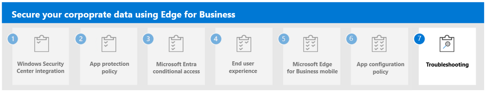

---
# required metadata

title: Use App Configuration Policies for Microsoft Edge for Business
titleSuffix:
description: Use app configuration policy for Microsoft Edge for Business.
keywords:
author: Erikre
ms.author: erikre
manager: dougeby
ms.date: 03/04/2024
ms.topic: overview
ms.service: microsoft-intune
ms.subservice: apps
ms.localizationpriority: high

# optional metadata

#audience:
#ROBOTS: 
ms.reviewer: samarti
ms.suite: ems
search.appverid: MET150
#ms.tgt_pltfrm:
ms.custom: 
ms.collection:
- tier1
- highpri
- highseo
- FocusArea_Apps_AppManagement
---

# App Configuration Policies for Microsoft Edge for Business

Microsoft Edge for iOS and Android supports app settings that allow Microsoft Intune administrators to customize the behavior of the app and implement Browser Configuration.

App configuration can be delivered either through the mobile device management (MDM) OS channel on enrolled devices [Managed App Configuration](https://developer.apple.com/library/content/samplecode/sc2279/Introduction/Intro.html) channel for iOS or the [Android in the Enterprise](https://developer.android.com/work/managed-configurations) channel for Android or through the MAM (Mobile Application Management) channel. Microsoft Edge for iOS and Android supports the following configuration scenarios:

- Only allow work or school accounts
- General app configuration settings
- Data protection settings
- Additional app configuration for managed devices

> [!IMPORTANT]
> For configuration scenarios that require device enrollment on Android, the devices must be enrolled in Android Enterprise and Microsoft Edge for Android must be deployed via the Managed Google Play store. For more information, see [**Set up enrollment of Android Enterprise personally-owned work profile devices**](/mem/intune/enrollment/android-work-profile-enroll) and [**Add app configuration policies for managed Android Enterprise devices**](/mem/intune/apps/app-configuration-policies-use-android).

You will now review the following key items that need to be configured. Then, you'll create an app configuration policy in Microsoft Intune admin center.

## Microsoft Edge app configuration values

Reference the following table when setting app configuration values for Microsoft Edge:

| Key | Value | Example | Notes |
|---|---|---|---|
| com.microsoft.intune.mam.managedbrowser.PasswordSSO | TRUE |  |  |
| com.microsoft.intune.mam.managedbrowser.disableShareUsageData | TRUE |  |  |
| com.microsoft.intune.mam.managedbrowser.disabledFeatures | Option include: <ul><li>`password`</li><li>`inprivate`</li><li>`autofill`</li><li>`translator`</li><li>`drop`</li><li>`developer tools`</li></ul> | `password|inprivate|autofill|translator|drop|developer tools` | To disable a feature, include it as part of the value. |
| com.microsoft.intune.mam.managedbrowser.disableImportPasswords | TRUE |  |  |
| com.microsoft.intune.mam.managedbrowser.SmartScreenEnabled | TRUE |  |  |
| com.microsoft.intune.mam.managedbrowser.account.syncDisabled | TRUE |  |  |
| com.microsoft.intune.IntuneMAMOnly.AdvancedEncryption | enabled |  |  |

For related information, see [Manage Microsoft Edge on iOS and Android with Intune](../apps/manage-microsoft-edge.md).

### Configure the app

Use the following steps to configure the app:

1. Navigate to the [Microsoft Intune admin center](https://go.microsoft.com/fwlink/?linkid=2109431).

2. Select **Apps** > **App configuration policies** > **Add** > **Managed apps**.

3. On the **Create app configuration policy**, pane enter the following information:

    - **Name**: Browser ACP
    - **Description**: Secure Enterprise Browser ACP Configuration
    - **Target Policy to**: Selected apps

    :::image type="content" alt-text="Apps - App configuration policies - Microsoft Intune admin center." source="./media/securing-data-edge-for-business/securing_data_edge_for_business49.png" lightbox="./media/securing-data-edge-for-business/securing_data_edge_for_business49.png":::

4. Click **Select public apps** to display the **Selected apps to target** pane.

5. Select the **Microsoft Edge** app for **iOS/iPadOS** and click **Select**.

5. Select **Next** to display the **Settings catalog** step. Don't change settings on the **Settings catalog** step.

6. Select **Next** to display the **Settings** step.

7. Enter each of the **names** and **keys** from the list below.
    
    - **Name**: 
    - **Value**: 

    :::image type="content" alt-text="Apps  -  App configuration policies  -  Create app configuration policy- Microsoft Intune admin center" source="./media/securing-data-edge-for-business/securing_data_edge_for_business50.png" lightbox="./media/securing-data-edge-for-business/securing_data_edge_for_business50.png":::
    
8. Review each value and select **Next**.

9. Add a **Scope tag** and select **Next**.

10. Review Assignment and select **Next**.

11. Select **Review + create**.

Repeat the previous steps to create an app configuration policy for additional platforms if needed.

## Next step

Continue with [Step 7](mamedge-7-troubleshooting.md) to troubleshoot securing data with Microsoft Edge for Business.