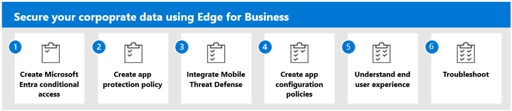

---
# required metadata

title: Secure your corporate data using Microsoft Edge for Business
titleSuffix:
description: Secure your corporate data in Microsoft Intune with Microsoft Edge for Business.
keywords:
author: Erikre
ms.author: erikre
manager: dougeby
ms.date: 03/26/2024
ms.topic: overview
ms.service: microsoft-intune
ms.subservice: apps
ms.localizationpriority: high

# optional metadata

#audience:
#ROBOTS: 
ms.reviewer: samarti
ms.suite: ems
search.appverid: MET150
#ms.tgt_pltfrm:
ms.custom: 
ms.collection:
- tier1
- highpri
- highseo
- FocusArea_Apps_AppManagement
---

# Secure your corporate data in Intune with Microsoft Edge for Business

This content helps you implement and secure enterprise browser configuration for Mobile Application Management using Microsoft Edge for Business.

**Applies to:**
- Mobile Application Management (MAM) 
- Microsoft Edge for Business

## Target Audience

The target audience for this content includes:

- **Intune Administrators:** This content provides detailed guidance about configuring and managing Microsoft Edge for Business in Microsoft Intune.
- **Security Professionals:** This content includes security related areas, such as the [data protection framework using app protection policies](../apps/app-protection-framework.md), [app configuration policies](../apps/app-configuration-policies-overview.md), data encryption, and [conditional access policies](../apps/app-protection-framework.md#conditional-access-policies). You can use this content to enhance your organization's security posture.
- **Decision Makers:** This content can help decision makers understand the security, productivity, and manageability benefits of Microsoft Edge for Business. In addition, this content helps decision makers make informed decisions about their browser choice for their organization.

> [!NOTE]
> This content is designed to help you leverage the full potential of Microsoft Edge for Business and Microsoft Application Management.

## Overview

This guide provides the following content:

1. **Microsoft Entra conditional access with Microsoft Edge for Business** - Create an Entra conditional access policy and Intune app protection policy for browsing on Android, iOS and Windows.
2. **App protection policies for Microsoft Edge for Business** - Ensure secure access and usage of enterprise applications when implementing app protection policies.
3. **Integrate Mobile Threat Defense** - Enhance the overall security posture of your organization by using the secure enterprise browser to integrate with the Windows Security Center, Microsoft Defender or any MTD Partners.
4. **App configuration policies for Microsoft Edge for Business** - Understand Microsoft Edge for Business and Microsoft Application Management can be used to protect your organization from various cyber threats.
5. **Microsoft Edge for Business end user experience** - Understand how security measures impact user interaction for Microsoft Edge for Business.
6. **Troubleshooting Examples:** - A series of examples on how to troubleshoot App Protection Policies and a list of FAQ.

For more information about Microsoft Edge Security content, see [Microsoft Edge for Business: AI and protection in one secure enterprise browser](https://aka.ms/EdgeSecuritywhitepaper).

### What is Microsoft Edge for Business?

Microsoft Edge for Business is a dedicated Microsoft Edge browsing experience designed specifically for work environments. Microsoft Edge for Business is secure by default. It enables admins in organizations to give their users a productive and secure work-browser provided across managed and unmanaged devices. In addition, Microsoft Edge for Business has the same rich set of enterprise controls, security, and productivity features that you're already familiar with in Microsoft Edge, and it's built to help meet the evolving needs of businesses and organizations.

Microsoft Edge for Business aims to address the needs of both end users and IT Pros by automatically separating work and personal browsing. Microsoft Edge for Business does this using dedicated browser windows containing their own favorites, separate caches, and storage locations. This separation ensures that work related content doesn't get intermingled with personal browsing. In addition, it helps to prevent end users accidentally share sensitive information with unintended audiences.

### Is this a new browser?

No, this isn’t a new browser. This is a new, dedicated Microsoft Edge experience built specifically for work. It allows organizations to configure it to maximize productivity and security. It retains the same functionality that users are already familiar with in Microsoft Edge. Additionally, it offers an optional feature of automatic switching between personal and corporate accounts, designed to meet the evolving needs of users and businesses. Signing in with a Microsoft Entra ID will automatically enable the Microsoft Edge for Business experience.  

### Benefits

Microsoft Edge for Business offers a multitude of advantages:

**Streamlined IT operations:** Microsoft Edge for Business can significantly reduce the cyber-attack surface area and enhance your organization’s security posture. It achieves this by streamlining down operations to a single browser for all use cases, simplifying IT management.

**Improved user experience:** For end users signed in with both work and personal profiles, Microsoft Edge for Business offers a superior browsing experience. The automatic switching feature not only enhances usability but also bolsters security and privacy.

**Work browser with a visual refresh:** The Microsoft Edge for Business icon, which replaces the existing Microsoft Edge icon in the taskbar and other shortcuts, provides a distinct and recognizable identity for the business browser.

**Enhanced security:** Microsoft Edge for Business fortifies the browsing experience by implementing app protection policies. These policies ensure that enterprise data remains secure, providing peace of mind for both the organization and its users.

**Centralized management:** With Microsoft Intune, managing a Microsoft Edge for Business policy experience is not complex. This centralized management system simplifies the process, saving time and resources.

In addition to the above benefits, you can enable protected Mobile Application Management access to corporate data on personal devices. This capability uses the following functionality:
- Intune application configuration policies (ACP) with Microsoft Edge for Business. Using ACP allows you to leverage Edge’s settings to better enable a secure browsing experience.
- Intune application protection policies (APP) to secure organization data and ensure the client device is healthy.
- Mobile Threat Protection (MTP) integrated with Intune APP to detect local health threats on personal Windows and all mobile devices.
- Microsoft Entra conditional access to ensure the device is protected and healthy before granting protected services access via Microsoft Entra.

## Zero Trust Methodology

The [Zero Trust security strategy](/security/zero-trust/zero-trust-overview) is transforming the way organizations approach security. It’s becoming the new standard for security strategy in response to the evolving threat landscape. Traditional best practices revolved around the model of "trust but verify", however this approach can be exploited by modern attacks. This has driven the need for a shift in security strategy. The Zero Trust methodology is based on the concept of "never trust, always verify" and aligns with three key principles:

- **Verify Explicitly:** Always authenticate and authorize based on all available data points. These data points include user identity, location, device health, service/workload, data classification, and anomalies.
- **Use Least-Privilege Access:** Limit user access with just-in-time and just-enough-access (JIT/JEA) policies. Implement risk-based adaptive policies and data protection to secure both data and productivity.
- **Assume Breach:** Minimize the blast radius and segment access. Ensure end-to-end encryption and use analytics to gain visibility, drive threat detection, and improve defenses.

### Microsoft Edge for Business complements Zero Trust

Microsoft Edge for Business, built on the robust and secure foundation of Chromium, is designed to stay ahead of security threats. It releases updates and patches swiftly to counter threats such as zero-day exploits, minimizing the impact of any potential compromise.

In addition to the inherent security features of Chromium, Microsoft Edge for Business incorporates unique protection features and supports a range of Microsoft technologies:

- **Microsoft Defender:** Provides comprehensive security solutions.
- **[Microsoft Entra](/entra/):** Formerly known as Azure Active Directory, it offers identity and access management services.
- **[Microsoft Intune](/mem/):** Offers mobile device and application management.
- **[Microsoft Purview](/purview/):** Supports data governance across your hybrid data estate.

Furthermore, Microsoft Edge for Business aligns with the Zero Trust methodology by offering the following features:

- **Data Loss Prevention (DLP) with Microsoft Purview:** Helps prevent data leaks and unauthorized data access.
- **Microsoft Defender SmartScreen:** Provides reputation-based protection against phishing and malware.
- **Enhanced Security Mode (ESM):** Offers additional security measures.
- **Website Typo Protection:** Helps prevent navigation to malicious sites due to typographical errors.
- **Native Support for Microsoft Entra Conditional Access:** Ensures only authenticated and authorized users can access your resources.
- **Password Monitoring and Generator:** Helps maintain strong, unique passwords.
- **Microsoft Edge Management Service (EMS):** Provides centralized control over your Microsoft Edge deployments.
- **Unmanaged Device Support with Microsoft Intune Mobile Application Management:** Allows secure access to enterprise resources from unmanaged devices.

## What's in this solution

This solution provides insights into securing your enterprise browser configuration and implementation for Mobile Application Management and Microsoft Edge for Business.

Continue with [Step 1](mamedge-1-mamca.md) to create Microsoft Entra conditional access.
