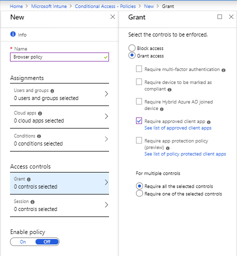
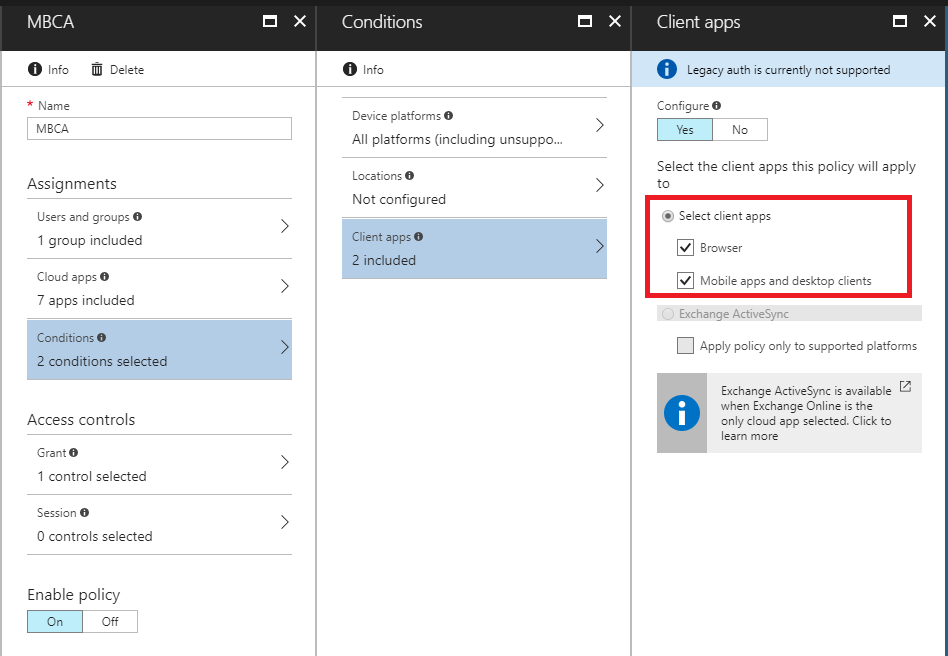
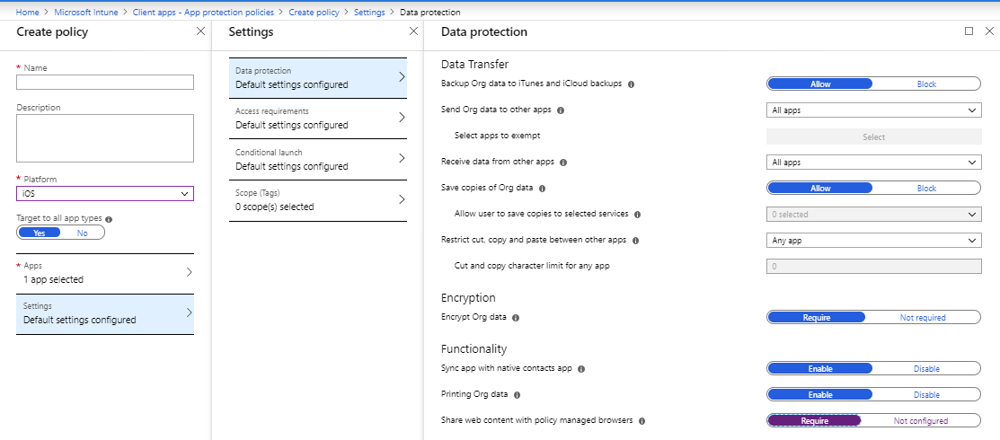

---
# required metadata

title: Manage Microsoft Edge for iOS and Android with Intune 
titleSuffix: 
description: Use Intune app protection policies with Microsoft Edge to ensure corporate websites are always accessed with safeguards in place. 
keywords:
author: Erikre
ms.author: erikre
manager: dougeby
ms.date: 03/02/2020
ms.topic: conceptual
ms.service: microsoft-intune
ms.subservice: apps
ms.localizationpriority: high
ms.technology:
ms.assetid: 3fb2f050-ec94-42ab-be05-c3d4101148bb

# optional metadata

#ROBOTS:
#audience:
#ms.devlang:
ms.reviewer: ilwu
ms.suite: ems
search.appverid: MET150
#ms.tgt_pltfrm:
ms.custom: intune-azure
ms.collection: M365-identity-device-management
---

# Manage web access by using Microsoft Edge with Microsoft Intune

Using Intune app protection policies with Microsoft Edge helps ensure that corporate websites are always accessed with safeguards in place. The following Microsoft Edge enterprise features enabled by Intune policies are available:

- **Dual-Identity.** Users can add a work account, as well as a personal account, for browsing. There is complete separation between the two identities, which is similar to the architecture and experience in Office 365 and Outlook. Intune admins can set the desired policies for a protected browsing experience within the work account.
- **Intune app protection policy integration.** Because Microsoft Edge is integrated with the Intune SDK, you can target app protection policies to protect against data loss. These capabilities include controlling cut, copy, and paste, preventing screen captures, and ensuring that user-selected links open only in other managed apps.
- **Azure Application Proxy integration.** You can control access to software as a service (SaaS) apps and web apps. This helps ensure that browser-based apps only run in the secure Microsoft Edge browser, whether end users connect from the corporate network or connect from the internet.
- **Application configuration.** You can use application configuration settings to strengthen your organization's security posture and configure ease-of-use features for your end users. For example, you can define bookmarks, a homepage shortcut, allowed or blocked sites, and Azure Active Directory (Azure AD) Application Proxy.

Microsoft Intune protection policies for Microsoft Edge help to protect your organization’s data and resources. Using these policies with Microsoft Edge ensures that your company’s resources are protected not only within natively installed apps, but also when accessed through the web browser.

## Getting started

You and your end users can download Microsoft Edge from public app stores for use in your organizations. 
The operating system requirements for browser policies are either of the following:
- Android 4 and later
- iOS 8.0 and later

## Application protection policies for Microsoft Edge

Because Microsoft Edge is integrated with the Intune SDK, you can apply application protection policies to them.

You can apply these settings to:
- Devices that are enrolled with Intune.
- Devices that are enrolled with another mobile device management product.
- Unmanaged devices.

If Microsoft Edge is not targeted with Intune policy, users can't use it to access data from other Intune-managed applications, such as Office apps. 

## Conditional Access for Microsoft Edge

You can use Azure AD Conditional Access to redirect your users to access corporate content only through Microsoft Edge. This restricts mobile browser access to Azure AD-connected web apps to policy-protected Microsoft Edge. This blocks access from any other unprotected browsers, such as Safari or Chrome. You can apply Conditional Access to Azure resources like Exchange Online and SharePoint Online, the Microsoft 365 admin center, and even on-premises sites that you have exposed to external users via the [Azure AD Application Proxy](https://docs.microsoft.com/azure/active-directory/active-directory-application-proxy-get-started).

To restrict Azure AD-connected web apps to use Microsoft Edge on iOS and Android:
1. Sign in to the [Microsoft Endpoint Manager Admin Center](https://go.microsoft.com/fwlink/?linkid=2109431).
2. Under the Intune node, select **Conditional Access** > **New policy**.
3. Select **Grant** from the **Access controls** section of the pane.
4. Select **Require approved client app**.
5. Choose **Select** on the **Grant** pane. This policy must be assigned to the cloud apps that you want to be accessible to only the Intune Managed Browser app.

    

6. In the Assignments section, select **Conditions** > **Apps**. The **Apps** pane appears.
7. Under **Configure**, select **Yes** to apply the policy to specific client apps.
8. Verify that **Browser** is selected as a client app.

    

    > [!NOTE]
    > If you want to restrict which native apps (non-browser apps) can access these cloud applications, you can also select **Mobile apps and desktop clients**.

9. In the **Assignments** section, select **Users and groups**, and then choose the users or groups you want to assign this policy.

10. In the **Assignments** section, select **Cloud apps** to choose which apps to protect with this policy.

After the above policy is configured, users are forced to use Microsoft Edge to access the Azure AD-connected web apps you have protected with this policy. If users attempt to use an unmanaged browser in this scenario, they receive a message that they must use Microsoft Edge.

> [!TIP]
> Conditional Access is an Azure AD technology. The Conditional Access node accessed from Intune is the same node as accessed from Azure AD.

## Single sign-on to Azure AD-connected web apps in policy-protected browsers

Microsoft Edge on iOS and Android can take advantage of single sign-on (SSO) to all web apps (SaaS and on-premises) that are Azure AD-connected. SSO allows users to access Azure AD-connected web apps through Microsoft Edge, without having to re-enter their credentials.

SSO requires your device to be registered by either the Microsoft Authenticator app for iOS devices, or the Intune Company Portal on Android. When users have either of these, they are prompted to register their device when they go to an Azure AD-connected web app in a policy-protected browser. (This is only true if their device hasn't already been registered.) After the device is registered with the user’s account managed by Intune, that account has SSO enabled for Azure AD-connected web apps.

> [!NOTE]
> Device registration is a simple check-in with the Azure AD service. It doesn't require full device enrollment, and doesn't give IT any additional privileges on the device.

## Create a protected browser app configuration

To create app configuration for Microsoft Edge:

1. Sign in to the [Microsoft Endpoint Manager Admin Center](https://go.microsoft.com/fwlink/?linkid=2109431).
2. Select **Apps** > **App configuration policies** > **Add**.
3. On the **Add configuration policy** pane, enter a **Name** and optional **Description** for the app configuration settings.
4. For **Device enrollment** type, choose **Managed apps**.
5. Choose **Select the required app**. Then, on the **Targeted apps** pane, choose the **Managed Browser** or **Edge** for iOS/iPadOS, for Android, or for both.
6. Select **OK** to return to the **Add configuration policy** pane.
7. Select **Configuration settings**. On the **Configuration** pane, you define key and value pairs to supply configurations for Microsoft Edge. Use the sections later in this article to learn about the different key and value pairs you can define.

    > [!NOTE]
    > Microsoft Edge uses the same key and value pairs as the Managed Browser. 
    > On Android, Microsoft Edge must be targeted with app protection policies for app configuration policies to take effect.

8. When you are done, select **OK**.
9. On the **Add configuration policy** pane, choose **Add**. 
    The new configuration is created and displayed on the **App configuration** pane.

## Assign the configuration settings you created 

You assign the settings to groups of users in Azure AD. If that user has the targeted protected browser app installed, then the app is managed by the settings you specified.

1. On the **Apps** pane of the Intune mobile application management dashboard, select **App configuration policies**.
2. From the list of app configurations, select the one you want to assign.
3. On the next pane, select **Assignments**.
4. On the **Assignments** pane, select the Azure AD group to which you want to assign the app configuration, and then select **OK**.

## Direct users to Microsoft Edge instead of the Intune Managed Browser 

Both the Intune Managed Browser and Microsoft Edge can be used as policy-protected browsers. To ensure that your users are being directed to use the correct browser app, target all of your Intune-managed apps (for example, Outlook, OneDrive, and SharePoint) with the following configuration setting:

|    Key    |    Value    |
|------------------------------------|--------------------------------------------------------------------------------------------------------------------------------------------------------|
|    `com.microsoft.intune.useEdge`    |    The value `true` will direct your users to download and use Microsoft Edge. The value `false` will allow your users to use the Intune Managed Browser.    |

If this app configuration value is **not** set, the following logic will define which browser will be used to open corporate links.

On Android:
- The Intune Managed Browser launches if a user has both the Intune Managed Browser and Microsoft Edge downloaded on their device. 
- Microsoft Edge launches if only Microsoft Edge is downloaded on the device, and is targeted with Intune policy.
- Managed Browser launches if only Managed Browser is on the device, and is targeted with Intune policy.

On iOS/iPadOS, for apps that have integrated the Intune SDK for iOS v. 9.0.9+:
- The Intune Managed Browser launches if both the Managed Browser and Microsoft Edge are on the device.  
- Microsoft Edge launches if only Microsoft Edge is on the device, and is targeted with Intune policy.
- Managed Browser launches if only Managed Browser is on the device, and is targeted with Intune policy.

## Configure Application Proxy settings for Microsoft Edge

You can use Microsoft Edge and [Azure AD Application Proxy](https://docs.microsoft.com/azure/active-directory/active-directory-application-proxy-get-started) together to give users access to intranet sites on their mobile devices. 

These are some examples of the scenarios Azure AD Application Proxy enable: 

- A user is using the Outlook mobile app, which is protected by Intune. They then click a link to an intranet site in an email, and Microsoft Edge recognizes that this intranet site has been exposed to the user through Application Proxy. The user is automatically routed through Application Proxy, to authenticate with any applicable multi-factor authentication and Conditional Access, before reaching the intranet site. The user is now able to access internal sites, even on their mobile devices, and the link in Outlook works as expected.
- A user opens Microsoft Edge on their iOS or Android device. If Microsoft Edge is protected with Intune, and Application Proxy is enabled, the user can go to an intranet site by using the internal URL they are used to. Microsoft Edge recognizes that this intranet site has been exposed to the user through Application Proxy. The user is automatically routed through Application Proxy, to authenticate before reaching the intranet site. 

### Before you start

- Set up your internal applications through Azure AD Application Proxy.
  - To configure Application Proxy and publish applications, see the [setup documentation](https://docs.microsoft.com/azure/active-directory/manage-apps/application-proxy).
- The Microsoft Edge app must have [Intune app protection policy](app-protection-policy.md) assigned.

> [!NOTE]
> Updated Application Proxy redirection data can take up to 24 hours to take effect in the Managed Browser and Microsoft Edge.

#### Step 1: Enable automatic redirection to Microsoft Edge from Outlook
Configure Outlook with an app protection policy that enables the setting **Share web content with policy managed browsers**.

#### Step 2: Set the app configuration setting to enable app proxy
Target Microsoft Edge with the following key/value pair, to enable Application Proxy for Microsoft Edge:

|    Key    |    Value    |
|-------------------------------------------------------------------|-------------|
|    com.microsoft.intune.mam.managedbrowser.AppProxyRedirection    |    true    |

For more information about how to use Microsoft Edge and Azure AD Application Proxy in tandem for seamless (and protected) access to on-premises web apps, see [Better together: Intune and Azure Active Directory team up to improve user access](https://techcommunity.microsoft.com/t5/enterprise-mobility-security/better-together-intune-and-azure-active-directory-team-up-to/ba-p/250254). This blog post references the Intune Managed Browser, but the content applies to Microsoft Edge as well.

## Configure a homepage shortcut for Microsoft Edge

This setting allows you to configure a homepage shortcut for Microsoft Edge. The homepage shortcut you configure appears as the first icon beneath the search bar when the user opens a new tab in Microsoft Edge. The user can't edit or delete this shortcut in their managed context. The homepage shortcut displays your organization's name to distinguish it. 

Use the following key/value pair to configure a homepage shortcut:

|    Key    |    Value    |
|-------------------------------------------------------------------|-------------|
|    com.microsoft.intune.mam.managedbrowser.homepage   |    Specify a valid URL. Incorrect URLs are blocked as a security measure. **Example:** <`https://www.bing.com`>     |

## Configure multiple top site shortcuts for new tab pages in Microsoft Edge 
Similarly to configuring a homepage shortcut, you can configure multiple top site shortcuts on new tab pages in Microsoft Edge. The user can't edit or delete these shortcuts in a managed context. Note: you can configure a total of 8 shortcuts, including a homepage shortcut. If you have configured a homepage shortcut, that will override the first top site configured. 

|    Key    |    Value    |
|-------------------------------------------------------------------|-------------|
|    com.microsoft.intune.mam.managedbrowser.managedTopSites   |    Specify set of value URLs. Each top site shortcut consists of a title and URL. Separate the title and URL with the `|` character. For example:   `GitHub | https://github.com/||LinkedIn|https://www.linkedin.com`    |

## Configure your organization's logo and brand color for new tab pages in Microsoft Edge

These settings allow you to customize the New Tab Page for Microsoft Edge to display your organization's logo and brand color as the page background.

To upload your organization's logo and color, first complete the following steps:
- Within the Azure portal, navigate to [Microsoft Endpoint Manager admin center](https://go.microsoft.com/fwlink/?linkid=2109431) -> **Tenant Administration** -> **Branding and customization** -> **Company Identity Branding**.
- To set your brand's logo, under "Display", choose "Company Logo only". Transparent background logos are recommended. 
- To set your brand's background color, under "Display" choose "Theme Color". Microsoft Edge applies a lighter shade of the color on the New Tab Page, which ensures the page has high readability. 

Next, use the following key/value pairs to pull your organizations branding into Microsoft Edge:

|    Key    |    Value    |
|--------------------------------------------------------------------|------------|
|    com.microsoft.intune.mam.managedbrowser.NewTabPage.BrandLogo    |    True    |
|    com.microsoft.intune.mam.managedbrowser.NewTabPage.BrandColor    |    True    |

## Display relevant industry news on New Tab Pages

You can configure the New Tab Page experience within Microsoft Edge mobile to display industry news that is relevant to your organization. When you enable this feature, Microsoft Edge mobile uses your organization's domain name to aggregate news from the web about your organization, organization's industry, and competitors, so your users can find relevant external news all from the centralized new tab pages within Microsoft Edge. Industry News is switched off by default, and you can use to opt-into it for your organization. 

|    Key    |    Value    |
|------------------------------------------------------|----------------------------------------------------------------------------------------------------------------|
|    com.microsoft.intune.mam.managedbrowser.NewTabPage.IndustryNews    |    **True** will show Industry News on the Microsoft Edge mobile New Tab Page.
**False** (default) will hide Industry News from the New Tab Page.    |

## Configure managed bookmarks for Microsoft Edge

For ease of access, you can configure bookmarks that you’d like your users to have available when they are using Microsoft Edge. 

Here are some details:

- These bookmarks only appear for users when they are using the [corporate mode](https://docs.microsoft.com/intune/apps/app-configuration-managed-browser#how-to-configure-bookmarks-for-a-protected-browser) of Microsoft Edge. 
- These bookmarks can't be deleted or modified by users.
- These bookmarks appear at the top of the list. Any bookmarks that users create appear below these bookmarks.
- If you have enabled Application Proxy redirection, you can add Application Proxy web apps by using either their internal or external URL.
- Ensure that you prefix all URLs with **http://** or **https://** when entering them into the list.

Use the following key/value pair to configure managed bookmarks:

|    Key    |    Value    |
|---------------------------------------------------------|--------------------------------------------------------------------------------------------------------------------------------------------------------------------------------------------------------------------------------------------------------------------------------------------------------------------------------------------------------------------------------------------------------------------|
|    com.microsoft.intune.mam.managedbrowser.bookmarks    |    The value for this configuration is a   list of bookmarks. Each bookmark consists of the bookmark title and the   bookmark URL. Separate the title and URL with the `|` character.      Example: `Microsoft Bing|https://www.bing.com` To configure multiple bookmarks, separate each pair with the double character `||`.
Example: `Microsoft Bing|https://www.bing.com||Contoso|https://www.contoso.com`    |

## Display MyApps within Microsoft Edge bookmarks

By default, your users are shown the MyApps sites that are configured to them within a folder inside Microsoft Edge bookmarks. The folder is labeled with the name of your organization.

|    Key    |    Value    |
|---------------------------------------------------------|--------------------------------------------------------------------------------------------------------------------------------------------------------------------------------------------------------------------------------------------------------------------------------------------------------------------------------------------------------------------------------------------------------------------|
|    com.microsoft.intune.mam.managedbrowser.MyApps    |    **True** shows MyApps within the Microsoft Edge bookmarks.
**False** hides MyApps within Microsoft Edge.    |
    
## Use HTTPS protocol as default

You can configure Microsoft Edge mobile to default to using the HTTPS protocol when the user doesn't specify one. Generally, this is considered a best practice. Use the following key/value pair to enable HTTPS as the default protocol:

|    Key    |    Value    |
|---------------------------------------------------------|--------------------------------------------------------------------------------------------------------------------------------------------------------------------------------------------------------------------------------------------------------------------------------------------------------------------------------------------------------------------------------------------------------------------|
|    `com.microsoft.intune.mam.managedbrowser.defaultHTTPS`     |     **True** sets the default protocol to use HTTPS     |

## Specify allowed or blocked sites list for Microsoft Edge
You can use app configuration to define which sites your users can access when using their work profile. If you use an allow list, your users are only able to access the sites you’ve explicitly listed. If you use a blocked list, your users can access all sites except for those you’ve explicitly blocked. You should only impose either an allowed or a blocked list, not both. If you impose both, the allowed list is honored.  

Use the following key/value pairs to configure either an allowed or blocked site list for Microsoft Edge. 

|    Key    |    Value    |
|---------------------------------------------------------------------------------------------------------------------------------------------------------------------------------------------------------------------------------------------------------------------------------------------------------------------------|----------------------------------------------------------------------------------------------------------------------------------------------------------------------------------------------------------------------------------------------------------------------------------|
|    Choose from:
1. Specify allowed URLs (only these URLs are allowed; no other sites can be accessed): `com.microsoft.intune.mam.managedbrowser.AllowListURLs`
2. Specify blocked URLs (all other sites can be accessed): `com.microsoft.intune.mam.managedbrowser.BlockListURLs`    |    The corresponding value for the key is a list of URLs. You enter all the URLs you want to allow or block as a single value, separated by a pipe `|` character. **Examples:** `URL1|URL2|URL3` `http://.contoso.com/|https://.bing.com/|https://expenses.contoso.com`  |

### URL formats for allowed and blocked site list 
You can use various URL formats to build your allowed/blocked sites lists. These permitted patterns are detailed in the following table. Some notes before you get started: 
- Ensure that you prefix all URLs with **http://** or **https://** when entering them into the list.
- You can use the wildcard symbol (\*) according to the rules in the following permitted patterns list.
- A wildcard can only match an entire component of the hostname (separated by periods) or entire parts of the path (separated by forward slashes). For example, `http://*contoso.com` is **not** supported.
- You can specify port numbers in the address. If you do not specify a port number, the values used are:
  - Port 80 for http
  - Port 443 for https
- Using wildcards for the port number is **not** supported. For example, `http://www.contoso.com:*` and `http://www.contoso.com:*/` are not supported. 

    |    URL    |    Details    |    Matches    |    Does not match    |
    |-------------------------------------------|--------------------------------------------------------|-------------------------------------------------------------------------------------------------|-------------------------------------------------------------------------|
    |    `http://www.contoso.com`    |    Matches a single page    |    `www.contoso.com`    |    `host.contoso.com` `www.contoso.com/images` `contoso.com/`    |
    |    `http://contoso.com`    |    Matches a single page    |    `contoso.com/`    |    `host.contoso.com` `www.contoso.com/images` `www.contoso.com`    |
    |    `http://www.contoso.com/*;`   |    Matches all URLs that begin with `www.contoso.com`    |    `www.contoso.com` `www.contoso.com/images` `www.contoso.com/videos/tvshows`    |    `host.contoso.com` `host.contoso.com/images`    |
    |    `http://*.contoso.com/*`    |    Matches all subdomains under `contoso.com`    |    `developer.contoso.com/resources` `news.contoso.com/images` `news.contoso.com/videos`    |    `contoso.host.com`
    |    `http://*contoso.com/*`    |    Matches all subdomains ending with `contoso.com/`    |    `http://news-contoso.com` `http://news-contoso.com.com/daily`    |    `http://news-contoso.host.com`    |
    `http://www.contoso.com/images`    |    Matches a single folder    |    `www.contoso.com/images`    |    `www.contoso.com/images/dogs`    |
    |    `http://www.contoso.com:80`    |    Matches a single page, by using a port   number    |    `http://www.contoso.com:80`    |         |
    |    `https://www.contoso.com`    |    Matches a single, secure page    |    `https://www.contoso.com`    |    `http://www.contoso.com`    |
    |    `http://www.contoso.com/images/*`    |    Matches a single folder and all subfolders    |    `www.contoso.com/images/dogs` `www.contoso.com/images/cats`    |    `www.contoso.com/videos`    |
  
- The following are examples of some of the inputs that you can't specify:
  - `*.com`
  - `*.contoso/*`
  - `www.contoso.com/*images`
  - `www.contoso.com/*images*pigs`
  - `www.contoso.com/page*`
  - IP addresses
  - `https://*`
  - `http://*`
  - `https://*contoso.com`
  - `http://www.contoso.com:*`
  - `http://www.contoso.com: /*`

## Transition users to their personal context when trying to access a blocked site

With the dual-identity model built into Microsoft Edge, you can enable a more flexible experience for your end users than was possible with the Intune Managed Browser. When users hit a blocked site in Microsoft Edge, you can prompt them to open the link in their personal context instead of their work context. This enables them to stay protected, while keeping corporate resources safe. For example, if a user is sent a link to a news article through Outlook, they can open the link in their personal context or in an InPrivate tab. Their work context doesn't allow news websites. By default, these transitions are allowed.

Use the following key/value pair to configure whether these soft transitions are allowed:

|    Key    |    Value    |
|-------------------------------------------------------------------|-------------------------------------------------------|
|    `com.microsoft.intune.mam.managedbrowser.AllowTransitionOnBlock`    |    **True** (default) allows Microsoft Edge to transition users to their  personal context to open blocked sites.
**False** prevents Microsoft Edge from transitioning users. Users are simply shown a message stating that the site they are trying to access is blocked.    |

## Disable InPrivate and Microsoft Accounts (MSA) to restrict personal browsing
Some customers in highly-regulated industries who are using Microsoft Edge may want to scope users to browsing within their AAD context only. You can use the following app config settings to disable Microsoft Accounts or InPrivate browsing.

|    Key    |    Value    |
|-------------------------------------------------------------------|-------------------------------------------------------|
|     `com.microsoft.intune.mam.managedbrowser.disabledFeatures`    |    **inprivate** will disable InPrivate browser.   **msa** will disable users' ability to add personal MSA accounts to Microsoft Edge.  To disable both InPrivate and MSA accounts, use `inprivate| msa`    |  

If you are not deploying App Protection Policies, you can also restrict users from using Microsoft Accounts and only allow browsing from a work or school account on enrolled devices. You can learn more about the keys to configure org-account-only mode for Microsoft Edge here:
- [Android org-account-only](https://docs.microsoft.com/intune/apps/app-configuration-policies-use-android#allow-only-configured-organization-accounts-in-multi-identity-apps)
- [iOS org-accounts-only](https://docs.microsoft.com/intune/apps/app-configuration-policies-use-ios#allow-only-configured-organization-accounts-in-multi-identity-apps)

## Open restricted links directly in InPrivate tab pages

You can configure if restricted links should open directly in InPrivate browsing, which provides users with a more seamless browsing experience. This would save users the step of having to transition over to their personal context to view a site. InPrivate browsing is considered unmanaged, so users will not be able to access when using InPrivate browsing mode.  Note: For this setting to take effect, you also must have configured the above setting `com.microsoft.intune.mam.managedbrowser.AllowTransitionOnBlock` to **true**.

|    Key    |    Value    |
|----------------------------------------------------------------------|--------------------------------------------------------------------------------------------------------------------------------------------------------------------------------------------------------------------------------------------------------------------------|
|    `com.microsoft.intune.mam.managedbrowser.openInPrivateIfBlocked`    |    **True** will automatically open sites directly in an InPrivate tab, without prompting the user to make the switch to their personal account. 
 **False** (default) will block the site within Microsoft Edge and the user will be asked to switch to their personal account to view.    |

## Disable Microsoft Edge features to customize the end user experience for your organization's needs

### Disable prompts to share usage data for personalization 

By default, Microsoft Edge prompts users for usage data collection to personalize their browsing experience. You are able to disable sharing this data by preventing this prompt from being shown to end users. 

|    Key    |    Value    |
|----------------------------------------------------------------------|--------------------------------------------------------------------------------------------------------------------------------------------------------------------------------------------------------------------------------------------------------------------------|
|    `com.microsoft.intune.mam.managedbrowser.disableShareUsageData`    |     **true** will disable this prompt from displaying to end users.    |

### Disable prompts to share browsing history 

By default, Microsoft Edge prompts users for browsing history data collection to personalize their browsing experience. You are able to disable sharing this data by preventing this prompt from being shown to end users.

|    Key    |    Value    |
|----------------------------------------------------------------------|--------------------------------------------------------------------------------------------------------------------------------------------------------------------------------------------------------------------------------------------------------------------------|
|     `com.microsoft.intune.man.managedbrowser.disableShareBrowsingHistory`    |     **true** will disable this prompt from displaying to end users.     |

### Disable prompts that offer to save passwords
By default, Microsoft Edge on iOS offers to save your users passwords to the keychain. If you would like to disable this prompt for your organization, configure the following setting:

|    Key    |    Value    |
|-----------------------|-----------------------|
|    `com.microsoft.intune.mam.managedbrowser.disableFeatures`    |    **password** will disable prompts that offer to save passwords for the end user.    |

### Disable InPrivate browsing and Microsoft Accounts to restrict browsing to work-only contexts

If your organization operates in a highly-regulated industry or uses a per-app VPN to allow users to access work resources with Microsoft Edge, you may choose to scope use of Microsoft Edge to a MAM-protected context only. This functionality is provided for MDM-enrolled devices only.

|    Key    |    Value    |
|-----------|-------------|
|    `com.microsoft.intune.mam.managedbrowser.disableFeatures`    |    **inprivate** disables InPrivate browsing,   **msa** blocks users from adding their personal Microsoft accounts (MSA) to the Microsoft Edge apps.   To disable multiple features, separate values with `|`. For example, `inprivate|msa` will block both InPrivate and personal accounts.   |

### Restrict Microsoft Edge use to allowed-accounts only

In addition to blocking InPrivate and MSA browsing, you can only allow use of Microsoft Edge when the user is logged in with their AAD account. This feature is only available for MDM-enrolled users. You can learn more about configuring this setting here:

- [Android setting](~/apps/app-configuration-policies-use-android.md#allow-only-configured-organization-accounts-in-multi-identity-apps)
- [iOS setting](~/apps/app-configuration-policies-use-ios.md#allow-only-configured-organization-accounts-in-multi-identity-apps)

## Use Microsoft Edge on iOS to access managed app logs 

Users with Microsoft Edge installed on their iOS device can view the management status of all Microsoft published apps. They can send logs for troubleshooting their managed iOS apps. Here's how:
1. Open Microsoft Edge on your iOS device.
2. Type `about:intunehelp` in the address box. 
3. Microsoft Edge launches troubleshooting mode.

For a list of the settings stored in the app logs, see [Review app protection logs in the Managed Browser](app-protection-policy-settings-log.md).

To see how to view logs on Android devices, see [Send logs to your IT admin by email](https://docs.microsoft.com/intune-user-help/send-logs-to-your-it-admin-by-email-android). 

## Security and privacy for Microsoft Edge

The following are additional security and privacy considerations for Microsoft Edge:

- Microsoft Edge doesn't consume settings that users set for the native browserhttps://docs.microsoft.com/en-us/intune/apps/app-configuration-policies-use-android#allow-only-configured-organization-accounts-in-multi-identity-apps on their devices, because Microsoft Edge can't access these settings.
- You can configure the option **Require simple PIN for access** or **Require corporate credentials for access** in an app protection policy associated with Microsoft Edge. If a user selects the help link on the authentication page, they can browse any internet sites, regardless of whether they were added to a blocked list in the policy.
- Microsoft Edge can block access to sites only when they are accessed directly. It doesn't block access when users use intermediate services (such as a translation service) to access the site.
- To allow authentication, and access to Intune documentation, ***.microsoft.com** is exempt from the allow or block list settings. It's always allowed.
- Users can turn off data collection. Microsoft automatically collects anonymous data about the performance and use of the Managed Browser to improve Microsoft products and services. Users can turn off data collection by using the **Usage Data** setting on their devices. You have no control over the collection of this data. On iOS devices, websites that users visit that have an expired or untrusted certificate can't be opened.

## Next steps

- [What are app protection policies?](app-protection-policy.md) 
