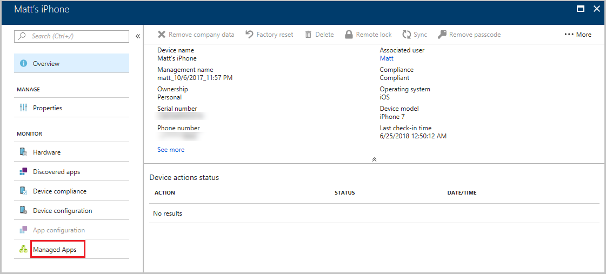

# Troubleshoot app installation issues

On Microsoft Intune MDM-managed devices, sometimes app installations can fail. When these app installs fail, it can be challenging to understand the failure reason or troubleshoot the issue. Microsoft Intune provides app installation failure details that allow help desk operators and Intune administrators to view app information to address user help requests. The troubleshooting pane within Intune provides failure details, including details about managed apps on a user's device. Details about the end-to-end lifecycle of an app are provided under each individual device in the **Managed Apps** pane. You can view installation issues, such as when the app was created, modified, targeted, and delivered to a device. 

> [!NOTE]
> For specific app installation error code information, see [Intune app installation error reference](~/intune/apps/app-install-error-codes.md).

## App troubleshooting details

Intune provides app troubleshooting details based on the apps installed on a specific user's device.

1. Sign in to the [Microsoft Endpoint Manager Admin Center](https://go.microsoft.com/fwlink/?linkid=2109431).
3. Select **Troubleshoot + support**.
4. Click **Select user** to select a user to troubleshoot. The **Select users** pane will be displayed.
5. Select a user by typing the name or email address. Click **Select** at the bottom of the pane. The troubleshooting information for the user is displayed in the **Troubleshoot** pane. 
6. Select the device that you want to troubleshoot from the **Devices** list.
    
7. Select **Managed Apps** from selected device pane. A list of managed apps is displayed.
    
8. Select an app from the list where **Installation Status** indicates a failure.
    

    > [!Note]  
    > The same app could be assigned to multiple groups but with different intended actions (intents) for the app. For instance, a resolved intent for an app will show **excluded** if the app is excluded for a user during app assignment. For more information, see [How conflicts between app intents are resolved](apps-deploy.md#how-conflicts-between-app-intents-are-resolved).  
    > If an installation failure occurs for a required app, either you or your helpdesk will be able to sync the device and retry the app install.

The app installation error details will indicate the problem. You can use these details to determine the best action to take to resolve the problem. For more information about troubleshooting app installation issues, see [Android app installation errors](app-install-error-codes.md#android-app-installation-errors) and [iOS app installation errors](app-install-error-codes.md#ios-and-ipados-app-installation-errors).

> [!Note]  
> You can also access the **troubleshooting** pane by pointing your browser to: [https://aka.ms/intunetroubleshooting](https://aka.ms/intunetroubleshooting).

## User Group targeted app installation does not reach device
The following actions should be considered when you have problems installing apps:
- If the app does not display in the Company Portal, ensure the app is deployed with **Available** intent and that the user is accessing the Company Portal with the device type supported by the app.
- For Windows BYOD devices, the user needs to add a Work account to the device.
- Check if the user is over the AAD device limit:
  1. Navigate to [Azure Active Directory Device Settings](https://portal.azure.com/#pane/Microsoft_AAD_IAM/DevicesMenupane/DeviceSettings/menuId).
  2. Make note of the value set for **Maximum devices per user**.
  3. Navigate to [Azure Active Directory Users](https://portal.azure.com/#pane/Microsoft_AAD_IAM/UsersManagementMenupane/AllUsers).
  4. Select the affected user and click **Devices**.
  5. If user is over the set limit then delete any stale records that are no longer needed.
- For iOS/iPadOS DEP devices, ensure that the user is listed as **Enrolled by User** in Intune Device Overview pane. If it shows NA, then deploy a config policy for the Intune Company Portal. For more information, see [Configure the Company Portal app](app-configuration-policies-use-ios.md#configure-the-company-portal-app-to-support-ios-and-ipados-dep-devices).

## Win32 app installation troubleshooting

Select the Win32 app that was deployed using the Intune management extension. You can select the **Collect logs** option when your Win32 app installation fails. 

> [!IMPORTANT]
> The **Collect logs** option will not be enabled when the Win32 app has been successfully installed on the device.
Before you can collect Win32 app log information, the Intune management extension must be installed on the Windows client. The Intune management extension is installed when a PowerShell script or a Win32 app is deployed to a user or device security group. For more information, see [Intune Management extension - Prerequisites](intune-management-extension.md#prerequisites).

### Collect log file

To collect your Win32 app installation logs, first follow the steps provided in the section [App troubleshooting details](troubleshoot-app-install.md#app-troubleshooting-details). Then, continue with the following steps:

1. Click the **Collect logs** option on the **Installation details** pane.

    <image alt="Win32 app installation details - Collect log option" src="./media/troubleshoot-app-install/troubleshoot-app-install-04.png" width="500" />

2. Provide file paths with log file names to begin the log file collection process and click **OK**.

    > [!NOTE]
    > Log collection will take less than two hours. Supported file types: *.log,.txt,.dmp,.cab,.zip,.xml,.evtx, and.evtl*. A maximum of 25 file paths are allowed.

3. Once the log files have been collected, you can select the **logs** link to download the log files.

    <image alt="Win32 app log details - Download logs" src="./media/troubleshoot-app-install/troubleshoot-app-install-05.png" width="500" />

    > [!NOTE]
    > A notification will be displayed indicating the success of the app log collection.

#### Win32 log collection requirements

There are specific requirements that must be followed to collect log files:

- You must specify the complete log file path. ​
- You can specify environment variables for log collection, such as the following: 
  *%PROGRAMFILES%, %PROGRAMDATA% %PUBLIC%, %WINDIR%, %TEMP%, %TMP%*
- Only exact file extensions are allowed, such as: 
  *.log,.txt,.dmp,.cab,.zip,.xml*
- The maximum log file to upload is 60 MB or 25 files, whichever occurs first. 
- Win32 app install log collection is enabled for apps that meet the required, available, and uninstall app assignment intent.
- Stored logs are encrypted to protect any personal identifiable information contained in the logs​.
- While opening support tickets for Win32 app failures, attach the related failure logs using the steps provided above.

## Troubleshooting apps from the Microsoft Store

The information in the topic [Troubleshooting packaging, deployment, and query of Microsoft Store apps](https://msdn.microsoft.com/library/windows/desktop/hh973484.aspx) helps you troubleshoot common problems you might encounter when installing apps from the Microsoft Store, whether by using Intune, or by any other means.

## App troubleshooting resources
- [Deploying Visio and Project as part of your Office Pro Plus Deployment](https://techcommunity.microsoft.com/t5/Intune-Customer-Success/Support-Tip-Deploying-Visio-and-Project-as-part-of-your-Office/ba-p/701795)
- [Take Action to Ensure MSfB Apps deployed through Intune install on Windows 10 1903](https://techcommunity.microsoft.com/t5/Intune-Customer-Success/Support-Tip-Take-Action-to-Ensure-MSfB-Apps-deployed-through/ba-p/658864)
- [Troubleshooting MSI app deployments in Microsoft Intune](https://techcommunity.microsoft.com/t5/Intune-Customer-Success/Support-Tip-Troubleshooting-MSI-App-deployments-in-Microsoft/ba-p/359125)
- [Best practices for software distribution to Intune classic Windows PC agent](https://support.microsoft.com/en-us/help/2583929/best-practices-for-intune-software-distribution-to-windows-pc)

## Next steps

- For additional Intune troubleshooting information, see [Use the troubleshooting portal to help users at your company](../intune/fundamentals/help-desk-operators.md). 
- Learn about any known issues in Microsoft Intune. For more information, see [Intune Customer Success](https://techcommunity.microsoft.com/t5/Intune-Customer-Success/bg-p/IntuneCustomerSuccess).
- Need extra help? See [How to get support for Microsoft Intune](../intune/fundamentals/get-support.md).
