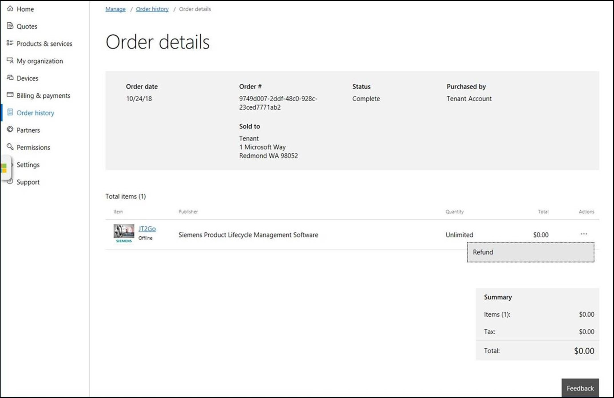

---
# required metadata

title: Manage VPP apps from Microsoft Store for Business 
titleSuffix: Microsoft Intune
description: Learn how you can sync apps into Intune from the Microsoft Store for Business.
keywords:
author: Erikre
ms.author: erikre
manager: dougeby
ms.date: 12/16/2021
ms.topic: how-to
ms.service: microsoft-intune
ms.subservice: apps
ms.localizationpriority: medium
ms.technology:
ms.assetid: 2ed5d3f0-2749-45cd-b6bf-fd8c7c08bc1b

# optional metadata

#ROBOTS:
#audience:

ms.reviewer: manchen
ms.suite: ems
search.appverid: MET150
#ms.tgt_pltfrm:
ms.custom: intune-azure, seoapril2019
ms.collection: M365-identity-device-management
---

# How to manage volume purchased apps from the Microsoft Store for Business with Microsoft Intune

[!INCLUDE [azure_portal](../includes/azure_portal.md)]

The [Microsoft Store for Business](https://www.microsoft.com/business-store) gives you a place to find and purchase apps for your organization, individually, or in volume. By connecting the store to Microsoft Intune, you can manage volume-purchased apps from the portal. For example:

* You can synchronize the list of apps you have purchased (or that are free) from the store with Intune.
* Apps that are synchronized appear in the Intune administration console; you can assign these apps like any other apps.
* Both Online and Offline licensed versions of Apps are synchronized to Intune. App names will be appended with "Online" or "Offline" in the portal.
* You can track how many licenses are available, and how many are being used in the Intune administration console.
* Intune blocks assignment and installation of apps if there are an insufficient number of licenses available.
* Apps managed by Microsoft Store for Business will automatically revoke licenses when a user leaves the enterprise, or when the administrator removes the user and the user devices.

## Before you start

> [!IMPORTANT]
> Microsoft Store for Business will be retired in the first quarter of 2023. However, admins can still leverage the connection to Store for Business and Education, from their UEM solution to deploy apps to managed Windows 11 devices, until they are retired in 2023. 

Review the following information before you start syncing and assigning apps from the Microsoft Store for Business:

- Configure Intune as the mobile device management authority for your organization.
- You must have signed up for an account on the Microsoft Store for Business.
- Once you have associated a Microsoft Business Store account with Intune, you cannot change to a different account in the future.
- Apps purchased from the store cannot be manually added to or deleted from Intune. They can only be synchronized with the Microsoft Store for Business.
- Both online and offline licensed apps that you have purchased from the Microsoft Store for Business are synced into Intune. You can then deploy these apps to device groups or user groups.
- Online app installations are managed by the store.
- Offline apps that are free of charge can also be synced to Intune. These apps are installed by Intune, not by the store.
- To use this capability, devices must be joined to Active Directory Domain Services, Azure AD joined, or workplace-joined.
- Enrolled devices must be using the 1511 release of Windows 10 or later.

> [!NOTE]
> If you disable access to the Store on managed devices (either manually, via policy or Group Policy), Online licensed apps will fail to install.

## Associate your Microsoft Store for Business account with Intune

Before you enable synchronization in the Intune console, you must configure your store account to use Intune as a management tool:

1. Ensure that you sign into the [Microsoft Store for Business](https://www.microsoft.com/business-store) using the same tenant account you use to sign into Intune.
2. In the Business Store, choose the **Manage** tab, select **Settings**, and choose the **Distribute** tab.
3. If you don't specifically have **Microsoft Intune** available as a mobile device management tool, choose **Add management tool** to add **Microsoft Intune**. If you don't have **Microsoft Intune** activated as your mobile device management tool, click **Activate** next to **Microsoft Intune**. Note that you should activate **Microsoft Intune** rather than **Microsoft Intune Enrollment**.

> [!NOTE]
> You could previously only associate one management tool to assign apps with the Microsoft Store for Business. You can now associate multiple management tools with the store, for example, Intune and Configuration Manager.

You can now continue, and set up synchronization in the Intune console.

## Configure synchronization

1. Sign in to the [Microsoft Endpoint Manager admin center](https://go.microsoft.com/fwlink/?linkid=2109431).
2. Select **Tenant administration** > **Connectors and tokens** > **Microsoft Store for Business**.
3. Click **Enable**.
4. If you haven't already done so, click the link to sign up for the Microsoft Store for Business and associate your account as detailed previously.
5. From the **Language** drop-down list, choose the language in which apps from the Microsoft Store for Business are displayed in the portal. Regardless of the language in which they are displayed, they are installed in the end user's language when available.
6. Click **Sync** to get the apps you've purchased from the Microsoft Store into Intune.

## Synchronize apps
If you've already associated your Microsoft Store for Business account with your Intune admin credentials, you can manually sync your Microsoft Store for Business apps with Intune using the following steps.

1. Select **Tenant administration** > **Connectors and tokens** > **Microsoft Store for Business**.
2. Click **Sync** to get the apps you've purchased from the Microsoft Store into Intune.

> [!NOTE]
> Apps with encrypted app packages are currently not supported and will not be synchronized to Intune.

## Assign apps

You assign apps from the store in the same way you assign any other Intune app. For more information, see [How to assign apps to groups with Microsoft Intune](apps-deploy.md).

Offline apps can be targeted to user groups, device groups, or groups with users and devices.
Offline apps can be installed for a specific user on a device or for all users on a device.

When you assign a Microsoft Store for Business app, a license is used by each user who installs the app. If you use all of the available licenses for an assigned app, you cannot assign any more copies. Take one of the following actions:

* Uninstall the app from some devices.
* Reduce the scope of the current assignment, targeting only the users you have sufficient licenses for.
* Buy more copies of the app from the Microsoft Store for Business.

## Remove apps

To remove an app that is synced from the Microsoft Store for Business, you need to log into the Microsoft Store for Business and refund the app. The process is the same whether the app is free or not. For a free app, the store will refund $0. The example below shows a refund for a free app. 

> [!NOTE]
> Removing an app's visibility in the private store won't keep Intune from syncing the app. You must refund the app to fully remove the app.

## Next steps

* [Manage volume-purchased apps and books with Microsoft Intune](vpp-apps.md)
