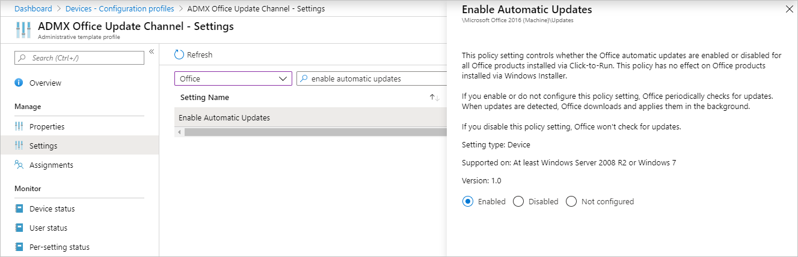
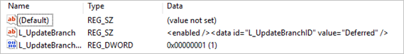
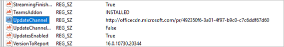
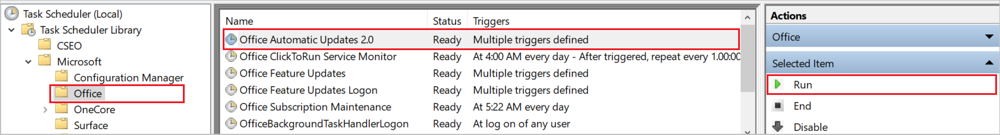
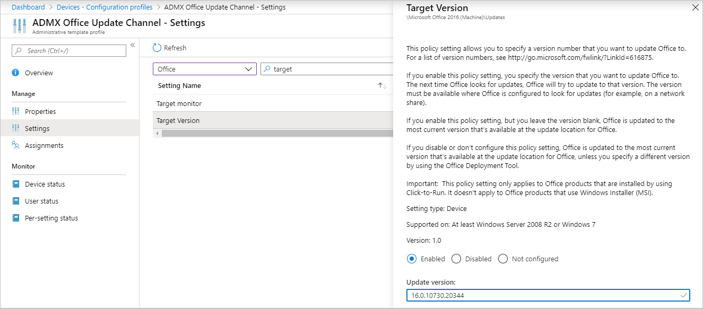
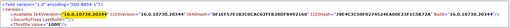

---
# required metadata

title: Update Office 365 using administrative templates in Microsoft Intune - Azure | Microsoft Docs
description: Use Administrative templates in Microsoft Intune to update Office 365 apps to the latest version, and choose how frequently Office checks for updates. See the device registry keys that are updated when an Intune policy to Office update is applied.
keywords:
author: MandiOhlinger
ms.author: mandia
manager: dougeby
ms.date: 05/11/2020
ms.topic: how-to
ms.service: microsoft-intune
ms.localizationpriority: high
ms.technology:

# optional metadata

#ROBOTS:
#audience:

ms.reviewer:
ms.suite: ems
search.appverid: MET150
#ms.tgt_pltfrm:
ms.custom: intune-azure
ms.collection: M365-identity-device-management
---

# Use Update Channel and Target Version settings to update Office 365 with Microsoft Intune Administrative Templates

In Intune, you can use [Windows 10 templates to configure group policy settings](administrative-templates-windows.md). This article shows you how to update Office 365 using an administrative template in Intune. It also gives guidance on confirming your policies apply successfully. This information also helps when troubleshooting.

In this scenario, you create an administrative template in Intune that updates Office 365 on your devices.

For more information on administrative templates, see [Windows 10 templates to configure group policy settings](administrative-templates-windows.md).

Applies to:

- Windows 10 and later
- Office 365

## Prerequisites

Be sure to [enable Microsoft 365 Apps Automatic Updates](https://docs.microsoft.com/deployoffice/configure-update-settings-for-office-365-proplus) for your Office apps. You can do this using group policy, or the Intune Office 2016 ADMX template:

> [!div class="mx-imgBorder"]
> 

## Set the Update Channel in the Intune administrative template

1. In your [Intune administrative template](administrative-templates-windows.md#create-the-template), go to the **Update Channel** setting, and enter the channel you want. For example, choose `Semi-Annual Channel`:

    > [!div class="mx-imgBorder"]
    > 

    > [!NOTE]
    > It's recommended to update more frequently. Semi-annually is only used as an example.

2. Be sure to [assign the policy](device-profile-assign.md) to your Windows 10 devices. To test your policy sooner, you can also sync the policy:

    - [Sync the policy in Intune](../remote-actions/device-sync.md)
    - [Manually sync the policy on the device](https://docs.microsoft.com/mem/intune/user-help/sync-your-device-manually-windows#sync-from-settings-app)

## Check the Intune registry keys

After you assign the policy and the device syncs, you can confirm the policy is applied:

1. On the device, open the **Registry Editor** app.
2. Go to the Intune policy path: `Computer\HKEY_LOCAL_MACHINE\SOFTWARE\Microsoft\PolicyManager\Providers\<Provider ID>\default\Device\office16~Policy~L_MicrosoftOfficemachine~L_Updates`.

    > [!TIP]
    > The `<Provider ID>` in the registry key changes. To find the provider ID for your device, open the **Registry Editor** app, and go to `Computer\HKEY_LOCAL_MACHINE\SOFTWARE\Microsoft\PolicyManager\AdmxInstalled`. The provider ID is shown.

    When the policy is applied, you see the following registry keys:

    - `L_UpdateBranch`
    - `L_UpdateTargetVersion`

    Looking at the following example, you see `L_UpdateBranch` has a value similar to `<enabled /><data id="L_UpdateBranchID" value="Deferred" />`. This value means it's set to Semi-Annual Channel:

    > [!div class="mx-imgBorder"]
    > 

    > [!TIP]
    > [Manage Microsoft 365 Apps with Configuration Manager](https://docs.microsoft.com/configmgr/sum/deploy-use/manage-office-365-proplus-updates#bkmk_channel) lists the values, and what they mean. The registry values are based on the distribution channel selected:
    >
    >- Monthly Channel                - value="Current"
    >- Monthly Channel (Targeted)     - value="Current"
    >- Semi-Annual Channel            - value="Current"
    >- Semi-Annual Channel (Targeted) - value="FirstReleaseDeferred"
    >- Insider Fast                   - value="InsiderFast"

At this point, the Intune policy is successfully applied to the device.

## Check the Office registry keys

1. On the device, open the **Registry Editor** app.
2. Go to the Office policy path: `Computer\HKEY_LOCAL_MACHINE\SOFTWARE\Microsoft\Office\ClickToRun\Configuration`.

    You see the following registry keys:

    - `UpdateChannel`: A dynamic key that changes, depending on the configured settings.
    - `CDNBaseUrl`: Set when Office 365 installs on the device.

3. Look at the `UpdateChannel` value. The value tells you how frequently Office is updated. [Manage Microsoft 365 Apps with Configuration Manager](https://docs.microsoft.com/configmgr/sum/deploy-use/manage-office-365-proplus-updates#bkmk_channel) lists the values, and what they're set to.

    Looking at the following example, you see `UpdateChannel` is set to `http://officecdn.microsoft.com/pr/492350f6-3a01-4f97-b9c0-c7c6ddf67d60`, which is **monthly**:

    > [!div class="mx-imgBorder"]
    > 

    This example means the policy isn't applied yet, as it's still set to **monthly**, instead of **semi-annual**.

This registry key is updated when the **Task Scheduler** > **Office Automatic Updates 2.0** runs, or when a user signs into the device. To confirm, open the **Office Automatic Updates 2.0** task > **Triggers**. Depending on your triggers, it can take at least a day and more before the `UpdateChannel` registry key is updated.

## Force Office automatic updates to run

To test your policy, you can force the policy settings on the device. The following steps update the registry. As always, be careful when updating the registry.

1. Clear the registry key:

    1. Go to `Computer\HKEY_LOCAL_MACHINE\SOFTWARE\Microsoft\Office\ClickToRun\Updates`.
    2. Double-select the `UpdateDetectionLastRunTime` key, delete the value data > **OK**.

2. Run the Office Automatic Updates task:

    1. Open the **Task Scheduler** app on the device.
    2. Expand **Task Scheduler Library** > **Microsoft** > **Office**.
    3. Select **Office Automatic Updates 2.0** > **Run**:

        > [!div class="mx-imgBorder"]
        > 

        Wait for the task to finish, which can take several minutes.

3. In the **Registry Editor** app, go to `Computer\HKEY_LOCAL_MACHINE\SOFTWARE\Microsoft\Office\ClickToRun\Configuration`. Check the `UpdateChannel` value.

    It should be updated with the value set in the policy. In our example, the value should be set to `http://officecdn.microsoft.com/pr/7ffbc6bf-bc32-4f92-8982-f9dd17fd3114`.

At this point, the Office update channel is successfully changed on the device. You can open an Office 365 app for a user that receives this update to check status.

## Force the Office synchronization to update account information  

If you want to do more, you can force Office to get the latest version update. The following steps should only be done as a confirmation, or if you need the devices to get the latest version update from that channel quickly. Otherwise, let Office do its job, and update automatically.

### Step 1: Force the Office version to update

1. Confirm the Office version supports the update channel you're choosing. [Update history for Microsoft 365 Apps](https://docs.microsoft.com/officeupdates/update-history-office365-proplus-by-date) lists the build numbers that support the different update channels.

2. In your [Intune administrative template](administrative-templates-windows.md#create-the-template), go to the **Target Version** setting, and enter the version you want.

    Your **Target version** setting looks similar to the following setting:

    > [!div class="mx-imgBorder"]
    > 

> [!IMPORTANT]
>
> - Be sure to assign the policy.
> - If you change an existing policy, your changes affect all assigned users.
> - If you're testing this feature, it's recommended to create a test policy, and assign the policy to a test group of users.

### Step 2: Check the Office version

Consider using these steps to test your policy before deploying the policy to all users.

1. In the **Registry Editor** app, go to `Computer\HKEY_LOCAL_MACHINE\SOFTWARE\Microsoft\PolicyManager\Providers\<Provider ID>\default\Device\office16~Policy~L_MicrosoftOfficemachine~L_Updates`

2. Look at the `L_UpdateTargetVersion` value. Once the policy applies, the value is set to the version you entered, such as `<enabled /><data id="L_UpdateTargetVersionID" value="16.0.10730.20344" />`.

    At this point, the Intune policy is successfully applied to the device.

3. Next, you can force Office to update. Open an Office app, such as Excel. Choose to update now (possibly in the **Account** menu).

    The update takes several minutes. You can confirm Office is trying to get the version you enter:

      1. On the device, go to `C:\Program Files (x86)\Microsoft Office\Updates\Detection\Version`.
      2. Open the `VersionDescriptor.xml` file, and go to the `<Version>` section. The available version should be the same version you entered in the Intune policy, such as:

          > [!div class="mx-imgBorder"]
          > 

4. After the update is installed, the Office app should show the new version (for example, on the **Account** menu)

## Next steps

[Update channel values for Office 365 clients](https://docs.microsoft.com/configmgr/sum/deploy-use/manage-office-365-proplus-updates#bkmk_channel)

[Overview of the Office cloud policy service for Microsoft 365 Apps](https://docs.microsoft.com/deployoffice/overview-office-cloud-policy-service)

[Use Windows 10 templates to configure group policy settings (ADMX templates) in Microsoft Intune](administrative-templates-windows.md)
