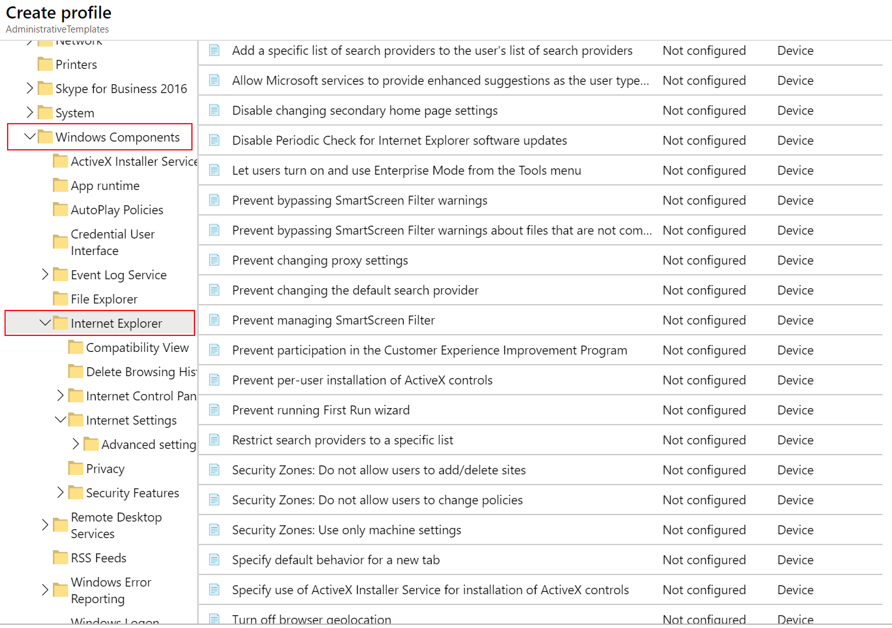
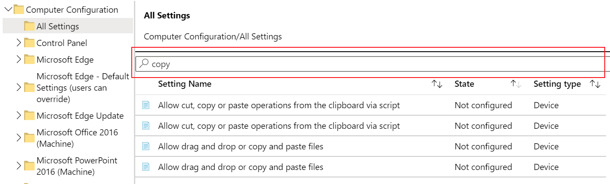

---
# required metadata

title: Use templates for Windows 10 devices in Microsoft Intune - Azure | Microsoft Docs
description: Use Administrative templates in Microsoft Intune and Endpoint Manager to create groups of settings for Windows 10 devices. Use these settings in a device configuration profile to control Office programs, Microsoft Edge, secure Internet Explorer, access OneDrive, use remote desktop, enable Auto-Play, set power management settings, use HTTP printing, control user sign-in, and change the event log size.
keywords:
author: MandiOhlinger
ms.author: mandia
manager: dougeby
ms.date: 05/14/2020
ms.topic: how-to
ms.service: microsoft-intune
ms.subservice: configuration
ms.localizationpriority: high
ms.technology:

# optional metadata

#ROBOTS:
#audience:

ms.reviewer:
ms.suite: ems
search.appverid: MET150
#ms.tgt_pltfrm:
ms.custom: intune-azure
ms.collection: M365-identity-device-management
---

# Use Windows 10 templates to configure group policy settings in Microsoft Intune

When managing devices in your organization, you want to create groups of settings that apply to different device groups. For example, you have several device groups. For GroupA, you want to assign a specific set of settings. For GroupB, you want to assign a different set of settings. You also want a simple view of the settings you can configure.

You can complete this task using **Administrative Templates** in Microsoft Intune. The administrative templates include thousands of settings that control features in Microsoft Edge version 77 and later, Internet Explorer, Microsoft Office programs, remote desktop, OneDrive, passwords, PINs, and more. These settings allow group administrators to manage group policies using the cloud.

This feature applies to:

- Windows 10 and newer

The Windows settings are similar to group policy (GPO) settings in Active Directory (AD). These settings are built in to Windows, and are [ADMX-backed settings](https://docs.microsoft.com/windows/client-management/mdm/understanding-admx-backed-policies) that use XML. The Office and Microsoft Edge settings are ADMX-ingested, and use the ADMX settings in [Office administrative template files](https://www.microsoft.com/download/details.aspx?id=49030) and [Microsoft Edge administrative template files](https://www.microsoftedgeinsider.com/enterprise). And, the Intune templates are 100% cloud-based. They offer a simple and straight-forward way to configure the settings, and find the settings you want.

**Administrative Templates** are built in to Intune, and don't require any customizations, including using OMA-URI. As part of your mobile device management (MDM) solution, use these template settings as a one-stop shop to manage your Windows 10 devices.

This article lists the steps to create a template for Windows 10 devices, and shows how to filter all the available settings in Intune. When you create the template, it creates a device configuration profile. You can then assign or deploy this profile to Windows 10 devices in your organization.

## Before you begin

- Some of these settings are available starting with Windows 10 version 1709 (RS2/build 15063). Some settings aren't included in all the Windows editions. For the best experience, it's suggested to use Windows 10 Enterprise version 1903 (19H1/build 18362) and newer.

- The Windows settings use [Windows policy CSPs](https://docs.microsoft.com/windows/client-management/mdm/policy-configuration-service-provider#policies-supported-by-group-policy-and-admx-backed-policies). The CSPs work on different editions of Windows, such as Home, Professional, Enterprise, and so on. To see if a CSP works on a specific edition, go to [Windows policy CSPs](https://docs.microsoft.com/windows/client-management/mdm/policy-configuration-service-provider#policies-supported-by-group-policy-and-admx-backed-policies).

## Create the template

1. Sign in to the [Microsoft Endpoint Manager admin center](https://go.microsoft.com/fwlink/?linkid=2109431).
2. Select **Devices** > **Configuration profiles** > **Create profile**.
3. Enter the following properties:

    - **Platform**: Select **Windows 10 and later**.
    - **Profile**: Select **Administrative Templates**.

4. Select **Create**.
5. In **Basics**, enter the following properties:

    - **Name**: Enter a descriptive name for the profile. Name your profiles so you can easily identify them later. For example, a good profile name is **Admin template: Windows 10 admin template that configures xyz settings in Microsoft Edge**.
    - **Description**: Enter a description for the profile. This setting is optional, but recommended.

6. Select **Next**.

7. In **Configuration settings**, select **All settings** to see an alphabetical list of all the settings. Or, configure settings that apply to devices (**Computer configuration**), and settings that apply to users **(User configuration**):

    > [!div class="mx-imgBorder"]
    > 

8. When you select **All settings**, every setting is listed. Scroll down to use the before and next arrows to see more settings:

    > [!div class="mx-imgBorder"]
    > 

9. Select any setting. For example, filter on **Office**, and select **Activate Restricted Browsing**. A detailed description of the setting is shown. Choose **Enabled**, **Disabled**, or leave the setting as **Not configured** (default). The detailed description also explains what happens when you choose **Enabled**, **Disabled**, or **Not configured**.

    > [!TIP]
    > The Windows settings in Intune correlate to the on-premises group policy path you see in Local Group Policy Editor (`gpedit`)

10. When you select **Computer configuration** or **User configuration**, the setting categories are shown. You can select any category to see the available settings.

    For example, select **Computer configuration** > **Windows components** > **Internet Explorer** to see all the device settings that apply to Internet Explorer:

    > [!div class="mx-imgBorder"]
    > 

11. Select **OK** to save your changes.

    Continue to go through the list of settings, and configure the settings you want in your environment. Here are some examples:

    - Use the **VBA Macro Notification Settings** setting to handle VBA macros in different Microsoft Office programs, including Word and Excel.
    - Use the **Allow file downloads** setting to allow or prevent downloads from Internet Explorer.
    - Use **Require a password when a computer wakes (plugged in)** to prompt users for a password when devices wake from sleep mode.
    - Use the **Download unsigned ActiveX controls** setting to block users from downloading unsigned ActiveX controls from Internet Explorer.
    - Use the **Turn off System Restore** setting to allow or prevent users from running a system restore on the device.
    - Use the **Allow importing of favorites** setting to allow or block users from importing favorites from another browser into Microsoft Edge.
    - And much more...

12. Select **Next**.
13. In **Scope tags** (optional), assign a tag to filter the profile to specific IT groups, such as `US-NC IT Team` or `JohnGlenn_ITDepartment`. For more information about scope tags, see [Use RBAC and scope tags for distributed IT](..//fundamentals/scope-tags.md).

    Select **Next**.

14. In **Assignments**, select the user or groups that will receive your profile. For more information on assigning profiles, see [Assign user and device profiles](device-profile-assign.md).

    If the profile is assigned to user groups, then configured ADMX settings apply to any device that the user enrolls, and signs in to. If the profile is assigned to device groups, then configured ADMX settings apply to any user that signs into that device. This assignment happens if the ADMX setting is a computer configuration (`HKEY_LOCAL_MACHINE`), or a user configuration (`HKEY_CURRENT_USER`). With some settings, a computer setting assigned to a user may also impact the experience of other users on that device.

    For more information, see [User groups vs. device groups](device-profile-assign.md#user-groups-vs-device-groups).

    Select **Next**.

15. In **Review + create**, review your settings. When you select **Create**, your changes are saved, and the profile is assigned. The policy is also shown in the profiles list.

The next time the device checks for configuration updates, the settings you configured are applied.

## Find some settings

There are thousands of settings available in these templates. To make it easier to find specific settings, use the built-in features:

- In your template, select the **Settings**, **State**, **Setting type**, or **Path** columns to sort the list. For example, select the **Path** column, and use the next arrow to see the settings in the `Microsoft Excel` path.

- In your template, use the **Search** box to find specific settings. You can search by setting, or path. For example, select **All settings**, and search for `copy`. All the settings with `copy` are shown:

  > [!div class="mx-imgBorder"]
  >  

  In another example, search for `microsoft word`. You see the settings you can set for the Microsoft Word program. Search for `explorer` to see the Internet Explorer settings you can add to your template.

- You can also narrow your search by only selecting **Computer configuration** or **User configuration**.

  For example, to see all the available Internet Explorer user settings, select  **User configuration**, and search for `Internet Explorer`. Only the IE settings that apply to users are shown:

  :::image type="content" source="./media/administrative-templates-windows/show-all-internet-explorer-settings-user-configuration.png" alt-text="In the ADMX template, select user configuration, and search or filter for Internet Explorer in Microsoft Intune.":::

## Next steps

The template is created, but may not be doing anything yet. Next, [assign the template (also called a profile)](device-profile-assign.md) and [monitor its status](device-profile-monitor.md).

Update [Office 365 using administrative templates](administrative-templates-update-office.md).

[Tutorial: Use the cloud to configure group policy on Windows 10 devices with ADMX templates and Microsoft Intune](tutorial-walkthrough-administrative-templates.md)
