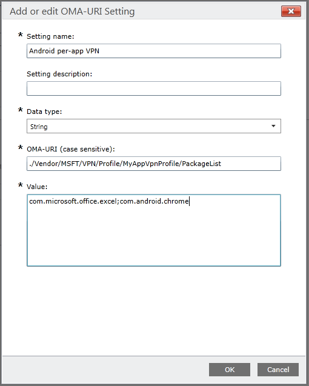

---
# required metadata

title: Custom per-app VPN profile for Android in Microsoft Intune - Azure | Microsoft Docs
description: Learn how to create a per-app VPN profile for Android device administrator devices managed by Microsoft Intune.
keywords:
author: MandiOhlinger
ms.author: mandia
manager: dougeby
ms.date: 03/18/2020
ms.topic: conceptual
ms.service: microsoft-intune
ms.subservice: configuration
ms.localizationpriority: high
ms.technology:
ms.assetid: d035ebf5-85f4-4001-a249-75d24325061a

# optional metadata

#ROBOTS:
#audience:

ms.reviewer: tycast
ms.suite: ems
search.appverid: MET150
#ms.tgt_pltfrm:
ms.custom: intune-azure
ms.collection: M365-identity-device-management
---

# Use a Microsoft Intune custom profile to create a per-app VPN profile for Android devices

You can create a per-app VPN profile for Android 5.0 and later devices that are managed by Intune. First, create a VPN profile that uses either the Pulse Secure or Citrix connection type. Then, create a custom configuration policy that associates the VPN profile with specific apps.

> [!NOTE]
> To use per-app VPN on Android Enterprise devices, you can also use these steps. But, it's recommended to use an [app configuration policy](../apps/app-configuration-policies-use-android.md) for your VPN client app.

After you assign the policy to your Android device or user groups, users should start the Pulse Secure or Citrix VPN client. The VPN client then allows only traffic from the specified apps to use the open VPN connection.

> [!NOTE]
>
> Only the Pulse Secure and Citrix connection types are supported for this profile.

## Step 1: Create a VPN profile

1. Sign in to the [Microsoft Endpoint Manager admin center](https://go.microsoft.com/fwlink/?linkid=2109431).
2. Select **Devices** > **Configuration profiles** > **Create profile**.
3. Enter the following properties:

    - **Name**: Enter a descriptive name for the profile. Name your profiles so you can easily identify them later. For example, a good profile name is **Android device administrator per-app VPN profile for entire company**.
    - **Description**: Enter a description for the profile. This setting is optional, but recommended.
    - **Platform**: Select **Android device administrator**.
    - **Profile type**: Select **VPN**.

4. Choose **Settings** > **Configure**. Then, configure the VPN profile. For more information, see [Configure VPN settings](vpn-settings-configure.md) and [VPN settings for Android device administrator devices](vpn-settings-android.md).

Take note of the **Connection Name** value you enter when creating the VPN profile. This name is needed in the next step. In this example, the connection name is **MyAppVpnProfile**.

## Step 2: Create a custom configuration policy

1. Sign in to the [Microsoft Endpoint Manager admin center](https://go.microsoft.com/fwlink/?linkid=2109431).
2. Select **Devices** > **Configuration profiles** > **Create profile**.
3. Enter the following properties:

    - **Name**: Enter a descriptive name for the custom profile. Name your profiles so you can easily identify them later. For example, a good profile name is **Custom OMA-URI Android VPN profile for entire company**.
    - **Description**: Enter a description for the profile. This setting is optional, but recommended.
    - **Platform**: Select **Android device administrator**.
    - **Profile type**: Select **Custom**.

4. Choose **Settings** > **Configure**.
5. On the **Custom OMA-URI Settings** pane, choose **Add**.
    - **Name**: Enter a name for your setting.
    - **Description**: Enter a description for the profile. This setting is optional, but recommended.
    - **OMA-URI**: Enter `./Vendor/MSFT/VPN/Profile/*Name*/PackageList`, where *Name* is the connection name you noted in Step 1. In this example, the string is `./Vendor/MSFT/VPN/Profile/MyAppVpnProfile/PackageList`.
    - **Data type**: Enter **String**.
    - **Value**: Enter a semicolon-separated list of packages to associate with the profile. For example, if you want Excel and the Google Chrome browser to use the VPN connection, enter `com.microsoft.office.excel;com.android.chrome`.

    > [!div class="mx-imgBorder"]
    >

### Set your app list to blacklist or whitelist (optional)

Use the **BLACKLIST** value to enter a list of apps that *cannot* use the VPN connection. All other apps connect through the VPN. Or, use the **WHITELIST** value to enter a list of apps that *can* use the VPN connection. Apps that aren't on the list don't connect through the VPN.

1. On the **Custom OMA-URI Settings** pane, choose **Add**.
2. Enter a setting name.
3. In **OMA-URI**, enter `./Vendor/MSFT/VPN/Profile/*Name*/Mode`, where *Name* is the VPN profile name you noted in Step 1. In our example, the string is `./Vendor/MSFT/VPN/Profile/MyAppVpnProfile/Mode`.
4. In **Data type**, enter **String**.
5. In **Value**, enter **BLACKLIST** or **WHITELIST**.

## Step 3: Assign both policies

[Assign both device profiles](device-profile-assign.md) to the required users or devices.
