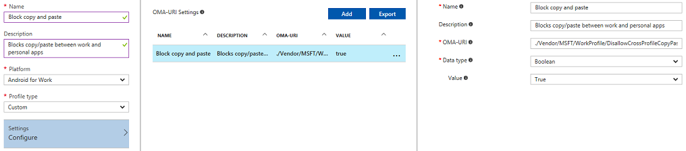

---
# required metadata

title: Add custom settings to Android Enterprise devices in Microsoft Intune - Azure | Microsoft Docs
description: Add or create a custom profile for Android Enterprise devices to create  in Microsoft Intune
keywords:
author: MandiOhlinger
ms.author: mandia
manager: dougeby
ms.date: 12/18/2019
ms.topic: reference
ms.service: microsoft-intune
ms.subservice: configuration
ms.localizationpriority: medium
ms.technology:
ms.assetid: 4724d6e5-05e5-496c-9af3-b74f083141f8

# optional metadata

#ROBOTS:
#audience:

ms.reviewer: chrisbal
ms.suite: ems
search.appverid: MET150
#ms.tgt_pltfrm:
ms.custom: intune-azure
ms.collection: M365-identity-device-management
---

# Use custom settings for Android Enterprise devices in Microsoft Intune

Using Microsoft Intune, you can add or create custom settings for your Android Enterprise Work Profile devices using a "custom profile". Custom profiles are a feature in Intune. They are designed to add device settings and features that aren't built in to Intune.

Android Enterprise custom profiles use Open Mobile Alliance Uniform Resource Identifier (OMA-URI) settings to control features on Android Enterprise devices. These settings are typically used by mobile device manufacturers to control these features.

Intune supports the following limited number of Android Enterprise custom profiles:

- ./Vendor/MSFT/WiFi/Profile/SSID/Settings: [Create a Wi-Fi profile with a pre-shared key](wi-fi-profile-shared-key.md) has some examples.
- ./Vendor/MSFT/VPN/Profile/Name/PackageList: [Create a per-app VPN profile](android-pulse-secure-per-app-vpn.md) has some examples.
- ./Vendor/MSFT/WorkProfile/DisallowCrossProfileCopyPaste: See the [example](#example) in this article. This setting is also available in the user interface. For more information, see [Android Enterprise device settings to allow or restrict features](device-restrictions-android-for-work.md).

If you need additional settings, see [OEMConfig for Android Enterprise](android-oem-configuration-overview.md).

This article shows you how to create a custom profile for Android Enterprise devices. It also provides an example of a custom profile that blocks copy-and-paste.

## Create the profile

1. Sign in to the [Microsoft Endpoint Manager admin center](https://go.microsoft.com/fwlink/?linkid=2109431).
2. Select **Devices** > **Configuration profiles** > **Create profile**.
3. Enter the following settings:

    - **Name**: Enter a descriptive name for the profile. Name your profiles so you can easily identify them later. For example, a good profile name is **Android Enterprise custom profile**.
    - **Description**: Enter a description for the profile. This setting is optional, but recommended.
    - **Platform**: Select **Android Enterprise**.
    - **Profile type**: Select **Custom**.

4. In **Custom OMA-URI Settings**, select **Add**. Enter the following settings:

    - **Name**: Enter a unique name for the OMA-URI setting so you can easily find it.
    - **Description**: Enter a description that gives an overview of the setting, and any other important details.
    - **OMA-URI**: Enter the OMA-URI you want to use as a setting.
    - **Data type**: Select the data type you'll use for this OMA-URI setting. Your options:

      - String
      - String (XML file)
      - Date and time
      - Integer
      - Floating point
      - Boolean
      - Base64 (file)

    - **Value**: Enter the data value you want to associate with the OMA-URI you entered. The value depends on the data type you selected. For example, if you select **Date and time**, select the value from a date picker.

    After you add some settings, you can select **Export**. **Export** creates a list of all the values you added in a comma-separated values (.csv) file.

5. Select **OK** to save your changes. Continue to add more settings as needed.
6. When finished, select **OK** > **Create** to create the Intune profile. When complete, your profile is shown in the **Devices - Configuration profiles** list.

## Example

In this example, you create a custom profile that restricts copy and paste actions between work and personal apps on Android Enterprise devices.

1. Sign in to the [Microsoft Endpoint Manager admin center](https://go.microsoft.com/fwlink/?linkid=2109431).
2. Select **Devices** > **Configuration profiles** > **Create profile**.
3. Enter the following settings:

    - **Name**: Enter a descriptive name for the profile. Name your profiles so you can easily identify them later. For example, enter **android ent block copy paste custom profile**.
    - **Description**: Enter a description for the profile. This setting is optional, but recommended.
    - **Platform**: Select **Android Enterprise**.
    - **Profile type**: Select **Custom**.

4. In **Custom OMA-URI Settings**, select **Add**. Enter the following settings:

    - **Name**: Enter something like `Block copy and paste`.
    - **Description**: Enter something like `Blocks copy/paste between work and personal apps`.
    - **OMA-URI**: Enter `./Vendor/MSFT/WorkProfile/DisallowCrossProfileCopyPaste`.
    - **Data type**: Select **Boolean** so the value for this OMA-URI is **True** or **False**.
    - **Value**: Select **True**.

5. After you enter the settings, your environment should like similar to the following image:

    

When you assign this profile to Android Enterprise devices you manage, copy and paste is blocked between apps in the work and personal profiles.

## Next steps

The profile is created, but it's not doing anything yet. Next, [assign the profile](../device-profile-assign.md) and [monitor its status](device-profile-monitor.md).

Create a [custom profile on Android devices](../custom-settings-android.md).
