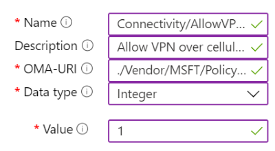

---
# required metadata

title: Use custom device settings in Microsoft Intune
description: Add or create a profile to use custom settings for Windows 10/11 client, Android device administrator, Android Enterprise, macOS, and iOS/iPadOS devices using Microsoft Intune.
keywords:
author: MandiOhlinger
ms.author: mandia
manager: dougeby
ms.date: 09/20/2022
ms.topic: how-to
ms.service: microsoft-intune
ms.subservice: configuration
ms.localizationpriority: high
ms.technology:

# optional metadata

#ROBOTS:
#audience:

ms.reviewer: mikedano
ms.suite: ems
search.appverid: MET150
#ms.tgt_pltfrm:
ms.custom: intune-azure
ms.collection: M365-identity-device-management
---

# Create a profile with custom settings in Intune

Microsoft Intune includes many built-in settings to control different features on a device. You can also create custom profiles, which are created similar to built-in profiles. Custom profiles are great when you want to use device settings and features that aren't built in to Intune. These profiles include features and settings for you to control on devices in your organization. For example, you can create a custom profile that sets the same feature for every iOS/iPadOS device.

This feature applies to:

- Android device administrator
- Android Enterprise personally owned devices with a work profile
- iOS/iPadOS
- macOS
- Windows 10/11

Custom settings are configured differently for each platform. For example, to control features on Android and Windows devices, you can enter Open Mobile Alliance Uniform Resource Identifier (OMA-URI) values. For Apple devices, you can import a file you created with the [Apple Configurator](https://itunes.apple.com/us/app/apple-configurator-2/id1037126344?mt=12) or [Apple Profile Manager](https://support.apple.com/profile-manager).

For more information on configuration profiles, see [What are Microsoft Intune device profiles?](device-profiles.md).

This article shows you how to create a custom profile for Android device administrator, Android Enterprise, iOS/iPadOS, macOS, and Windows. You can also see all the available settings for the different platforms.

## Create the profile

1. Sign in to the [Microsoft Endpoint Manager admin center](https://go.microsoft.com/fwlink/?linkid=2109431).
2. Select **Devices** > **Configuration profiles** > **Create profile**.
3. Enter the following properties:

    - **Platform**: Choose the platform of your devices. Your options:  

        - **Android device administrator**
        - **Android Enterprise**
        - **iOS/iPadOS**
        - **macOS**
        - **Windows 10 and later**

    - **Profile**: Select **Custom**. Or, select **Templates** > **Custom**.

4. Select **Create**.
5. In **Basics**, enter the following properties:

    - **Name**: Enter a descriptive name for the policy. Name your policies so you can easily identify them later. For example, a good policy name is **Windows 10/11: Custom profile that enables AllowVPNOverCellular custom OMA-URI**.
    - **Description**: Enter a description for the policy. This setting is optional, but recommended.

6. Select **Next**.

7. In **Configuration settings**, depending on the platform you chose, the settings you can configure are different. Choose your platform for detailed settings:

    - [Android device administrator](custom-settings-android.md)
    - [Android Enterprise](custom-settings-android-for-work.md)
    - [iOS/iPadOS](custom-settings-ios.md)
    - [macOS](custom-settings-macos.md)
    - [Windows 10/11](custom-settings-windows-10.md)
    - [Windows Holographic for Business](custom-settings-windows-holographic.md)

8. Select **Next**.
9. In **Scope tags** (optional), assign a tag to filter the profile to specific IT groups, such as `US-NC IT Team` or `JohnGlenn_ITDepartment`. For more information about scope tags, see [Use RBAC and scope tags for distributed IT](../fundamentals/scope-tags.md).

    Select **Next**.

10. In **Assignments**, select the users or groups that will receive your profile. For more information on assigning profiles, see [Assign user and device profiles](device-profile-assign.md).

    Select **Next**.

11. In **Review + create**, review your settings. When you select **Create**, your changes are saved, and the profile is assigned. The policy is also shown in the profiles list.

## Example

In the following example, the **Connectivity/AllowVPNOverCellular** setting is enabled. This setting allows a Windows client device to open a VPN connection when on a cellular network.

> [!div class="mx-imgBorder"]
> 

## Next steps

The profile is created, but it may not be doing anything yet. Next, [assign the profile](device-profile-assign.md) and [monitor its status](device-profile-monitor.md).
