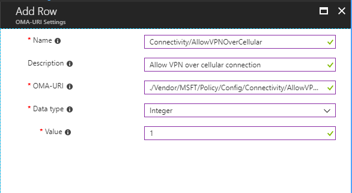

---
# required metadata

title: Add custom settings for Windows 10 devices in Microsoft Intune - Azure | Microsoft Docs
description: Add or create a custom profile to use the OMA-URI settings for devices running Windows 10 in Microsoft Intune. Use a custom profile to add custom settings.
keywords:
author: MandiOhlinger
ms.author: mandia
manager: dougeby
ms.date: 12/18/2019
ms.topic: reference
ms.service: microsoft-intune
ms.subservice: configuration
ms.localizationpriority: medium
ms.technology:

# optional metadata

#ROBOTS:
#audience:
#ms.devlang:
ms.suite: ems
search.appverid: MET150
#ms.tgt_pltfrm:
ms.custom: intune-azure
ms.collection: M365-identity-device-management
---

# Use custom settings for Windows 10 devices in Intune

Using Microsoft Intune, you can add or create custom settings for your Windows 10 devices using "custom profiles". Custom profiles are a feature in Intune. They're designed to add device settings and features that aren't built in to Intune.

Windows 10 custom profiles use Open Mobile Alliance Uniform Resource Identifier (OMA-URI) settings to configure different features. These settings are typically used by mobile device manufacturers to control features on the device. 

Windows 10 makes many Configuration Service Provider (CSP) settings available, such as [Policy Configuration Service Provider (Policy CSP)](https://technet.microsoft.com/itpro/windows/manage/how-it-pros-can-use-configuration-service-providers).

If you're looking for a specific setting, remember that the [Windows 10 device restriction profile](device-restrictions-windows-10.md) includes many built-in settings. So, you may not need to enter custom values.

This article shows you:

- How to create a custom profile for Windows 10 devices
- Includes a list of the recommended OMA-URI settings
- Provides an example of a custom profile that opens a VPN connection

## Create the profile

1. Sign in to the [Microsoft Endpoint Manager admin center](https://go.microsoft.com/fwlink/?linkid=2109431).
2. Select **Devices** > **Configuration profiles** > **Create profile**.
3. Enter the following settings:

    - **Name**: Enter a descriptive name for the profile. Name your profiles so you can easily identify them later. For example, a good profile name is **Windows 10 custom profile**.
    - **Description**: Enter a description for the profile. This setting is optional, but recommended.
    - **Platform**: Select **Windows 10 and later**.
    - **Profile type**: Select **Custom**.

4. In **Custom OMA-URI Settings**, select **Add**. Enter the following settings:

    - **Name**: Enter a unique name for the OMA-URI setting to help you identify it in the list of settings.
    - **Description**: Enter a description that gives an overview of the setting, and any other important details.
    - **OMA-URI** (case sensitive): Enter the OMA-URI you want to use as a setting.
    - **Data type**: Select the data type you'll use for this OMA-URI setting. Your options:

        - String
        - String (XML file)
        - Date and time
        - Integer
        - Floating point
        - Boolean
        - Base64 (file)

    - **Value**: Enter the data value you want to associate with the OMA-URI you entered. The value depends on the data type you selected. For example, if you select **Date and time**, select the value from a date picker.

    After you add some settings, you can select **Export**. **Export** creates a list of all the values you added in a comma-separated values (.csv) file.

5. Select **OK** to save your changes. Continue to add more settings as needed.
6. When finished, select **OK** > **Create** to create the Intune profile. When complete, your profile is shown in the **Devices - Configuration profiles** list.

## Example

In the following example, the **Connectivity/AllowVPNOverCellular** setting is enabled. This setting allows a Windows 10 device to open a VPN connection when on a cellular network.

## Find the policies you can configure

There's a complete list of all configuration service providers (CSPs) that Windows 10 supports in the [Configuration service provider reference](https://msdn.microsoft.com/windows/hardware/commercialize/customize/mdm/configuration-service-provider-reference).

Not all settings are compatible with all Windows 10 versions. [Configuration service provider reference](https://msdn.microsoft.com/windows/hardware/commercialize/customize/mdm/configuration-service-provider-reference) tells you which versions are supported for each CSP.

Additionally, Intune doesn't support all the settings listed in [Configuration service provider reference](https://msdn.microsoft.com/windows/hardware/commercialize/customize/mdm/configuration-service-provider-reference). To find out if Intune supports the setting you want, open the article for that setting. Each setting page shows its supported operation. To work with Intune, the setting must support the **Add**, **Replace**, and **Get** operations. If the value returned by the **Get** operation doesn't match the value supplied by the **Add** or **Replace** operations, then Intune reports a compliance error.

## Next steps

The profile is created, but it's not doing anything yet. Next, [assign the profile](../device-profile-assign.md) and [monitor its status](device-profile-monitor.md).
