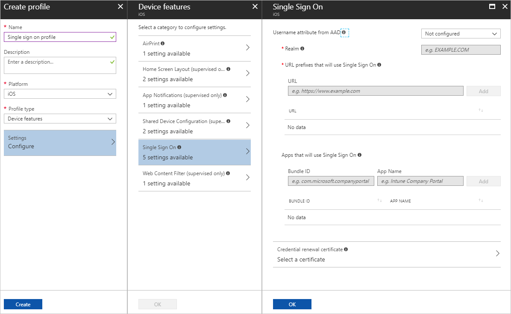

---
# required metadata

title: Create iOS/iPadOS or macOS device profile with Microsoft Intune - Azure | Microsoft Docs
description: Add or create an iOS, iPadOS, or macOS device profile, and then configure settings for AirPrint, layout of the home screen, app notifications, shared device, single sign-on, and web content filter settings in Microsoft Intune.
keywords:
author: MandiOhlinger
ms.author: mandia
manager: dougeby
ms.date: 03/24/2020
ms.topic: conceptual
ms.service: microsoft-intune
ms.subservice: configuration
ms.localizationpriority: high
ms.technology:

# optional metadata

#ROBOTS:
#audience:

ms.reviewer: 
ms.suite: ems
search.appverid: MET150
#ms.tgt_pltfrm:
ms.custom: intune-azure
ms.collection: M365-identity-device-management
---

# Add iOS, iPadOS, or macOS device feature settings in Intune

Intune includes many features and settings that help administrators control iOS, iPadOS, and macOS devices. For example, administrators can:

- Allow users access to AirPrint printers in your network
- Add apps and folders to the home screen, including adding new pages
- Choose if and how app notifications are shown
- Configure the lock screen to show a message or the asset tag, especially for shared devices
- Give users a secure single sign-on experience to share credentials between apps
- Filter web sites that use adult language and allow or block specific web sites

Intune uses "configuration profiles" to create and customize these settings for your organization's needs. After you add these features in a profile, you then push or deploy the profile to iOS/iPadOS and macOS devices in your organization.

This article describes the different features you can configure, and shows you how to create a device configuration profile. You can also see all the available settings for [iOS/iPadOS](ios-device-features-settings.md) and [macOS](macos-device-features-settings.md) devices.

> [!NOTE]
> The Intune user interface (UI) is updating to a full screen experience, and may take several weeks. Until your tenant receives this update, you will have a slightly different workflow when you create or edit settings described in this article.

## Airprint

Airprint is an Apple feature that allows devices to print to files over a wireless network. In Intune, you can add AirPrint information to devices.

For a list of the settings you can configure in Intune, see [AirPrint on iOS/iPadOS](ios-device-features-settings.md#airprint) and [AirPrint on macOS](macos-device-features-settings.md#airprint).

For more information on AirPrint, see [About AirPrint](https://support.apple.com/HT201311) on Apple's web site.

Applies to:

- iOS 7.0 and newer
- iPadOS 13.0 and newer
- macOS 10.10 and newer

## App notifications

Choose how apps on your iOS and iPadOS devices receive notifications. For example, from Intune, send app notifications so they show in the notification center, show on the lock screen, or play a sound.

For a list of the settings you can configure in Intune, see [App notifications on iOS/iPadOS](ios-device-features-settings.md#app-notifications).

For more information on this feature, see [Notifications](https://developer.apple.com/notifications/) on Apple's web site.

Applies to:

- iOS 9.3 and newer
- iPadOS 13.0 and newer

## Associated domains

Associated domains allow you to create a relationship between your domains, such as `contoso.com`, and your apps. This feature allows you to:

- Share data and sign in credentials between apps and websites in your organization.
- Use app features that are based on your website, such as single sign-on app extension, universal links, and password autofill.

  For example, create an associated domain to allow password autofill to recommend credentials, such as a password, for websites associated with your app.

For a list of the settings you can configure in Intune, see [Associated domains on macOS](macos-device-features-settings.md#associated-domains).

For more information on this feature, see [Setting Up an App's Associated Domains](https://developer.apple.com/documentation/security/password_autofill/setting_up_an_app_s_associated_domains) on Apple's web site.

Applies to:

- macOS 10.15 and newer

## Home screen layout

These settings configure the app layout and folders on the dock and home screens on iOS and iPadOS devices. You can:

- Use the **Dock** settings to add apps or folders to the screen. For example, show Safari and the Mail app on the device dock.
- Add **Pages** you want shown on the home screen, and the apps you want shown on each page. For example, add a **Contoso** page, and add the Settings app on this page.

For a list of the settings you can configure in Intune, see [Home screen layout on iOS/iPadOS](ios-device-features-settings.md#home-screen-layout).

Applies to:

- iOS 9.3 and newer
- iPadOS 13.0 and newer

## Lock screen message

Use these settings to show a custom message or text on the sign in window and lock screen. For example, you can enter an "If lost, return to ..." message, and show asset tag information.

For a list of the settings you can configure in Intune, see [Lock screen message settings on iOS/iPadOS](ios-device-features-settings.md#lock-screen-message).

For more information on Lock Screen Message, see [LockScreenMessage](https://developer.apple.com/documentation/devicemanagement/lockscreenmessage) on Apple's web site.

Applies to:

- iOS 9.3 and newer
- iPadOS 13.0 and newer

## Login items

Use this feature to choose the apps, custom apps, files, and folders that open when users sign in to the devices.

For a list of the settings you can configure in Intune, see [Login items on macOS](macos-device-features-settings.md#login-items).

Applies to:

- macOS 10.13 and newer

## Login window

Control the appearance of the login screen and functions available to users before they sign in. For example, add a banner with a custom message, choose if the sleep button is shown, and more.

For a list of the settings you can configure in Intune, see [Login window on macOS](macos-device-features-settings.md#login-window).

Applies to:

- macOS 10.7 and newer

## Single sign-on

Most Line of Business (LOB) apps require some level of user authentication to support security. In many cases, the authentication requires the user to enter the same credentials repeatedly. To improve the user experience, developers can create apps that use single sign-on (SSO). Using single sign-on reduces the number of times a user must enter credentials.

To use single sign-on, be sure you have:

- An app that's coded to look for the user credential store in single sign-on on the device.
- Intune configured for iOS/iPadOS device single sign-on.

For a list of the settings you can configure in Intune, see [Single sign-on on iOS/iPadOS](ios-device-features-settings.md#single-sign-on).

Applies to:

- iOS 7.0 and newer
- iPadOS 13.0 and newer

## Single sign-on app extension

These settings configure an app extension that enables single sign-on (SSO) for your iOS, iPadOS, and macOS devices. Most Line of Business (LOB) apps and organization websites require some level of secure user authentication. In many cases, authentication requires users to enter the same credentials repeatedly. SSO gives users access to apps and websites after entering their credentials once. SSO also provides a better authentication experience for users, and reduces the number of repeated prompts for credentials.

In Intune, use these settings to configure an SSO app extension created by your organization, your identity provider, Microsoft, or Apple. The SSO app extension handles authentication for your users. These settings configure redirect-type and credential-type SSO app extensions.

- The redirect-type is designed for modern authentication protocols, such as OAuth and SAML2. Microsoft has an iOS/iPadOS Azure AD redirect-type SSO app extension that can be enabled with the single sign-on app extension settings.
- The credential-type is designed for challenge-and-response authentication flows. You can choose between a Kerberos-specific credential extension provided by Apple, or a generic credential extension.

For a list of the settings you can configure in Intune, see [iOS/iPadOS SSO app extension](ios-device-features-settings.md#single-sign-on-app-extension) and [macOS SSO app extension](macos-device-features-settings.md#single-sign-on-app-extension).

For more information on developing an SSO app extension, watch [Extensible Enterprise SSO](https://developer.apple.com/videos/play/tech-talks/301) on Apple's web site. To read Apple's description of the feature, visit [Single Sign-On Extensions payload settings](https://support.apple.com/guide/mdm/single-sign-on-extensions-mdmfd9cdf845/web). 

> [!NOTE]
> The **Single sign-on app extension** feature is different than the **Single sign-on** feature:
>
> - The **Single sign-on app extension** settings apply to iPadOS 13.0 (and newer), iOS 13.0 (and newer), and macOS 10.15 (and newer). **Single sign-on** settings apply to iPadOS 13.0 (and newer) and iOS 7.0 and newer.
>
> - The **Single sign-on app extension** settings define extensions for use by identity providers or organizations to deliver a seamless enterprise sign-on experience. The **Single sign-on** settings define Kerberos account information for when users access servers or apps.
>
> - The **Single sign-on app extension** uses the Apple operating system to authenticate. So, it might provide an end-user experience that's better than **Single sign-on**.
>
> - From a development perspective, with **Single sign-on app extension**, you can use any type of redirect SSO or credential SSO authentication. With **Single sign-on**, you can only use Kerberos SSO authentication.
>
> - The Kerberos **Single sign-on app extension** was developed by Apple and is built into the iOS/iPadOS 13.0+ and macOS 10.15+ platforms. The built-in Kerberos extension can be used to log users into native apps and websites that support Kerberos authentication. **Single sign-on** is not an Apple implementation of Kerberos.
>
> - The built-in Kerberos **Single sign-on app extension** handles Kerberos challenges for web pages and apps just like **Single sign-on**. However, the built-in Kerberos extension supports password changes and behaves better in enterprise networks. When deciding between the Kerberos **Single sign-on app extension** and **Single sign-on**, we recommend using the extension due to improved performance and capabilities.

Applies to:

- iOS 13.0 and newer
- iPadOS 13.0 and newer
- macOS 10.15 and newer

## Wallpaper

Add a custom .png, .jpg, or .jpeg image to your supervised iOS/iPadOS devices. For example, use Intune to add a company logo to the lock screen on your devices.

For a list of the settings you can configure in Intune, see [Wallpaper on iOS/iPadOS](ios-device-features-settings.md#wallpaper).

Applies to:

- iOS
- iPadOS 13.0 and newer

## Web content filter

These settings use Apple's built-in AutoFilter algorithm to evaluate web pages, and block adult content and adult language. You can also create a list of allowed web links and restricted web links. For example, you can allow only `contoso` web sites to open.

For a list of the settings you can configure in Intune, see [Web content filter on iOS/iPadOS](ios-device-features-settings.md#web-content-filter).

Applies to:

- iOS 7.0 and newer
- iPadOS 13.0 and newer

## Create the profile

1. Sign in to the [Microsoft Endpoint Manager admin center](https://go.microsoft.com/fwlink/?linkid=2109431).
2. Select **Devices** > **Configuration profiles** > **Create profile**.
3. Enter the following properties:

    - **Platform**: Choose the platform of your devices. Your options:  

        - **iOS/iPadOS**
        - **macOS**

    - **Profile**: Select **Device features**.

4. Select **Create**.
5. In **Basics**, enter the following properties:

    - **Name**: Enter a descriptive name for the policy. Name your policies so you can easily identify them later. For example, a good policy name is **macOS: Configures login screen**.
    - **Description**: Enter a description for the policy. This setting is optional, but recommended.

6. Select **Next**.

7. In **Configuration settings**, depending on the platform you chose, the settings you can configure are different. Choose your platform for detailed settings:

    - [iOS/iPadOS](ios-device-features-settings.md)
    - [macOS](macos-device-features-settings.md)

8. Select **Next**.
9. In **Scope tags** (optional), assign a tag to filter the profile to specific IT groups, such as `US-NC IT Team` or `JohnGlenn_ITDepartment`. For more information about scope tags, see [Use RBAC and scope tags for distributed IT](../fundamentals/scope-tags.md).

    Select **Next**.

10. In **Assignments**, select the users or groups that will receive your profile. For more information on assigning profiles, see [Assign user and device profiles](device-profile-assign.md).

    Select **Next**.

11. In **Review + create**, review your settings. When you select **Create**, your changes are saved, and the profile is assigned. The policy is also shown in the profiles list.

## Next steps

The profile is created, but it may not be doing anything yet. Next, [assign the profile](device-profile-assign.md) and [monitor its status](device-profile-monitor.md).

View all the device feature settings for [iOS/iPadOS](ios-device-features-settings.md) and [macOS](macos-device-features-settings.md) devices.
