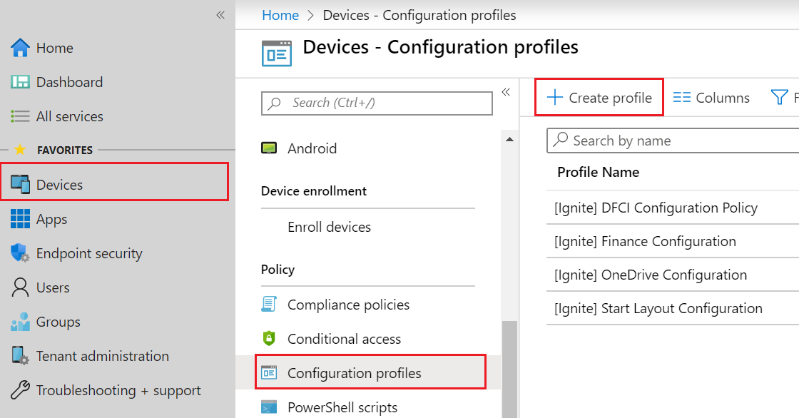
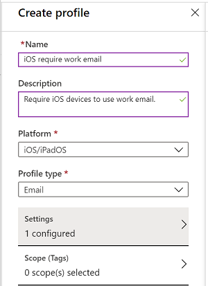
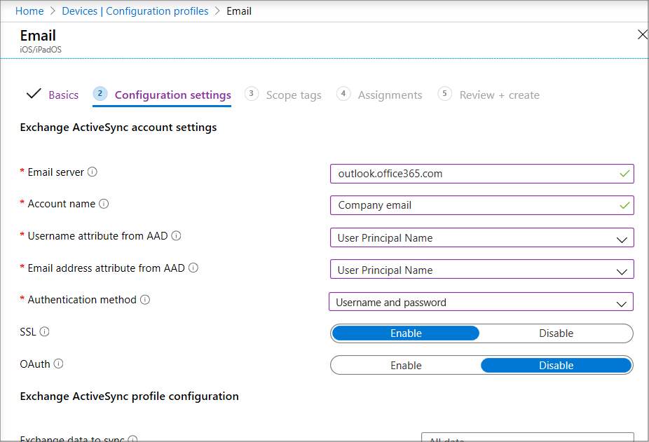

---
# required metadata

title: Quickstart - Create an email device profile for iOS/iPadOS devices
titleSuffix: Microsoft Intune
description: Learn how to use Microsoft Intune to create an email device profile so iOS/iPadOS devices can securely connect to company email.
keywords:
author: brenduns
ms.author: brenduns
manager: dougeby
ms.date: 02/18/2020
ms.topic: quickstart
ms.service: microsoft-intune
ms.subservice: configuration
ms.localizationpriority: high
ms.technology:
ms.assetid: 

# optional metadata

#ROBOTS:
#audience:

ms.reviewer:
ms.suite: ems
search.appverid: MET150
#ms.tgt_pltfrm:
ms.custom: intune-azure
ms.collection: M365-identity-device-management
---

# Quickstart: Create an email device profile for iOS/iPadOS

In this quickstart, you'll see how to create an email device profile for iOS/iPadOS devices. This profile specifies the settings that are required for the built-in email app on the iOS/iPadOS device to connect to company email. Email device profiles help standardize settings across devices, and they let end users access company email on their personal devices without any required setup on their part. To further safeguard your email, you can use an email profile to determine if devices are compliant, and then set up Conditional Access to allow only compliant devices to access email. For details about email profiles, see [How to configure email settings in Microsoft Intune](email-settings-configure.md)

If you don't have an Intune subscription, [sign up for a free trial account](../fundamentals/free-trial-sign-up.md).

## Sign in to Intune

Sign in to the [Microsoft Endpoint Manager admin center](https://go.microsoft.com/fwlink/?linkid=2109431) as a Global Administrator or an Intune Service Administrator. If you have created an Intune Trial subscription, the account you created the subscription with is the Global administrator.

## Create an iOS/iPadOS email profile

1. Select **Devices** > **Configuration profiles** > **Create profile**.

   

2. Under **Name**, enter a descriptive name for the new profile. For this example, enter **iOS require work email**.
3. Enter the following profile information:
    - For **Description**, enter **Require iOS/iPadOS devices to use work email**.
    - For **Platform**, select **iOS/iPadOS**.
    - For **Profile type**, select **Email**.

        

4. Select **Settings**, and enter the following settings (leave the defaults for other settings):
   - **Email server**: For this quickstart, enter **outlook.office365.com**. This setting specifies the Exchange location (URL) of the email server that the iOS/iPadOS mail app will use to connect to email.
   - **Account name**: Enter **Company Email**.
   - **Username attribute from AAD**: This name is the attribute Intune gets from Azure Active Directory (Azure AD). Intune dynamically generates the username for this profile using this name. For this quickstart, we'll assume that we want the **User Principal Name** to be used as the username for the profile (for example, user1@contoso.com).
   - **Email address attribute from AAD**: This setting is the email address from Azure AD that will be used to sign in to Exchange. For this quickstart, select **User Principal Name**.
   - **Authentication method**: For this quickstart, select **Username and password**. (You can also choose **Certificate** if you've already set up a certificate for Intune.)

        

5. Select **OK** > **Create**. The new profile appears on the profiles list with the dashboard displayed so you can monitor how the profile has been assigned to iOS/iPadOS devices and iOS/iPadOS users.
6. Select **Assignments**.
7. Select the **Include** tab, and then select **All Users & All Devices**. 
8. Select **Save**.

## Clean up resources

If you don't intend to use the profile you created for additional tutorials or testing, you can delete it now.

1. In Intune, select **Device configuration**, and then select **Profiles**.
2. Select the test profile you created, **iOS/iPadOS require work email**.
3. Select the ellipses (**...**) next to the profile, and then select **Delete**.

## Next steps

In this quickstart, you created an email profile for iOS/iPadOS devices. Now you can use this profile to determine whether an iOS/iPadOS device is compliant by creating a compliance policy that marks as noncompliant any iOS/iPadOS devices that don't match the profile. For further protection, you can create a Conditional Access policy that blocks noncompliant iOS/iPadOS devices from accessing email. For more information about device compliance policies, see [Get started with device compliance policies in Intune](../protect/device-compliance-get-started.md).

> [!div class="nextstepaction"]
> [Tutorial: Protect Exchange Online email on managed devices](../protect/tutorial-protect-email-on-enrolled-devices.md)
