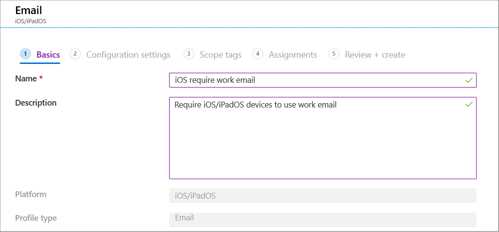

---
# required metadata

title: Create an email device profile for iOS/iPadOS devices
titleSuffix: Microsoft Intune
description: Learn how to use Microsoft Intune to create an email device profile so iOS/iPadOS devices can securely connect to company email.
keywords:
author: brenduns
ms.author: brenduns
manager: dougeby
ms.date: 03/20/2020
ms.topic: conceptual
ms.service: microsoft-intune
ms.subservice: configuration
ms.localizationpriority: high
ms.technology:
ms.assetid: 

# optional metadata

#ROBOTS:
#audience:

ms.reviewer: beflamm
ms.suite: ems
search.appverid: MET150
#ms.tgt_pltfrm:
ms.custom: intune-azure
ms.collection:
- tier2
- M365-identity-device-management
---

# Step 11: Create an email device profile for iOS/iPadOS

In this topic, you'll see how to create an email device profile for iOS/iPadOS devices. This profile specifies the settings that are required for the built-in email app on the iOS/iPadOS device to connect to company email. Email device profiles help standardize settings across devices, and they let end users access company email on their personal devices without any required setup on their part. To further safeguard your email, you can use an email profile to determine if devices are compliant, and then set up Conditional Access to allow only compliant devices to access email. For details about email profiles, see [How to configure email settings in Microsoft Intune](email-settings-configure.md)

If you don't have an Intune subscription, [sign up for a free trial account](../fundamentals/free-trial-sign-up.md).

## Sign in to Intune

Sign in to the [Microsoft Intune admin center](https://go.microsoft.com/fwlink/?linkid=2109431) as a Global Administrator or an Intune Service Administrator. If you have created an Intune Trial subscription, the account you created the subscription with is the Global administrator.

## Create an iOS/iPadOS email profile

1. Sign in to the [Microsoft Intune admin center](https://go.microsoft.com/fwlink/?linkid=2109431).

2. Select  and go to **Devices** > **Configuration profiles** > **Create profile**.
   

3. Enter the following properties:
   - **Platform**: Select **iOS/iPadOS**
   - **Profile**: Select **Email**
  
4. Select **Create**.

5. In **Basics**, enter the following properties:
   - **Name**: Enter a descriptive name for the new profile. For this example, enter **iOS require work email**.
   - **Description**: Enter **Require iOS/iPadOS devices to use work email**

        

6. Select **Next**.

7. In **Configuration settings**, enter the following settings (leave the defaults for other settings):
   - **Email server**: For this evaluation step, enter **outlook.office365.com**. This setting specifies the Exchange location (URL) of the email server that the iOS/iPadOS mail app will use to connect to email.
   - **Account name**: Enter **Company Email**.
   - **Username attribute from AAD**: This name is the attribute Intune gets from Azure Active Directory (Azure AD). Intune dynamically generates the username for this profile using this name. For this evalution step, we'll assume that we want the **User Principal Name** to be used as the username for the profile (for example, user1@contoso.com).
   - **Email address attribute from AAD**: This setting is the email address from Azure AD that will be used to sign in to Exchange. For this evaluation step, select **User Principal Name**.
   - **Authentication method**: For this evalution step, select **Username and password**. (You can also choose **Certificate** if you've already set up a certificate for Intune.)

8. Select **Next**.

9. In **Scope tags** (optional), Select **Next**. We won't use a scope tag for this profile.

10. In **Assignments**, use the drop-down for **Assign to** and select **All users and all devices**.  Then, select **Next**.

11. In **Review + create**, review your settings. When you select **Create**, your changes are saved, and the profile is assigned. 

## Clean up resources

If you don't intend to use the profile you created for additional tutorials or testing, you can delete it now.

1. In Intune, select**Devices** > **Device configuration**.
2. Select the test profile you created, **iOS/iPadOS require work email**, and then select **Delete**. 

## Next steps

In this topic, you created an email profile for iOS/iPadOS devices. Now you can use this profile to determine whether an iOS/iPadOS device is compliant by creating a compliance policy that marks as noncompliant any iOS/iPadOS devices that don't match the profile. For further protection, you can create a Conditional Access policy that blocks noncompliant iOS/iPadOS devices from accessing email. For more information about device compliance policies, see [Get started with device compliance policies in Intune](../protect/device-compliance-get-started.md).

> [!div class="nextstepaction"]
> [Deploy or move to Microsoft Intune](../fundamentals/migration-guide.md)
