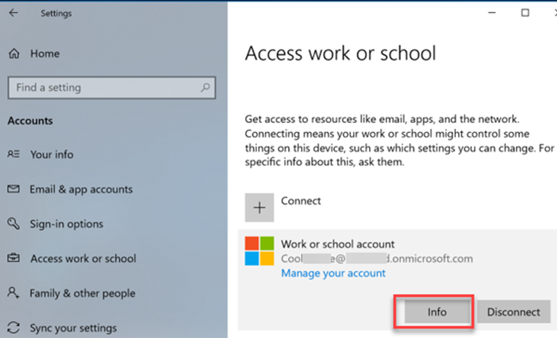

---
# required metadata

title: Troubleshoot and review Wi-Fi device profile logs in Microsoft Intune - Azure | Microsoft Docs
description: Understand and troubleshoot Wi-Fi device configuration profile issues on Android, iOS/iPadOS, and Windows devices in Microsoft Intune. Review logs, and see some common issues and possible resolutions.
keywords:
author: MandiOhlinger
ms.author: mandia
manager: dougeby
ms.date: 02/18/2020
ms.topic: conceptual
ms.service: microsoft-intune
ms.subservice: configuration
ms.localizationpriority: high
ms.technology:

# optional metadata

#ROBOTS:
#audience:
#ms.devlang:
ms.reviewer: tycast
ms.suite: ems
search.appverid: MET150
#ms.tgt_pltfrm:
ms.custom: intune-azure
ms.collection: M365-identity-device-management
---

# Troubleshoot Wi-Fi device configuration profiles in Microsoft Intune

In Intune, you can create device configuration profiles that include connection settings for your WiFi network. Use these settings to connect users' Android, iOS/iPadOS, and Windows devices to the organization network.

This article shows what a Wi-Fi profile looks like when it successfully applies to devices. It also includes log information, common issues, and more. Use this article to help troubleshoot your Wi-Fi profiles.

For more information on Wi-Fi profiles in Intune, see [Add and use Wi-Fi settings on your devices](wi-fi-settings-configure.md).

## Before you begin

The examples in this article use SCEP certificate authentication for the Intune profiles. It also assumes that the Trusted Root and SCEP profiles work correctly on the device.

## Android

In this section, we step through the end user experience when installing the configuration profiles on an Android device.

### End-user experience example

This scenario uses a Nokia 6.1 device. Before the Wi-Fi profile is installed on the device, install the Trusted Root and SCEP profiles.

1. End users receive a notification to install the Trusted Root certificate profile:

    > [!div class="mx-imgBorder"]
    > 

2. The next notification prompts to install the SCEP certificate profile:

    > [!div class="mx-imgBorder"]
    > 

    > [!TIP]
    > When using a device administrator-managed Android device, there may be multiple certificates listed. When a certificate profile is revoked or removed, the certificate stays on the device. In this scenario, select the newest certificate. It's usually the last certificate shown in the list.
    >
    > This situation doesn’t occur on Android Enterprise and Samsung Knox devices. For more information, see [Manage Android work profile devices](../intune/enrollment/android-enterprise-overview.md) and [Remove SCEP and PKCS certificates](../intune/protect/remove-certificates.md#android-knox-devices).

3. Next, users receive a notification to install the Wi-Fi profile:

    > [!div class="mx-imgBorder"]
    > 

4. When complete, the Wi-Fi connection is shown as a saved network:

    > [!div class="mx-imgBorder"]
    > 

### Review Company Portal app logs

On Android, the **Omadmlog.log** file details the activities of the Wi-Fi profile when it's installed on the device. You might have up to five Omadmlog log files. Be sure to get the timestamp of the last sync, as it will help you find the related log entries.

In the following example, use [CMTrace](https://docs.microsoft.com/configmgr/core/support/cmtrace) to read the logs, and search for “wifimgr”:

> [!div class="mx-imgBorder"]
> 

The following log shows your search results, and shows the Wi-Fi profile successfully applied:

```log
2019-08-01T19:22:46.7340000    VERB    com.microsoft.omadm.platforms.android.wifimgr.WifiProfile    15118    04142    Starting to parse Wifi Profile XML with name '<profile ID>'.
2019-08-01T19:22:46.7490000    VERB    com.microsoft.omadm.platforms.android.wifimgr.OneX    15118    04142    Starting to parse OneX from Wifi XML.
2019-08-01T19:22:46.8100000    VERB    com.microsoft.omadm.platforms.android.wifimgr.OneX    15118    04142    Completed parsing OneX from Wifi XML.
2019-08-01T19:22:46.8209999    VERB    com.microsoft.omadm.platforms.android.wifimgr.WifiProfile    15118    04142    Completed parsing Wifi Profile XML with name '<profile ID>'.
2019-08-01T19:22:46.8240000    INFO    com.microsoft.omadm.utils.CertificateSelector    15118    04142    Selected ca certificate with alias: 'user:205xxxxx.0' and thumbprint '<thumbprint>'.
2019-08-01T19:22:47.0990000    VERB    com.microsoft.omadm.platforms.android.certmgr.CertificateChainBuilder    15118    04142    Complete certificate chain built with Complete certs.
2019-08-01T19:22:47.1010000    VERB    com.microsoft.omadm.utils.CertUtils    15118    04142    1 cert(s) matched criteria: User<ID>[i:<ID>,17CECEA1D337FAA7D167AD83A8CC7A8FCBF9xxxx;eku:1.3.6.1.5.5.7.3.1,1.3.6.1.5.5.7.3.2]
2019-08-01T19:22:47.1090000    VERB    com.microsoft.omadm.utils.CertUtils    15118    04142    0 cert(s) excluded by criteria:
2019-08-01T19:22:47.1110000    INFO    com.microsoft.omadm.utils.CertificateSelector    15118    04142    Selected client cert with alias 'User<ID>' and requestId 'ModelName=<ModelName>%2FLogicalName_<LogicalName>;Hash=-912418295'.
2019-08-01T19:22:47.4120000    VERB    com.microsoft.omadm.Services    15118    04142    Successfully applied, enabled and saved wifi profile '<profile ID>'
2019-08-01T19:22:47.4240000    VERB    com.microsoft.omadm.platforms.android.wifimgr.OneX    15118    04142    Starting to parse OneX from Wifi XML.
2019-08-01T19:22:47.4910000    VERB    com.microsoft.omadm.platforms.android.wifimgr.OneX    15118    04142    Completed parsing OneX from Wifi XML.
2019-08-01T19:22:47.4970000    VERB    com.microsoft.omadm.platforms.android.wifimgr.WifiProfile    15118    04142    Starting to parse Wifi Profile XML with name '<profile ID>'.
2019-08-01T19:22:47.5080000    VERB    com.microsoft.omadm.platforms.android.wifimgr.OneX    15118    04142    Starting to parse OneX from Wifi XML.
2019-08-01T19:22:47.5820000    VERB    com.microsoft.omadm.platforms.android.wifimgr.OneX    15118    04142    Completed parsing OneX from Wifi XML.
2019-08-01T19:22:47.5900000    VERB    com.microsoft.omadm.platforms.android.wifimgr.WifiProfile    15118    04142    Completed parsing Wifi Profile XML with name '<profile ID>'.
2019-08-01T19:22:47.5910000    INFO    com.microsoft.omadm.platforms.android.wifimgr.WifiProfileManager    15118    04142    Applied profile <profile ID>

```

## iOS/iPadOS

After the Wi-Fi profile is installed on the device, it's shown in the **Management Profile**:

> [!div class="mx-imgBorder"]
> 

> [!div class="mx-imgBorder"]
> 

### Review the iOS/iPadOS console and device logs

On iOS/iPadOS devices, the Company Portal app log doesn't include information about Wi-Fi profiles. To see installation details of your Wi-Fi profiles, use the Console/Device Logs:

1. Connect the iOS/iPadOS device to Mac. Go to **Applications** > **Utilities**, and open the Console app.
2. Under **Action**, select **Include Info Messages** and **Include Debug Messages**:

    > [!div class="mx-imgBorder"]
    > 

3. Reproduce the scenario, and save the logs to a text file:

    1. Select all the messages on the current screen: **Edit** > **Select All**.
    2. Copy the messages: **Edit** > **Copy**.
    3. Paste the log data in a text editor, and save the file.

4. Search the saved log file to see detailed information. When the profile successfully installs, your output looks similar to the following log:

    ```log
    Line 390870: debug    11:19:58.994815 -0400    profiled    Adding dependent www.windowsintune.com.wifi.Contoso to parent Microsoft.Profiles.MDM in domain ManagingProfileToManagedProfile to system\
    Line 390872: debug    11:19:58.995210 -0400    profiled    Adding dependent Microsoft.Profiles.MDM to parent www.windowsintune.com.wifi.Contoso in domain ManagedProfileToManagingProfile to system\
    Line 392346: default    11:19:59.360460 -0400    profiled    Profile \'93www.windowsintune.com.wifi.Contoso\'94 installed.\
    ```

## Windows

After the Wi-Fi profile is installed on the device, go to **Settings** > **Accounts** > **Access work or school**. Select your account > **Info**:

> [!div class="mx-imgBorder"]
> 

In **Areas managed by Microsoft**, **WiFi** is shown:

> [!div class="mx-imgBorder"]
> 

To see the Wi-Fi connection, go to **Settings** > **Network & Internet**  > **Wi-Fi**:

> [!div class="mx-imgBorder"]
> 

### Review event viewer logs

On Windows devices, the details about Wi-Fi profiles are logged in the Event Viewer:

1. Open the **Event Viewer** app.
2. On the **View** menu, select **Show Analytic and Debug Logs**.
3. Expand **Applications and Services Logs** > **Microsoft** > **Windows** > **DeviceManagement-Enterprise-Diagnostic-Provider** > **Admin**

Your output similar to the following logs:

```log
Log Name:      Microsoft-Windows-DeviceManagement-Enterprise-Diagnostics-Provider/Admin
Source:        Microsoft-Windows-DeviceManagement-Enterprise-Diagnostics-Provider
Date:          8/7/2019 8:01:41 PM
Event ID:      1506
Task Category: (1)
Level:         Information
Keywords:      (2)
User:          SYSTEM
Computer:      <Computer Name>
Description:
WiFiConfigurationServiceProvider: Node set value, type: (0x4), Result: (The operation completed successfully.).
```

## Common issues

### Issue 1: The Wi-Fi profile isn't deployed to the device

- Confirm the Wi-Fi profile is assigned to the correct group:

    1. In the [Microsoft Endpoint Manager admin center](https://go.microsoft.com/fwlink/?linkid=2109431), select **Devices** > **Configuration profiles**.
    2. Select your profile > **Assignments**. Confirm the selected groups are correct.
    3. In the Endpoint Manager, select **Troubleshooting + Support**. Review the **Assignments** information.

- In the Endpoint Manager, select **Troubleshooting + Support**. Confirm the device can sync with Intune by checking the **Last check in** time.

- If the Wi-Fi profile is linked to the Trusted Root and SCEP profiles, confirm both profiles are deployed to the device. The Wi-Fi profile has a dependency on these profiles.

- On Windows 10 and newer devices, review the MDM Diagnostic Information log:

  1. Go to **Settings** > **Accounts** > **Access work or school**.
  2. Select your work or school account > **Info**.
  3. At the bottom of the **Settings** page, select **Create report**.
  4. A window opens that shows the path to the log files. Select **Export**.
  5. Go to the `\Users\Public\Documents\MDMDiagnostics` path, and view the report:

      > [!div class="mx-imgBorder"]
      > 

  > [!TIP]
  > For more information, see [Diagnose MDM failures in Windows 10](https://docs.microsoft.com/windows/client-management/mdm/diagnose-mdm-failures-in-windows-10).

- On Android devices, if the Trusted Root and SCEP profiles aren't installed on the device, you see the following entry in the Company Portal app Omadmlog file:

  ``` log
  2019-08-01T19:18:13.5120000    INFO    com.microsoft.omadm.platforms.android.wifimgr.WifiProfileManager    15118    04105    Skipping Wifi profile <profile ID> because it is pending certificates.
  ```

  - When the Trusted Root and SCEP profiles are on the Android device and compliant, the Wi-Fi profile might not be on the device. This issue happens when the **CertificateSelector** provider from the Company Portal app doesn't find a certificate that matches the specified criteria. The specific criteria can be in the Certificate Template or in the SCEP profile.

    If the matching certificate isn't found, the certificates on the device aren't installed. The Wi-Fi profile isn't applied because it doesn’t have the correct certificate. In this scenario, you see the following entry in the Company Portal app Omadmlog file:

    ` Skipping Wifi profile <profile ID> because it is pending certificates.`

    The following sample log shows certificates being excluded because the **Any Purpose** Extended Key Usage (EKU) criteria was specified. But, the certificates assigned to the device don’t have that EKU:

    ```log
    2018-11-27T21:10:37.6390000    VERB     com.microsoft.omadm.utils.CertUtils      14210    00948    Excluding cert with alias User<ID1> and requestId <requestID1> as it does not have any purpose EKU.
    2018-11-27T21:10:37.6400000    VERB     com.microsoft.omadm.utils.CertUtils      14210    00948    Excluding cert with alias User<ID2> and requestId <requestID2> as it does not have any purpose EKU.
    2018-11-27T21:10:37.6400000    VERB     com.microsoft.omadm.utils.CertUtils      14210    00948    0 cert(s) matched criteria:
    2018-11-27T21:10:37.6400000    VERB     com.microsoft.omadm.utils.CertUtils      14210    00948    2 cert(s) excluded by criteria:
    2018-11-27T21:10:37.6400000    INFO       com.microsoft.omadm.platforms.android.wifimgr.WifiProfileManager       14210                00948     Skipping Wifi profile <profile ID> because it is pending certificates.
    ```

    The following sample shows the SCEP profile entered the **Any Purpose** EKU. But, it's not entered in the Certificate Template on the certificate authority (CA). To fix the issue, add the **Any Purpose** option to the certificate template. Or, remove the **Any Purpose** option from the SCEP profile.

    > [!div class="mx-imgBorder"]
    > 

    > [!div class="mx-imgBorder"]
    > 

  - Confirm that all required certificates in the complete certificate chain are on the Android device. Otherwise, the Wi-Fi profile can't be installed on the device. For more information, see [Missing intermediate certificate authority](https://developer.android.com/training/articles/security-ssl#MissingCa) (opens Android's web site).
  - Filter Omadmlog with keywords to look for information, such as which certificate is used in the Wi-Fi profile, and if the profile successfully applied.

    For example, use [CMTrace](https://docs.microsoft.com/configmgr/core/support/cmtrace) to read the logs. Use the search string to filter “wifimgr”:

    > [!div class="mx-imgBorder"]
    > 

    The output looks similar to the following log:

    > [!div class="mx-imgBorder"]
    > 

    If you see an error in the log, copy the time stamp of the error and unfilter the log. Then, use the “find” option with the time stamp to see what happened right before the error.

### Issue 2: The Wi-Fi profile is deployed to the device, but the device can't connect to the network

Typically, this issue is caused by something outside of Intune. The following tasks may help you understand and troubleshoot connectivity issues:

- Manually connect to the network using a certificate with the same criteria that's in the Wi-Fi profile.

  If you can connect, look at the certificate properties in the manual connection. Then, update the Intune Wi-Fi profile with the same certificate properties.
- Connectivity errors are usually logged in the Radius server log. For example, it should show if the device tried to connect with the Wi-Fi profile.

## Need more help

- Use the [Intune user forums](https://social.technet.microsoft.com/Forums/en-US/home?category=microsoftintune&filter=alltypes&sort=lastpostdesc) or [get support from Microsoft](../intune/fundamentals/get-support.md).

- For more information about Wi-Fi profiles in Microsoft Intune, see the following articles:

  - Add Wi-Fi settings for devices running [Android](wi-fi-settings-android.md), [iOS/iPadOS](wi-fi-settings-ios.md), and [Windows 10 and later](wi-fi-settings-windows.md).
  - [Support Tip - How to configure NDES for SCEP certificate deployments in Intune](https://techcommunity.microsoft.com/t5/Intune-Customer-Success/Support-Tip-How-to-configure-NDES-for-SCEP-certificate/ba-p/455125)
  - Troubleshoot the [SCEP certificate profile deployment](https://support.microsoft.com/help/4526725/troubleshooting-scep-profile-deployment-to-android-devices-in-intune) and [NDES configuration](https://support.microsoft.com/help/4459540/troubleshoot-ndes-configuration-for-use-with-intune).

- For the latest news, information, and tech tips, see the official blogs:
  - [Microsoft Intune Support Team blog](https://techcommunity.microsoft.com/t5/Intune-Customer-Success/bg-p/IntuneCustomerSuccess)
  - [Microsoft Enterprise Mobility and Security blog](https://techcommunity.microsoft.com/t5/Enterprise-Mobility-Security/bg-p/enterprisemobilityandsecurity)

## Next steps

[Monitor your profiles](device-profile-monitor.md).
