---
# required metadata

title: Walkthrough - Create administrative template in Microsoft Intune - Azure | Microsoft Docs
description: This tutorial or walkthrough uses Microsoft Intune to configure Office, Windows, and Microsoft Edge ADMX templates on Windows 10 and newer devices.
keywords:
author: MandiOhlinger
ms.author: mandia
manager: dougeby
ms.date: 02/18/2020
ms.topic: tutorial
ms.service: microsoft-intune
ms.subservice: configuration
ms.localizationpriority:
ms.technology:
ms.assetid: 

# optional metadata

#ROBOTS:
#audience:
#ms.devlang:
ms.reviewer:
ms.suite: ems
search.appverid: MET150
#ms.tgt_pltfrm:
ms.custom: intune-azure
ms.collection: M365-identity-device-management

#Customer intent: As an administrator, I want learn and use ADMX templates in the cloud so that I can control and manage Office, Windows, and Microsoft Edge settings on Windows 10 devices.
---

# Tutorial: Use the cloud to configure group policy on Windows 10 devices with ADMX templates and Microsoft Intune

> [!NOTE]
> This tutorial was created as a technical workshop for Microsoft Ignite. It has more prerequisites than typical tutorials, as it compares using and configuring ADMX policies in Intune and on-premises.

Group policy administrative templates, also known as ADMX templates, include settings you can configure on Windows 10 devices, including PCs. The ADMX template settings are available by different services. These settings are used by Mobile Device Management (MDM) providers, including Microsoft Intune. For example, you can turn on Design Ideas in PowerPoint, set a home page in Microsoft Edge, block ActiveX controls in Internet Explorer, and more.

ADMX templates are available for the following services:

- **Microsoft Edge**: Download at [Microsoft Edge policy file](https://www.microsoftedgeinsider.com/en-us/enterprise).
- **Office**: Download at [Office 365 ProPlus, Office 2019, and Office 2016](https://www.microsoft.com/download/details.aspx?id=49030).
- **Windows**: Built in to the Windows 10 OS.

For more information on ADMX policies, see [Understanding ADMX-backed policies](https://docs.microsoft.com/windows/client-management/mdm/understanding-admx-backed-policies).

In Microsoft Intune, these templates are built in to the Intune service, and are available as **Administrative templates** profiles. In this profile, you configure the settings you want to include, and then "assign" this profile to your devices.

In this tutorial, you will:

> [!div class="checklist"]
> * Get introduced to the [Microsoft Endpoint Manager admin center](https://go.microsoft.com/fwlink/?linkid=2109431).
> * Create user groups and create device groups.
> * Compare the settings in Intune with on-premises ADMX settings.
> * Create different administrative templates, and configure the settings that target the different groups.

By the end of this lab, you’ll have the skills to get started using Intune and Microsoft 365 to manage your users, and deploy administrative templates.

This feature applies to:

- Windows 10 version 1703 and newer

## Prerequisites

- A Microsoft 365 E3 or E5 subscription, which includes Intune and Azure Active Directory (AD) premium. If you don't have an E3 or E5 subscription, [try it for free](https://docs.microsoft.com/office365/admin/try-or-buy-microsoft-365?view=o365-worldwide).

  For more information on what you get with the different Microsoft 365 licenses, see [Transform your Enterprise with Microsoft 365](https://www.microsoft.com/microsoft-365/compare-all-microsoft-365-plans).

- Microsoft Intune is configured as the **Intune MDM Authority**. For more information, see [Set the mobile device management authority](../intune/fundamentals/mdm-authority-set.md).

  > [!div class="mx-imgBorder"]
  > 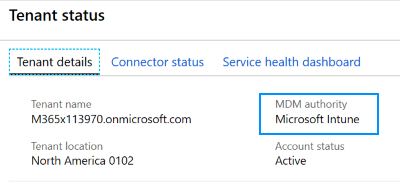

- On an on-premises Active Directory domain controller (DC):

  1. Copy the following Office and Microsoft Edge templates to the [Central Store (SYSVOL folder)](https://support.microsoft.com/help/3087759/how-to-create-and-manage-the-central-store-for-group-policy-administra):

      - [Office administrative templates](https://www.microsoft.com/download/details.aspx?id=49030)
      - [Microsoft Edge administrative templates > Policy file](https://www.microsoftedgeinsider.com/en-us/enterprise)

  2. Create a group policy to push these templates to a Windows 10 Enterprise administrator computer in the same domain as the DC. In this tutorial:

      - The group policy we created with these templates is called **OfficeandEdge**. You'll see this name in the images.
      - The Windows 10 Enterprise administrator computer we use is called the **Admin computer**.

      In some organizations, a domain administrator has two accounts - a typical domain work account, and a different domain administrator account used only for domain administrator tasks, such as group policy.

      The purpose of this **Admin computer** is for administrators to sign in with their domain administrator account, and access tools designed for managing group policy.

- On this **Admin computer**:

  - Sign in with a Domain Administrator account.

  - Install the **RSAT: Group Policy Management Tools**:

    1. Open the **Settings** app > **Apps** > **Optional features** > **Add feature**.
    2. Select **RSAT: Group Policy Management Tools** > **Install**.

        Wait while Windows installs the feature. When complete, it eventually shows in the **Windows Administrative Tools** app.

        > [!div class="mx-imgBorder"]
        > 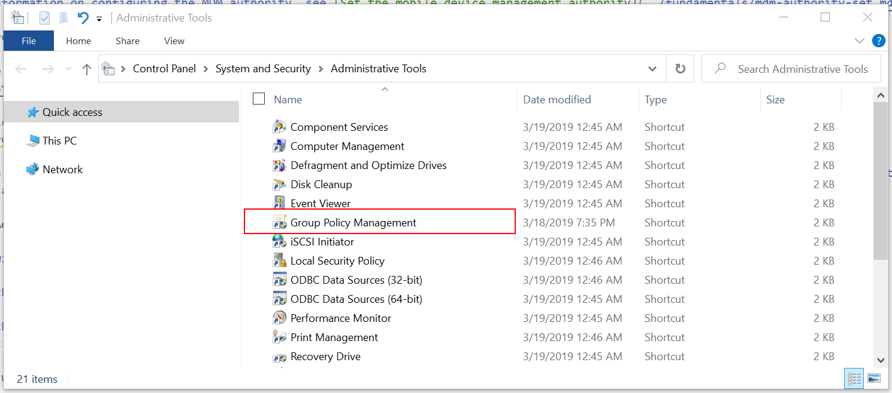

  - Be sure you have internet access and administrator rights to the Microsoft 365 subscription, which includes the Endpoint Manager admin center.

## Open the Endpoint Manager admin center

1. Open a chromium web browser, such as Microsoft Edge version 77 and later.
2. Go to the [Microsoft Endpoint Manager admin center](https://go.microsoft.com/fwlink/?linkid=2109431) (https://devicemanagement.microsoft.com). Sign in with the following account:

    **User**: Enter the administrator account of your Microsoft 365 tenant subscription.  
    **Password**: Enter its password.

This admin center is focused on device management, and includes Azure services, such as Azure AD and Intune. You might not see the **Azure Active Directory** and **Intune** branding, but you're using them.

You can also open the Endpoint Manager admin center from the [Microsoft 365 admin center](https://admin.microsoft.com):

1. Go to [https://admin.microsoft.com](https://admin.microsoft.com).
2. Sign in with your administrator account of your Microsoft 365 tenant subscription.
3. Under **Admin centers**, select **All admin centers** > **Endpoint management**. The Endpoint Manager admin center opens.

    > [!div class="mx-imgBorder"]
    > 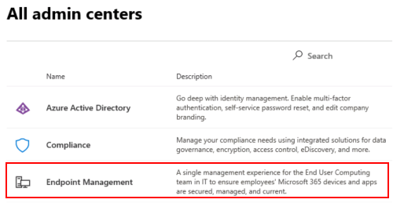

## Create groups, and add users

On-premises policies are applied in the LSDOU order - local, site, domain, and organizational unit (OU). In this hierarchy, OU policies overwrite local policies, domain policies overwrite site policies, and so on.

In Intune, policies are applied to users and groups you create. There isn't a hierarchy. If two policies update the same setting, then the setting shows as a conflict. If two compliance policies are in conflict, then the most restrictive policy applies. If two configuration profiles are in conflict, then the setting isn't applied. For more information, see [Common questions, issues, and resolutions with device policies and profiles](device-profile-troubleshoot.md#if-multiple-policies-are-assigned-to-the-same-user-or-device-how-do-i-know-which-settings-gets-applied).

In these next steps, you’ll create security groups, and add users to the groups. You can add a user to multiple groups. For example, it’s normal for a user to have multiple devices, such as a Surface Pro for work, and an Android mobile device for personal. And, it's normal for a person to access organizational resources from these multiple devices.

1. In the Endpoint Manager admin center, select **Groups** > **New group**.

2. Enter the following settings:

    - **Group type**: Select **Security**.
    - **Group name**: Enter **All Windows 10 student devices**.
    - **Membership type**: Select **Assigned**.

3. Select **Members**, and add some devices.

    Adding devices is optional. The goal is to practice creating groups, and knowing how to add devices. If you're using this tutorial in a production environment, then be aware of what you're doing.

4. **Select** > **Create** to save your changes.

    Don't see your group? Select **Refresh**.

5. Select **New group**, and enter the following settings:

    - **Group type**: Select **Security**.
    - **Group name**: Enter **All Windows devices**.
    - **Membership type**: Select **Dynamic Device**.
    - **Dynamic device members**: Configure your query:

        - **Property**: Select **deviceOSType**.
        - **Operator**: Select **Equals**.
        - **Value**: Enter **Windows**.

        1. Select **Add expression**. Your expression is shown in the **Rule syntax**:

            > [!div class="mx-imgBorder"]
            > 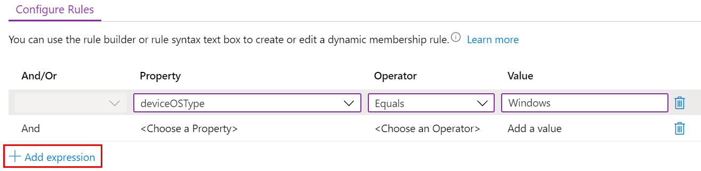

            When users or devices meet the criteria you enter, they're automatically added to the dynamic groups. In this example, devices are automatically added to this group when the operating system is Windows. If you're using this tutorial in a production environment, then be careful. The goal is to practice creating dynamic groups.

        2. **Save** > **Create** to save your changes.

6. Create the **All Teachers** group with the following settings:

    - **Group type**: Select **Security**.
    - **Group name**: Enter **All Teachers**.
    - **Membership type**: Select **Dynamic User**.
    - **Dynamic user members**: Configure your query:

      - **Property**: Select **department**.
      - **Operator**: Select **Equals**.
      - **Value**: Enter **Teachers**.

        1. Select **Add expression**. Your expression is shown in the **Rule syntax**.

            When users or devices meet the criteria you enter, they're automatically added to the dynamic groups. In this example, users are automatically added to this group when their department is Teachers. You can enter the department and other properties when users are added to your organization. If you're using this tutorial in a production environment, then be careful. The goal is to practice creating dynamic groups.

        2. **Save** > **Create** to save your changes.

### Talking points

- Dynamic groups are a feature in Azure AD Premium. If you don't have Azure AD Premium, then you're licensed to only create assigned groups. For more information on dynamic groups, see:

  - [Dynamic Group Membership in Azure Active Directory (Part 1)](https://blogs.technet.microsoft.com/pauljones/2017/08/28/dynamic-group-membership-in-azure-active-directory-part-1/)
  - [Dynamic Group Membership in Azure Active Directory (Part 2)](https://blogs.technet.microsoft.com/pauljones/2017/08/29/dynamic-group-membership-in-azure-active-directory-part-2/)

- Azure AD Premium includes other services that are commonly used when managing apps and devices, including [multi-factor authentication (MFA)](https://docs.microsoft.com/azure/active-directory/authentication/concept-mfa-howitworks) and [conditional access](https://docs.microsoft.com/azure/active-directory/conditional-access/overview).

- Many administrators ask when to use user groups and when to use device groups. For some guidance, see [User groups vs. device groups](device-profile-assign.md#user-groups-vs-device-groups).

- Remember, a user can belong to multiple groups. Consider some of the other dynamic user and device groups you can create, such as:

  - All Students
  - All Android devices
  - All iOS/iPadOS devices
  - Marketing
  - Human Resources
  - All Charlotte employees
  - All Redmond employees
  - West coast IT administrators
  - East coast IT administrators

The users and groups created are also seen in the [Microsoft 365 admin center](https://admin.microsoft.com), Azure AD in the Azure portal, and [Microsoft Intune in the Azure portal](https://go.microsoft.com/fwlink/?linkid=2090973). You can create and manage groups in all these areas for your tenant subscription. **If your goal is device management, use the [Microsoft Endpoint Manager admin center](https://go.microsoft.com/fwlink/?linkid=2109431)**.

### Review group membership

1. In the Endpoint Manager admin center, select **Users** > select the name of any existing user.

    > [!div class="mx-imgBorder"]
    > 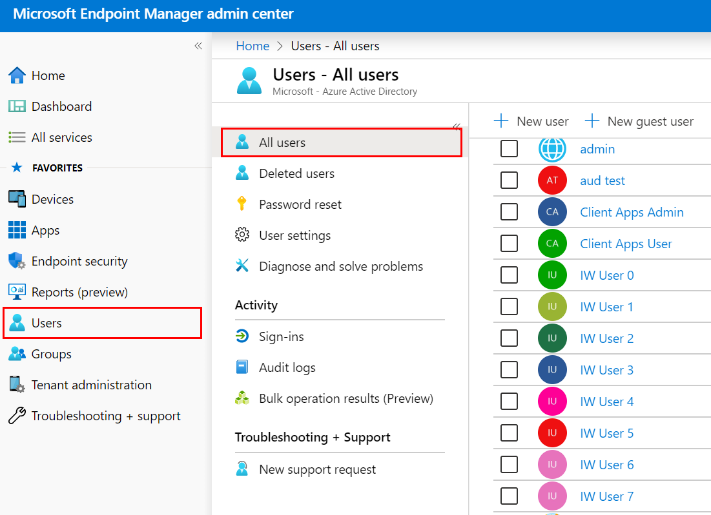

2. Review some of the information you can add or change. For example, look at the properties you can configure, such as Job Title, Department, City, Office location, and more. You can use these properties in your dynamic queries when creating dynamic groups.
3. Select **Groups** to see the membership of this user. You can also remove the user from a group.
4. Select some of the other options to see more information, and what you can do. For example, look at the assigned license, the user's devices, and more.

### What did I just do?

In the Endpoint Manager admin center, you created new security groups, and added existing users and devices to these groups. We’ll use these groups in later steps in this tutorial.

## Create a template in Intune

In this section, we create an administrative template in Intune, look at some settings in **Group Policy Management**, and compare the same setting in Intune. The goal is to show a setting in group policy, and show the same setting in Intune.

1. In the Endpoint Manager admin center, select **Devices** > **Configuration profiles** > **Create profile**.
2. Enter the following properties:

    - **Name**: Enter a descriptive name for the profile. Name your profiles so you can easily identify them later. For example, enter **Admin template - Windows 10 student devices**.
    - **Description**: Enter a description for the profile. This setting is optional, but recommended.
    - **Platform**: Select **Windows 10 and later**.
    - **Profile type**: Select **Administrative templates**.

3. Select **Create**. In the **Select a category** drop-down list, select **All products**. All the settings are shown. In these settings, notice the following properties:

    - The **Path** to the policy is the same as Group Policy Management or GPEdit.
    - The setting applies to users or devices.

### Open Group Policy Management

In this section, we show a policy in Intune and its matching policy in Group Policy Management Editor.

#### Compare a device policy

1. On the **Admin computer**, open the **Group Policy Management** app.

    This app gets installed with **RSAT: Group Policy Management Tools**, which is an optional feature you install on Windows. [Prerequisites](#prerequisites) (in this article) lists the steps to install it.

2. Expand **Domains** > select your domain. For example, select **contoso.net**.
3. Right-click the **OfficeandEdge** policy > **Edit**. This opens the Group Policy Management Editor app.

    > [!div class="mx-imgBorder"]
    > 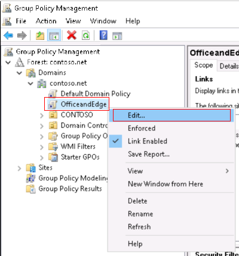

    **OfficeandEdge** is a group policy that includes the Office and Microsoft Edge ADMX templates. This policy is described in [prerequisites](#prerequisites) (in this article).

4. Expand **Computer configuration** > **Policies** > **Administrative Templates** > **Control Panel** > **Personalization**. Notice the available settings.

    > [!div class="mx-imgBorder"]
    > 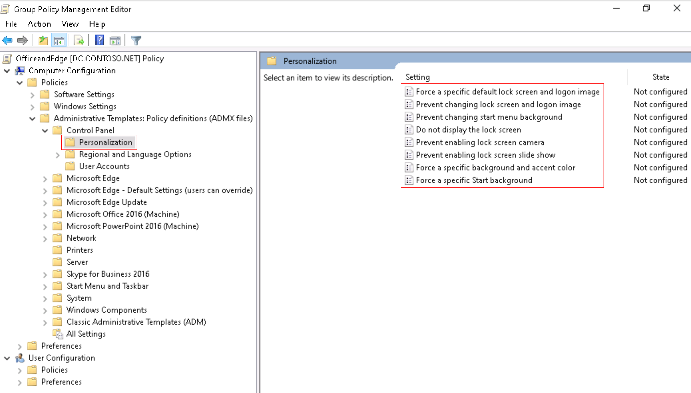

    Double-click **Prevent enabling lock screen camera**, and see the available options:

    > [!div class="mx-imgBorder"]
    > 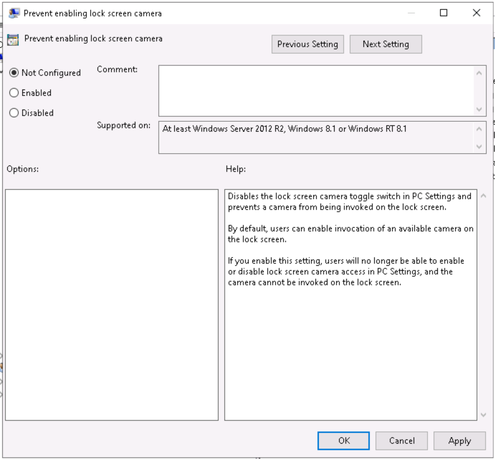

5. In the device management admin center, go to your **Admin template - Windows 10 student devices** template.
6. Select **All products** from the drop-down list, and search for **personalization**:

    > [!div class="mx-imgBorder"]
    > 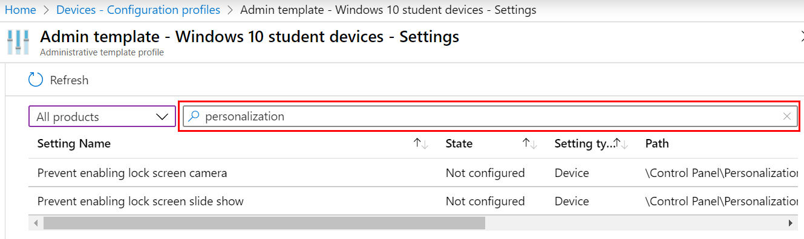

    Notice the available settings.

    The setting type is **Device**, and the path is **\Control Panel\Personalization**. This path is similar to what you just saw in Group Policy Management Editor. If you open the setting, you see the same **Not configured**, **Enabled**, and **Disabled** options you see in Group Policy Management Editor.

#### Compare a user policy

1. In your admin template, search for **inprivate browsing**. Notice the path, and that the setting applies to users and devices.

2. In **Group Policy Management Editor**, find the matching user and device settings:

    - Device: Expand **Computer configuration** > **Policies** > **Administrative Templates** > **Windows components** > **Internet Explorer** > **Privacy** > **Turn off InPrivate Browsing**.
    - User: Expand **User configuration** > **Policies** > **Administrative Templates** > **Windows components** > **Internet Explorer** > **Privacy** > **Turn off InPrivate Browsing**.

    > [!div class="mx-imgBorder"]
    > 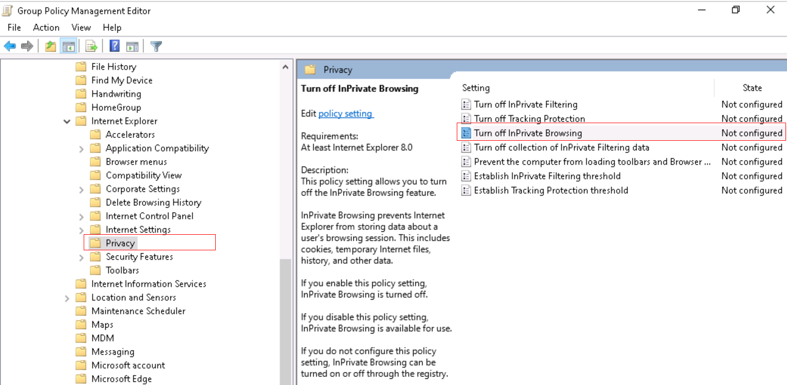

> [!TIP]
> To see the built-in Windows policies, you can also use GPEdit (**Edit group policy** app).

#### Compare an Edge policy

1. In the device management admin center, go to your **Admin template - Windows 10 student devices** template.
2. Select **Edge version 77 and later** from the drop-down list.
3. Search for **startup**. Notice the available settings.
4. In Group Policy Management Editor, find these settings:

    - Device: Expand **Computer configuration** > **Policies** > **Administrative Templates** > **Microsoft Edge** > **Startup, homepage and new tab page**.
    - User: Expand **User configuration** > **Policies** > **Administrative Templates** > **Microsoft Edge** > **Startup, homepage and new tab page**

### What did I just do?

You created an administrative template in Intune. In this template, we looked at some ADMX settings, and looked at the same ADMX settings in Group Policy Management.

## Add settings to the Students admin template

In this template, we configure some Internet Explorer settings to lock down devices shared by multiple students.

1. In your **Admin template - Windows 10 student devices**, search for **Turn off InPrivate Browsing**, and select the device policy:

    > [!div class="mx-imgBorder"]
    > 

2. In this window, notice the description and values you can set. These options are similar to what you see in group policy.
3. Select **Enabled** > **OK** to save your changes.
4. Also configure the following Internet Explorer settings. Be sure to select **OK** to save your changes.

    - **Allow drag and drop or copy and paste files**
      - **Type**: Device
      - **Path**: \Windows Components\Internet Explorer\Internet Control Panel\Security Page\Internet Zone
      - **Value**: Disabled

    - **Prevent ignoring certificate errors**
      - **Type**: Device
      - **Path**: \Windows Components\Internet Explorer\Internet Control Panel
      - **Value**: Enabled

    - **Disable changing home page settings**
      - **Type**: User
      - **Path**: \Windows Components\Internet Explorer
      - **Value**: Enabled
      - **Home page**: Enter a URL, such as `contoso.com`.

5. Clear your search filter. Notice the settings you configured are listed at the top:

    > [!div class="mx-imgBorder"]
    > 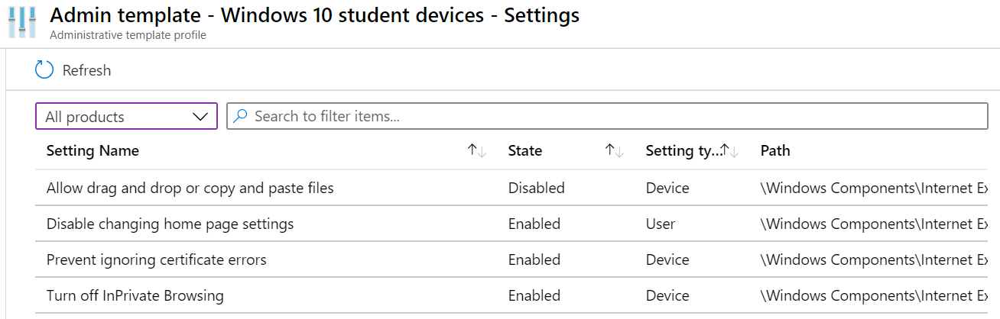

### Assign your template

1. In your template, select **Assignments**. You may have to close your template, and then select it from the **Devices - Configuration profiles** list:

    > [!div class="mx-imgBorder"]
    > 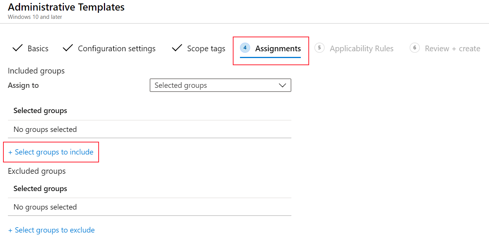

2. Choose **Select groups to include**. A list of existing users and groups is shown.
3. Select the **All Windows 10 student devices** group you created earlier > **Select**.

    If you're using this tutorial in a production environment, then consider adding groups that are empty. The goal is to practice assigning your template.

4. **Save** your changes.

As soon as the profile is saved, it applies to the devices when they check in with Intune. If the devices are connected to the internet, it can happen immediately. For more information on policy refresh times, see [How long does it take for devices to get a policy, profile, or app after they're assigned](device-profile-troubleshoot.md#how-long-does-it-take-for-devices-to-get-a-policy-profile-or-app-after-they-are-assigned).

When assigning strict or restrictive policies and profiles, don't lock yourself out. Consider creating a group that's excluded from your policies and profiles. The idea is to have access to troubleshoot. Monitor this group to confirm it's being used as intended.

### What did I just do?

In the Endpoint Manager admin center, you created an administrative template device configuration profile, and assigned this profile to a group you created.

## Create a OneDrive template

In this section, you create a OneDrive admin template In Intune to control some settings. These specific settings are chosen because they're commonly used by organizations.

1. Create another profile (**Devices** > **Configuration profiles** > **Create profile**).

2. Enter the following properties:

    - **Name**: Enter **Admin template - OneDrive policies that apply to all Windows 10 users**.
    - **Description**: Enter a description for the profile. This setting is optional, but recommended.
    - **Platform**: Select **Windows 10 and later**.
    - **Profile type**: Select **Administrative templates**.

3. Select **Create**.
4. Select **Office** from the drop-down list.
5. **Enable** the following settings. Be sure to select **OK** to save your changes.

    - **Silently sign in users to the OneDrive sync client with their Windows credentials**
    - **Use OneDrive Files On-Demand**
    - **Prevent users from syncing personal OneDrive accounts**

Your settings look similar to the following settings:

> [!div class="mx-imgBorder"]
> 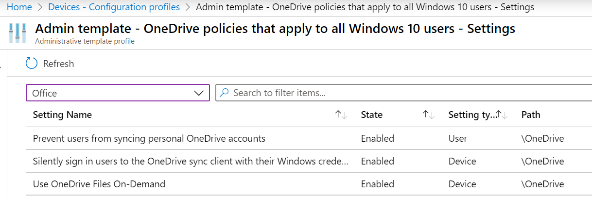

For more information on OneDrive client settings, see [Use Group Policy to control OneDrive sync client settings](https://docs.microsoft.com/onedrive/use-group-policy).

### Assign your template

1. In your template, select **Assignments**.
2. Choose **Select groups to include**. A list of existing users and groups is shown.
3. Select the **All Windows devices** group you created earlier > **Select**.

    If you're using this tutorial in a production environment, then consider adding groups that are empty. The goal is to practice assigning your template.

4. **Save** your changes.

At this point, you created some administrative templates, and assigned them to groups you created. The next step is to create an administrative template using Windows PowerShell and the Microsoft Graph API for Intune.

## Optional: Create a policy using PowerShell and Graph API

This section uses the following resources. We'll install these resources in this section.

- [Intune PowerShell SDK](https://github.com/microsoft/Intune-PowerShell-SDK)
- [Microsoft Graph API for Intune](https://docs.microsoft.com/graph/api/resources/intune-graph-overview?view=graph-rest-1.0)

1. On the **Admin computer**, open **Windows PowerShell** as administrator:

    1. In your search bar, enter **powershell**.
    2. Right-click **Windows PowerShell** > **Run as administrator**.

    > [!div class="mx-imgBorder"]
    > 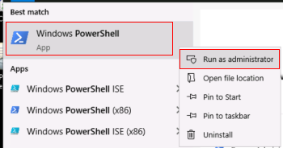

2. Get and set the execution policy.

    1. Enter: `get-ExecutionPolicy`

        Write down what it's set to, which may **Restricted**. When finished with the tutorial, set it back to its original value.

    2. Enter: `Set-ExecutionPolicy -ExecutionPolicy Unrestricted`

    3. Enter `Y` to change it.

    PowerShell's execution policy helps prevent executing malicious scripts. For more information, see [About Execution Policies](https://docs.microsoft.com/powershell/module/microsoft.powershell.core/about/about_execution_policies).

3. Enter: `Install-Module -Name Microsoft.Graph.Intune`

    Enter `Y` if:

    - Asked to install the NuGet provider
    - Asked to install the modules from an untrusted repo

    It can take several minutes to complete. When finished, a prompt similar to the following prompt is shown:

    > [!div class="mx-imgBorder"]
    > 

4. In your web browser, go to [https://github.com/Microsoft/Intune-PowerShell-SDK/releases](https://github.com/Microsoft/Intune-PowerShell-SDK/releases), and select the **Intune-PowerShell-SDK_v6.1907.00921.0001.zip** file.

    1. Select **Save as**, and select a folder you'll remember. `c:\psscripts` is a good choice.
    2. Open your folder, right-click the .zip file > **Extract all** > **Extract**. Your folder structure looks similar to the following folder:

        > [!div class="mx-imgBorder"]
        > 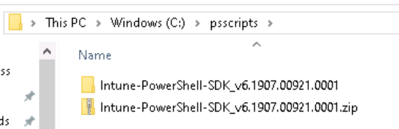

5. On the **View** tab, check **File name extensions**:

    > [!div class="mx-imgBorder"]
    > 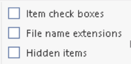

6. In your folder, and go to `c:\psscripts\Intune-PowerShell-SDK_v6.1907.00921.0001\drop\outputs\build\Release\net471`. Right-click every .dll > **Properties** > **Unblock**.

    > [!div class="mx-imgBorder"]
    > 

7. In your **Windows PowerShell** app, enter:

    ```powershell
    Import-Module c:\psscripts\Intune-PowerShell-SDK_v6.1907.00921.0001\drop\outputs\build\Release\net471\Microsoft.Graph.Intune.psd1
    ```

    Enter `R` if prompted to run from the untrusted publisher.

8. Intune administrative templates use the beta version of Graph:

    1. Enter: `Update-MSGraphEnvironment -SchemaVersion 'beta'`

    2. Enter: `Connect-MSGraph -AdminConsent`

    3. When prompted, sign in with the same Microsoft 365 administrator account. These cmdlets create the policy in your tenant organization.

        **User**: Enter the administrator account of your Microsoft 365 tenant subscription.  
        **Password**: Enter its password.

    4. Select **Accept**.

9. Create the **Test Configuration** configuration profile. Enter:

    ```powershell
    $configuration = Invoke-MSGraphRequest -Url https://graph.microsoft.com/beta/deviceManagement/groupPolicyConfigurations -Content '{"displayName":"Test Configuration","description":"A test configuration created through PS"}' -HttpMethod POST
    ```

    When these cmdlets succeed, the profile is created. To confirm, go to the Endpoint Manager admin center > **Configuration Profiles**. Your **Test Configuration** profile should be listed.

10. Get all the SettingDefinitions. Enter:

    ```powershell
    $settingDefinitions = Invoke-MSGraphRequest -Url https://graph.microsoft.com/beta/deviceManagement/groupPolicyDefinitions -HttpMethod GET
    ```

11. Find the definition ID using the setting display name. Enter:

    ```powershell
    $desiredSettingDefinition = $settingDefinitions.value | ? {$_.DisplayName -Match "Silently sign in users to the OneDrive sync client with their Windows credentials"}
    ```

12. Configure a setting. Enter:

    ```powershell
    $configuredSetting = Invoke-MSGraphRequest -Url "https://graph.microsoft.com/beta/deviceManagement/groupPolicyConfigurations('$($configuration.id)')/definitionValues" -Content ("{""enabled"":""true"",""configurationType"":""policy"",""definition@odata.bind"":""https://graph.microsoft.com/beta/deviceManagement/groupPolicyDefinitions('$($desiredSettingDefinition.id)')""}") -HttpMethod POST
    ```

    ```powershell
    Invoke-MSGraphRequest -Url "https://graph.microsoft.com/beta/deviceManagement/groupPolicyConfigurations('$($configuration.id)')/definitionValues('$($configuredSetting.id)')" -Content ("{""enabled"":""false""}") -HttpMethod PATCH
    ```

    ```powershell
    $configuredSetting = Invoke-MSGraphRequest -Url "https://graph.microsoft.com/beta/deviceManagement/groupPolicyConfigurations('$($configuration.id)')/definitionValues('$($configuredSetting.id)')" -HttpMethod GET
    ```

### See your policy

1. In the Endpoint Manager admin center > **Configuration Profiles** > **Refresh**.
2. Select your **Test Configuration** profile > **Settings**.
3. In the drop-down list, select **All products**.

You'll see the **Silently sign in users to the OneDrive sync client with their Windows credentials** setting is configured.

## Policy best practices

When creating policies and profiles in Intune, there are some recommendations and best practices to consider. For more information, see [policy and profile best practices](device-profile-create.md#recommendations).

## Clean up resources

When no longer needed, you can:

- Delete the groups you created:

  - **All Windows 10 student devices**
  - **All Windows devices**
  - **All Teachers**

- Delete the admin templates you created:

  - **Admin template - Windows 10 student devices**
  - **Admin template - OneDrive policies that apply to all Windows 10 users**
  - **Test Configuration**

- Set the Windows PowerShell execution policy back to its original value. The following example sets the execution policy to Restricted:

  ```powershell
  Set-ExecutionPolicy -ExecutionPolicy Restricted
  ```

## Next steps

In this tutorial, you got more familiar with the [Microsoft Endpoint Manager admin center](https://go.microsoft.com/fwlink/?linkid=2109431), used the query builder to create dynamic groups, and created administrative templates in Intune to configure [ADMX settings](https://docs.microsoft.com/windows/client-management/mdm/understanding-admx-backed-policies). You also compared using ADMX templates on-premises and in the cloud with Intune. As a bonus, you used PowerShell cmdlets to create an administrative template.

For more information on administrative templates in Intune, see:

> [!div class="nextstepaction"]
> [Use Windows 10 templates to configure group policy settings in Intune](administrative-templates-windows.md)
