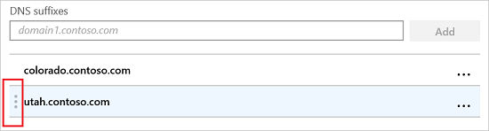

---
# required metadata

title: Windows 10/11 VPN settings in Microsoft Intune
description: Learn and read about all the available VPN settings in Microsoft Intune, what they're used for, and what they do. See the traffic rules, conditional access, and DNS and proxy settings for Windows 10/11 and Windows Holographic for Business devices.
keywords:
author: MandiOhlinger
ms.author: mandia
manager: dougeby
ms.date: 01/25/2022
ms.topic: conceptual
ms.service: microsoft-intune
ms.subservice: configuration
ms.localizationpriority: medium
ms.technology:

# optional metadata

#ROBOTS:
#audience:

ms.suite: ems
search.appverid: MET150
ms.reviewer: tycast
#ms.tgt_pltfrm:
ms.custom: intune-azure; seodec18
ms.collection: M365-identity-device-management
---

# Windows 10/11 and Windows Holographic device settings to add VPN connections using Intune

> [!NOTE]
> [!INCLUDE [not-all-settings-are-documented](../includes/not-all-settings-are-documented.md)]

You can add and configure VPN connections for devices using Microsoft Intune. This article describes some of the settings and features you can configure when creating virtual private networks (VPNs). These VPN settings are used in device configuration profiles, and then pushed or deployed to devices.

As part of your mobile device management (MDM) solution, use these settings to allow or disable features, including using a specific VPN vendor, enabling always on, using DNS, adding a proxy, and more.

These settings apply to devices running:

- Windows 10/11
- Windows Holographic for Business

## Before you begin

- [Deploy your VPN app](../apps/apps-add.md), and create a [Windows client VPN device configuration profile](vpn-settings-configure.md). The available settings depend on the VPN client app you choose. Some settings are only available for specific VPN clients.
- [!INCLUDE [partner-vpns](../includes/partner-vpns.md)]
- These settings use the [VPNv2 CSP](/windows/client-management/mdm/vpnv2-csp).

## User scope or Device scope

- **Use this VPN profile with a user/device scope**: Apply the profile to the user scope or the device scope:

  - **User scope**: The VPN profile is installed within the user's account on the device, such as `user@contoso.com`. If another user signs in to the device, the VPN profile isn't available.
  - **Device scope**: The VPN profile is installed in the device context, and applies to all users on the device.

Existing VPN profiles apply to their existing scope. By default, new VPN profiles are installed in the user scope *except* for the profiles with device tunnel enabled. VPN profiles with device tunnel enabled use the device scope.

## Connection type


- **Connection type**: Select the VPN connection type from the following list of vendors:

  - **Check Point Capsule VPN**
  - **Cisco AnyConnect**
  - **Citrix**
  - **F5 Access**
  - **Palo Alto Networks GlobalProtect**
  - **Pulse Secure**
  - **SonicWall Mobile Connect**
  - **Automatic (Native type)**
  - **IKEv2 (Native type)**
  - **L2TP (Native type)**
  - **PPTP (Native type)**

## Base VPN

The following settings are shown depending on the connection type you select. Not all settings are available for all connection types.

- **Connection name**: Enter a name for this connection. End users see this name when they browse their device for the list of available VPN connections. For example, enter `Contoso VPN`.
- **Servers**: Add one or more VPN servers that devices connect to. When you add a server, you enter the following information:

  - **Import**: Browse to a comma-separated file that includes a list of servers in the format: description, IP address or FQDN, Default server. Choose **OK** to import these servers into the **Servers** list.
  - **Export**: Exports the existing list of servers to a comma-separated-values (csv) file.
  - **Description**: Enter a descriptive name for the server, such as **Contoso VPN server**.
  - **VPN server address**: Enter the IP address or fully qualified domain name (FQDN) of the VPN server that devices connect to, such as **192.168.1.1** or **vpn.contoso.com**.
  - **Default server**: **True** enables this server as the default server that devices use to establish the connection. Set only one server as the default. **False** (default) doesn't use this VPN server as the default server.

- **Register IP addresses with internal DNS**: Select **Enable** to configure the VPN profile to dynamically register the IP addresses assigned to the VPN interface with the internal DNS. Select **Disable** to not dynamically register the IP addresses.

- **Always On**: **Enable** automatically connects to the VPN connection when the following events happen:
  - Users sign into their devices.
  - The network on the device changes.
  - The screen on the device turns back on after being turned off.

  To use device tunnel connections, such as IKEv2, **Enable** this setting.

  **Disable** doesn't automatically turn on the VPN connection. Users might have to turn on the VPN manually.

- **Authentication method**: Select how you want users to authenticate to the VPN server. Your options:

  - **Certificates**: Select an existing user client certificate profile to authenticate the user. This option provides enhanced features, such as zero-touch experience, on-demand VPN, and per-app VPN.

    To create certificate profiles in Intune, see [Use certificates for authentication](../protect/certificates-configure.md).  

  - **Username and password**: Require users to enter their domain username and password to authenticate, such as `user@contoso.com`, or `contoso\user`.

  - **Derived credential**: Use a certificate that's derived from a user's smart card. If no derived credential issuer is configured, Intune prompts you to add one. For more information, see [Use derived credentials in Intune](../protect/derived-credentials.md).

  - **EAP** (IKEv2 only): Select an existing Extensible Authentication Protocol (EAP) client certificate profile to authenticate. Enter the authentication parameters in the **EAP XML** setting.

    For more information on EAP authentication, see [Extensible Authentication Protocol (EAP) for network access](/windows-server/networking/technologies/extensible-authentication-protocol/network-access) and [EAP configuration](/windows/client-management/mdm/eap-configuration).

  - **Machine certificates** (IKEv2 only): Select an existing device client certificate profile to authenticate the device.

    If you use [device tunnel connections](/windows-server/remote/remote-access/vpn/vpn-device-tunnel-config), you must select **Machine certificates**.

    To create certificate profiles in Intune, see [Use certificates for authentication](../protect/certificates-configure.md).

- **Remember credentials at each logon**: **Enable** caches the authentication credentials. When set to **Not configured**, Intune doesn't change or update this setting. By default, the OS might not cache the authentication credentials.
- **Custom XML**: Enter any custom XML commands that configure the VPN connection.
- **EAP XML**: Enter any EAP XML commands that configure the VPN connection.

  For more information, including creating custom EAP XML, see [EAP configuration](/windows/client-management/mdm/eap-configuration).

- **Device tunnel** (IKEv2 only): **Enable** connects the device to the VPN automatically without any user interaction or sign in. This setting applies to devices joined to Azure Active Directory (AD).

  To use this feature, you must configure the following settings:

  - **Connection type**: Set to **IKEv2**.
  - **Always On**: Set to **Enable**.
  - **Authentication method**: Set to **Machine certificates**.

  Only assign one profile per device with **Device Tunnel** enabled.

### IKE Security Association Parameters (IKEv2 only)

These cryptography settings are used during IKE security association negotiations (also known as `main mode` or `phase 1`) for IKEv2 connections. These settings must match the VPN server settings. If the settings don't match, the VPN profile won't connect.

- **Encryption algorithm**: Select the encryption algorithm used on the VPN server. For example, if your VPN server uses AES 128 bit, then select **AES-128** from the list.

  When set to **Not configured**, Intune doesn't change or update this setting.

- **Integrity check algorithm**: Select the integrity algorithm used on the VPN server. For example, if your VPN server uses SHA1-96, then select **SHA1-96** from the list.

  When set to **Not configured**, Intune doesn't change or update this setting.

- **Diffie-Hellman group**: Select the Diffie-Hellman computation group used on the VPN server. For example, if your VPN server uses Group2 (1024 bits), then select **2** from the list.

  When set to **Not configured**, Intune doesn't change or update this setting.

### Child Security Association Parameters (IKEv2 only)

These cryptography settings are used during child security association negotiations (also known as `quick mode` or `phase 2`) for IKEv2 connections. These settings must match the VPN server settings. If the settings don't match, the VPN profile won't connect.

- **Cipher transform algorithm**: Select the algorithm used on the VPN server. For example, if your VPN server uses AES-CBC 128 bit, then select **CBC-AES-128** from the list.

  When set to **Not configured**, Intune doesn't change or update this setting.

- **Authentication transform algorithm**: Select the algorithm used on the VPN server. For example, if your VPN server uses AES-GCM 128 bit, then select **GCM-AES-128** from the list.

  When set to **Not configured**, Intune doesn't change or update this setting.

- **Perfect forward secrecy (PFS) group**: Select the Diffie-Hellman computation group used for perfect forward secrecy (PFS) on the VPN server. For example, if your VPN server uses Group2 (1024 bits), then select **2** from the list.

  When set to **Not configured**, Intune doesn't change or update this setting.

### Pulse Secure example

```xml
<pulse-schema><isSingleSignOnCredential>true</isSingleSignOnCredential></pulse-schema>
```

### F5 Edge Client example

```xml
<f5-vpn-conf><single-sign-on-credential /></f5-vpn-conf>
```

### SonicWALL Mobile Connect example

**Login group or domain**: This property can't be set in the VPN profile. Instead, Mobile Connect parses this value when the user name and domain are entered in the `username@domain` or `DOMAIN\username` formats.

Example:

```xml
<MobileConnect><Compression>false</Compression><debugLogging>True</debugLogging><packetCapture>False</packetCapture></MobileConnect>
```

### CheckPoint Mobile VPN example

```xml
<CheckPointVPN port="443" name="CheckPointSelfhost" sso="true" debug="3" />
```

> [!TIP]
> For more information about writing custom XML commands, see the manufacturer's VPN documentation.

## Apps and Traffic Rules

- **Associate WIP or apps with this VPN**: Enable this setting if you only want some apps to use the VPN connection. Your options:

  - **Not configured** (default): Intune doesn't change or update this setting.
  - **Associate a WIP with this connection**: All apps in the Windows Identity Protection domain automatically use the VPN connection.
    - **WIP domain for this connection**: Enter a Windows Identity Protection (WIP) domain. For example, enter `contoso.com`.
  - **Associate apps with this connection**: The apps you enter automatically use the VPN connection.
    - **Restrict VPN connection to these apps**: **Disable** (default) allows all apps to use the VPN connection. **Enable** restricts the VPN connection to the apps you enter (per-app VPN). Traffic rules for the apps you add are automatically added to the **Network traffic rules for this VPN connection** setting.

      When you select **Enable**, the app identifier list becomes read-only. Before you enable this setting, add your associated apps.

    - **Associated Apps**: Select **Import** to import a `.csv` file with your list of apps. Your `.csv` looks similar to the following file:

      ```csv
      %windir%\system32\notepad.exe,desktop
      Microsoft.Office.OneNote_8wekyb3d8bbwe,universal
      ```

      The type of app determines the app identifier. For a universal app, enter the package family name, such as `Microsoft.Office.OneNote_8wekyb3d8bbwe`. For a desktop app, enter the file path of the app, such as `%windir%\system32\notepad.exe`.

      To get the package family name, you can use the `Get-AppxPackage` Windows PowerShell cmdlet. For example, to get the OneNote package family name, open Windows PowerShell, and enter `Get-AppxPackage *OneNote`. For more information, see [Find a PFN for an app that's installed on a Windows client computer](../../configmgr/protect/deploy-use/find-a-pfn-for-per-app-vpn.md#find-a-pfn-for-an-app-thats-installed-on-a-windows-10-computer) and [Get-AppxPackage cmdlet](/powershell/module/appx/get-appxpackage?view=windowsserver2019-ps).

  > [!IMPORTANT]
  > We recommend that you secure all app lists created for per-app VPNs. If an unauthorized user changes this list, and you import it into the per-app VPN app list, then you potentially authorize VPN access to apps that shouldn't have access. One way you can secure app lists is using an access control list (ACL).

- **Network traffic rules for this VPN connection**: Select the protocols, and the local & remote port and address ranges, are enabled for the VPN connection. If you don't create a network traffic rule, then all protocols, ports, and address ranges are enabled. After you create a rule, the VPN connection uses only the protocols, ports, and address ranges that you enter in that rule.

## Conditional Access

- **Conditional Access for this VPN connection**: Enables device compliance flow from the client. When enabled, the VPN client communicates with Azure Active Directory (AD) to get a certificate to use for authentication. The VPN should be set up to use certificate authentication, and the VPN server must trust the server returned by Azure AD.

- **Single sign-on (SSO) with alternate certificate**: For device compliance, use a certificate different from the VPN authentication certificate for Kerberos authentication. Enter the certificate with the following settings:

  - **Name**: Name for extended key usage (EKU)
  - **Object Identifier**: Object identifier for EKU
  - **Issuer hash**: Thumbprint for SSO certificate

## DNS Settings

- **DNS suffix search list**: In **DNS suffixes**, enter a DNS suffix, and **Add**. You can add many suffixes.

  When using DNS suffixes, you can search for a network resource using its short name, instead of the fully qualified domain name (FQDN). When searching using the short name, the suffix is automatically determined by the DNS server. For example, `utah.contoso.com` is in the DNS suffix list. You ping `DEV-comp`. In this scenario, it resolves to `DEV-comp.utah.contoso.com`.

  DNS suffixes are resolved in the order listed, and the order can be changed. For example, `colorado.contoso.com` and `utah.contoso.com` are in the DNS suffix list, and both have a resource called `DEV-comp`. Since `colorado.contoso.com` is first in the list, it resolves as `DEV-comp.colorado.contoso.com`.
  
  To change the order, select the dots to the left of the DNS suffix, and then drag the suffix to the top:

  

- **Name Resolution Policy table (NRPT) rules**: Name Resolution Policy table (NRPT) rules define how DNS resolves names when connected to the VPN. After the VPN connection is established, you choose which DNS servers the VPN connection uses.

  You can add rules that include the domain, DNS server, proxy, and other details. These rules resolve the domain you enter. The VPN connection uses these rules when users connect to the domains you enter.

  Select **Add** to add a new rule. For each server, enter:

  - **Domain**: Enter the fully qualified domain name (FQDN) or a DNS suffix to apply the rule. You can also enter a period (.) at the beginning for a DNS suffix. For example, enter `contoso.com` or `.allcontososubdomains.com`.
  - **DNS servers**: Enter the IP address or DNS server that resolves the domain. For example, enter `10.0.0.3` or `vpn.contoso.com`.
  - **Proxy**: Enter the web proxy server that resolves the domain. For example, enter `http://proxy.com`.
  - **Automatically connect**: When **Enabled**, the device automatically connects to the VPN when a device connects to a domain you enter, such as `contoso.com`. When **Not configured** (default), the device doesn't automatically connect to the VPN
  - **Persistent**: When set to **Enabled**, the rule stays in the Name Resolution Policy table (NRPT) until the rule is manually removed from the device, even after the VPN disconnects. When set to **Not configured** (default), NRPT rules in the VPN profile are removed from the device when the VPN disconnects.

## Proxy

- **Automatic configuration script**: Use a file to configure the proxy server. Enter the proxy server URL that includes the configuration file. For example, enter `http://proxy.contoso.com/pac`.
- **Address**: Enter the IP address or fully qualified host name of the proxy server. For example, enter `10.0.0.3` or `vpn.contoso.com`.
- **Port number**: Enter the port number used by your proxy server. For example, enter `8080`.
- **Bypass proxy for local addresses**: This setting applies if your VPN server requires a proxy server for the connection. If you don't want to use a proxy server for local addresses, then choose **Enable**.

## Split Tunneling

- **Split tunneling**: **Enable** or **Disable** to let devices decide which connection to use depending on the traffic. For example, a user in a hotel uses the VPN connection to access work files, but uses the hotel's standard network for regular web browsing.
- **Split tunneling routes for this VPN connection**: Add optional routes for third-party VPN providers. Enter a destination prefix, and a prefix size for each connection.

## Trusted Network Detection

**Trusted network DNS suffixes**: When users are already connected to a trusted network, you can prevent devices from automatically connecting to other VPN connections.

In **DNS suffixes**, enter a DNS suffix that you want to trust, such as contoso.com, and select **Add**. You can add as many suffixes as you want.

If a user is connected to a DNS suffix in the list, then the user won't automatically connect to another VPN connection. The user continues to use the trusted list of DNS suffixes you enter. The trusted network is still used, even if any autotriggers are set.

For example, if the user is already connected to a trusted DNS suffix, then the following autotriggers are ignored. Specifically, the DNS suffixes in the list cancel all other connection autotriggers, including:

- Always on
- App-based trigger
- DNS autotrigger

## Next steps

The profile is created, but may not be doing anything yet. Be sure to [assign the profile](device-profile-assign.md), and [monitor its status](device-profile-monitor.md).

Configure VPN settings on [Android](vpn-settings-android.md), [iOS/iPadOS](vpn-settings-ios.md), and [macOS](vpn-settings-macos.md) devices.
