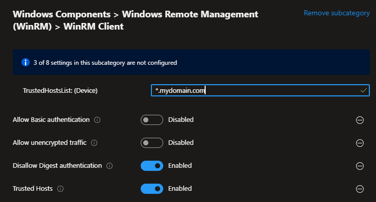

---
# required metadata

title: Windows Remote Management on Entra ID joined devices
description: This article describes how to enable and configure the WinRM service on clients that are Entra ID joined only.
author: niklasrast
ms.author: niklasrast
manager: [ALIAS]
ms.date: 04/25/2024
ms.topic: reference
ms.service: microsoft-intune
ms.subservice: configuration
ms.localizationpriority: medium

# optional metadata

#ROBOTS:
#audience:
#ms.devlang:
#ms.reviewer: [ALIAS]
#ms.suite: ems
#ms.tgt_pltfrm:
#ms.custom:

---

# Windows Remote Management on Entra ID joined devices

Windows Remote Management can be used to manage Windows devices remotely from PowerShell. In an legacy active directory environment this could be implemented using gpo. But in an Intune and Entra ID environment it is a bit different as we dont have Kerberos for Authentication and other legacy methods.

## Configuration
First of all create a new settings catalog profile which will include our WinRM configuration for Intune managed Windows endpoints that are only Entra ID joined.

Search for "WinRM Service" within the settings catalog and add the following settings:

| Setting name | state |
|-|-|
| Allow Basic authentication | disabled |
| Allow remote server management through WinRM | enabled |
| IPv4 filter (Device) | * |
| IPv6 filter (Device) | * |
| Allow unencrypted traffic | disabled |
| Disallow WinRM from storing RunAs credentials | enabled |
| Specify channel binding token hardening level | enabled |
| Hardening level (Device) | Relaxed |
| Turn On Compatibility HTTP Listener | disabled |
| Turn On Compatibility HTTPS Listener | disabled |

  

Next search for "WinRM Client" to define the client settings in our WinRM configuration. Add the following settings to your configuration:

| Setting name | state |
|-|-|
| Allow Basic authentication (Device) | enabled |
| Allow unencrypted traffic | disabled |
| Disallow Digest authentication | enabled |
| Trusted Hosts | enabled |
| TrustedHostsList: (Device) | "*" or "*.mydomain.com" or "List of Hostnames" -> whatever fits your environment best |

  

When you want to use your domain you need to add a DNS suffix. To configure this simply search for "DNS Client" and add "DNS Suffices (Device)" from the Network section your your settings catalog configuration:

 

## Enabling the WinRM service
Now that we have configured the WinRM service and client we need to ensure that the service will be started on the device. As there currently is not native option to enable service we will make use of Intune Remediations to enable the service.

Use the following detection and remediation script within your Intune Remediation.

### Detection

```powershell
$service = Get-Service -Name WinRM -ErrorAction Stop
$service_running = $service.Status -eq 4
$service_autostart = $service.StartType -eq 2
$trusted_hosts = ((Get-ItemProperty -Path HKLM:\SOFTWARE\Microsoft\Windows\CurrentVersion\WSMAN\Client).trusted_hosts) -ne ""
$spnprefix = ((Get-ItemProperty -Path HKLM:\SOFTWARE\Microsoft\Windows\CurrentVersion\WSMAN\Client).spn_prefix) -eq "WSMAN"
 
if ($service_running -and $service_autostart -and $trusted_hosts -and $spnprefix) {
    exit 0
} else {
    exit 1
}
```

### Remediation

```powershell
$http_listener_exists = $null -ne $(Get-ChildItem -Path WSMan:\localhost\Listener\ -Force | Where-Object Keys -match "http")
 
$wsman_params = @{
    ResourceURI = "winrm/config/Listener"
    SelectorSet = @{Transport = 'HTTP'; Address = '*'}
}
 
Set-Service -Name WinRM -StartupType Automatic -PassThru -ErrorAction Stop | Start-Service -ErrorAction Stop
 
if ($http_listener_exists) {
    Set-WSManInstance @wsman_params -ErrorAction Stop | Out-Null
} else {
    New-WSManInstance @wsman_params -ErrorAction Stop | Out-Null
}
 
New-ItemProperty -Path "HKLM:\SOFTWARE\Microsoft\Windows\CurrentVersion\WSMAN\Client" -Name "spn_prefix" -PropertyType String -Value "WSMAN" -Force
```

### Important

> [!IMPORTANT]
> The spn_prefix is required on Entra ID joined devices. If not configured the connection will fail with "Access denied".

## Configuring Windows Firewall
Lastly it is required to create a local Windows Firewall rule that allows the traffic for WinRM on the device. So you need to create a Windows Firewall rule that configures:

| Setting name | state |
|-|-|
| Direction | Inbound |
| Action | Allow |
| Protocol | TCP |
| Local Ports | 5985 (or 5986 for HTTPS) |
| Remote Ports | Any |

 


## Connecting to an Entra ID joined device using WinRM
Once everything is configured and applied on an Intune managed Windows client you will be able to connect trough PowerShell using WinRM to a device.

Simply use the following command and replace "RemoteHostName.mydomain.com" with the FQDN of the device and use your UPN instead of "EntraIDUser@EntraIDDomain.com".

### Important

> [!IMPORTANT]
> The UPN that wants to connect to a device needs to be member of the "Remote Management Users" or "Administrators" on the client.

```powershell
Enter-PSSession -ComputerName RemoteHostName.mydomain.com -Credential EntraIDUser@EntraIDDomain.com
```