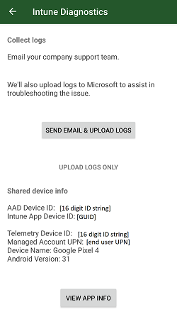

---
# required metadata

title: Microsoft Intune App SDK for Android developer integration and testing guide - MAM integration essentials 
description: Understand MAM integration essentials to incorporate Intune mobile app management (MAM) into your Android app.
keywords: SDK
author: Erikre
ms.author: erikre
manager: dougeby
ms.date: 08/07/2024
ms.topic: reference
ms.service: microsoft-intune
ms.subservice: developer
ms.localizationpriority: medium
ms.assetid: 0100e1b5-5edd-4541-95f1-aec301fb96af

# optional metadata

#ROBOTS:
#audience:

ms.reviewer: jamiesil
ms.suite: ems
search.appverid: MET150
#ms.tgt_pltfrm:
ms.collection:
- tier2
- M365-identity-device-management
- Android
ms.custom: intune-classic
---

# Intune App SDK for Android - MAM integration essentials

The Microsoft Intune App SDK for Android lets you incorporate Intune app protection policies (also known as **APP** or MAM policies) into your native Java/Kotlin Android app. An Intune-managed application is one that is integrated with the Intune App SDK. Intune administrators can easily deploy app protection policies to your Intune-managed app when Intune actively manages the app.

> [!NOTE]
> This guide is divided into several distinct stages. Start by reviewing [Stage 1: Plan the Integration].

## Stage 4: MAM Integration Essentials

## Stage Goals

- Enable MAM Strict Mode.
- Register for critical notifications from the SDK.
- Implement and register an authentication callback to provide Microsoft Entra tokens from MSAL to the SDK.
- Register new accounts for MAM management after authenticating with MSAL.
- Unregister accounts on log-out to remove corporate data.
- (Recommended) Incorporate MAM logging into your app.
- (Recommended) Learn how to use the SDK diagnostic dialog.

## Background

Now that you have the Intune App SDK downloaded, integrated into your build, and successfully performing class and method replacements, it's time to make the essential code changes to start enforcing app protection policy settings for MAM-protected accounts.

This stage instructs you on how to hook into the SDK's logging, invoke a diagnostics dialog, enable MAM Strict Mode to identify possible integration bugs, register for notifications from the SDK, and most importantly, how to register an account for Intune MAM to start receiving policy.

## MAM Strict Mode

MAM Strict Mode can identify potential bugs in your application's integration of the Intune App SDK.
These integration bugs may result in failures to properly apply app protection policy and leave corporate data unprotected.
As a result, usage of MAM Strict Mode is *required*.

MAM Strict Mode looks for anomalies in your application's usage of MAM APIs and MAM-restricted platform APIs.
Loosely patterned after Android's StrictMode, MAM Strict Mode runs a predefined set of checks that raise runtime errors when they fail.
MAM Strict Mode isn't intended to be left enabled in production builds; instead, use it in your app's internal development, debug, and/or dogfood builds.

To enable MAM Strict Mode, call the following method early in application initialization (for example, `Application.onCreate`):

```java
MAMStrictMode.enable();
```

When a MAM Strict Mode check fails, try to determine whether it's a
real issue that can be fixed in your app or a false positive.
If you believe it's a false positive or you aren't sure, let the
Intune MAM team know.
This will allow us to make sure we agree with the false positive determination and to attempt to improve detection for future releases.
To suppress false positives, disable the failing check following the instructions below.

### Handling Violations

When a check fails, it runs a [MAMStrictViolationHandler].
The default handler throws an `Error`, which is expected to crash the app.
This is to make failures as noisy as possible and fits with the intention that strict mode shouldn't be enabled in production builds.

If your app would like to handle violations differently, it can supply its own handler by calling the following method where `handler` implements `MAMStrictViolationHandler`:

```java
MAMStrictMode.global().setHandler(handler);
```

### Suppressing Checks

If a check fails in a situation where your app is doing nothing
incorrect, report it as mentioned above.
In the meantime, it may be necessary to disable the check encountering a false positive, at least while waiting for an updated SDK.
The check, which failed will be shown in the error raised by the default handler, or will be passed to a custom handler if set.

Although suppressions can be done globally, temporarily disabling per-thread at the specific call site is preferred.
The following examples show various ways to disable [MAMStrictCheck.IDENTITY_NO_SUCH_FILE][MAMStrictCheck] (raised if an
attempt is made to protect a file which doesn't exist).

#### Per-Thread Temporary Suppression

This is the preferred suppression mechanism.

```java
try (StrictScopedDisable disable = MAMStrictMode.thread().disableScoped(MAMStrictCheck.IDENTITY_NO_SUCH_FILE)) {
    // Perform the operation which raised a violation here
}
// The check is no longer disabled once the block exits
```

#### Per-Thread Permanent Suppression

```java
MAMStrictMode.thread().disable(MAMStrictCheck.IDENTITY_NO_SUCH_FILE);
```

#### Global (Process-Wide) Suppression

```java
MAMStrictMode.global().disable(MAMStrictCheck.IDENTITY_NO_SUCH_FILE);
```

## Register for notifications from the SDK

The Intune App SDK issues many different types of notifications to inform applications of time-sensitive management operations.
Your application can register for, and take action when receiving, any of these notifications.

For example, whenever an IT administrator issues a selective wipe command for a device, the Intune service sends down a notification to the SDK, which is passed along to your application as `WIPE_USER_DATA`.
Your application can listen for this notification and control what data is wiped; or it can rely on the SDK's default wipe behavior.

Many of the notifications are optional.
Depending on the SDK features your application uses, some notifications may be required.
See [Register for Notifications from the SDK] in [Stage 7: App Participation Features] for details on how to register for notifications, which notifications the SDK delivers, and how to handle specific notification types.

## Registering for App Protection Policy

When admins create App Protection Policies, they target these policies to specific accounts in their organization.
On the client, the SDK needs to know which account is using the application so it can retrieve that account's policy and enforce the settings appropriately.
Your app is responsible for providing the SDK with this account information.
This process is called registration.

Whenever your app adds a new account, it must register the account with the SDK, even if other accounts are already registered.
Your app can register multiple accounts.
However, currently only one account can be enrolled, or have app protection policy applied.
On Android, this single-managed-account limitation is device-wide.

### Registration vs Enrollment

**Registration** is the process where your app informs the SDK that a new account is in use.
The SDK contains functions your app must call for registering and unregistering accounts.

**Enrollment** is the process where the SDK records the registered account with the Intune service so it can apply the account's policy.
Your app doesn't need to call any functions for enrollment.
The SDK fully handles enrollment after an account is registered.

If one account is already enrolled for your application, when it registers another account, even if that account is targeted with App Protection Policies, that second account won't be enrolled and policy won't be applied.

> [!NOTE]
> The term "enrollment" can also refer to device-wide MDM enrollment
> Learn more in the Appendix at [MDM and MAM enrollment].

### Implementing registration

> [!CAUTION]
> If your app doesn't integrate MSAL (strongly recommended), see [Default Enrollment] in the [Appendix] instead of continuing this section.

Your app must make three code changes to successfully register an account:

1. The app *must* implement and register an instance of the [MAMServiceAuthenticationCallback] or [MAMServiceAuthenticationCallbackExtended] interface. The callback instance must be registered in the `onCreate()` (or `onMAMCreate()`) method of the Application subclass.

2. When an account is created and the user successfully signs in with MSAL, the app *must* call [registerAccountForMAM].

3. When an account is removed, the app should call [unregisterAccountForMAM] to remove the account from Intune management.

    > [!CAUTION]
    > The call may initiate a wipe to completely remove corporate data for the account.

All the necessary authentication and registration APIs can be found in the [MAMEnrollmentManager] interface.
A reference to the `MAMEnrollmentManager` can be obtained as follows:

```java
MAMEnrollmentManager mgr = MAMComponents.get(MAMEnrollmentManager.class);

// make use of mgr
```

The `MAMEnrollmentManager` instance returned is guaranteed not to be null.
The API methods fall into two categories: **authentication** and **account registration**.

### MAMEnrollmentManager and Authentication

The SDK frequently communicates with the Intune service: for enrolling registered accounts, for getting updates to App Protection Policy settings, and for getting pending admin actions, like selectively wiping protected data inside your app.
To successfully communicate with the Intune service, the SDK requires fresh access tokens from apps that have integrated MSAL.

If the SDK isn't able to retrieve a fresh token, it will not be able to communicate with the Intune service, which can delay retrieval and enforcement of new policy settings or admin actions.
It's critical that your app completes these steps to ensure seamless enforcement of policy.

In Stage 2, you integrated MSAL into your application for authentication and acquiring access tokens.
Here, you implement an authentication callback to allow the SDK to request necessary tokens.

[MAMEnrollmentManager] has the following authentication methods:

```java
interface MAMServiceAuthenticationCallback {
    String acquireToken(String upn, String aadId, String resourceId);
}
interface MAMServiceAuthenticationCallbackExtended extends MAMServiceAuthenticationCallback {
    String acquireToken(String upn, String aadId, String tenantId, String authority, String resourceId);
}
void registerAuthenticationCallback(MAMServiceAuthenticationCallback callback);
void updateToken(String upn, String aadId, String resourceId, String token);
```

> [!NOTE]
> The `aadId` parameter in these methods refers to the Microsoft Entra User ID, formerly known as AAD ID and also known as OID.

1. The app must implement the [MAMServiceAuthenticationCallback] interface or the [MAMServiceAuthenticationCallbackExtended] interface to allow the SDK to request a Microsoft Entra token for the given account and resource ID. The callback instance must be provided to the `MAMEnrollmentManager` by calling its [registerAuthenticationCallback] method. A token may be needed early in the app lifecycle for enrollment retries or app protection policy refresh check-ins, so the callback must be registered in the `onCreate()` (or `onMAMCreate()`) method of the app's `Application` subclass.

2. The `acquireToken` method should acquire the access token for the requested resource ID for the given account. If it can't acquire the requested token, it should return null.

    > [!TIP]
    > Ensure that your app utilizes the `resourceId` and the `aadId` parameters passed to `acquireToken()`
    > so that the correct token is acquired. The `upn` parameter is for informational use only; it should not be used to identify an account without also considering the `aadId`.
    > The `resourceId` should be used to generate the proper scopes and the `aadId` should be used
    > to pass along the correct account.
    > If tokens are returned for the wrong account and/or wrong resource, they could cause delays or failures in enrolling the app and retrieving policies.
    > If your app needs the Microsoft Entra Authority to acquire the token correctly, implement the `MAMServiceAuthenticationCallbackExtended` interface.

    ```java
    class MAMAuthCallback implements MAMServiceAuthenticationCallbackExtended {
        public String acquireToken(String upn, String aadId,
                    String tenantId, String authority, String resourceId) {
            final String[] scopes = {resourceId + "/.default"};

            final IAccount account = getAccount(aadId);
            if (account == null) {
                // Log error or warning here about: "no account found for " + aadId
                return null;
            }

            AcquireTokenSilentParameters params =
                new AcquireTokenSilentParameters.Builder()
                        .forAccount(account)
                        .fromAuthority(account.getAuthority())
                        .withScopes(Arrays.asList(scopes))
                        .withCallback(callback)
                        .build();

            return mMsalClientApplication.acquireTokenSilent(params);
        }

        private static IAccount getAccount(String aadId) throws InterruptedException, MsalException {
          IAccount account = null;

          if (mMsalClientApplication instanceof IMultipleAccountPublicClientApplication) {
              IMultipleAccountPublicClientApplication multiAccountPCA =
                      (IMultipleAccountPublicClientApplication) mMsalClientApplication;

              account = multiAccountPCA.getAccount(aadId);
          } else {
              ISingleAccountPublicClientApplication singleAccountPCA =
                      (ISingleAccountPublicClientApplication) mMsalClientApplication;

              ICurrentAccountResult accountResult = singleAccountPCA.getCurrentAccount();
              if (accountResult != null) {
                  account = accountResult.getCurrentAccount();
                  // make sure this is the correct user
                  if (account != null && !account.getId().equals(aadId))
                      account = null;
              }
          }
          return account;
      }
    }
    ```

3. In case the app is unable to provide a token when the SDK calls `acquireToken()`  -- for example, if silent authentication fails and it is an inconvenient time to show a UI -- the app can provide a token at a later time by calling the [updateToken] method. The same UPN, Microsoft Entra ID, and resource ID that were requested by the prior call to `acquireToken()` must be passed to `updateToken()`, along with the token that was finally acquired. The `upn` parameter is for informational purposes only and is generally ignored by the MAM SDK. The app should call this method as soon as possible after returning null from the provided callback.

    > [!WARNING]
    > Do not call `updateToken()` from within your implementation of `acquireToken()`. `updateToken()` should be used in the case where `acquireToken()` is unable to acquire a token.

    > [!NOTE]
    > The SDK will call `acquireToken()` periodically to get the token, so calling `updateToken()` is not strictly required.
    > However, it is strongly recommended as it can help enrollments and app protection policy check-ins complete in a timely manner.

#### Authentication Implementation Notes

- Apps are encouraged to acquire Microsoft Entra tokens **prior to** calling [registerAccountForMAM].
After registering an account, apps will receive a callback to the registered `MAMServiceAuthenticationCallback`'s `acquireToken()` method on a different thread.
Providing a valid token in that callback allows enrollment to proceed.
The app gets the enrollment result via notification.

- If the app doesn't return a valid Microsoft Entra token, the final result from the enrollment attempt will be `AUTHORIZATION_NEEDED`.
If the app receives this Result via notification, it's recommended to expedite the enrollment process by acquiring the token for the account and resource previously requested from [acquireToken] and calling the [updateToken] method to initiate the enrollment process again.

- The app's registered `MAMServiceAuthenticationCallback` will also be called to acquire a token for periodic app protection policy refresh check-ins.
If the app is unable to provide a token when requested, it will not get a notification, but it should attempt to acquire a token and call `updateToken()` at the next convenient time to expedite the check-in process.
If a token isn't provided, the callback may still be called at the next check-in attempt.

- Support for sovereign clouds requires providing the authority.

- If `MAMServiceAuthenticationCallbackExtended` interface is implemented, the inherited `acquireToken()` method from `MAMServiceAuthenticationCallback` does not need to be implemented, as the `MAMServiceAuthenticationCallbackExtended` interface provides a default implementation.

### MAMEnrollmentManager and Registration

Whenever the app adds an account, it must register the account with the SDK.
Likewise, whenever the app removes an account, it should unregister that account to indicate that the app should no longer apply policy for that account.
If the account was enrolled in the MAM service, the account is unenrolled and the app will be wiped.

[MAMEnrollmentManager] has the following account registration methods:

```java
void registerAccountForMAM(String upn, String aadId, String tenantId);
void registerAccountForMAM(String upn, String aadId, String tenantId, String authority);
void unregisterAccountForMAM(String upn, String aadId);
Result getRegisteredAccountStatus(String upn, String aadId);
```

1. To register an account for management, the app should call `registerAccountForMAM()`.
An account is identified by both its UPN and its Microsoft Entra user ID.
The tenant ID is also required to associate enrollment data with the account's Microsoft Entra tenant.
The account's authority may also be provided to allow enrollment against specific sovereign clouds; for more information, see [Sovereign Cloud Registration](#sovereign-cloud-registration).
The SDK may attempt to enroll the app for the given account in the MAM service; if enrollment fails, it will periodically retry enrollment until enrollment succeeds or the account is unregistered.
The retry period will typically be 12-24 hours.
The SDK provides the status of enrollment attempts asynchronously via notifications.

2. The best time to call `registerAccountForMAM` is after the user has signed into the app and is successfully authenticated using MSAL.
The account's Microsoft Entra user ID, tenant ID and authority are returned from the MSAL authentication call as part of the [`IAccount`] related to the [`IAuthenticationResult`].
    - The account comes from the `IAuthenticationResult.getAccount()` method and contains the pertinent account information.
    - The AAD ID (also known as Microsoft Entra ID or OID) comes from the `IAccount.getId()` method.
    - The tenant ID comes from the `IAccount.getTenantId()` method.
    - The authority comes from the `IAccount.getAuthority()` method.

3. To unregister an account from Intune management, the app should call `unregisterAccountForMAM()`.
If the account has been successfully enrolled and is managed, the SDK unenrolls the account and wipe its data.
Periodic enrollment retries for the account will be stopped.
The SDK provides the status of unenrollment requests asynchronously via notification.

#### Registration Implementation Notes

- The registration methods are idempotent.
For example, [registerAccountForMAM] will only register an account and attempt to enroll the app if the account isn't already registered, and [unregisterAccountForMAM] will only unregister an account if it's currently registered.
Subsequent calls are no-ops, so there's no harm in calling these methods more than once.

- There's no guarantee that every register/unregister call has a corresponding result notification.
For example, if `registerAccountForMAM()` is called for an account that is already registered, the notification may not be sent again for that identity.
Alternately, the SDK may send notifications even when your app didn't call these methods, since the SDK may periodically attempt enrollments in the background, and unenrollments may be triggered by wipe requests received from the Intune service.

- The registration methods can be called for any number of different accounts, but currently only one account can become successfully enrolled.
If multiple accounts that are licensed for Intune and targeted with app protection policy are registered at or near the same time, there's no guarantee on which one will win the race.

- You can query [MAMEnrollmentManager] to see if a particular account is registered and to get its current status using the [getRegisteredAccountStatus] method.
If the provided account isn't registered, this method returns **null**.
If the account is registered, this method returns the account's status as one of the members of the [MAMEnrollmentManager.Result] enumeration.

### Sovereign Cloud Registration

Azure supports multiple physically isolated clouds, known as Sovereign or National Clouds.
If your application is [sovereign cloud aware], it **must** provide the `authority` parameter to `registerAccountForMAM()`.

#### MSAL Guidance

For MSAL, set `multiple_clouds_supported` to `true` in the [MSAL configuration file].

``` json
{
  "multiple_clouds_supported": true,
}
```

### Registration Result and status codes

When an account is first registered, it begins in the `PENDING` state, indicating that the initial MAM service enrollment attempt is incomplete.
After the enrollment attempt finishes, a notification will be sent with one of the Result codes in the table below.
In addition, the [getRegisteredAccountStatus] method returns the account's status so the app can always determine if that account has app protection policies enforced.
If the enrollment attempt fails, the account's status may change over time as the SDK retries enrollment in the background.

| Result code | Explanation |
| -- | -- |
| `AUTHORIZATION_NEEDED` | This result indicates that a token wasn't provided by the app's registered [MAMServiceAuthenticationCallback] instance, or the provided token was invalid.  The app should acquire a valid token and call [updateToken] if possible. |
| `NOT_LICENSED` | The account isn't licensed for Intune, or the attempt to contact the Intune MAM service failed.  The app should continue in an unmanaged (normal) state and the user shouldn't be blocked.  Enrollments will be retried periodically in case the account becomes licensed in the future. |
| `ENROLLMENT_SUCCEEDED` | The enrollment attempt succeeded, or the account is already enrolled.  In the case of a successful enrollment, a policy refresh notification is sent before this notification.  Access to corporate data should be allowed. |
| `ENROLLMENT_FAILED` | The enrollment attempt failed.  Further details can be found in the device logs.  The app shouldn't allow access to corporate data in this state, since it was previously determined that the account is licensed for Intune. All apps should ensure that corporate data access is unauthorized, until `ENROLLMENT_SUCCEEDED` is obtained by your app.|
| `WRONG_USER` | Only one account per device can enroll an app with the MAM service. This result indicates that the account for whom this result was delivered (the second account) is targeted with MAM policy, but a different account is already enrolled. Because MAM policy can't be enforced for the second account, your app must not allow access to this account's data (possibly by removing the account from your app) unless/until enrollment for this account succeeds at a later time. Concurrent with delivering this `WRONG_USER` result, MAM prompts with the option to remove the existing account. If the human user answers in the affirmative, it will indeed be possible to enroll the second account a short time later. As long as the second account remains registered, MAM retries enrollment periodically. |
| `UNENROLLMENT_SUCCEEDED` | Unenrollment was successful.|
| `UNENROLLMENT_FAILED` | The unenrollment request failed.  Further details can be found in the device logs. In general, this won't occur as long as the app passes a valid (neither null nor empty) UPN. There's no direct, reliable remediation the app can take. If this value is received when unregistering a valid UPN, report as a bug to the Intune MAM team.|
| `PENDING` | The initial enrollment attempt for the account is in progress.  The app can block access to corporate data until the enrollment result is known, but isn't required to do so. |
| `COMPANY_PORTAL_REQUIRED` | The account is licensed for Intune, but the app can't be enrolled until the Company Portal app is installed on the device. The Intune App SDK attempts to block access to the app for the given account and direct them to install the Company Portal app. When sending this notification to the app, the Intune App SDK will show a nonblocking UI on top of the current Activity if the Activity is currently visible to the user or the next time `onResume` is called. If the user cancels out this nonblocking UI, the Intune App SDK will show a blocking UI the next time `onCreate` is called for an Activity and the current identity is managed (see below for details on troubleshooting). |

## (Recommended) Logging

Logging should be initialized early to get the most value out of logged data.
`Application.onMAMCreate()` is typically the best place to initialize logging.

To receive MAM logs in your app, create a [Java Handler](https://docs.oracle.com/javase/7/docs/api/java/util/logging/Handler.html) and add it to the [MAMLogHandlerWrapper].
This invokes `publish()` on the application handler for every log message.

```java
/**
 * Global log handler that enables fine grained PII filtering within MAM logs.  
 * To start using this you should build your own log handler and add it via
 * MAMComponents.get(MAMLogHandlerWrapper.class).addHandler(myHandler, false);  
 * You may also remove the handler entirely via
 * MAMComponents.get(MAMLogHandlerWrapper.class).removeHandler(myHandler);
 */
public interface MAMLogHandlerWrapper {
    /**
     * Add a handler, PII can be toggled.
     * @param handler handler to add.
     * @param wantsPII if PII is desired in the logs.    
     */
    void addHandler(final Handler handler, final boolean wantsPII);

    /**
     * Remove a handler.
     * @param handler handler to remove.
     */
    void removeHandler(final Handler handler);
}
```

> [!NOTE]
> PII stands for "personally identifiable information" and may include data like usernames and UPNs.
> You are strongly encouraged to exclude such personal information in your own production logs.
> See the [Microsoft Privacy Policy] for more detail.

## (Recommended) Diagnostics Information

The Intune Company Portal app has multiple options for gathering diagnostic information.
The Company Portal includes UI that:

- Enables end users to gather Company Portal logs.
- Displays device and account metadata.
- Includes per-app information about current MAM policy.

 

For a detailed explanation of the data included in Company Portal logs and in the diagnostics UI, see [Understanding Company Portal logs] in the [Appendix].

> [!TIP]
> If you are testing with an account that should have MAM policy applied, but the diagnostics don't display any policy for your app's package name, see the [Troubleshooting] section below.

Apps can launch this diagnostics UI by invoking `MAMPolicyManager.showDiagnostics(context)`.
End users can also launch the Company Portal's diagnostic console through Microsoft Edge, by entering `about:intunehelp` in the address bar.
This is an optional feature that may assist in debugging.

This diagnostics information is only available when the Company Portal is installed on device.
A warning dialog will appear whenever `showDiagnostics` is called without the Company Portal installed.

## Exit Criteria

At this point in the integration, your app can now receive and enforce App Protection Policy.
Execute the following tests to validate the integration.

### First Policy Application Test

Execute the following test first to get familiar with the complete end user experience of policy application within your app:

1. Create an Android App Protection Policy in the Microsoft Intune admin center (see [Creating a test Android app protection policy] in Stage 1 for details). For this test, configure the policy:
    - Under Data Protection, set "Screen capture and Google Assistant" to "Block".
    - Under Access Requirements, leave the default settings. Notably, "PIN for Access" should be "Require".
2. Ensure the App Protection Policy is targeted to your application. You'll likely need to manually add the package name in the policy creation wizard.
3. Assign the App Protection Policy to a user group containing your test account.
4. On a test Android device, uninstall other SDK-integrated apps, like Microsoft Outlook, Teams, OneDrive, and Office. Also uninstall the Intune Company Portal app and Microsoft Authenticator app.
    - > [!TIP]
      > Uninstalling other SDK-integrated apps helps ensure that you're exclusively testing your own app's integration.
5. Install your application.
6. Log in to your application with your test account that is targeted with App Protection Policy.
7. Confirm that you're prompted to install the Intune Company Portal from Google Play.
    - > [!NOTE]
      > If your test device doesn't have the Google Play Store app, confirm you are prompted to install the Intune Company Portal from either another app store or a Microsoft website.
8. Install the Company Portal. You don't need to launch the Company Portal or log in to the Company Portal.
9. Return to your app and log in again, if necessary.
10. Confirm that you're prompted with a Get Access screen. This indicates that the SDK has successfully retrieved policy for this account.
11. You should be prompted to set an app PIN. Create a PIN.
12. Navigate around your application and attempt to take screenshots. Given that the SDK has policy, this should consistently be blocked on any screen.
13. Log the managed account out of your application.
14. If possible without logging in, navigate around your application and attempt to take screenshots. Now that the account is removed, this shouldn't be blocked.

This is a *bare minimum* test to confirm that your app has properly registered the account, registered the authentication callback, and unregistered the account.
Execute the following tests to more thoroughly validate how other App Protection Policy settings modify the behavior of your application.

### Data Protection Tests

The following tests cover specific data protection settings configured within the App Protection Policy.
When you change the App Protection Policy settings in the [Microsoft Intune admin center], the client won't immediately update.
See [Quickly testing with changing policy] for tips on speeding up testing.

For these tests:

1. Install your app.
2. Install the Intune Company Portal.
3. Install another managed app, targeted with the same policy as your app, that can copy and paste data (like Microsoft Office).
4. Install (or reuse) any unmanaged app that can copy and paste data.
5. Log in to your app with the test managed account.
6. Log in to the other managed app with the managed test account.

| Scenario | App Protection Policy Setting | Test Steps |
| - | - | - |
| Screenshot | "Screen capture and Google Assistant" set to "Block" | 1. Navigate to all pages in your app. <br> 2. Attempt to take a screenshot on each page. <br> 3. Confirm that screenshots are blocked or the image saved is fully blank. |
| Copy text | "Restrict cut, copy and paste between other apps" set to "Policy managed apps" | 0. If your app doesn't have any text to copy, skip. <br> 1. Navigate to all pages in your app that have copyable text. <br> 2. Copy text. <br> 3. Switch to the unmanaged app. <br> 4. Attempt to paste in the unmanaged app. <br> 5. Confirm the paste is blocked. <br> 6. Navigate to the other managed app. <br> 7. Attempt to paste in the managed app. <br> 8. Confirm the paste is allowed. |
| Paste text | "Restrict cut, copy and paste between other apps" set to "Policy managed apps" | 0. If your app doesn't have any text inputs to paste in, skip. <br> 1. Switch to the unmanaged app. <br> 2. Copy text from the unmanaged app. <br> 3. Navigate to all pages in your app that have text inputs. <br> 5. Attempt to paste from the unmanaged app. <br> 5. Confirm the paste is blocked. <br> 6. Switch to the other managed app. <br> 7. Copy text from the other managed app. <br> 7. Navigate to all pages in your app that have text inputs. <br> 8. Attempt to paste from the other managed app. <br> 9. Confirm the paste is allowed. |
| Printing | "Printing Org data" set to "Block" | 0. If your app doesn't have any pages or documents that can be printed, skip. <br> 1. Navigate to all pages in your app that invoke Android's print function. <br> 2. Attempt to print from each page. <br> 3. Confirm that printing is blocked. |
| Managed browser | "Restrict web content transfer with other apps" set to "Microsoft Edge" | 0. If your app doesn't render weblinks, skip. <br> 1. Navigate to all pages in your app that can display weblinks or have text input that render into clickable weblinks. <br> 2. For each page, select the weblink. <br> 3. Confirm that you're prompted to install Microsoft Edge and the weblink doesn't open in another browser.  |
| Restricted keyboard | "Approved keyboards" set to "Required" <br> "Select keyboards to approve" set to just a keyboard package your device doesn't currently have installed | 0. If your app doesn't have any text inputs, skip. <br> 1. Navigate to all pages in your app that have text inputs. <br> 2. Select the text input to bring up the device keyboard. <br> 3. Confirm that you're prompted to install the configured approved keyboard and the current device keyboard doesn't open. |

#### Data Transfer Tests

Data transfer settings are a subset of App Protection Policy data protection features that control data entering and exiting managed apps.
Most apps that support **sending** data to or **receiving** data from other apps also have the ability to **save** data to and **open** data from local or cloud storage.
If your app has these capabilities, you'll need to implement additional support. See [Policy for limiting data transfer between apps and device or cloud storage locations] for details.

Your app may actively import data from other apps, like Microsoft Outlook attaching a file from Microsoft OneDrive.
Your app may also passively receive data from other apps, like Microsoft Office opening a document from a Microsoft Outlook attachment.
The "receive data from other apps" policy setting covers both scenarios.

For these tests:

1. Install your app.
2. Install the Intune Company Portal.
3. Install another managed app, targeted with the same policy as your app, that can send and receive data (like Microsoft Outlook).
4. Install (or reuse) any unmanaged app that can send and receive data.
5. Log in to your app with the test managed account.
6. Log in to the other managed app with the managed test account.

| Scenario | App Protection Policy Setting | Test Steps |
| - | - | - |
| Sending data to other apps | "Send org data to other apps" set to "Policy managed apps" | 0. If your app can't send data to other apps, skip. <br> 1. Navigate to where your app can send data. <br> 2. Attempt to send data. <br> 3. Confirm that you're limited to sending data only to other managed apps. You should see an app picker with only managed apps. |
| Importing data from other apps | "Receive data from other apps" set to "Policy managed apps" | 0. If your app can't import data from other apps, skip. <br> 1. Navigate to where your app can import data from other apps. <br> 2. Attempt to import data. <br> 3. Confirm that you're limited to importing data only from other managed apps. You should see an app picker with only managed apps. |
| Receiving data from unmanaged app | "Receive data from other apps" set to "Policy managed apps" | 0. If your app can't receive data from other apps, skip. <br> 1. Switch to the unmanaged app. <br> 2. Navigate to where it can send data. <br> 3. Attempt to send data from the unmanaged app to your app. <br> 4. Confirm that your app isn't able to receive data from the unmanaged app. |
| Receiving data from managed app | "Receive data from other apps" set to "Policy managed apps" | 0. If your app can't receive data from other apps, skip. <br> 1. Switch to the other managed app. <br> 2. Navigate to where it can send data. <br> 3. Attempt to send data from the other managed app to your app. <br> 4. Confirm that your app is able to receive data from the other managed app. |

#### Other Data Protection Settings

The following data protection settings won't be enforced until your app takes additional changes.
You don't need to test these settings at this stage.
See [Stage 7: App Participation Features] for more detail.

| Scenario | App Protection Policy Setting | Must implement support if... |
| - | - | - |
| Saving copies of data | Save copies of org data | Your application can save data to local or cloud storage. |
| Opening data from storage | Open data into Org documents | Your application can open data from local or cloud storage.
| Managed notification content | Org data notifications | Your app includes user data inside notifications. |
| Backup and restore | Backup org data to Android backup services | Your app shares user data with Android's backup feature. |

### Conditional Launch Tests

Conditional launch settings are a subset of App Protection Policy features that restrict access into your app based on configurable device-wide or app-specific criteria.
These settings include both conditions (like "minimum OS version") and actions (like "block access").
Conditional launch actions can be either:

- **Warn**: the end user sees a warning dialog when their device or app fails the criteria. They'll still have access to all app data.
- **Block access**: the end user sees a warning dialog when their device or app fails the criteria. They won't be allowed to enter the app and access app data until they either meet the criteria or remove the managed account from the app.
- **Wipe data**: all corporate data associated with the managed account will be wiped when the device or app fails the criteria. The user won't have an opportunity to meet the criteria before the data is removed.

Some conditional launch settings can be configured with multiple values and actions. For example:

- Minimum OS version, value of "10.0", action set to "Warn".
- Minimum OS version, value of "9.0", action set to "Block access"
- Minimum OS version, value of "8.0", action set to "Wipe data".

By completing the integration steps in this stage, your app now supports *all conditional launch features*.
Familiarize yourself with conditional launch functionality by changing policy items such that your test device:

- Passes all configured conditional launch settings.
- Fails a configured conditional launch setting set to the "Warn" action.
- Fails a configured conditional launch setting set to the "Block access" action.
- Fails a configured conditional launch setting set to the "Wipe data" action.

## Troubleshooting

### First Policy Application Test Troubleshooting

Following the [First Policy Application Test] steps above, you may run into the following unexpected behaviors:

#### After logging in with a managed account, I am not prompted to install the Company Portal (step 7)

First, visit the Intune admin center and double check that the App Protection Policy is targeted to your test account.

Second, double check your source code for calls to `registerAccountForMAM` and implementation of `MAMServiceAuthenticationCallback`.
If this former isn't called at the right time and/or the latter didn't properly provide a valid token, you won't see the Company Portal prompt.

Finally, either look in the logs (or debugging) for the registration result code or explicitly call `getRegisteredAccountStatus` on the account.
Codes like NOT_LICENSED can indicate configuration problems with the test account.

#### I didn't see the Get Access screen after logging in (step 10)

If the Company Portal wasn't previously installed, you may need to resume or fully restart your application to see the Get Access screen and have policy properly enforced.
This is an expected result based on how SDK-integrated apps leverage code inside the Company Portal app.

If you still don't see the Get Access screen, even after restarting your app and logging in again, the SDK may be failing to either enroll the account or retrieve policy for the account.
Double check your source code's implementation of the `MAMServiceAuthenticationCallback`.

#### I didn't see the screen to set or enter an app PIN after logging in (step 11)

Are there other SDK-integrated applications on your test device?
The app PIN is shared between all managed apps, and the SDK has a global timer to prevent end users from being prompted for the PIN on every managed app launch or resume.

Otherwise, visit the Intune admin center and double check that the App Protection Policy has app PIN enabled and is targeted to your test account.

As a last resort, restarting your device will reset the PIN timer.
If the PIN screen doesn't show after restarting your device, it's likely not configured properly in the policy.

#### I did see the Get Access screen, but screenshots are still allowed (step 12)

While policy is being retrieved, the wrong policy is being applied.
First, visit the Intune admin center and double check that the App Protection Policy does disable screenshots and is targeted to your test account.
Second, use the diagnostic console (described above) to check the policy that's been pulled down for your app.
If both policies confirm that screenshots should be blocked, check your Gradle build plugin configuration to ensure that MAM replacements are being made.

#### My app appeared to crash or close after logging out (step 13)

When you unregister an account that was previously enrolled and had policy enforced, data associated with that account will be wiped by the SDK.
The app process terminating is expected.

#### Screenshots are still blocked even after I logged out (step 14)

Double check your source code for calls to `unregisterAccountForMAM()`.
If policy is still enforced after logging out, it's likely the account wasn't properly unregistered and unenrolled.

### Data Protection Test Troubleshooting

Following the [Data Protection Tests] steps above, you may run into the following unexpected behaviors:

#### My app isn't receiving or enforcing any policies

First, confirm that the App Protection Policy is targeted to a group containing your test account.
See [How to validate your app protection policy setup in Microsoft Intune] for details.

Second, check the client [Diagnostics Information] to confirm the SDK has received the configured policy.
If it hasn't, inspect your app's implementation of `MAMServiceAuthenticationCallback` and calls to `registerAccountForMAM`.
Also check logs or debug to verify the `MAMEnrollmentManager.Result`.

#### My app can share data to an unmanaged app

Confirm that "Send org data to other apps" set to "Policy managed apps".
Check the [Microsoft Intune admin center] to confirm the policy is configured and targeted correctly.
Check the client [Diagnostics Information] to confirm the SDK has received the configured policy.

Next, if policy is configured and retrieved correctly, check if *any* policies are being enforced: [My app isn't receiving or enforcing any policies].

#### My app cannot share data with another managed app

Confirm the App Protection Policy settings targeted to both your app *and the other managed app*.
It's recommended to have the same policy target both apps.
The policy targeting your app should have "Send org data to other apps" set to "Policy managed apps".
Check the policy targeting the other app; if it has "Receive data from other apps" set to "None", this behavior is expected.

#### My app can receive data from an unmanaged app

Confirm that "Receive data from other apps" set to "Policy managed apps".
Check the [Microsoft Intune admin center] to confirm the policy is configured and targeted correctly.
Check the client [Diagnostics Information] to confirm the SDK has received the configured policy.

Next, if policy is configured and retrieved correctly, check if *any* policies are being enforced: [My app isn't receiving or enforcing any policies].

#### My app cannot receive data from another managed app

Confirm the App Protection Policy settings targeted to both your app *and the other managed app*.
It's recommended to have the same policy target both apps.
The policy targeting your app should have "Receive data from other apps" set to "Policy managed apps".
Check the policy targeting the other app; if it has "Send org data to other apps" set to "None", this behavior is expected.

## Next Steps

After you've completed all the [Exit Criteria] above, your app is now successfully integrated as single-identity and can enforce all basic app protection policies.
The subsequent sections, [Stage 5: Multi-Identity], [Stage 6: App Configuration], and [Stage 7: App Participation Features] may or may not be required, depending on your app's desired app protection policy support.
If you're unsure if any of these sections apply to your app, revisit [Key Decisions for SDK integration].

<!-- Stage 4 links -->
<!-- internal links -->
[Troubleshooting]:#troubleshooting
[Exit Criteria]:#exit-criteria
[First Policy Application Test]:#first-policy-application-test
[Data Protection Tests]:#data-protection-tests
[Diagnostics Information]:#recommended-diagnostics-information
[My app is not receiving or enforcing any policies]:#my-app-is-not-receiving-or-enforcing-any-policies

<!-- Other SDK Guide Markdown documentation -->
[Stage 1: Plan the Integration]:app-sdk-android-phase1.md
[Creating a test Android app protection policy]:app-sdk-android-phase1.md#creating-a-test-android-app-protection-policy
[Key Decisions for SDK integration]:app-sdk-android-phase1.md#key-decisions-for-sdk-integration
[Stage 5: Multi-Identity]:app-sdk-android-phase5.md
[Stage 6: App Configuration]:app-sdk-android-phase6.md
[Stage 7: App Participation Features]:app-sdk-android-phase7.md
[Register for Notifications from the SDK]:app-sdk-android-phase7.md#register-for-notifications-from-the-sdk
[Policy for limiting data transfer between apps and device or cloud storage locations]:app-sdk-android-phase7.md#policy-for-limiting-data-transfer-between-apps-and-device-or-cloud-storage-locations
[Appendix]:app-sdk-android-appendix.md
[Default Enrollment]:app-sdk-android-appendix.md#default-enrollment
[Understanding Company Portal logs]:app-sdk-android-appendix.md#understanding-company-portal-logs
[MDM and MAM enrollment]:app-sdk-android-appendix.md#mdm-and-mam-enrollment
[Quickly testing with changing policy]:app-sdk-android-appendix.md#quickly-testing-with-changing-policy

<!-- Microsoft Learn documentation -->
[Microsoft Privacy Policy]:https://go.microsoft.com/fwlink/?Linkid=857875
[How to validate your app protection policy setup in Microsoft Intune]:/mem/intune/apps/app-protection-policies-validate

<!-- Sovereign Cloud -->
[sovereign cloud aware]:/azure/active-directory/develop/authentication-national-cloud
[MSAL configuration file]:/azure/active-directory/develop/msal-configuration#multiple_clouds_supported

<!-- Class links -->
[`IAccount`]:https://github.com/AzureAD/microsoft-authentication-library-for-android/blob/dev/msal/src/main/java/com/microsoft/identity/client/IAccount.java
[`IAuthenticationResult`]:https://github.com/AzureAD/microsoft-authentication-library-for-android/blob/dev/msal/src/main/java/com/microsoft/identity/client/IAuthenticationResult.java
[MAMEnrollmentManager]:https://microsoftconnect.github.io/ms-intune-app-sdk-android/reference/com/microsoft/intune/mam/policy/MAMEnrollmentManager.html
[MAMEnrollmentManager.Result]:https://microsoftconnect.github.io/ms-intune-app-sdk-android/reference/com/microsoft/intune/mam/policy/MAMEnrollmentManager.Result.html
[MAMLogHandlerWrapper]:https://microsoftconnect.github.io/ms-intune-app-sdk-android/reference/com/microsoft/intune/mam/log/MAMLogHandlerWrapper.html
[MAMServiceAuthenticationCallback]:https://microsoftconnect.github.io/ms-intune-app-sdk-android/reference/com/microsoft/intune/mam/policy/MAMServiceAuthenticationCallback.html
[MAMServiceAuthenticationCallbackExtended]:https://microsoftconnect.github.io/ms-intune-app-sdk-android/reference/com/microsoft/intune/mam/policy/MAMServiceAuthenticationCallbackExtended.html
[MAMStrictViolationHandler]:https://microsoftconnect.github.io/ms-intune-app-sdk-android/reference/com/microsoft/intune/mam/client/strict/MAMStrictViolationHandler.html
[MAMStrictCheck]:https://microsoftconnect.github.io/ms-intune-app-sdk-android/reference/com/microsoft/intune/mam/client/strict/MAMStrictCheck.html

<!-- Method links -->
[acquireToken]:https://microsoftconnect.github.io/ms-intune-app-sdk-android/reference/com/microsoft/intune/mam/policy/MAMServiceAuthenticationCallback.html#acquireToken(java.lang.String,%20java.lang.String,%20java.lang.String)
[getRegisteredAccountStatus]:https://microsoftconnect.github.io/ms-intune-app-sdk-android/reference/com/microsoft/intune/mam/policy/MAMEnrollmentManager.html#getRegisteredAccountStatus(java.lang.String,%20java.lang.String)
[registerAccountForMAM]:https://microsoftconnect.github.io/ms-intune-app-sdk-android/reference/com/microsoft/intune/mam/policy/MAMEnrollmentManager.html#registerAccountForMAM(java.lang.String,%20java.lang.String,%20java.lang.String,%20java.lang.String)
[registerAuthenticationCallback]:https://microsoftconnect.github.io/ms-intune-app-sdk-android/reference/com/microsoft/intune/mam/policy/MAMEnrollmentManager.html#registerAuthenticationCallback(com.microsoft.intune.mam.policy.MAMServiceAuthenticationCallback)
[unregisterAccountForMAM]:https://microsoftconnect.github.io/ms-intune-app-sdk-android/reference/com/microsoft/intune/mam/policy/MAMEnrollmentManager.html#unregisterAccountForMAM(java.lang.String,%20java.lang.String)
[updateToken]:https://microsoftconnect.github.io/ms-intune-app-sdk-android/reference/com/microsoft/intune/mam/policy/MAMEnrollmentManager.html#updateToken(java.lang.String,%20java.lang.String,%20java.lang.String,%20java.lang.String)


<!-- Other Microsoft links -->
[Microsoft Intune admin center]:https://go.microsoft.com/fwlink/?linkid=2109431
