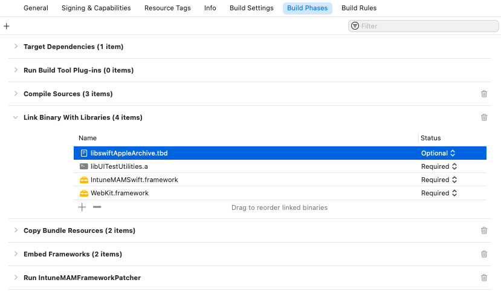

---
# required metadata

title: Microsoft Intune App SDK for iOS developer guide - Intune SDK integration into your iOS app
description: The Microsoft Intune App SDK for iOS lets you incorporate Intune app protection policies (also known as APP or MAM policies) into your native iOS app. Intune SDK integration into your iOS app
keywords:
author: Erikre
ms.author: erikre
manager: dougeby
ms.date: 11/01/2023
ms.topic: reference
ms.service: microsoft-intune
ms.subservice: developer
ms.localizationpriority: medium
ms.technology:
ms.assetid: 8e280d23-2a25-4a84-9bcb-210b30c63c0b

# optional metadata

#ROBOTS:
#audience:

ms.reviewer: jamiesil
ms.suite: ems
search.appverid: MET150
#ms.tgt_pltfrm:
ms.custom: has-adal-ref
ms.collection:
- tier3
- M365-identity-device-management
- iOS/iPadOS
---

# Stage 3: Intune SDK integration into your iOS app
> [!NOTE]
> This guide is divided into several distinct stages. Start by reviewing [Plan the Integration](..\developer\app-sdk-ios-phase1.md).

## Stage Goals

- Download the Intune App SDK.
- Learn what files are included in the Intune App SDK.
- Reference the Intune App SDK in your application.
- Confirm that the Intune App SDK is properly included in your build.
- Register new accounts for MAM management after authenticating with MSAL.
- Unregister accounts on log-out to remove corporate data.
- (Recommended) Incorporate MAM logging into your app.

## Build the SDK into your mobile app

> [!IMPORTANT]
> Intune regularly releases updates to the Intune App SDK. Regularly check the [Intune App SDK for iOS](https://github.com/msintuneappsdk/ms-intune-app-sdk-ios) for updates and incorporate into your software development release cycle  to ensure your apps support the latest App Protection Policy settings.

To enable the Intune App SDK, follow these steps:

1. **Option 1 - Framework (recommended)**: Link `IntuneMAMSwift.xcframework` and `IntuneMAMSwiftStub.xcframework` to your target: Drag `IntuneMAMSwift.xcframework` and `IntuneMAMSwiftStub.xcframework` to the **Frameworks, Libraries, and Embedded Content** list of the project target.

    :::image type="content" source="media/app-sdk-ios/intune-app-sdk-ios-linked-framework.png" alt-text="Intune App SDK iOS Framework: Xcode Frameworks, Libraries, and Embedded Content sample":::

   **Option 2 - Static Library**:  Link `libIntuneMAMSwift.xcframework` and `IntuneMAMSwiftStub.xcframework` to the target: Drag `libIntuneMAMSwift.xcframework` and `IntuneMAMSwiftStub.xcframework` to the **Frameworks, Libraries, and Embedded Content** list of the project target.  

    :::image type="content" source="media/app-sdk-ios/intune-app-sdk-ios-linked-static-lib.png" alt-text="Screenshot of the Intune App SDK iOS Static Library: Xcode Frameworks, Libraries, and Embedded Content sample.":::

    > [!NOTE]
    > Currently, if you run the SDK static lib on iOS 15 simulator, it can cause a crash since AppleArchive does not exist.
    > This can be fixed by explicitly weak linking `libSwiftAppleArchive` in the main app target by marking it as "optional".
    >
    > 

     Add the `IntuneMAMResources.bundle` resource bundle to the project by dragging the resource bundle under **Copy Bundle Resources** within **Build Phases**.

     
         
2. Add these iOS frameworks to the project:  
   -  MessageUI.framework  
   -  Security.framework  
   -  CoreServices.framework  
   -  SystemConfiguration.framework  
   -  libsqlite3.tbd  
   -  libc++.tbd  
   -  ImageIO.framework  
   -  LocalAuthentication.framework  
   -  AudioToolbox.framework  
   -  QuartzCore.framework  
   -  WebKit.framework
   -  MetricKit.framework

3. Enable keychain sharing (if it isn't already enabled) by choosing **Capabilities** in each project target and enabling the **Keychain Sharing** switch. Keychain sharing is required for you to proceed to the next step.

   > [!NOTE]
   > Your provisioning profile needs to support new keychain sharing values. The keychain access groups should support a wildcard character. You can check this by opening the .mobileprovision file in a text editor, searching for **keychain-access-groups**, and ensuring that you have a wildcard character. For example:
   >
   >  ```xml
   >  <key>keychain-access-groups</key>
   >  <array>
   >  <string>YOURBUNDLESEEDID.*</string>
   >  </array>
   >  ```

4. After you enable keychain sharing, follow the steps to create a separate access group in which the Intune App SDK will store its data. You can create a keychain access group by using the UI or by using the entitlements file. If you're using the UI to create the keychain access group, make sure to follow these steps:

    1. If your mobile app doesn't have any keychain access groups defined, add the app's bundle ID as the **first** group.
    
    1. Add the shared keychain group `com.microsoft.intune.mam` to your existing access groups. The Intune App SDK uses this access group to store data.
    
    1. Add `com.microsoft.adalcache` to your existing access groups.
    
       
    
    1. If you're editing the entitlements file directly, rather than using the Xcode UI shown above to create the keychain access groups, prepend the keychain access groups with `$(AppIdentifierPrefix)` (Xcode handles this automatically). For example:
    
       - `$(AppIdentifierPrefix)com.microsoft.intune.mam`
       - `$(AppIdentifierPrefix)com.microsoft.adalcache`
    
       > [!NOTE]
       > An entitlements file is an XML file that is unique to your mobile application. It is used to specify special permissions and capabilities in your iOS app. If your app did not previously have an entitlements file, enabling keychain sharing (step 3) should have caused Xcode to generate one for your app. Ensure the app's bundle ID is the first entry in the list.

5. Include each protocol that your app passes to `UIApplication canOpenURL` in the `LSApplicationQueriesSchemes` array of your app's Info.plist file. For each protocol listed in this array, a copy of the protocol appended with `-intunemam` also needs to be added to the array. Additionally, `http-intunemam`, `https-intunemam`, `microsoft-edge-http-intunemam`, `microsoft-edge-https-intunemam`,  `smart-ns`,  `zips`,  `lacoonsecurity`,  `wandera`,  `lookoutwork-ase`,  `skycure`,  `betteractiveshield`,  `smsec`, `mvisionmobile`, and `scmx` should be added to the array. If your app uses the mailto: protocol, `ms-outlook-intunemam` should be added to the array as well. Be sure to save your changes before proceeding to the next step.

   If the app runs out of space in its LSApplicationQueriesSchemes list, then it can remove the "-intunemam" schemes for apps that are known to also implement the Intune MAM SDK. When the app removes  "scheme-intunemam" from the LSApplicationQueriesSchemes list, `canOpenURL()` may return incorrect responses for those schemes. To fix this, the app should instead call `[IntuneMAMPolicy isURLAllowed:url isKnownManagedAppScheme:YES]` for that scheme. This call will return `NO` if the policy will block the URL from being opened. If it returns true, then the app can call `canOpenURL()` with an empty identity to determine if the url can be opened. For example:

   ```objc
   BOOL __block canOpen = NO;
   if([policy isURLAllowed:urlForKnownManagedApp isKnownManagedAppScheme:YES])
   {
       [[IntuneMAMPolicyManager instance] setCurrentThreadIdentity:"" forScope:^{
       canOpen = [[UIApplication sharedApplication] canOpenURL:urlForKnownManagedApp];
       }];
   }
   ```

6. If your app doesn't use FaceID already, ensure the [NSFaceIDUsageDescription Info.plist key](https://developer.apple.com/library/archive/documentation/General/Reference/InfoPlistKeyReference/Articles/CocoaKeys.html#//apple_ref/doc/uid/TP40009251-SW75) is configured with a default message. This is required so iOS can let the user know how the app intends to use FaceID. An Intune app protection policy setting allows for FaceID to be used as a method for app access when configured by the IT admin.

7. Use the IntuneMAMConfigurator tool that is included in the [SDK repo](https://github.com/msintuneappsdk/ms-intune-app-sdk-ios) to finish configuring your app's Info.plist. The tool has three parameters:

   |Property|How to use it|
   |---------------|--------------------------------|
   |- i |  `<Path to the input plist>` |
   |- e | `<Path to the entitlements file>` |
   |- o |  (Optional) `<Path to the output plist>` |

   If the '-o' parameter isn't specified, the input file will be modified in-place. The tool is idempotent, and should be rerun whenever changes to the app's Info.plist or entitlements have been made. You should also download and run the latest version of the tool when updating the Intune SDK, in case Info.plist config requirements have changed in the latest release.

### Xcode Build Settings
The app should have both "Strip Swift Symbols"(STRIP_SWIFT_SYMBOLS) and "Enable Bitcode"(ENABLE_BITCODE) set to NO.

### Integrating a File Provider extension
File Provider extensions have certain memory requirements that might make integrating the full SDK difficult. To make it easier, there's a static library `libIntuneMAMSwiftFileProvider.xcframework` which is a stripped down version of the SDK specifically for File Provider extensions. Note this is for the non-UI portion of the FileProvider extension. You'll need to integrate the full SDK into the file-provider UI extension. 

To integrate the one of these libraries with your File Provider extension, follow the steps for integrating the SDK as a static library as shown above. Make sure to include `ContainingAppBundleId` setting.

If it’s a multi-identity app, the current user identity should be set in the file provider enumerator in `- enumeratorForContainerItemIdentifier:error:` API using `setIdentity:onFileProviderEnumerator:` method of `IntuneMAMFileProtectionManager`.

In `- startProvidingItemAtURL:completionHandler:` check if you should encrypt files using `[[IntuneMAMPolicy instance]shouldFileProviderEncryptFiles]]`. Use `encryptFile:forIdentity` API in `IntuneMAMFileProtectionManager` for actual file encryption. Also, share out a copy of the file when encryption is required since you wouldn’t want to store an encrypted copy of the file in your cloud storage.

In `- importDocumentAtURL:toParentItemIdentifier:completionHandler:` check whether the file is encrypted using `isFileEncrytped:` API in `IntuneMAMFileProtectionManager`. If it's then decrypt it using `decryptFile:toCopyPath:` API of `IntuneMAMFileProtectionManager`.

## Configure settings for the Intune App SDK

You can use the **IntuneMAMSettings** dictionary in the application's Info.plist file to set up and configure the Intune App SDK. If the IntuneMAMSettings dictionary isn't seen in your Info.plist file, you should create it.

Under the IntuneMAMSettings dictionary, you can define the following supported settings to configure the Intune App SDK.

Some of these settings might have been covered in previous sections, and some don't apply to all apps.

Setting  | Type  | Definition | Required?
--       |  --   |   --       |  --
ADALClientId  | String  | The app's Microsoft Entra client identifier. | Required for all apps. |
ADALAuthority | String | The app's Microsoft Entra authority in use. You should use your own environment where Microsoft Entra accounts have been configured. For more information, see [Application configuration options](/azure/active-directory/develop/msal-client-application-configuration). | Required if the app is a custom line-of-business application built for use within a single organization / Microsoft Entra tenant. If this value is absent, the common Microsoft Entra authority is used (which is only supported for multi-tenant applications).|
ADALRedirectUri  | String  | The app's Microsoft Entra redirect URI. | ADALRedirectUri or ADALRedirectScheme is required for all apps.  |
ADALRedirectScheme  | String  | The app's Microsoft Entra ID redirect scheme. This can be used in place of ADALRedirectUri if the application's redirect URI is in the format `scheme://bundle_id`. | ADALRedirectUri or ADALRedirectScheme is required for all apps. |
ADALLogOverrideDisabled | Boolean  | Specifies whether the SDK will route all MSAL logs (including MSAL calls from the app, if any) to its own log file. Defaults to NO. Set to YES if the app will set its own MSAL log callback. | Optional. |
ADALCacheKeychainGroupOverride | String  | Specifies the keychain group to use for the MSAL cache, instead of "com.microsoft.adalcache". Note that this doesn't have the app-id prefix. That will be prefixed to the provided string at runtime. | Optional. |
AppGroupIdentifiers | Array of strings  | Array of app groups from the app's entitlements com.apple.security.application-groups section. | Required if the app uses application groups. |
ContainingAppBundleId | String | Specifies the bundle ID of the extension's containing application. | Required for iOS extensions. |
AutoEnrollOnLaunch| Boolean| Specifies whether the app should attempt to automatically enroll on launch if an existing managed identity is detected and it has not yet done so. Defaults to NO. <br><br> Notes: If no managed identity is found or no valid token for the identity is available in the MSAL cache, the enrollment attempt will silently fail without prompting for credentials, unless the app has also set MAMPolicyRequired to YES. | Optional. Defaults to no. |
MAMPolicyRequired| Boolean| Specifies whether the app will be blocked from starting if the app doesn't have an Intune app protection policy. Defaults to NO. <br><br> Notes: Apps can't be submitted to the App Store with MAMPolicyRequired set to YES. When setting MAMPolicyRequired to YES, AutoEnrollOnLaunch should also be set to YES. | Optional. Defaults to no. |
MAMPolicyWarnAbsent | Boolean| Specifies whether the app will warn the user during launch if the app doesn't have an Intune app protection policy. <br><br> Note: Users will still be allowed to use the app without policy after dismissing the warning. | Optional. Defaults to no. |
MultiIdentity | Boolean| Specifies whether the app is multi-identity aware. | Optional. Defaults to no. |
SafariViewControllerBlockedOverride | Boolean| Disables Intune's SafariViewController hooks to enable MSAL auth via SFSafariViewController, SFAuthSession or ASWebAuthSession.  <br><br> Note: The SFSafariViewControllerConfiguration [activity button property](https://developer.apple.com/documentation/safariservices/sfsafariviewcontrollerconfiguration/2968487-activitybutton?language=objc) isn't supported by Intune's managed Safari View Controller. A configured _activity button_ will only appear in the SafariViewController if the view is unmanaged and the SafariViewControllerBlockedOverride is set to yes.| Optional. Defaults to no. WARNING: can result in data leakage if used improperly. Enable only if absolutely necessary. For more information, see [Special considerations when using MSAL for app-initiated authentication](../developer/app-sdk-ios-phase2.md#special-considerations-when-using-msal-for-app-initiated-authentication).  |
SplashIconFile <br>SplashIconFile~ipad | String  | Specifies the Intune splash (startup) icon file. | Optional. |
SplashDuration | Number | Minimum amount of time, in seconds, that the Intune startup screen will be shown at application launch. Defaults to 1.5. | Optional. |
BackgroundColor| String| Specifies the background color for the Intune SDK's UI components. Accepts a hexadecimal RGB string in the form of #XXXXXX, where X can range from 0-9 or A-F. The pound sign might be omitted.   | Optional. Defaults to the system background color, which may vary across versions of iOS and according to the iOS Dark Mode setting. |
ForegroundColor| String| Specifies the foreground color for the Intune SDK's UI components, such as text color. Accepts a hexadecimal RGB string in the form of #XXXXXX, where X can range from 0-9 or A-F. The pound sign might be omitted.  | Optional. Defaults to the system label color, which may vary across versions of iOS and according to the iOS Dark Mode setting. |
AccentColor | String| Specifies the accent color for the Intune SDK's UI components, such as button text color and PIN box highlight color. Accepts a hexadecimal RGB string in the form of #XXXXXX, where X can range from 0-9 or A-F. The pound sign might be omitted.| Optional. Defaults to system blue. |
SecondaryBackgroundColor| String| Specifies the secondary background color for the MTD screens. Accepts a hexadecimal RGB string in the form of #XXXXXX, where X can range from 0-9 or A-F. The pound sign might be omitted.   | Optional. Defaults to white. |
SecondaryForegroundColor| String| Specifies the secondary foreground color for the MTD screens, like footnote color. Accepts a hexadecimal RGB string in the form of #XXXXXX, where X can range from 0-9 or A-F. The pound sign might be omitted.  | Optional. Defaults to gray. |
SupportsDarkMode| Boolean | Specifies whether the Intune SDK's UI color scheme should observe the system dark mode setting, if no explicit value has been set for BackgroundColor/ForegroundColor/AccentColor | Optional. Defaults to yes. |
MAMTelemetryDisabled| Boolean| Specifies if the SDK won't send any telemetry data to its back end.| Optional. Defaults to no. |
MAMTelemetryUsePPE | Boolean | Specifies if MAM SDK will send data to PPE telemetry backend. Use this when testing your apps with Intune policy so that test telemetry data doesn't mix up with customer data. | Optional. Defaults to no. |
MaxFileProtectionLevel | String | Allows the app to specify the maximum `NSFileProtectionType` it can support. This value will override the policy sent by the service if the level is higher than what the application can support. Possible values: `NSFileProtectionComplete`, `NSFileProtectionCompleteUnlessOpen`, `NSFileProtectionCompleteUntilFirstUserAuthentication`, `NSFileProtectionNone`. Notice: With the highest file protection level (`NSFileProtectionComplete`), protected files can only be accessed while the device is unlocked. Ten seconds after the device is locked, the app will lose access to protected files.  In some cases, this may cause loss of access to internal components (such as MySQL databases), leading to unexpected behavior. It's recommended that applications that present lockscreen UI elements set this value to `NSFileProtectionCompleteUntilFirstUserAuthentication`. | Optional. Defaults to `NSFileProtectionComplete`. |
OpenInActionExtension | Boolean | Set to YES for Open in Action extensions. See the Sharing Data via UIActivityViewController section for more information. 
WebViewHandledURLSchemes | Array of Strings | Specifies the URL schemes that your app's WebView handles. | Required if your app uses a WebView that handles URLs via links and/or JavaScript. |
DocumentBrowserFileCachePath | String | If your app uses the [`UIDocumentBrowserViewController`](https://developer.apple.com/documentation/uikit/uidocumentbrowserviewcontroller?language=objc) to browse through files in various file providers, you can set this path relative to the home directory in the application sandbox so the Intune SDK can drop decrypted managed files into that folder. | Optional. Defaults to the `/Documents/` directory. |
VerboseLoggingEnabled | Boolean | If set to YES, Intune will log in verbose mode. | Optional. Defaults to NO |
FinishLaunchingAtStartup | Boolean | If the app is using `[BGTaskScheduler registerForTaskWithIdentifier:]` then this setting should be set to YES. | Optional. Defaults to NO |
ValuesToScrubFromLogging | Array of Strings | Specifies Application Configuration values that should be scrubbed from the logs. Alternatively, the valuesToScrubFromLogging property on the IntuneMAMSettings class can be given an array of strings for the same behavior. | Optional. |

## Receive app protection policy

### Overview

To receive Intune app protection policy, apps must initiate an enrollment request with the Intune MAM service. Apps can be configured in the Intune admin center to receive app protection policy with or without device enrollment. [Mobile Application Management (MAM)](../apps/android-deployment-scenarios-app-protection-work-profiles.md#mam), allows apps to be managed by Intune without the need for the device to be enrolled in Intune mobile device management (MDM). In both cases, enrolling with the Intune MAM service is required to receive policy.

> [!Important]
> The Intune App SDK for iOS uses 256-bit encryption keys when encryption is enabled by App Protection Policies. All apps will need to have a current SDK version to allow protected data sharing.

### Apps that already use ADAL or MSAL

> [!NOTE]
> Azure AD Authentication Library (ADAL) and Azure AD Graph API will be deprecated. For more information, see [Update your applications to use Microsoft Authentication Library (MSAL) and Microsoft Graph API](https://techcommunity.microsoft.com/t5/azure-active-directory-identity/update-your-applications-to-use-microsoft-authentication-library/ba-p/1257363).

Apps which already use ADAL or MSAL should call the `registerAndEnrollAccount` method on the `IntuneMAMEnrollmentManager` instance after the user has been successfully authenticated:

```objc
/*
 *  This method will add the account to the list of registered accounts.
 *  An enrollment request will immediately be started.
 *  @param identity The UPN of the account to be registered with the SDK
 */

(void)registerAndEnrollAccount:(NSString *)identity;
```

By calling the `registerAndEnrollAccount` method, the SDK will register the user account and attempt to enroll the app on behalf of this account. If the enrollment fails for any reason, the SDK will automatically retry the enrollment 24 hours later. For debugging purposes, the app can receive [notifications](#status-result-and-debug-notifications), via a delegate, about the results of any enrollment requests.

After this API has been invoked, the app can continue to function as normal. If the enrollment succeeds, the SDK will notify the user that an app restart is required. At that time, the user can immediately restart the app.

```objc
[[IntuneMAMEnrollmentManager instance] registerAndEnrollAccount:@"user@foo.com"];
```

### Apps that don't use ADAL or MSAL

Apps that don't sign in the user using ADAL or MSAL can still receive app protection policy from the Intune MAM service by calling the API to have the SDK handle that authentication. Apps should use this technique when they haven't authenticated a user with Microsoft Entra ID but still need to retrieve app protection policy to help protect data. An example is if another authentication service is being used for app sign-in, or if the app doesn't support signing in at all. To do this, the application can call the `loginAndEnrollAccount` method on the `IntuneMAMEnrollmentManager` instance:

```objc
/**
 *  Creates an enrollment request which is started immediately.
 *  If no token can be retrieved for the identity, the user will be prompted
 *  to enter their credentials, after which enrollment will be retried.
 *  @param identity The UPN of the account to be logged in and enrolled.
 */
 (void)loginAndEnrollAccount: (NSString *)identity;
```

By calling this method, the SDK will prompt the user for credentials if no existing token can be found. The SDK will then try to enroll the app with the Intune MAM service on behalf of the supplied user account. The method can be called with "nil" as the identity. In that case, the SDK will enroll with the existing managed user on the device (in the case of MDM), or prompt the user for a user name if no existing user is found.

If the enrollment fails, the app should consider calling this API again at a future time, depending on the details of the failure. The app can receive [notifications](#status-result-and-debug-notifications), via a delegate, about the results of any enrollment requests.

After this API has been invoked, the app can continue functioning as normal. If the enrollment succeeds, the SDK will notify the user that an app restart is required.

Example:

```objc
[[IntuneMAMEnrollmentManager instance] loginAndEnrollAccount:@"user@foo.com"];
```

### Let Intune handle authentication and enrollment at launch

If you want the Intune SDK to handle all authentication with ADAL/MSAL and enrollment before your app finishes launching, and your app always requires APP policy, you don't have to use `loginAndEnrollAccount` API. You can simply set the two settings below to YES in the IntuneMAMSettings dictionary in the app's Info.plist.

Setting  | Type  | Definition |
--       |  --   |   --       |  
AutoEnrollOnLaunch| Boolean| Specifies whether the app should attempt to automatically enroll on launch if an existing managed identity is detected and it has not yet done so. Defaults to NO. <br><br> Note: If no managed identity is found or no valid token for the identity is available in the ADAL/MSAL cache, the enrollment attempt will silently fail without prompting for credentials, unless the app has also set MAMPolicyRequired to YES. |
MAMPolicyRequired| Boolean| Specifies whether the app will be blocked from starting if the app doesn't have an Intune app protection policy. Defaults to NO. <br><br> Note: Apps can't be submitted to the App Store with MAMPolicyRequired set to YES. When setting MAMPolicyRequired to YES, AutoEnrollOnLaunch should also be set to YES. |

If you choose this option for your app, you don't have to handle restarting your app after enrolling.

### Deregister user accounts

Before a user is signed out of an app, the app should deregister the user from the SDK. This will ensure:

1. Enrollment retries will no longer happen for the user's account.

2. App protection policy will be removed.

3. If the app initiates a selective wipe (optional), any corporate data is deleted.

Before the user is signed out, the app should call the following method on the  `IntuneMAMEnrollmentManager` instance:

```objc
/*
 *  This method will remove the provided account from the list of
 *  registered accounts.  Once removed, if the account has enrolled
 *  the application, the account will be un-enrolled.
 *  @note In the case where an un-enroll is required, this method will block
 *  until the Intune APP AAD token is acquired, then return.  This method must be called before  
 *  the user is removed from the application (so that required AAD tokens are not purged
 *  before this method is called).
 *  @param identity The UPN of the account to be removed.
 *  @param doWipe   If YES, a selective wipe if the account is un-enrolled
 */
(void)deRegisterAndUnenrollAccount:(NSString *)identity withWipe:(BOOL)doWipe;
```

This method must be called before the user account's Microsoft Entra tokens are deleted. The SDK needs the user account's Microsoft Entra token(s) to make specific requests to the Intune MAM service on behalf of the user.

If the app will delete the user's corporate data on its own, the `doWipe` flag can be set to false. Otherwise, the app can have the SDK initiate a selective wipe. This will result in a call to the app's selective wipe delegate.

Example:

```objc
[[IntuneMAMEnrollmentManager instance] deRegisterAndUnenrollAccount:@"user@foo.com" withWipe:YES];
```

## Status, result, and debug notifications

The app can receive status, result, and debug notifications about the following requests to the Intune MAM service:

* Enrollment requests
* Policy update requests
* Unenrollment requests

The notifications are presented via delegate methods in `IntuneMAMEnrollmentDelegate.h`:

```objc
/**
 *  Called when an enrollment request operation is completed.
 * @param status status object containing debug information
 */

(void)enrollmentRequestWithStatus:(IntuneMAMEnrollmentStatus *)status;

/**
 *  Called when a MAM policy request operation is completed.
 *  @param status status object containing debug information
 */
(void)policyRequestWithStatus:(IntuneMAMEnrollmentStatus *)status;

/**
 *  Called when a un-enroll request operation is completed.
 *  @Note: when a user is un-enrolled, the user is also de-registered with the SDK
 *  @param status status object containing debug information
 */

(void)unenrollRequestWithStatus:(IntuneMAMEnrollmentStatus *)status;
```

These delegate methods return an `IntuneMAMEnrollmentStatus` object that has the following information:

* The identity of the account associated with the request
* A status code that indicates the result of the request
* An error string with a description of the status code
* An `NSError` object. This object is defined in `IntuneMAMEnrollmentStatus.h`, along with the specific status codes that can be returned.

### Sample code

These are example implementations of the delegate methods:

```objc
- (void)enrollmentRequestWithStatus:(IntuneMAMEnrollmentStatus*)status
{
    NSLog(@"enrollment result for identity %@ with status code %ld", status.identity, (unsigned long)status.statusCode);
    NSLog(@"Debug Message: %@", status.errorString);
}

- (void)policyRequestWithStatus:(IntuneMAMEnrollmentStatus*)status
{
    NSLog(@"policy check-in result for identity %@ with status code %ld", status.identity, (unsigned long)status.statusCode);
    NSLog(@"Debug Message: %@", status.errorString);
}

- (void)unenrollRequestWithStatus:(IntuneMAMEnrollmentStatus*)status
{
    NSLog(@"un-enroll result for identity %@ with status code %ld", status.identity, (unsigned long)status.statusCode);
    NSLog(@"Debug Message: %@", status.errorString);
}
```

## Application restart

When an app receives MAM policies for the first time, it must restart to apply the required hooks. To notify the app that a restart needs to happen, the SDK provides a delegate method in `IntuneMAMPolicyDelegate.h`.

```objc
 - (BOOL) restartApplication
```

The return value of this method tells the SDK if the application must handle the required restart:

* If true is returned, the application must handle the restart.

* If false is returned, the SDK will restart the application after this method returns. The SDK will immediately show a dialog box that tells the user to restart the application.

## Exit Criteria

After you've either configured the build plugin or integrated the command line tool into your build process, validate that it's running successfully:

- Ensure that your build compiles and builds successfully.
- Launch your compiled app, login with a Microsoft Entra user that isn't targeted with App Protection Policy, and confirm that app functions as expected.
- Logout and repeat this test *with a Microsoft Entra user that is targeted with App Protection Policy and confirm that app is now managed by Intune and restarted.

At this point in the integration, your app can now receive and enforce App Protection Policy. 
Execute the following tests to validate the integration.

### First Policy Application Test

Execute the following test first to get familiar with the complete end user experience of policy application within your app:

1. Create an iOS App Protection Policy in the Microsoft Intune admin center. For this test, configure the policy:
    - Under Access Requirements, leave the default settings. Notably, "PIN for Access" should be "Require".
2. Ensure the App Protection Policy is targeted to your application. You'll likely need to manually add the package name in the policy creation wizard.
3. Assign the App Protection Policy to a user group containing your test account.
4. On a test iOS device, uninstall other SDK-integrated apps, like Microsoft Outlook, Teams, OneDrive, and Office. Also uninstall the Intune Company Portal app and Microsoft Authenticator app.
    - > [!TIP]
      > Uninstalling other SDK-integrated apps helps ensure that you're exclusively testing your own app's integration.
5. Install your application.
6. Log in to your application with your test account that is targeted with App Protection Policy.
10. Confirm that you're prompted with a Intune mamnaged screen and confirming the prompt will restart the app. This indicates that the SDK has successfully retrieved policy for this account.
11. You should be prompted to set an app PIN. Create a PIN.
13. Log the managed account out of your application.
14. If possible without logging in, navigate around your application and confirm your app works as expected.

This is a *bare minimum- test to confirm that your app has properly registered the account, registered the authentication callback, and unregistered the account. 
Execute the following tests to more thoroughly validate how other App Protection Policy settings modify the behavior of your application.