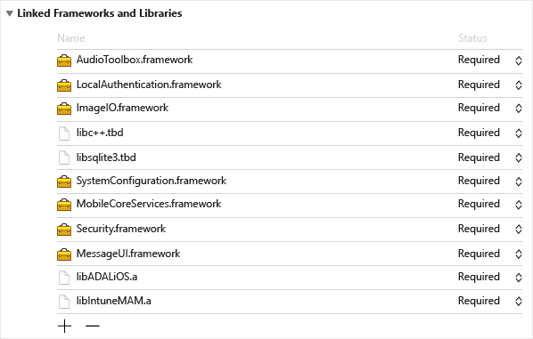

---
# required metadata

title: Microsoft Intune App SDK for iOS developer guide 
description: The Microsoft Intune App SDK for iOS lets you incorporate Intune app protection policies (also known as APP or MAM policies) into your native iOS app.
keywords:
author: Erikre
ms.author: erikre
manager: dougeby
ms.date: 04/02/2020
ms.topic: reference
ms.service: microsoft-intune
ms.subservice: developer
ms.localizationpriority: medium
ms.technology:
ms.assetid: 8e280d23-2a25-4a84-9bcb-210b30c63c0b

# optional metadata

#ROBOTS:
#audience:

ms.reviewer: aanavath
ms.suite: ems
search.appverid: MET150
#ms.tgt_pltfrm:
ms.custom: 
ms.collection: M365-identity-device-management
---

# Microsoft Intune App SDK for iOS developer guide

> [!NOTE]
> Consider reading the [Get Started with Intune App SDK Guide](app-sdk-get-started.md) article, which explains how to prepare for integration on each supported platform.
>
> To download the SDK, see [Download the SDK files](../developer/app-sdk-get-started.md#download-the-sdk-files).

The Microsoft Intune App SDK for iOS lets you incorporate Intune app protection policies (also known as APP or MAM policies) into your native iOS app. A MAM-enabled application is one that is integrated with the Intune App SDK. IT administrators can deploy app protection policies to your mobile app when Intune actively manages the app.

## Prerequisites

* You will need a Mac OS computer that runs OS X 10.8.5 or later, and also has Xcode 9 or later installed.

* Your app must be targeted for iOS 11 or above.

* Review the [Intune App SDK for iOS License Terms](https://github.com/msintuneappsdk/ms-intune-app-sdk-ios/blob/master/Microsoft%20License%20Terms%20Intune%20App%20SDK%20for%20iOS.pdf). Print and retain a copy of the license terms for your records. By downloading and using the Intune App SDK for iOS, you agree to such license terms.  If you do not accept them, do not use the software.

* Download the files for the Intune App SDK for iOS on [GitHub](https://github.com/msintuneappsdk/ms-intune-app-sdk-ios).

## What's in the SDK Repository

The following files are relevant to apps/extensions that contain no Swift code, or are compiled with a version of Xcode prior to 10.2:

* **IntuneMAM.framework**: The Intune App SDK framework. It is recommended that you link this framework to your app/extensions to enable Intune client application management. However some developers may prefer the performance benefits of the static library. See the following.

* **libIntuneMAM.a**: The Intune App SDK static library. Developers may choose to link the static library instead of the framework. Because static libraries are embedded directly into the app/extension binary at build time, there are some launch-time performance benefits to using the static library. However, integrating it into your app is a more complicated process. If your app includes any extensions, linking the static library to the app and extensions will result in a larger app bundle size, as the static library will be embedded into each app/extension binary. When using the framework, apps and extensions can share the same Intune SDK binary, resulting in a smaller app size.

* **IntuneMAMResources.bundle**: A resource bundle that contains resources that the SDK relies on. The resources bundle is required only for apps which integrate the static library (libIntuneMAM.a).

The following files are relevant to apps/extensions that contain Swift code, and are compiled with Xcode 10.2+:

* **IntuneMAMSwift.framework**: The Intune App SDK Swift framework. This framework contains all the headers for APIs that your app will call. Link this framework to your app/extensions to enable Intune client application management.

* **IntuneMAMSwiftStub.framework**: The Intune App SDK Swift Stub framework. This is a required dependency of IntuneMAMSwift.framework which apps/extensions must link.


The following files are relevant to all apps/extentions:

* **IntuneMAMConfigurator**: A tool used to configure the app or extension's Info.plist with the minimum required changes for Intune management. Depending on the functionality of your app or extension, you may need to make additional manual changes to the Info.plist.

* **Headers**: Exposes the public Intune App SDK APIs. These headers are included within the IntuneMAM/IntuneMAMSwift frameworks, so developers who consume either of the frameworks do not need to manually add the headers to their project. Developers that choose to link against the static library (libIntuneMAM.a) will need to manually include these headers in their project.

The following header files include the APIs, data types, and protocols which the Intune App SDK makes available to developers:

-  IntuneMAMAppConfig.h
-  IntuneMAMAppConfigManager.h
-  IntuneMAMDataProtectionInfo.h
-  IntuneMAMDataProtectionManager.h
-  IntuneMAMDefs.h
-  IntuneMAMDiagnosticConsole.h
-  IntuneMAMEnrollmentDelegate.h
-  IntuneMAMEnrollmentManager.h
-  IntuneMAMEnrollmentStatus.h
-  IntuneMAMFileProtectionInfo.h
-  IntuneMAMFileProtectionManager.h
-  IntuneMAMLogger.h
-  IntuneMAMPolicy.h
-  IntuneMAMPolicyDelegate.h
-  IntuneMAMPolicyManager.h
-  IntuneMAMVersionInfo.h

Developers can make the contents of all the previous headers available by just importing IntuneMAM.h


## How the Intune App SDK works

The objective of the Intune App SDK for iOS is to add management capabilities to iOS applications with minimal code changes. The fewer the code changes the less time to market, but without affecting the consistency and stability of your mobile application.


## Build the SDK into your mobile app

To enable the Intune App SDK, follow these steps:

1. **Option 1 - Framework (recommended)**: If you're using Xcode 10.2+ and your app/extension contains Swift code, link `IntuneMAMSwift.framework` and `IntuneMAMSwiftStub.framework` to your target: Drag `IntuneMAMSwift.framework` and `IntuneMAMSwiftStub.framework` to the **Embedded Binaries** list of the project target.

    Otherwise, link `IntuneMAM.framework` to your target: Drag `IntuneMAM.framework` to the **Embedded Binaries** list of the project target.

   > [!NOTE]
   > If you use the framework, you must manually strip out the simulator architectures from the universal framework before you submit your app to the App Store. See [Submit your app to the App Store](#submit-your-app-to-the-app-store) for more details.

   **Option 2 - Static Library**: This option is only available for apps/extensions that contain no Swift code, or were built with Xcode < 10.2. Link to the `libIntuneMAM.a` library. Drag the `libIntuneMAM.a` library to the **Linked Frameworks and Libraries** list of the project target.

    

    Add `-force_load {PATH_TO_LIB}/libIntuneMAM.a` to either of the following, replacing `{PATH_TO_LIB}` with the Intune App SDK location:
   * The project's `OTHER_LDFLAGS` build configuration setting.
   * The Xcode UI's **Other Linker Flags**.

     > [!NOTE]
     > To find `PATH_TO_LIB`, select the file `libIntuneMAM.a` and choose **Get Info** from the **File** menu. Copy and paste the **Where** information (the path) from the **General** section of the **Info** window.

     Add the `IntuneMAMResources.bundle` resource bundle to the project by dragging the resource bundle under **Copy Bundle Resources** within **Build Phases**.

     
         
2. Add these iOS frameworks to the project:  
-  MessageUI.framework  
-  Security.framework  
-  CoreServices.framework  
-  SystemConfiguration.framework  
-  libsqlite3.tbd  
-  libc++.tbd  
-  ImageIO.framework  
-  LocalAuthentication.framework  
-  AudioToolbox.framework  
-  QuartzCore.framework  
-  WebKit.framework

3. Enable keychain sharing (if it isn't already enabled) by choosing **Capabilities** in each project target and enabling the **Keychain Sharing** switch. Keychain sharing is required for you to proceed to the next step.

   > [!NOTE]
   > Your provisioning profile needs to support new keychain sharing values. The keychain access groups should support a wildcard character. You can check this by opening the .mobileprovision file in a text editor, searching for **keychain-access-groups**, and ensuring that you have a wildcard character. For example:
   >
   >  ```xml
   >  <key>keychain-access-groups</key>
   >  <array>
   >  <string>YOURBUNDLESEEDID.*</string>
   >  </array>
   >  ```

4. After you enable keychain sharing, follow the steps to create a separate access group in which the Intune App SDK will store its data. You can create a keychain access group by using the UI or by using the entitlements file. If you are using the UI to create the keychain access group, make sure to follow these steps:

     a. If your mobile app does not have any keychain access groups defined, add the app's bundle ID as the **first** group.
    
    b. Add the shared keychain group `com.microsoft.intune.mam` to your existing access groups. The Intune App SDK uses this access group to store data.
    
    c. Add `com.microsoft.adalcache` to your existing access groups.
    
      
    
    d. If you are editing the entitlements file directly, rather than using the Xcode UI shown above to create the keychain access groups, prepend the keychain access groups with `$(AppIdentifierPrefix)` (Xcode handles this automatically). For example:
    
      - `$(AppIdentifierPrefix)com.microsoft.intune.mam`
      - `$(AppIdentifierPrefix)com.microsoft.adalcache`
    
      > [!NOTE]
      > An entitlements file is an XML file that is unique to your mobile application. It is used to specify special permissions and capabilities in your iOS app. If your app did not previously have an entitlements file, enabling keychain sharing (step 3) should have caused Xcode to generate one for your app. Ensure the app's bundle ID is the first entry in the list.

5. Include each protocol that your app passes to `UIApplication canOpenURL` in the `LSApplicationQueriesSchemes` array of your app's Info.plist file. Be sure to save your changes before proceeding to the next step.

6. If your app does not use FaceID already, ensure the [NSFaceIDUsageDescription Info.plist key](https://developer.apple.com/library/archive/documentation/General/Reference/InfoPlistKeyReference/Articles/CocoaKeys.html#//apple_ref/doc/uid/TP40009251-SW75) is configured with a default message. This is required so iOS can let the user know how the app intends to use FaceID. An Intune app protection policy setting allows for FaceID to be used as a method for app access when configured by the IT admin.

7. Use the IntuneMAMConfigurator tool that is included in the [SDK repo](https://github.com/msintuneappsdk/ms-intune-app-sdk-ios) to finish configuring your app's Info.plist. The tool has three parameters:

   |Property|How to use it|
   |---------------|--------------------------------|
   |- i |  `<Path to the input plist>` |
   |- e | `<Path to the entitlements file>` |
   |- o |  (Optional) `<Path to the output plist>` |

If the '-o' parameter is not specified, the input file will be modified in-place. The tool is idempotent, and should be rerun whenever changes to the app's Info.plist or entitlements have been made. You should also download and run the latest version of the tool when updating the Intune SDK, in case Info.plist config requirements have changed in the latest release.

## Configure ADAL/MSAL

The Intune App SDK can use either the [Azure Active Directory Authentication Library](https://github.com/AzureAD/azure-activedirectory-library-for-objc) or the [Microsoft Authentication Library](https://github.com/AzureAD/microsoft-authentication-library-for-objc) for its authentication and conditional launch scenarios. It also relies on ADAL/MSAL to register the user identity with the MAM service for management without device enrollment scenarios.

Typically, ADAL/MSAL require apps to register with Azure Active Directory (AAD) and create a unique client ID and redirect URI, to guarantee the security of the tokens granted to the app. If your app already uses ADAL or MSAL to authenticate users, the app must use its existing registration values and override the Intune App SDK default values. This ensures that users are not prompted for authentication twice (once by the Intune App SDK and once by the app).

If your app does not already use ADAL or MSAL, and you do not need to access any AAD resource, you do not need to set up a client app registration in AAD if you choose to integrate ADAL. If you decide to integrate MSAL, you will need to configure an app registration and override the default Intune client ID and redirect URI.  

It is recommended that your app links to the latest release of [ADAL](https://github.com/AzureAD/azure-activedirectory-library-for-objc/releases) or [MSAL](https://github.com/AzureAD/microsoft-authentication-library-for-objc/releases).

### Link to ADAL or MSAL binaries

**Option 1 -** Follow [these steps](https://github.com/AzureAD/azure-activedirectory-library-for-objc#download) to link your app to the ADAL binaries.

**Option 2 -** Alternatively, you may follow [these instructions](https://github.com/AzureAD/microsoft-authentication-library-for-objc#installation) to link your app to the MSAL binaries.

1. If your app does not have any keychain access groups defined, add the app's bundle ID as the first group.

2. Enable ADAL/MSAL single sign-on (SSO) by adding `com.microsoft.adalcache` to the keychain access groups.

3. In the case you are explicitly setting the ADAL shared cache keychain group, make sure it is set to `<appidprefix>.com.microsoft.adalcache`. ADAL will set this for you unless you override it. If you want to specify a custom keychain group to replace `com.microsoft.adalcache`, specify that in the Info.plist file under IntuneMAMSettings, by using the key `ADALCacheKeychainGroupOverride`.

### Configure ADAL/MSAL settings for the Intune App SDK

If your app already uses ADAL or MSAL for authentication and has its own Azure Active Directory settings, you can force the Intune App SDK to use the same settings during authentication against AAD. This ensures that the app will not double-prompt the user for authentication. See [Configure settings for the Intune App SDK](#configure-settings-for-the-intune-app-sdk) for information on populating the following settings:  

* ADALClientId
* ADALAuthority
* ADALRedirectUri
* ADALRedirectScheme
* ADALCacheKeychainGroupOverride

If your app already uses ADAL or MSAL, the following configurations are required:

1. In the project's Info.plist file, under the **IntuneMAMSettings** dictionary with the key name `ADALClientId`, specify the client ID to be used for ADAL calls.

2. Also under the **IntuneMAMSettings** dictionary with the key name `ADALAuthority`, specify the Azure AD authority.

3. Also under the **IntuneMAMSettings** dictionary with the key name `ADALRedirectUri`, specify the redirect URI to be used for ADAL calls. Alternatively, you could specify `ADALRedirectScheme` instead, if the application's redirect URI is in the format `scheme://bundle_id`.

Additionally, apps can override these Azure AD settings at runtime. To do this, simply set the `aadAuthorityUriOverride`, `aadClientIdOverride`, and `aadRedirectUriOverride` properties on the `IntuneMAMPolicyManager` instance.

4. Ensure the steps to give your iOS app permissions to the app protection policy (APP) service are followed. Use the instructions in the [getting started with the Intune SDK guide](app-sdk-get-started.md#next-steps-after-integration) under "[Give your app access to the Intune app protection service (optional)](app-sdk-get-started.md#give-your-app-access-to-the-intune-app-protection-service-optional)".  

> [!NOTE]
> The Info.plist approach is recommended for all settings which are static and do not need to be determined at runtime. Values assigned to the `IntuneMAMPolicyManager` properties take precedence over any corresponding values specified in the Info.plist, and will persist even after the app is restarted. The SDK will continue to use them for policy check-ins until the user is unenrolled or the values are cleared or changed.

### If your app does not use ADAL or MSAL

As previously mentioned, the Intune App SDK can use either the [Azure Active Directory Authentication Library](https://github.com/AzureAD/azure-activedirectory-library-for-objc) or the [Microsoft Authentication Library](https://github.com/AzureAD/microsoft-authentication-library-for-objc) for its authentication and conditional launch scenarios. It also relies on ADAL/MSAL to register the user identity with the MAM service for management without device enrollment scenarios. If **your app does not use ADAL or MSAL for its own authentication mechanism**, then you may need to configure custom AAD settings, depending on which authentication library you choose to integrate:   

ADAL - Intune App SDK will provide default values for ADAL parameters and handle authentication against Azure AD. Developers do not need to specify any values for the ADAL settings previously mentioned. 

MSAL - Developers need to create an app registration in AAD with a custom redirect URI in the format specified [here](https://github.com/AzureAD/microsoft-authentication-library-for-objc/wiki/Migrating-from-ADAL-Objective-C-to-MSAL-Objective-C#app-registration-migration). Developers should set the `ADALClientID` and `ADALRedirectUri` settings previously mentioned, or the equivalent `aadClientIdOverride` and `aadRedirectUriOverride` properties on the `IntuneMAMPolicyManager` instance. Developers should also ensure they follow step 4 in the previous section, to give their app registration access to the Intune app protection service.

### Special considerations when using MSAL 

1. **Check your Webview** - It is recommended that applications do not use SFSafariViewController, SFAuthSession or ASWebAuthSession as their webview for any app-initiated MSAL interactive auth operations. If for some reason your app must use one of these webviews for any interactive MSAL auth operations, then it must also set `SafariViewControllerBlockedOverride` to `true` under the `IntuneMAMSettings` dictionary in the application's Info.plist. WARNING: This will turn off Intune's SafariViewController hooks to enable the auth session. This does risk data leaks elsewhere in the app if the application uses SafariViewController to view corporate data, so the application should not show corporate data in any of those webview types.
2. **Linking both ADAL and MSAL** - Developers must opt in if they want Intune to prefer MSAL over ADAL in this scenario. By default, Intune will prefer supported ADAL versions to supported MSAL versions, if both are linked at runtime. Intune will only prefer a supported MSAL version when, at the time of Intune's first authentication operation, `IntuneMAMUseMSALOnNextLaunch` is `true` in `NSUserDefaults`. If `IntuneMAMUseMSALOnNextLaunch` is `false` or not set, Intune will fall back to the default behavior. As the name suggests, a change to `IntuneMAMUseMSALOnNextLaunch` will take effect on the next launch.


## Configure settings for the Intune App SDK

You can use the **IntuneMAMSettings** dictionary in the application's Info.plist file to set up and configure the Intune App SDK. If the IntuneMAMSettings dictionary is not seen in your Info.plist file, you should create it.

Under the IntuneMAMSettings dictionary, you can the following supported settings to configure the Intune App SDK.

Some of these settings might have been covered in previous sections, and some do not apply to all apps.

Setting  | Type  | Definition | Required?
--       |  --   |   --       |  --
ADALClientId  | String  | The app's Azure AD client identifier. | Required for all apps that use MSAL and any ADAL app that accesses a non-Intune AAD resource. |
ADALAuthority | String | The app's Azure AD authority in use. You should use your own environment where AAD accounts have been configured. | Optional. Recommended if the app is a custom line-of-business application built for use within a single organization/AAD tenant. If this value is absent, the common AAD authority is used.|
ADALRedirectUri  | String  | The app's Azure AD redirect URI. | ADALRedirectUri or ADALRedirectScheme is required for all apps that use MSAL and any ADAL app that accesses a non-Intune AAD resource.  |
ADALRedirectScheme  | String  | The app's Azure AD redirect scheme. This can be used in place of ADALRedirectUri if the application's redirect URI is in the format `scheme://bundle_id`. | ADALRedirectUri or ADALRedirectScheme is required for all apps that use MSAL and any ADAL app that accesses a non-Intune AAD resource. |
ADALLogOverrideDisabled | Boolean  | Specifies whether the SDK will route all ADAL/MSAL logs (including ADAL calls from the app, if any) to its own log file. Defaults to NO. Set to YES if the app will set its own ADAL/MSAL log callback. | Optional. |
ADALCacheKeychainGroupOverride | String  | Specifies the keychain group to use for the ADAL/MSAL cache, instead of "com.microsoft.adalcache." Note that this doesn't have the app-id prefix. That will be prefixed to the provided string at runtime. | Optional. |
AppGroupIdentifiers | Array of strings  | Array of app groups from the app's entitlements com.apple.security.application-groups section. | Required if the app uses application groups. |
ContainingAppBundleId | String | Specifies the bundle ID of the extension's containing application. | Required for iOS extensions. |
DebugSettingsEnabled| Boolean | If set to YES, test policies within the Settings bundle can be applied. Applications should *not* be shipped with this setting enabled. | Optional. Defaults to no. |
AutoEnrollOnLaunch| Boolean| Specifies whether the app should attempt to automatically enroll on launch if an existing managed identity is detected and it has not yet done so. Defaults to NO. <br><br> Notes: If no managed identity is found or no valid token for the identity is available in the ADAL/MSAL cache, the enrollment attempt will silently fail without prompting for credentials, unless the app has also set MAMPolicyRequired to YES. | Optional. Defaults to no. |
MAMPolicyRequired| Boolean| Specifies whether the app will be blocked from starting if the app does not have an Intune app protection policy. Defaults to NO. <br><br> Notes: Apps cannot be submitted to the App Store with MAMPolicyRequired set to YES. When setting MAMPolicyRequired to YES, AutoEnrollOnLaunch should also be set to YES. | Optional. Defaults to no. |
MAMPolicyWarnAbsent | Boolean| Specifies whether the app will warn the user during launch if the app does not have an Intune app protection policy. <br><br> Note: Users will still be allowed to use the app without policy after dismissing the warning. | Optional. Defaults to no. |
MultiIdentity | Boolean| Specifies whether the app is multi-identity aware. | Optional. Defaults to no. |
SafariViewControllerBlockedOverride | Boolean| Disables Intune's SafariViewController hooks to enable MSAL auth via SFSafariViewController, SFAuthSession or ASWebAuthSession. | Optional. Defaults to no. WARNING: can result in data leakage if used improperly. Enable only if absolutely necessary. See [special considerations when using MSAL](#special-considerations-when-using-msal) for details.  |
SplashIconFile <br>SplashIconFile~ipad | String  | Specifies the Intune splash (startup) icon file. | Optional. |
SplashDuration | Number | Minimum amount of time, in seconds, that the Intune startup screen will be shown at application launch. Defaults to 1.5. | Optional. |
BackgroundColor| String| Specifies the background color for the Intune SDK's UI components. Accepts a hexadecimal RGB string in the form of #XXXXXX, where X can range from 0-9 or A-F. The pound sign might be omitted.   | Optional. Defaults to the system background color, which may vary across versions of iOS and according to the iOS Dark Mode setting. |
ForegroundColor| String| Specifies the foreground color for the Intune SDK's UI components, such as text color. Accepts a hexadecimal RGB string in the form of #XXXXXX, where X can range from 0-9 or A-F. The pound sign might be omitted.  | Optional. Defaults to the system label color, which may vary across versions of iOS and according to the iOS Dark Mode setting. |
AccentColor | String| Specifies the accent color for the Intune SDK's UI components, such as button text color and PIN box highlight color. Accepts a hexadecimal RGB string in the form of #XXXXXX, where X can range from 0-9 or A-F. The pound sign might be omitted.| Optional. Defaults to system blue. |
SecondaryBackgroundColor| String| Specifies the secondary background color for the MTD screens. Accepts a hexadecimal RGB string in the form of #XXXXXX, where X can range from 0-9 or A-F. The pound sign might be omitted.   | Optional. Defaults to white. |
SecondaryForegroundColor| String| Specifies the secondary foreground color for the MTD screens, like footnote color. Accepts a hexadecimal RGB string in the form of #XXXXXX, where X can range from 0-9 or A-F. The pound sign might be omitted.  | Optional. Defaults to gray. |
SupportsDarkMode| Boolean | Specifies whether the Intune SDK's UI color scheme should observe the system dark mode setting, if no explicit value has been set for BackgroundColor/ForegroundColor/AccentColor | Optional. Defaults to yes. |
MAMTelemetryDisabled| Boolean| Specifies if the SDK will not send any telemetry data to its back end.| Optional. Defaults to no. |
MAMTelemetryUsePPE | Boolean | Specifies if MAM SDK will send data to PPE telemetry backend. Use this when testing your apps with Intune policy so that test telemetry data does not mix up with customer data. | Optional. Defaults to no. |
MaxFileProtectionLevel | String | Optional. Allows the app to specify the maximum `NSFileProtectionType` it can support. This value will override the policy sent by the service if the level is higher than what the application can support. Possible values: `NSFileProtectionComplete`, `NSFileProtectionCompleteUnlessOpen`, `NSFileProtectionCompleteUntilFirstUserAuthentication`, `NSFileProtectionNone`.|
OpenInActionExtension | Boolean | Set to YES for Open in Action extensions. See the Sharing Data via UIActivityViewController section for more information. |
WebViewHandledURLSchemes | Array of Strings | Specifies the URL schemes that your app's WebView handles. | Required if your app uses a WebView that handles URLs via links and/or javascript. |
DocumentBrowserFileCachePath | String | If your app uses the [`UIDocumentBrowserViewController`](https://developer.apple.com/documentation/uikit/uidocumentbrowserviewcontroller?language=objc) to browse through files in various file providers, you can set this path relative to the home directory in the application sandbox so the Intune SDK can drop decrypted managed files into that folder. | Optional. Defaults to the `/Documents/` directory. |
VerboseLoggingEnabled | Boolean | If set to YES, Intune will log in verbose mode. | Optional. Defaults to NO |

## Receive app protection policy

### Overview

To receive Intune app protection policy, apps must initiate an enrollment request with the Intune MAM service. Apps can be configured in the Intune console to receive app protection policy with or without device enrollment. App protection policy without enrollment, also known as **APP-WE** or MAM-WE, allows apps to be managed by Intune without the need for the device to be enrolled in Intune mobile device management (MDM). In both cases, enrolling with the Intune MAM service is required to receive policy.

> [!Important]
> The Intune App SDK for iOS uses 256-bit encryption keys when encryption is enabled by App Protection Policies. All apps will need to have a current SDK version to allow protected data sharing.

### Apps that already use ADAL or MSAL

Apps which already use ADAL or MSAL should call the `registerAndEnrollAccount` method on the `IntuneMAMEnrollmentManager` instance after the user has been successfully authenticated:

```objc
/*
 *  This method will add the account to the list of registered accounts.
 *  An enrollment request will immediately be started.
 *  @param identity The UPN of the account to be registered with the SDK
 */

(void)registerAndEnrollAccount:(NSString *)identity;
```

By calling the `registerAndEnrollAccount` method, the SDK will register the user account and attempt to enroll the app on behalf of this account. If the enrollment fails for any reason, the SDK will automatically retry the enrollment 24 hours later. For debugging purposes, the app can receive [notifications](#status-result-and-debug-notifications), via a delegate, about the results of any enrollment requests.

After this API has been invoked, the app can continue to function as normal. If the enrollment succeeds, the SDK will notify the user that an app restart is required. At that time, the user can immediately restart the app.

```objc
[[IntuneMAMEnrollmentManager instance] registerAndEnrollAccount:@"user@foo.com"];
```

### Apps that do not use ADAL or MSAL

Apps that do not sign in the user using ADAL or MSAL can still receive app protection policy from the Intune MAM service by calling the API to have the SDK handle that authentication. Apps should use this technique when they have not authenticated a user with Azure AD but still need to retrieve app protection policy to help protect data. An example is if another authentication service is being used for app sign-in, or if the app does not support signing in at all. To do this, the application can call the `loginAndEnrollAccount` method on the `IntuneMAMEnrollmentManager` instance:

```objc
/**
 *  Creates an enrollment request which is started immediately.
 *  If no token can be retrieved for the identity, the user will be prompted
 *  to enter their credentials, after which enrollment will be retried.
 *  @param identity The UPN of the account to be logged in and enrolled.
 */
 (void)loginAndEnrollAccount: (NSString *)identity;
```

By calling this method, the SDK will prompt the user for credentials if no existing token can be found. The SDK will then try to enroll the app with the Intune MAM service on behalf of the supplied user account. The method can be called with "nil" as the identity. In that case, the SDK will enroll with the existing managed user on the device (in the case of MDM), or prompt the user for a user name if no existing user is found.

If the enrollment fails, the app should consider calling this API again at a future time, depending on the details of the failure. The app can receive [notifications](#status-result-and-debug-notifications), via a delegate, about the results of any enrollment requests.

After this API has been invoked, the app can continue functioning as normal. If the enrollment succeeds, the SDK will notify the user that an app restart is required.

Example:

```objc
[[IntuneMAMEnrollmentManager instance] loginAndEnrollAccount:@"user@foo.com"];
```

### Let Intune handle authentication and enrollment at launch

If you want the Intune SDK to handle all authentication using ADAL/MSAL and enrollment before your app finishes launching, and your app always requires APP policy, you don't have to use `loginAndEnrollAccount` API. You can simply set the two settings below to YES in the IntuneMAMSettings dictionary in the app's Info.plist.

Setting  | Type  | Definition |
--       |  --   |   --       |  
AutoEnrollOnLaunch| Boolean| Specifies whether the app should attempt to automatically enroll on launch if an existing managed identity is detected and it has not yet done so. Defaults to NO. <br><br> Note: If no managed identity is found or no valid token for the identity is available in the ADAL/MSAL cache, the enrollment attempt will silently fail without prompting for credentials, unless the app has also set MAMPolicyRequired to YES. |
MAMPolicyRequired| Boolean| Specifies whether the app will be blocked from starting if the app does not have an Intune app protection policy. Defaults to NO. <br><br> Note: Apps cannot be submitted to the App Store with MAMPolicyRequired set to YES. When setting MAMPolicyRequired to YES, AutoEnrollOnLaunch should also be set to YES. |

If you choose this option for your app, you do not have to handle restarting your app after enrolling.

### Deregister user accounts

Before a user is signed out of an app, the app should deregister the user from the SDK. This will ensure:

1. Enrollment retries will no longer happen for the user's account.

2. App protection policy will be removed.

3. If the app initiates a selective wipe (optional), any corporate data is deleted.

Before the user is signed out, the app should call the following method on the on the `IntuneMAMEnrollmentManager` instance:

```objc
/*
 *  This method will remove the provided account from the list of
 *  registered accounts.  Once removed, if the account has enrolled
 *  the application, the account will be un-enrolled.
 *  @note In the case where an un-enroll is required, this method will block
 *  until the Intune APP AAD token is acquired, then return.  This method must be called before  
 *  the user is removed from the application (so that required AAD tokens are not purged
 *  before this method is called).
 *  @param identity The UPN of the account to be removed.
 *  @param doWipe   If YES, a selective wipe if the account is un-enrolled
 */
(void)deRegisterAndUnenrollAccount:(NSString *)identity withWipe:(BOOL)doWipe;
```

This method must be called before the user account's Azure AD tokens are deleted. The SDK needs the user account's AAD token(s) to make specific requests to the Intune MAM service on behalf of the user.

If the app will delete the user's corporate data on its own, the `doWipe` flag can be set to false. Otherwise, the app can have the SDK initiate a selective wipe. This will result in a call to the app's selective wipe delegate.

Example:

```objc
[[IntuneMAMEnrollmentManager instance] deRegisterAndUnenrollAccount:@"user@foo.com" withWipe:YES];
```

## Status, result, and debug notifications

The app can receive status, result, and debug notifications about the following requests to the Intune MAM service:

* Enrollment requests
* Policy update requests
* Unenrollment requests

The notifications are presented via delegate methods in `IntuneMAMEnrollmentDelegate.h`:

```objc
/**
 *  Called when an enrollment request operation is completed.
 * @param status status object containing debug information
 */

(void)enrollmentRequestWithStatus:(IntuneMAMEnrollmentStatus *)status;

/**
 *  Called when a MAM policy request operation is completed.
 *  @param status status object containing debug information
 */
(void)policyRequestWithStatus:(IntuneMAMEnrollmentStatus *)status;

/**
 *  Called when a un-enroll request operation is completed.
 *  @Note: when a user is un-enrolled, the user is also de-registered with the SDK
 *  @param status status object containing debug information
 */

(void)unenrollRequestWithStatus:(IntuneMAMEnrollmentStatus *)status;
```

These delegate methods return an `IntuneMAMEnrollmentStatus` object that has the following information:

* The identity of the account associated with the request
* A status code that indicates the result of the request
* An error string with a description of the status code
* An `NSError` object. This object is defined in `IntuneMAMEnrollmentStatus.h`, along with the specific status codes that can be returned.

### Sample code

These are example implementations of the delegate methods:

```objc
- (void)enrollmentRequestWithStatus:(IntuneMAMEnrollmentStatus*)status
{
    NSLog(@"enrollment result for identity %@ with status code %ld", status.identity, (unsigned long)status.statusCode);
    NSLog(@"Debug Message: %@", status.errorString);
}

- (void)policyRequestWithStatus:(IntuneMAMEnrollmentStatus*)status
{
    NSLog(@"policy check-in result for identity %@ with status code %ld", status.identity, (unsigned long)status.statusCode);
    NSLog(@"Debug Message: %@", status.errorString);
}

- (void)unenrollRequestWithStatus:(IntuneMAMEnrollmentStatus*)status
{
    NSLog(@"un-enroll result for identity %@ with status code %ld", status.identity, (unsigned long)status.statusCode);
    NSLog(@"Debug Message: %@", status.errorString);
}
```

## Application restart

When an app receives MAM policies for the first time, it must restart to apply the required hooks. To notify the app that a restart needs to happen, the SDK provides a delegate method in `IntuneMAMPolicyDelegate.h`.

```objc
 - (BOOL) restartApplication
```

The return value of this method tells the SDK if the application must handle the required restart:

* If true is returned, the application must handle the restart.

* If false is returned, the SDK will restart the application after this method returns. The SDK will immediately show a dialog box that tells the user to restart the application.

## Customize your app's behavior with APIs

The Intune App SDK has several APIs you can call to get information about the Intune APP policy deployed to the app. You can use this data to customize your app's behavior. The following table provides information on some essential Intune classes you will use.

Class | Description
----- | -----------
IntuneMAMPolicyManager.h | The IntuneMAMPolicyManager class exposes the Intune APP policy deployed to the application. Notably, it exposes APIs that are useful for [Enabling multi-identity](app-sdk-ios.md#enable-multi-identity-optional). |
IntuneMAMPolicy.h | The IntuneMAMPolicy class exposes some MAM policy settings that apply to the app. These policy settings are exposed so the app can customize its UI. Most policy settings are enforced by the SDK and not the app. The only one that the app should implement is the Save-as control. This class exposes some APIs needed to implement Save-as. |
IntuneMAMFileProtectionManager.h | The IntuneMAMFileProtectionManager class exposes APIs the app can use to explicitly secure files and directories based on a supplied identity. The identity can be managed by Intune or unmanaged, and the SDK will apply the appropriate MAM policy. Using this class is optional. |
IntuneMAMDataProtectionManager.h | The IntuneMAMDataProtectionManager class exposes APIs the app can use to secure data buffers given a supplied identity. The identity can be managed by Intune or unmanaged, and the SDK will apply encryption appropriately. |

## Implement Allowed Accounts

Intune lets IT admins specify which accounts can be logged into by the user. Apps can query the Intune App SDK for the specified list of allowed accounts and then ensure only allowed accounts are signed into the device.

To query for allowed accounts, the App should check the `allowedAccounts` property on the `IntuneMAMEnrollmentManager`. The `allowedAccounts` property is either an array containing the allowed accounts or nil. If the property is nil then no allowed accounts have been specified.

Apps can also react to changes of the `allowedAccounts` property by observing the `IntuneMAMAllowedAccountsDidChangeNotification` notification. The notification is posted whenever the `allowedAccounts` property changes in value.

## Implement save-as and open-from controls

Intune lets IT admins select which storage locations a managed app can save data to or open data from. Apps can query the Intune MAM SDK for allowed save-to storage locations by using the `isSaveToAllowedForLocation` API, defined in `IntuneMAMPolicy.h`. Apps can also query the Intune MAM SDK for allowed open-from storage locations by using the `isOpenFromAllowedForLocation` API, defined in `IntuneMAMPolicy.h`.

Before apps can save managed data to a cloud-storage or local location, they must check with the `isSaveToAllowedForLocation` API to know if the IT admin has allowed data to be saved there.
Before opening data into an app from a cloud-storage or local location, the app must check with the `isOpenFromAllowedForLocation` API to know if the IT admin has allowed data to be opened from there.

When apps use the `isSaveToAllowedForLocation` or `isOpenFromAllowedForLocation` APIs, they must pass in the UPN for the storage location, if it is available.

### Supported save locations

The `isSaveToAllowedForLocation` API provides constants to check whether the IT admin permits data to be saved to the following locations defined in `IntuneMAMPolicy.h`:

* IntuneMAMSaveLocationOther
* IntuneMAMSaveLocationOneDriveForBusiness
* IntuneMAMSaveLocationSharePoint
* IntuneMAMSaveLocationLocalDrive
* IntuneMAMSaveLocationAccountDocument

Apps should use the constants in `isSaveToAllowedForLocation` to check if data can be saved to locations considered "managed," like OneDrive for Business, or "personal." Additionally, the API should be used when the app can't check whether a location is "managed" or "personal."

The `IntuneMAMSaveLocationLocalDrive` constant should be used when the app is saving data to any location on the local device.

If the account for the destination location is unknown, `nil` should be passed. The `IntuneMAMSaveLocationLocalDrive` location should always be paired with a `nil` account.

### Supported open locations

The `isOpenFromAllowedForLocation` API provides constants to check whether the IT admin permits data to be opened from the following locations defined in `IntuneMAMPolicy.h`.

* IntuneMAMOpenLocationOther
* IntuneMAMOpenLocationOneDriveForBusiness
* IntuneMAMOpenLocationSharePoint
* IntuneMAMOpenLocationCamera
* IntuneMAMOpenLocationLocalStorage
* IntuneMAMOpenLocationAccountDocument

Apps should use the constants in `isOpenFromAllowedForLocation` to check if data can be opened from locations considered "managed", like OneDrive for Business, or "personal". Additionally, the API should be used when the app can't check whether a location is "managed" or "personal".

The `IntuneMAMOpenLocationCamera` constant should be used when the app is opening data from the camera or photo album.

The `IntuneMAMOpenLocationLocalStorage` constant should be used when the app is opening data from any location on the local device.

The `IntuneMAMOpenLocationAccountDocument` constant should be used when the app is opening a document that has a managed account identity (see the "Shared data" section below)

If the account for the source location is unknown, `nil` should be passed. The `IntuneMAMOpenLocationLocalStorage` and `IntuneMAMOpenLocationCamera` locations should always be paired with a `nil` account.

### Unknown or unlisted locations

When the desired location is not listed in the `IntuneMAMSaveLocation` or `IntuneMAMOpenLocation` enums or is unknown, one of two locations should be used.
* If the save location is being accessed with a managed account then the `IntuneMAMSaveLocationAccountDocument` location should be used (`IntuneMAMOpenLocationAccountDocument` for open).
* Otherwise, use the `IntuneMAMSaveLocationOther` location (`IntuneMAMOpenLocationOther` for open).

It is important to make the distinction clear between the managed account and an account that shares the managed account's UPN. For example, a managed account with UPN "user@contoso.com" signed into OneDrive is not the same as an account with UPN "user@contoso.com" signed into Dropbox. If an unknown or unlisted service is accessed by signing into the managed account (e.g. "user@contoso.com" signed into OneDrive), it should be represented by the `AccountDocument` location. If the unknown or unlisted service signs in through another account (e.g. "user@contoso.com" signed into Dropbox), it is not accessing the location with a managed account and should be represented by the `Other` location.

### Sharing blocked alert

A UI helper function can be used when either the `isSaveToAllowedForLocation` or `isOpenFromAllowedForLocation` API is called and found to block the save/open action. If the app wants to notify the user that the action was blocked, it can call the `showSharingBlockedMessage` API defined in `IntuneMAMUIHelper.h` to present an alert view with a generic message.

## Share Data via UIActivityViewController

Starting in release 8.0.2, the Intune App SDK can filter `UIActivityViewController` actions so that only Intune managed share locations are available to select. This behavior will be controlled by the application data transfer policy.

### 'Copy To' actions

When sharing documents via the `UIActivityViewController` and `UIDocumentInteractionController`, iOS displays 'Copy to' actions for each application that supports opening the document being shared. Applications declare the document types they support through the `CFBundleDocumentTypes` setting in their Info.plist. This type of sharing will no longer be available if the policy prohibits sharing to unmanaged applications. As a replacement, user will have to add a non-UI Action extension to their application and link it to the Intune App SDK. The Action extension is merely a stub. The SDK will implement the file sharing behavior. Follow the steps below:

1. Your application must have at least one schemeURL defined under its Info.plist `CFBundleURLTypes` along with its `-intunemam` counterpart. For example:
    ```objc
    <key>CFBundleURLSchemes</key>
	<array>
		<string>launch-com.contoso.myapp</string>
  		<string>launch-com.contoso.myapp-intunemam</string>
	</array>
    ```

2. Both your application and action extension must share at least one App Group, and the App Group must be listed under the `AppGroupIdentifiers` array under the app's and the extension's IntuneMAMSettings dictionaries.

3. Both your application and action extension must have the Keychain Sharing capability and share the `com.microsoft.intune.mam` keychain group.

4. Name the action extension "Open in" followed by the application name. Localize the Info.plist as needed.

5. Provide a template icon for the extension as described by [Apple's developer documentation](https://developer.apple.com/ios/human-interface-guidelines/extensions/sharing-and-actions/). Alternatively, the IntuneMAMConfigurator tool can be used to generate these images from the application .app directory. To do this, run:

    ```bash
    IntuneMAMConfigurator -generateOpenInIcons /path/to/app.app -o /path/to/output/directory
    ```

6. Under IntuneMAMSettings in the extension's Info.plist, add a Boolean setting named `OpenInActionExtension` with value YES.

7. Configure the `NSExtensionActivationRule` to support a single file and all types from the application's `CFBundleDocumentTypes` prefixed with `com.microsoft.intune.mam`. For example, if the application supports public.text and public.image, the activation rule would be:

    ```objc
    SUBQUERY (
        extensionItems,
        $extensionItem,
        SUBQUERY (
            $extensionItem.attachments,
            $attachment,
            ANY $attachment.registeredTypeIdentifiers UTI-CONFORMS-TO "com.microsoft.intune.mam.public.text" ||
            ANY $attachment.registeredTypeIdentifiers UTI-CONFORMS-TO "com.microsoft.intune.mam.public.image").@count == 1
    ).@count == 1
    ```

### Update existing Share and Action extensions

If your app already contains Share or Action extensions, then their `NSExtensionActivationRule` will have to be modified to allow the Intune types. For each type supported by the extension, add an additional type prefixed with `com.microsoft.intune.mam`. For example, if the existing activation rule is:  

```objc
SUBQUERY (
    extensionItems,
    $extensionItem,
    SUBQUERY (
        $extensionItem.attachments,
        $attachment,
        ANY $attachment.registeredTypeIdentifiers UTI-CONFORMS-TO "public.url" ||
        ANY $attachment.registeredTypeIdentifiers UTI-CONFORMS-TO "public.plain-text" ||
        ANY $attachment.registeredTypeIdentifiers UTI-CONFORMS-TO "public.image" ||
        ANY $attachment.registeredTypeIdentifiers UTI-CONFORMS-TO "public.data"
    ).@count > 0
).@count > 0
```

It should be changed to:

```objc
SUBQUERY (
    extensionItems,
    $extensionItem,
    SUBQUERY (
        $extensionItem.attachments,
        $attachment,
        ANY $attachment.registeredTypeIdentifiers UTI-CONFORMS-TO "public.url" ||
        ANY $attachment.registeredTypeIdentifiers UTI-CONFORMS-TO "public.plain-text" ||
        ANY $attachment.registeredTypeIdentifiers UTI-CONFORMS-TO "public.image" ||
        ANY $attachment.registeredTypeIdentifiers UTI-CONFORMS-TO "public.data" ||
        ANY $attachment.registeredTypeIdentifiers UTI-CONFORMS-TO "com.microsoft.intune.mam.public.url" ||
        ANY $attachment.registeredTypeIdentifiers UTI-CONFORMS-TO "com.microsoft.intune.mam.public.plain-text" ||
        ANY $attachment.registeredTypeIdentifiers UTI-CONFORMS-TO "com.microsoft.intune.mam.public.image" ||
        ANY $attachment.registeredTypeIdentifiers UTI-CONFORMS-TO "com.microsoft.intune.mam.public.data"
    ).@count > 0
).@count > 0
```

> [!NOTE]
> The IntuneMAMConfigurator tool can be used to add the Intune types to the activation rule. If your existing activation rule uses the predefined string constants (e.g. NSExtensionActivationSupportsFileWithMaxCount, NSExtensionActivationSupportsText, etc.), the predicate syntax can get quite complex. The IntuneMAMConfigurator tool can also be used to convert the activation rule from the string constants to a predicate string while adding the Intune types.

### What the UI should look like

Old UI:


New UI:


## Enable targeted configuration (APP/MAM app config) for your iOS applications

MAM targeted configuration (also know as MAM app config) allows an app to receive configuration data through the Intune SDK. The format and variants of this data must be defined and communicated to Intune customers by the app owner/developer.

Intune administrators can target and deploy configuration data via the Intune Azure portal and Intune Graph API. As of version 7.0.1 of the Intune App SDK for iOS, apps that are participating in MAM targeted configuration can be provided MAM targeted configuration data via the MAM Service. The application configuration data is pushed through our MAM Service directly to the app instead of through the MDM channel. The Intune App SDK provides a class to access the data retrieved from these consoles. The following items are prerequisites:

* The app needs to be enrolled with the Intune MAM service before you access the MAM targeted config UI. For more information, see [Receive app protection policy](#receive-app-protection-policy).

* Include `IntuneMAMAppConfigManager.h` in your app's source file.

* Call `[[IntuneMAMAppConfigManager instance] appConfigForIdentity:]` to get the App Config Object.

* Call the appropriate selector on `IntuneMAMAppConfig` object. For example, if your application's key is a string, you'd want to use `stringValueForKey` or `allStringsForKey`. See `IntuneMAMAppConfig.h` for a detailed description on return values and error conditions.

For more information about the capabilities of the Graph API, see [Graph API Reference](https://developer.microsoft.com/graph/docs/concepts/overview).

For more information about how to create a MAM targeted app configuration policy in iOS, see the section on MAM targeted app config in [How to use Microsoft Intune app configuration policies for iOS/iPadOS](../apps/app-configuration-policies-use-ios.md).

## Telemetry

By default, the Intune App SDK for iOS collects telemetry on the following types of events:

* **App launch**: To help Microsoft Intune learn about MAM-enabled app usage by management type (MAM with MDM, MAM without MDM enrollment, and so on).

* **Enrollment calls**: To help Microsoft Intune learn about success rate and other performance metrics of enrollment calls initiated from the client side.

* **Intune actions**: To help diagnose issues and ensure Intune functionality, we collect information about Intune SDK actions.

> [!NOTE]
> If you choose not to send Intune App SDK telemetry data to Microsoft Intune from your mobile application, you must disable Intune App SDK telemetry capture. Set the property `MAMTelemetryDisabled` to YES in the IntuneMAMSettings dictionary.

## Enable multi-identity (optional)

By default, the SDK applies a policy to the app as a whole. Multi-identity is a MAM feature that you can enable to apply a policy on a per-identity level. This requires more app participation than other MAM features.

The app must inform the app SDK when it intends to change the active identity. The SDK also notifies the app when an identity change is required. Currently, only one managed identity is supported. After the user enrolls the device or the app, the SDK uses this identity and considers it the primary managed identity. Other users in the app will be treated as unmanaged with unrestricted policy settings.

Note that an identity is simply defined as a string. Identities are case-insensitive. Requests to the SDK for an identity might not return the same casing that was originally used when the identity was set.

### Identity overview

An identity is simply the user name of an account (for example, user@contoso.com). Developers can set the identity of the app on the following levels:

* **Process identity**: Sets the process-wide identity and is mainly used for single identity applications. This identity affects all tasks, files, and UI.

* **UI identity**: Determines what policies are applied to UI tasks on the main thread, like cut/copy/paste, PIN, authentication, and data sharing. The UI identity does not affect file tasks like encryption and backup.

* **Thread identity**: Affects what policies are applied on the current thread. This identity affects all tasks, files, and UI.

The app is responsible for setting the identities appropriately, whether or not the user is managed.

At any time, every thread has an effective identity for UI tasks and file tasks. This is the identity that's used to check what policies, if any, should be applied. If the identity is "no identity" or the user is not managed, no policies will be applied. The diagrams below show how the effective identities are determined.

  

### Thread queues

Apps often dispatch asynchronous and synchronous tasks to thread queues. The SDK intercepts Grand Central Dispatch (GCD) calls and associates the current thread identity with the dispatched tasks. When the tasks are finished, the SDK temporarily changes the thread identity to the identity associated with the tasks, finishes the tasks, then restores the original thread identity.


Because `NSOperationQueue` is built on top of GCD, `NSOperations` will run on the identity of the thread at the time the tasks are added to `NSOperationQueue`. `NSOperations` or functions dispatched directly through GCD can also change the current thread identity as they are running. This identity will override the identity inherited from the dispatching thread.

### File owner

The SDK tracks the identities of local file owners and applies policies accordingly. A file owner is established when a file is created or when a file is opened in truncate mode. The owner is set to the effective file task identity of the thread that's performing the task.

Alternatively, apps can set the file owner identity explicitly by using `IntuneMAMFilePolicyManager`. Apps can use `IntuneMAMFilePolicyManager` to retrieve the file owner and set the UI identity before showing the file contents.

### Shared data

If the app creates files that have data from both managed and unmanaged users, the app is responsible for encrypting the managed user's data. You can encrypt data by using the `protect` and `unprotect` APIs in `IntuneMAMDataProtectionManager`.

The `protect` method accepts an identity that can be a managed or unmanaged user. If the user is managed, the data will be encrypted. If the user is unmanaged, a header will be added to the data that's encoding the identity, but the data will not be encrypted. You can use the `protectionInfo` method to retrieve the data's owner.

### Share extensions

If the app has a share extension, the owner of the item being shared can be retrieved through the  `protectionInfoForItemProvider` method in `IntuneMAMDataProtectionManager`. If the shared item is a file, the SDK will handle setting the file owner. If the shared item is data, the app is responsible for setting the file owner if this data is persisted to a file, and for calling the `setUIPolicyIdentity` API before showing this data in the UI.

### Turn on multi-identity

By default, apps are considered single identity. The SDK sets the process identity to the enrolled user. To enable multi-identity support, add a Boolean setting with the name `MultiIdentity` and a value of YES to the IntuneMAMSettings dictionary in the app's Info.plist file.

> [!NOTE]
> When multi-identity is enabled, the process identity, UI identity, and thread identities are set to nil. The app is responsible for setting them appropriately.

### Switch identities

* **App-initiated identity switch**:

    At launch, multi-identity apps are considered to be running under an unknown, unmanaged account. The conditional launch UI will not run, and no policies will be enforced on the app. The app is responsible for notifying the SDK whenever the identity should be changed. Typically, this will happen whenever the app is about to show data for a specific user account.

    An example is when the user attempts to open a document, a mailbox, or a tab in a notebook. The app needs to notify the SDK before the file, mailbox, or tab is actually opened. This is done through the `setUIPolicyIdentity` API in `IntuneMAMPolicyManager`. This API should be called whether or not the user is managed. If the user is managed, the SDK will perform the conditional launch checks, like jailbreak detection, PIN, and authentication.

    The result of the identity switch is returned to the app asynchronously through a completion handler. The app should postpone opening the document, mailbox, or tab until a success result code is returned. If the identity switch failed, the app should cancel the task.

* **SDK-initiated identity switch**:

    Sometimes, the SDK needs to ask the app to switch to a specific identity. Multi-identity apps must implement the `identitySwitchRequired` method in `IntuneMAMPolicyDelegate` to handle this request.

    When this method is called, if the app can handle the request to switch to the specified identity, it should pass `IntuneMAMAddIdentityResultSuccess` into the completion handler. If it can't handle switching the identity, the app should pass `IntuneMAMAddIdentityResultFailed` into the completion handler.

    The app does not have to call `setUIPolicyIdentity` in response to this call. If the SDK needs the app to switch to an unmanaged user account, the empty string will be passed into the `identitySwitchRequired` call.

* **Selective wipe**:

    When the app is selectively wiped, the SDK will call the `wipeDataForAccount` method in `IntuneMAMPolicyDelegate`. The app is responsible for removing the specified user's account and any data associated with it. The SDK is capable of removing all files owned by the user and will do so if the app returns FALSE from the `wipeDataForAccount` call.

    Note that this method is called from a background thread. The app should not return a value until all data for the user has been removed (with the exception of files if the app returns FALSE).

## Siri Intents
If your app integrates with Siri Intents, please make sure to read the comments for `areSiriIntentsAllowed` in `IntuneMAMPolicy.h` for instructions on supporting this scenario. 
    
## Notifications
If your app receives notifications, please make sure to read the comments for `notificationPolicy` in `IntuneMAMPolicy.h` for instructions on supporting this scenario.  It is recommended that apps register for `IntuneMAMPolicyDidChangeNotification` described in `IntuneMAMPolicyManager.h`, and communicate this value to their `UNNotificationServiceExtension` via the keychain.
## Displaying Web Content Within Application
If your application has the ability to display websites within a web view and the displayed web pages have the ability to navigate to arbitrary sites, the application is responisble for setting the current identity so that managed data cannot be leaked through the web view. Examples of this are 'Suggest a Feature' or 'Feedback' web pages that have either direct or indirect links to a search engine.
Multi-identity applications should call IntuneMAMPolicyManager setUIPolicyIdentity passing in the empty string prior to displaying the web view. After the web view is dismissed, the application should call setUIPolicyIdentity passing in the current identity.
Single identity applications should call IntuneMAMPolicyManager setCurrentThreadIdentity passing in the empty string prior to displaying the web view. After the web view is dismissed, the application should call setCurrentThreadIdentity passing in nil.

## iOS best practices

Here are recommended best practices for developing for iOS:

* The iOS file system is case-sensitive. Ensure that the case is correct for file names like `libIntuneMAM.a` and `IntuneMAMResources.bundle`.

* If Xcode has trouble finding `libIntuneMAM.a`, you can fix the problem by adding the path to this library into the linker search paths.

## FAQs

### Are all of the APIs addressable through native Swift or the Objective-C and Swift interoperability?

The Intune App SDK APIs are in Objective-C only and do not support **native** Swift. Swift interoperability with Objective-C is required.

### Do all users of my application need to be registered with the APP-WE service?

No. In fact, only work or school accounts should be registered with the Intune App SDK. Apps are responsible for determining if an account is used in a work or school context.

### What about users that have already signed in to the application? Do they need to be enrolled?

The application is responsible for enrolling users after they have been successfully authenticated. The application is also responsible for enrolling any existing accounts that might have been present before the application had MDM-less MAM functionality.

To do this, the application should make use of the `registeredAccounts:` method. This method returns an NSDictionary that has all of the accounts registered into the Intune MAM service. If any existing accounts in the application are not in the list, the application should register and enroll those accounts via `registerAndEnrollAccount:`.

### How often does the SDK retry enrollments?

The SDK will automatically retry all previously failed enrollments on a 24-hour interval. The SDK does this to ensure that if a user's organization enabled MAM after the user signed in to the application, the user will successfully enroll and receive policies.

The SDK will stop retrying when it detects that a user has successfully enrolled the application. This is because only one user can enroll an application at a particular time. If the user is unenrolled, the retries will begin again on the same 24-hour interval.

### Why does the user need to be deregistered?

The SDK will take these actions in the background periodically:

* If the application is not yet enrolled, it will try to enroll all registered accounts every 24 hours.
* If the application is enrolled, the SDK will check for MAM policy updates every 8 hours.

Deregistering a user notifies the SDK that the user will no longer use the application, and the SDK can stop any of the periodic events for that user account. It also triggers an app unenroll and selective wipe if necessary.

### Should I set the doWipe flag to true in the deregister method?

This method should be called before the user is signed out of the application.  If the user's data is deleted from the application as part of the sign-out, `doWipe` can be set to false. But if the application does not remove the user's data, `doWipe` should be set to true so that the SDK can delete the data.

### Are there any other ways that an application can be un-enrolled?

Yes, the IT admin can send a selective wipe command to the application. This will deregister and unenroll the user, and it will wipe the user's data. The SDK automatically handles this scenario and sends a notification via the unenroll delegate method.

### Is there a sample app that demonstrates how to integrate the SDK?

Yes! We just recently revamped our open-source sample app [Wagr for iOS](https://github.com/Microsoft/Wagr-Sample-Intune-iOS-App). Wagr is now enabled for app protection policy using the Intune App SDK.

### How can I troubleshoot my app?

The Intune SDK for iOS 9.0.3+ supports the ability to add a diagnostics console within the mobile app for testing policies and logging errors. `IntuneMAMDiagnosticConsole.h` defines the `IntuneMAMDiagnosticConsole` class interface, which developers can use to display the Intune diagnostic console. This allows end users or developers during test to collect and share Intune logs to help diagnose any issue they may have. This API is optional for integrators.

## Submit your app to the App Store

Both the static library and framework builds of the Intune App SDK are universal binaries. This means they have code for all device and simulator architectures. Apple will reject apps submitted to the App Store if they have simulator code. When compiling against the static library for device-only builds, the linker will automatically strip out the simulator code. Follow the steps below to ensure all simulator code is removed before you upload your app to the App Store.

1. Make sure `IntuneMAM.framework` is on your desktop.

2. Run these commands:

    ```bash
    lipo ~/Desktop/IntuneMAM.framework/IntuneMAM -remove i386 -remove x86_64 -output ~/Desktop/IntuneMAM.device_only
    ```

    ```bash
    cp ~/Desktop/IntuneMAM.device_only ~/Desktop/IntuneMAM.framework/IntuneMAM
    ```

    The first command strips the simulator architectures from the framework's DYLIB file. The second command copies the device-only DYLIB file back into the framework directory.
