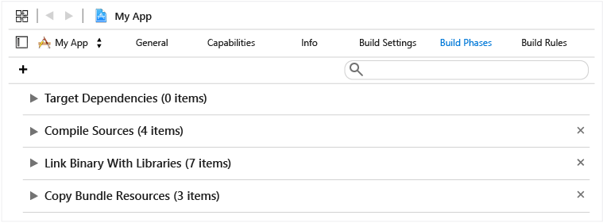
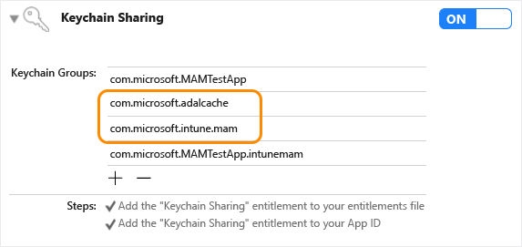
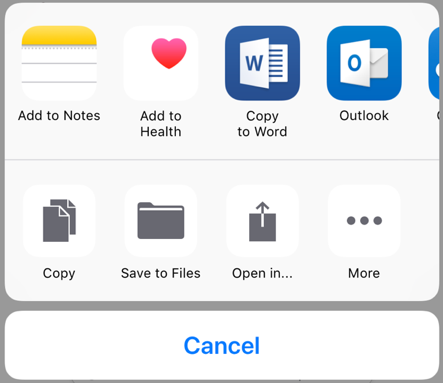
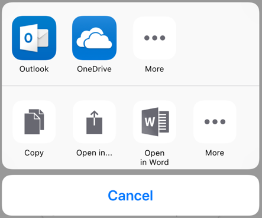
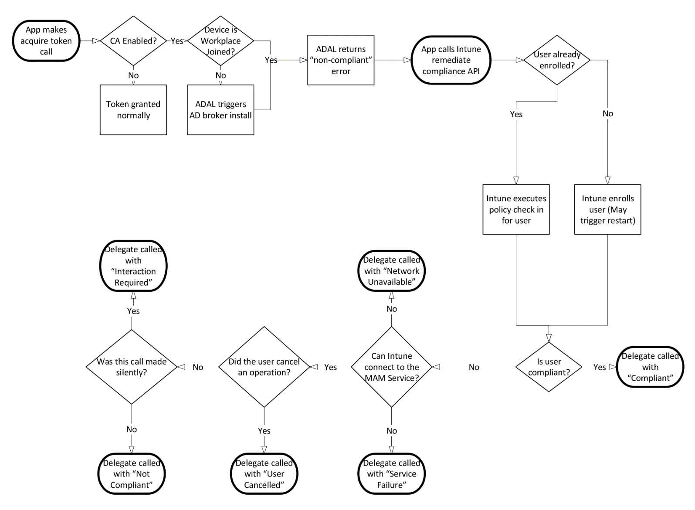
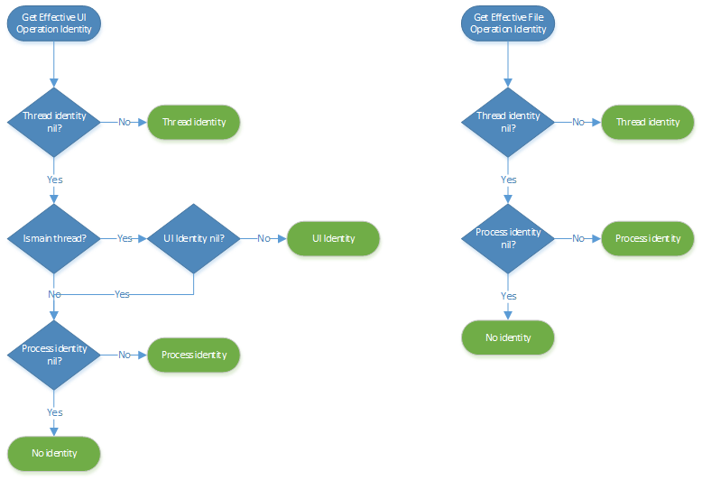

---
# required metadata

title: Microsoft Intune App SDK for iOS developer guide 
description: The Microsoft Intune App SDK for iOS lets you incorporate Intune app protection policies (also known as APP or MAM policies) into your native iOS app.
keywords:
author: Erikre
ms.author: erikre
manager: dougeby
ms.date: 03/31/2023
ms.topic: reference
ms.service: microsoft-intune
ms.subservice: developer
ms.localizationpriority: medium
ms.technology:
ms.assetid: 8e280d23-2a25-4a84-9bcb-210b30c63c0b

# optional metadata

#ROBOTS:
#audience:

ms.reviewer: jamiesil
ms.suite: ems
search.appverid: MET150
#ms.tgt_pltfrm:
ms.custom: has-adal-ref
ms.collection:
- tier3
- M365-identity-device-management
- iOS/iPadOS
---

# Microsoft Intune App SDK for iOS developer guide

> [!NOTE]
> Consider reading the [Get Started with Intune App SDK Guide](app-sdk-get-started.md) article, which explains how to prepare for integration on each supported platform.
>
> To download the SDK, see [Download the SDK files](../developer/app-sdk-get-started.md#download-the-sdk-files).
>
> If you have issues with integrating the Intune App SDK into your apps, submit a [request for assistance](https://github.com/msintuneappsdk/ms-intune-app-sdk-ios/issues) on GitHub.

The Microsoft Intune App SDK for iOS lets you incorporate Intune app protection policies (also known as APP or MAM policies) into your native iOS app. A MAM-enabled application is one that is integrated with the Intune App SDK. IT administrators can deploy app protection policies to your mobile app when Intune actively manages the app.

## Prerequisites

- You'll need a macOS computer which has Xcode 14.0 or later installed.

- Your app must be targeted for iOS 14.0 or above.

- Review the [Intune App SDK for iOS License Terms](https://github.com/msintuneappsdk/ms-intune-app-sdk-ios/blob/master/Microsoft%20License%20Terms%20Intune%20App%20SDK%20for%20iOS.pdf). Print and retain a copy of the license terms for your records. By downloading and using the Intune App SDK for iOS, you agree to such license terms.  If you don't accept them, don't use the software.

- Download the files for the Intune App SDK for iOS on [GitHub](https://github.com/msintuneappsdk/ms-intune-app-sdk-ios).

## What's in the SDK Repository

* **IntuneMAMSwift.xcframework**: The Intune App SDK framework. It's recommended that you link this framework to your app/extensions to enable Intune client application management. However, some developers may prefer the performance benefits of the static library. See the following:

* **libIntuneMAMSwift.xcframework**: The Intune App SDK static library. Developers may choose to link the static library instead of the framework. Because static libraries are embedded directly into the app/extension binary at build time, there are some launch-time performance benefits to using the static library. However, integrating it into your app is a more complicated process. If your app includes any extensions, linking the static library to the app and extensions will result in a larger app bundle size, as the static library will be embedded into each app/extension binary. When using the framework, apps and extensions can share the same Intune SDK binary, resulting in a smaller app size.

* **IntuneMAMSwiftStub.xcframework**: The Intune App SDK Swift Stub framework. This is a required dependency of both IntuneMAMSwift.xcframework and libIntuneMAMSwift.xcframework which apps/extensions must link.

* **IntuneMAMResources.bundle**: A resource bundle that contains resources that the SDK relies on. The resources bundle is required only for apps which integrate the static library (libIntuneMAMSwift.xcframework).

* **IntuneMAMConfigurator**: A tool used to configure the app or extension's Info.plist with the minimum required changes for Intune management. Depending on the functionality of your app or extension, you may need to make additional manual changes to the Info.plist.


## How the Intune App SDK works

The objective of the Intune App SDK for iOS is to add management capabilities to iOS applications with minimal code changes. The fewer the code changes the less time to market, but without affecting the consistency and stability of your mobile application.


## Build the SDK into your mobile app

> [!IMPORTANT]
> Intune regularly releases updates to the Intune App SDK. Regularly check the [Intune App SDK for iOS](https://github.com/msintuneappsdk/ms-intune-app-sdk-ios) for updates and incorporate into your software development release cycle  to ensure your apps support the latest App Protection Policy settings.

To enable the Intune App SDK, follow these steps:

1. **Option 1 - Framework (recommended)**: Link `IntuneMAMSwift.xcframework` and `IntuneMAMSwiftStub.xcframework` to your target: Drag `IntuneMAMSwift.xcframework` and `IntuneMAMSwiftStub.xcframework` to the **Frameworks, Libraries, and Embedded Content** list of the project target.

    :::image type="content" source="media/app-sdk-ios/intune-app-sdk-ios-linked-framework.png" alt-text="Intune App SDK iOS Framework: Xcode Frameworks, Libraries, and Embedded Content sample":::

   **Option 2 - Static Library**:  Link `libIntuneMAMSwift.xcframework` and `IntuneMAMSwiftStub.xcframework` to the target: Drag `libIntuneMAMSwift.xcframework` and `IntuneMAMSwiftStub.xcframework` to the **Frameworks, Libraries, and Embedded Content** list of the project target.  

    :::image type="content" source="media/app-sdk-ios/intune-app-sdk-ios-linked-static-lib.png" alt-text="Screenshot of the Intune App SDK iOS Static Library: Xcode Frameworks, Libraries, and Embedded Content sample.":::

     Add the `IntuneMAMResources.bundle` resource bundle to the project by dragging the resource bundle under **Copy Bundle Resources** within **Build Phases**.

     
         
2. Add these iOS frameworks to the project:  
   -  MessageUI.framework  
   -  Security.framework  
   -  CoreServices.framework  
   -  SystemConfiguration.framework  
   -  libsqlite3.tbd  
   -  libc++.tbd  
   -  ImageIO.framework  
   -  LocalAuthentication.framework  
   -  AudioToolbox.framework  
   -  QuartzCore.framework  
   -  WebKit.framework

3. Enable keychain sharing (if it isn't already enabled) by choosing **Capabilities** in each project target and enabling the **Keychain Sharing** switch. Keychain sharing is required for you to proceed to the next step.

   > [!NOTE]
   > Your provisioning profile needs to support new keychain sharing values. The keychain access groups should support a wildcard character. You can check this by opening the .mobileprovision file in a text editor, searching for **keychain-access-groups**, and ensuring that you have a wildcard character. For example:
   >
   >  ```xml
   >  <key>keychain-access-groups</key>
   >  <array>
   >  <string>YOURBUNDLESEEDID.*</string>
   >  </array>
   >  ```

4. After you enable keychain sharing, follow the steps to create a separate access group in which the Intune App SDK will store its data. You can create a keychain access group by using the UI or by using the entitlements file. If you're using the UI to create the keychain access group, make sure to follow these steps:

     a. If your mobile app doesn't have any keychain access groups defined, add the app's bundle ID as the **first** group.
    
    b. Add the shared keychain group `com.microsoft.intune.mam` to your existing access groups. The Intune App SDK uses this access group to store data.
    
    c. Add `com.microsoft.adalcache` to your existing access groups.
    
      
    
    d. If you're editing the entitlements file directly, rather than using the Xcode UI shown above to create the keychain access groups, prepend the keychain access groups with `$(AppIdentifierPrefix)` (Xcode handles this automatically). For example:
    
      - `$(AppIdentifierPrefix)com.microsoft.intune.mam`
      - `$(AppIdentifierPrefix)com.microsoft.adalcache`
    
      > [!NOTE]
      > An entitlements file is an XML file that is unique to your mobile application. It is used to specify special permissions and capabilities in your iOS app. If your app did not previously have an entitlements file, enabling keychain sharing (step 3) should have caused Xcode to generate one for your app. Ensure the app's bundle ID is the first entry in the list.

5. Include each protocol that your app passes to `UIApplication canOpenURL` in the `LSApplicationQueriesSchemes` array of your app's Info.plist file. For each protocol listed in this array, a copy of the protocol appended with `-intunemam` also needs to be added to the array. Additionally, `http-intunemam`, `https-intunemam`, `microsoft-edge-http-intunemam`, `microsoft-edge-https-intunemam`,  `smart-ns`,  `zips`,  `lacoonsecurity`,  `wandera`,  `lookoutwork-ase`,  `skycure`,  `betteractiveshield`,  `smsec`, `mvisionmobile`, and `scmx` should be added to the array. If your app uses the mailto: protocol, `ms-outlook-intunemam` should be added to the array as well. Be sure to save your changes before proceeding to the next step.

If the app runs out of space in its LSApplicationQueriesSchemes list, then it can remove the "-intunemam" schemes for apps that are known to also implement the Intune MAM SDK. When the app removes  "scheme-intunemam" from the LSApplicationQueriesSchemes list, `canOpenURL()` may return incorrect responses for those schemes. To fix this, the app should instead call `[IntuneMAMPolicy isURLAllowed:url isKnownManagedAppScheme:YES]` for that scheme. This call will return `NO` if the policy will block the URL from being opened. If it returns true, then the app can call `canOpenURL()` with an empty identity to determine if the url can be opened. For example:

```objc
BOOL __block canOpen = NO;
if([policy isURLAllowed:urlForKnownManagedApp isKnownManagedAppScheme:YES])
{
    [[IntuneMAMPolicyManager instance] setCurrentThreadIdentity:"" forScope:^{
    canOpen = [[UIApplication sharedApplication] canOpenURL:urlForKnownManagedApp];
    }];
}
```

6. If your app doesn't use FaceID already, ensure the [NSFaceIDUsageDescription Info.plist key](https://developer.apple.com/library/archive/documentation/General/Reference/InfoPlistKeyReference/Articles/CocoaKeys.html#//apple_ref/doc/uid/TP40009251-SW75) is configured with a default message. This is required so iOS can let the user know how the app intends to use FaceID. An Intune app protection policy setting allows for FaceID to be used as a method for app access when configured by the IT admin.

7. Use the IntuneMAMConfigurator tool that is included in the [SDK repo](https://github.com/msintuneappsdk/ms-intune-app-sdk-ios) to finish configuring your app's Info.plist. The tool has three parameters:

   |Property|How to use it|
   |---------------|--------------------------------|
   |- i |  `<Path to the input plist>` |
   |- e | `<Path to the entitlements file>` |
   |- o |  (Optional) `<Path to the output plist>` |

If the '-o' parameter isn't specified, the input file will be modified in-place. The tool is idempotent, and should be rerun whenever changes to the app's Info.plist or entitlements have been made. You should also download and run the latest version of the tool when updating the Intune SDK, in case Info.plist config requirements have changed in the latest release.

### Xcode Build Settings
The app should have both "Strip Swift Symbols"(STRIP_SWIFT_SYMBOLS) and "Enable Bitcode"(ENABLE_BITCODE) set to NO.

### Integrating a File Provider extension
File Provider extensions have certain memory requirements that might make integrating the full SDK difficult. To make it easier, there's a static library `libIntuneMAMSwiftFileProvider.xcframework` which is a stripped down version of the SDK specifically for File Provider extensions. Note this is for the non-UI portion of the FileProvider extension. You'll need to integrate the full SDK into the file-provider UI extension. 

To integrate the one of these libraries with your File Provider extension, follow the steps for integrating the SDK as a static library as shown above. Make sure to include `ContainingAppBundleId` setting.

If it’s a multi-identity app, the current user identity should be set in the file provider enumerator in `- enumeratorForContainerItemIdentifier:error:` API using `setIdentity:onFileProviderEnumerator:` method of `IntuneMAMFileProtectionManager`.

In `- startProvidingItemAtURL:completionHandler:` check if you should encrypt files using `[[IntuneMAMPolicy instance]shouldFileProviderEncryptFiles]]`. Use `encryptFile:forIdentity` API in `IntuneMAMFileProtectionManager` for actual file encryption. Also, share out a copy of the file when encryption is required since you wouldn’t want to store an encrypted copy of the file in your cloud storage.

In `- importDocumentAtURL:toParentItemIdentifier:completionHandler:` check whether the file is encrypted using `isFileEncrytped:` API in `IntuneMAMFileProtectionManager`. If it's then decrypt it using `decryptFile:toCopyPath:` API of `IntuneMAMFileProtectionManager`.

## Setup MSAL

The Intune App SDK uses the [Microsoft Authentication Library](https://github.com/AzureAD/microsoft-authentication-library-for-objc) for its authentication and conditional launch scenarios. It also relies on MSAL to register the user identity with the MAM service for management without device enrollment scenarios.

### Set up and configure an AAD app registration
MSAL requires apps to [register](/azure/active-directory/develop/quickstart-register-app) with Azure Active Directory (AAD) and create a unique client ID and redirect URI, to guarantee the security of the tokens granted to the app. If your application already uses MSAL for its own authentication, then there should already be an AAD app registration/client ID/redirect URI associated with the app. 

If your app doesn't already use MSAL, you will need to configure an app registration in AAD and specify the client ID and redirect URI that the Intune SDK should use.  

If your app currently uses ADAL to authenticate users, see [Migrate applications to MSAL for iOS and macOS](/azure/active-directory/develop/migrate-objc-adal-msal) for more information on migrating your app from ADAL to MSAL.

It's recommended that your app links to the latest release of [MSAL](https://github.com/AzureAD/microsoft-authentication-library-for-objc/releases).

### Link MSAL to Your Project

Follow the [installation](https://github.com/AzureAD/microsoft-authentication-library-for-objc#installation) section to put the MSAL binaries in your app.

### Configure MSAL

Follow the [configuration](https://github.com/AzureAD/microsoft-authentication-library-for-objc#configuring-msal) section to configure MSAL. Make sure you follow all the steps in the configuration section. Disregard step one if your app is already registered in AAD. 

The points below contain additional information to configure MSAL and link to it. Follow these if they apply to your application.

* If your app doesn't have any keychain access groups defined, add the app's bundle ID as the first group.
* Enable MSAL single sign-on (SSO) by adding `com.microsoft.adalcache` to the keychain access groups.
* In the case you're explicitly setting the MSAL shared cache keychain group, make sure it's set to `<appidprefix>.com.microsoft.adalcache`. MSAL will set this for you unless you override it. If you want to specify a custom keychain group to replace `com.microsoft.adalcache`, specify that in the Info.plist file under IntuneMAMSettings, by using the key `ADALCacheKeychainGroupOverride`.


### Configure MSAL settings for the Intune App SDK

Once an app registration has been configured for your application in AAD, you can configure the Intune App SDK to use the settings from your app registration during authentication against AAD. See [Configure settings for the Intune App SDK](#configure-settings-for-the-intune-app-sdk) for information on populating the following settings:  

* ADALClientId
* ADALAuthority
* ADALRedirectUri
* ADALRedirectScheme
* ADALCacheKeychainGroupOverride

The following configurations are required:

1. In the project's Info.plist file, under the **IntuneMAMSettings** dictionary with the key name `ADALClientId`, specify the client ID to be used for MSAL calls.

2. If the Azure AD app registration which maps to the client ID configured in step 1 is configured for use in only a single AAD tenant, configure the `ADALAuthority` key under the **IntuneMAMSettings** dictionary within the application's Info.plist file. Specify the Azure AD authority to be used by MSAL for acquiring tokens for the Intune mobile application management service.

3. Also under the **IntuneMAMSettings** dictionary with the key name `ADALRedirectUri`, specify the redirect URI to be used for MSAL calls. Alternatively, you could specify `ADALRedirectScheme` instead, if the application's redirect URI is in the format `scheme://bundle_id`.

Alternatively, apps can override these Azure AD settings at runtime. To do this, simply set the `aadAuthorityUriOverride`, `aadClientIdOverride`, and `aadRedirectUriOverride` properties on the `IntuneMAMSettings` class.

4. Ensure the steps to give your iOS app permissions to the app protection policy (APP) service are followed. Use the instructions in the [getting started with the Intune SDK guide](app-sdk-get-started.md#next-steps-after-integration) under "[Give your app access to the Intune app protection service (optional)](app-sdk-get-started.md#give-your-app-access-to-the-intune-app-protection-service-optional)".  

> [!NOTE]
> If the app protection policy is related to managed devices, creating an app configuration profile of the application that has Intune integrated is also necessary.
>
> The Info.plist approach is recommended for all settings which are static and do not need to be determined at runtime. Values assigned to the `IntuneMAMSettings` class properties at runtime take precedence over any corresponding values specified in the Info.plist, and will persist even after the app is restarted. The SDK will continue to use them for policy check-ins until the user is unenrolled or the values are cleared or changed.

### Special considerations when using MSAL for app-initiated authentication

It's recommended that applications don't use SFSafariViewController, SFAuththenticationSession or ASWebAuthenticationSession as their webview for any app-initiated MSAL interactive auth operations. By default, MSAL uses ASWebAuthenticationSession, so app developers should [explicitly set the webview type](/azure/active-directory/develop/customize-webviews#change-the-default-browser-for-the-request) to WKWebView. If for some reason your app must use a webview type other than WKWebView for any interactive MSAL auth operations, then it must also set `SafariViewControllerBlockedOverride` to `true` under the `IntuneMAMSettings` dictionary in the application's Info.plist. WARNING: This will turn off Intune's SafariViewController hooks to enable the auth session. This does risk data leaks elsewhere in the app if the application uses SafariViewController to view corporate data, so the application shouldn't show corporate data in any of those webview types.


## Configure settings for the Intune App SDK

You can use the **IntuneMAMSettings** dictionary in the application's Info.plist file to set up and configure the Intune App SDK. If the IntuneMAMSettings dictionary isn't seen in your Info.plist file, you should create it.

Under the IntuneMAMSettings dictionary, you can define the following supported settings to configure the Intune App SDK.

Some of these settings might have been covered in previous sections, and some don't apply to all apps.

Setting  | Type  | Definition | Required?
--       |  --   |   --       |  --
ADALClientId  | String  | The app's Azure AD client identifier. | Required for all apps that use MSAL. |
ADALAuthority | String | The app's Azure AD authority in use. You should use your own environment where AAD accounts have been configured. For more information, see [Application configuration options](/azure/active-directory/develop/msal-client-application-configuration). | Required if the app is a custom line-of-business application built for use within a single organization/AAD tenant. If this value is absent, the common AAD authority is used (which is only supported for multi-tenant applications).|
ADALRedirectUri  | String  | The app's Azure AD redirect URI. | ADALRedirectUri or ADALRedirectScheme is required for all apps that use MSAL and any ADAL app that accesses a non-Intune AAD resource.  |
ADALRedirectScheme  | String  | The app's Azure AD redirect scheme. This can be used in place of ADALRedirectUri if the application's redirect URI is in the format `scheme://bundle_id`. | ADALRedirectUri or ADALRedirectScheme is required for all apps that use MSAL and any ADAL app that accesses a non-Intune AAD resource. |
ADALLogOverrideDisabled | Boolean  | Specifies whether the SDK will route all MSAL logs (including MSAL calls from the app, if any) to its own log file. Defaults to NO. Set to YES if the app will set its own MSAL log callback. | Optional. |
ADALCacheKeychainGroupOverride | String  | Specifies the keychain group to use for the MSAL cache, instead of "com.microsoft.adalcache". Note that this doesn't have the app-id prefix. That will be prefixed to the provided string at runtime. | Optional. |
AppGroupIdentifiers | Array of strings  | Array of app groups from the app's entitlements com.apple.security.application-groups section. | Required if the app uses application groups. |
ContainingAppBundleId | String | Specifies the bundle ID of the extension's containing application. | Required for iOS extensions. |
AutoEnrollOnLaunch| Boolean| Specifies whether the app should attempt to automatically enroll on launch if an existing managed identity is detected and it has not yet done so. Defaults to NO. <br><br> Notes: If no managed identity is found or no valid token for the identity is available in the MSAL cache, the enrollment attempt will silently fail without prompting for credentials, unless the app has also set MAMPolicyRequired to YES. | Optional. Defaults to no. |
MAMPolicyRequired| Boolean| Specifies whether the app will be blocked from starting if the app doesn't have an Intune app protection policy. Defaults to NO. <br><br> Notes: Apps can't be submitted to the App Store with MAMPolicyRequired set to YES. When setting MAMPolicyRequired to YES, AutoEnrollOnLaunch should also be set to YES. | Optional. Defaults to no. |
MAMPolicyWarnAbsent | Boolean| Specifies whether the app will warn the user during launch if the app doesn't have an Intune app protection policy. <br><br> Note: Users will still be allowed to use the app without policy after dismissing the warning. | Optional. Defaults to no. |
MultiIdentity | Boolean| Specifies whether the app is multi-identity aware. | Optional. Defaults to no. |
SafariViewControllerBlockedOverride | Boolean| Disables Intune's SafariViewController hooks to enable MSAL auth via SFSafariViewController, SFAuthSession or ASWebAuthSession.  <br><br> Note: The SFSafariViewControllerConfiguration [activity button property](https://developer.apple.com/documentation/safariservices/sfsafariviewcontrollerconfiguration/2968487-activitybutton?language=objc) isn't supported by Intune's managed Safari View Controller. A configured _activity button_ will only appear in the SafariViewController if the view is unmanaged and the SafariViewControllerBlockedOverride is set to yes.| Optional. Defaults to no. WARNING: can result in data leakage if used improperly. Enable only if absolutely necessary. For more information, see [Special considerations when using MSAL for app-initiated authentication](#special-considerations-when-using-msal-for-app-initiated-authentication).  |
SplashIconFile <br>SplashIconFile~ipad | String  | Specifies the Intune splash (startup) icon file. | Optional. |
SplashDuration | Number | Minimum amount of time, in seconds, that the Intune startup screen will be shown at application launch. Defaults to 1.5. | Optional. |
BackgroundColor| String| Specifies the background color for the Intune SDK's UI components. Accepts a hexadecimal RGB string in the form of #XXXXXX, where X can range from 0-9 or A-F. The pound sign might be omitted.   | Optional. Defaults to the system background color, which may vary across versions of iOS and according to the iOS Dark Mode setting. |
ForegroundColor| String| Specifies the foreground color for the Intune SDK's UI components, such as text color. Accepts a hexadecimal RGB string in the form of #XXXXXX, where X can range from 0-9 or A-F. The pound sign might be omitted.  | Optional. Defaults to the system label color, which may vary across versions of iOS and according to the iOS Dark Mode setting. |
AccentColor | String| Specifies the accent color for the Intune SDK's UI components, such as button text color and PIN box highlight color. Accepts a hexadecimal RGB string in the form of #XXXXXX, where X can range from 0-9 or A-F. The pound sign might be omitted.| Optional. Defaults to system blue. |
SecondaryBackgroundColor| String| Specifies the secondary background color for the MTD screens. Accepts a hexadecimal RGB string in the form of #XXXXXX, where X can range from 0-9 or A-F. The pound sign might be omitted.   | Optional. Defaults to white. |
SecondaryForegroundColor| String| Specifies the secondary foreground color for the MTD screens, like footnote color. Accepts a hexadecimal RGB string in the form of #XXXXXX, where X can range from 0-9 or A-F. The pound sign might be omitted.  | Optional. Defaults to gray. |
SupportsDarkMode| Boolean | Specifies whether the Intune SDK's UI color scheme should observe the system dark mode setting, if no explicit value has been set for BackgroundColor/ForegroundColor/AccentColor | Optional. Defaults to yes. |
MAMTelemetryDisabled| Boolean| Specifies if the SDK will not send any telemetry data to its back end.| Optional. Defaults to no. |
MAMTelemetryUsePPE | Boolean | Specifies if MAM SDK will send data to PPE telemetry backend. Use this when testing your apps with Intune policy so that test telemetry data doesn't mix up with customer data. | Optional. Defaults to no. |
MaxFileProtectionLevel | String | Allows the app to specify the maximum `NSFileProtectionType` it can support. This value will override the policy sent by the service if the level is higher than what the application can support. Possible values: `NSFileProtectionComplete`, `NSFileProtectionCompleteUnlessOpen`, `NSFileProtectionCompleteUntilFirstUserAuthentication`, `NSFileProtectionNone`. Notice: With the highest file protection level (`NSFileProtectionComplete`), protected files can only be accessed while the device is unlocked. Ten seconds after the device is locked, the app will lose access to protected files.| Optional. Defaults to `NSFileProtectionComplete`.
OpenInActionExtension | Boolean | Set to YES for Open in Action extensions. See the Sharing Data via UIActivityViewController section for more information. |
WebViewHandledURLSchemes | Array of Strings | Specifies the URL schemes that your app's WebView handles. | Required if your app uses a WebView that handles URLs via links and/or JavaScript. |
DocumentBrowserFileCachePath | String | If your app uses the [`UIDocumentBrowserViewController`](https://developer.apple.com/documentation/uikit/uidocumentbrowserviewcontroller?language=objc) to browse through files in various file providers, you can set this path relative to the home directory in the application sandbox so the Intune SDK can drop decrypted managed files into that folder. | Optional. Defaults to the `/Documents/` directory. |
VerboseLoggingEnabled | Boolean | If set to YES, Intune will log in verbose mode. | Optional. Defaults to NO |
FinishLaunchingAtStartup | Boolean | If the app is using `[BGTaskScheduler registerForTaskWithIdentifier:]` then this setting should be set to YES. | Optional. Defaults to NO |

## Receive app protection policy

### Overview

To receive Intune app protection policy, apps must initiate an enrollment request with the Intune MAM service. Apps can be configured in the Intune admin center to receive app protection policy with or without device enrollment. [Mobile Application Management (MAM)](../apps/android-deployment-scenarios-app-protection-work-profiles.md#mam), allows apps to be managed by Intune without the need for the device to be enrolled in Intune mobile device management (MDM). In both cases, enrolling with the Intune MAM service is required to receive policy.

> [!Important]
> The Intune App SDK for iOS uses 256-bit encryption keys when encryption is enabled by App Protection Policies. All apps will need to have a current SDK version to allow protected data sharing.

### Apps that already use ADAL or MSAL

> [!NOTE]
> Azure Active Directory (Azure AD) Authentication Library (ADAL) and Azure AD Graph API will be deprecated. For more information, see [Update your applications to use Microsoft Authentication Library (MSAL) and Microsoft Graph API](https://techcommunity.microsoft.com/t5/azure-active-directory-identity/update-your-applications-to-use-microsoft-authentication-library/ba-p/1257363).

Apps which already use ADAL or MSAL should call the `registerAndEnrollAccount` method on the `IntuneMAMEnrollmentManager` instance after the user has been successfully authenticated:

```objc
/*
 *  This method will add the account to the list of registered accounts.
 *  An enrollment request will immediately be started.
 *  @param identity The UPN of the account to be registered with the SDK
 */

(void)registerAndEnrollAccount:(NSString *)identity;
```

By calling the `registerAndEnrollAccount` method, the SDK will register the user account and attempt to enroll the app on behalf of this account. If the enrollment fails for any reason, the SDK will automatically retry the enrollment 24 hours later. For debugging purposes, the app can receive [notifications](#status-result-and-debug-notifications), via a delegate, about the results of any enrollment requests.

After this API has been invoked, the app can continue to function as normal. If the enrollment succeeds, the SDK will notify the user that an app restart is required. At that time, the user can immediately restart the app.

```objc
[[IntuneMAMEnrollmentManager instance] registerAndEnrollAccount:@"user@foo.com"];
```

### Apps that don't use ADAL or MSAL

Apps that don't sign in the user using ADAL or MSAL can still receive app protection policy from the Intune MAM service by calling the API to have the SDK handle that authentication. Apps should use this technique when they haven't authenticated a user with Azure AD but still need to retrieve app protection policy to help protect data. An example is if another authentication service is being used for app sign-in, or if the app doesn't support signing in at all. To do this, the application can call the `loginAndEnrollAccount` method on the `IntuneMAMEnrollmentManager` instance:

```objc
/**
 *  Creates an enrollment request which is started immediately.
 *  If no token can be retrieved for the identity, the user will be prompted
 *  to enter their credentials, after which enrollment will be retried.
 *  @param identity The UPN of the account to be logged in and enrolled.
 */
 (void)loginAndEnrollAccount: (NSString *)identity;
```

By calling this method, the SDK will prompt the user for credentials if no existing token can be found. The SDK will then try to enroll the app with the Intune MAM service on behalf of the supplied user account. The method can be called with "nil" as the identity. In that case, the SDK will enroll with the existing managed user on the device (in the case of MDM), or prompt the user for a user name if no existing user is found.

If the enrollment fails, the app should consider calling this API again at a future time, depending on the details of the failure. The app can receive [notifications](#status-result-and-debug-notifications), via a delegate, about the results of any enrollment requests.

After this API has been invoked, the app can continue functioning as normal. If the enrollment succeeds, the SDK will notify the user that an app restart is required.

Example:

```objc
[[IntuneMAMEnrollmentManager instance] loginAndEnrollAccount:@"user@foo.com"];
```

### Let Intune handle authentication and enrollment at launch

If you want the Intune SDK to handle all authentication with ADAL/MSAL and enrollment before your app finishes launching, and your app always requires APP policy, you don't have to use `loginAndEnrollAccount` API. You can simply set the two settings below to YES in the IntuneMAMSettings dictionary in the app's Info.plist.

Setting  | Type  | Definition |
--       |  --   |   --       |  
AutoEnrollOnLaunch| Boolean| Specifies whether the app should attempt to automatically enroll on launch if an existing managed identity is detected and it has not yet done so. Defaults to NO. <br><br> Note: If no managed identity is found or no valid token for the identity is available in the ADAL/MSAL cache, the enrollment attempt will silently fail without prompting for credentials, unless the app has also set MAMPolicyRequired to YES. |
MAMPolicyRequired| Boolean| Specifies whether the app will be blocked from starting if the app doesn't have an Intune app protection policy. Defaults to NO. <br><br> Note: Apps can't be submitted to the App Store with MAMPolicyRequired set to YES. When setting MAMPolicyRequired to YES, AutoEnrollOnLaunch should also be set to YES. |

If you choose this option for your app, you don't have to handle restarting your app after enrolling.

### Deregister user accounts

Before a user is signed out of an app, the app should deregister the user from the SDK. This will ensure:

1. Enrollment retries will no longer happen for the user's account.

2. App protection policy will be removed.

3. If the app initiates a selective wipe (optional), any corporate data is deleted.

Before the user is signed out, the app should call the following method on the  `IntuneMAMEnrollmentManager` instance:

```objc
/*
 *  This method will remove the provided account from the list of
 *  registered accounts.  Once removed, if the account has enrolled
 *  the application, the account will be un-enrolled.
 *  @note In the case where an un-enroll is required, this method will block
 *  until the Intune APP AAD token is acquired, then return.  This method must be called before  
 *  the user is removed from the application (so that required AAD tokens are not purged
 *  before this method is called).
 *  @param identity The UPN of the account to be removed.
 *  @param doWipe   If YES, a selective wipe if the account is un-enrolled
 */
(void)deRegisterAndUnenrollAccount:(NSString *)identity withWipe:(BOOL)doWipe;
```

This method must be called before the user account's Azure AD tokens are deleted. The SDK needs the user account's AAD token(s) to make specific requests to the Intune MAM service on behalf of the user.

If the app will delete the user's corporate data on its own, the `doWipe` flag can be set to false. Otherwise, the app can have the SDK initiate a selective wipe. This will result in a call to the app's selective wipe delegate.

Example:

```objc
[[IntuneMAMEnrollmentManager instance] deRegisterAndUnenrollAccount:@"user@foo.com" withWipe:YES];
```

## Status, result, and debug notifications

The app can receive status, result, and debug notifications about the following requests to the Intune MAM service:

* Enrollment requests
* Policy update requests
* Unenrollment requests

The notifications are presented via delegate methods in `IntuneMAMEnrollmentDelegate.h`:

```objc
/**
 *  Called when an enrollment request operation is completed.
 * @param status status object containing debug information
 */

(void)enrollmentRequestWithStatus:(IntuneMAMEnrollmentStatus *)status;

/**
 *  Called when a MAM policy request operation is completed.
 *  @param status status object containing debug information
 */
(void)policyRequestWithStatus:(IntuneMAMEnrollmentStatus *)status;

/**
 *  Called when a un-enroll request operation is completed.
 *  @Note: when a user is un-enrolled, the user is also de-registered with the SDK
 *  @param status status object containing debug information
 */

(void)unenrollRequestWithStatus:(IntuneMAMEnrollmentStatus *)status;
```

These delegate methods return an `IntuneMAMEnrollmentStatus` object that has the following information:

* The identity of the account associated with the request
* A status code that indicates the result of the request
* An error string with a description of the status code
* An `NSError` object. This object is defined in `IntuneMAMEnrollmentStatus.h`, along with the specific status codes that can be returned.

### Sample code

These are example implementations of the delegate methods:

```objc
- (void)enrollmentRequestWithStatus:(IntuneMAMEnrollmentStatus*)status
{
    NSLog(@"enrollment result for identity %@ with status code %ld", status.identity, (unsigned long)status.statusCode);
    NSLog(@"Debug Message: %@", status.errorString);
}

- (void)policyRequestWithStatus:(IntuneMAMEnrollmentStatus*)status
{
    NSLog(@"policy check-in result for identity %@ with status code %ld", status.identity, (unsigned long)status.statusCode);
    NSLog(@"Debug Message: %@", status.errorString);
}

- (void)unenrollRequestWithStatus:(IntuneMAMEnrollmentStatus*)status
{
    NSLog(@"un-enroll result for identity %@ with status code %ld", status.identity, (unsigned long)status.statusCode);
    NSLog(@"Debug Message: %@", status.errorString);
}
```

## Application restart

When an app receives MAM policies for the first time, it must restart to apply the required hooks. To notify the app that a restart needs to happen, the SDK provides a delegate method in `IntuneMAMPolicyDelegate.h`.

```objc
 - (BOOL) restartApplication
```

The return value of this method tells the SDK if the application must handle the required restart:

* If true is returned, the application must handle the restart.

* If false is returned, the SDK will restart the application after this method returns. The SDK will immediately show a dialog box that tells the user to restart the application.

## Customize your app's behavior with APIs

The Intune App SDK has several APIs you can call to get information about the Intune APP policy deployed to the app. You can use this data to customize your app's behavior. The following table provides information on some essential Intune classes you will use.

Class | Description
----- | -----------
IntuneMAMPolicyManager.h | The IntuneMAMPolicyManager class exposes the Intune APP policy deployed to the application. Notably, it exposes APIs that are useful for [Enabling multi-identity](app-sdk-ios.md#enable-multi-identity-optional). |
IntuneMAMPolicy.h | The IntuneMAMPolicy class exposes some MAM policy settings that apply to the app. Most of these policy settings are exposed so the app can customize its UI. Most policy settings are enforced by the SDK and not the app. However, there are some exceptions. App developers should review the comments in this header to determine which APIs are applicable to their application's scenarios. |
IntuneMAMFileProtectionManager.h | The IntuneMAMFileProtectionManager class exposes APIs the app can use to explicitly secure files and directories based on a supplied identity. The identity can be managed by Intune or unmanaged, and the SDK will apply the appropriate MAM policy. Using this class is optional. |
IntuneMAMDataProtectionManager.h | The IntuneMAMDataProtectionManager class exposes APIs the app can use to secure data buffers given a supplied identity. The identity can be managed by Intune or unmanaged, and the SDK will apply encryption appropriately. |

## Implement Allowed Accounts

Intune lets IT admins specify which accounts can be logged into by the user. Apps can query the Intune App SDK for the specified list of allowed accounts and then ensure only allowed accounts are signed into the device.

To query for allowed accounts, the App should check the `allowedAccounts` property on the `IntuneMAMEnrollmentManager`. The `allowedAccounts` property is either an array containing the allowed accounts or nil. If the property is nil then no allowed accounts have been specified.

Apps can also react to changes of the `allowedAccounts` property by observing the `IntuneMAMAllowedAccountsDidChangeNotification` notification. The notification is posted whenever the `allowedAccounts` property changes in value.

## Implement File Encryption Required

The `isFileEncryptionRequired` API defined in `IntuneMAMPolicy.h` informs applications when the IT administrator requires that applications use Intune encryption on any files saved to disk. If `isFileEncryptionRequired` is true, then it's the app's responsibility to ensure that any files saved to disk by the app are encrypted using the APIs in `IntuneMAMFile.h`, `IntuneMAMFileProtectionManager.h`, and `IntuneMAMFDataProtectionManager.h`.

Apps can react to changes in this policy by observing the `IntuneMAMDataProtectionDidChangeNotification` notification defined in `IntuneMAMFDataProtectionManager.h`.

## Implement save-as and open-from controls

Intune lets IT admins select which storage locations a managed app can save data to or open data from. Apps can query the Intune MAM SDK for allowed save-to storage locations by using the `isSaveToAllowedForLocation:withAccount:` API, defined in `IntuneMAMPolicy.h`. Apps can also query the SDK for allowed open-from storage locations by using the `isOpenFromAllowedForLocation:withAccount:` API, also defined in `IntuneMAMPolicy.h`.

Additionally, apps can verify that incoming data from a share extension is allowed by querying the `canReceiveSharedItemProvider:` API, defined in `IntuneMAMPolicy.h`. Apps can also query the `canReceiveSharedFile:` API to verify incoming files from an openURL call, also defined in `IntuneMAMPolicy.h`

> [!NOTE] 
> Changes have been made to internal behavior as of MAM SDK v15.1.0.
> - A `nil` account will no longer be treated as the current account for the LocalDrive/LocalStorage locations. Passing in a `nil` account will have it treated as an unmanaged account. Because app's can control how they handle their sandbox storage, an identity can and should be associated with those locations.
> - A `nil` account will no longer be treated as the current account for single-identity apps. Passing in a `nil` account in a single-identity app will now be treated exactly the same as if it was passed into a multi-identity app. If you are developing a single-identity app, please use the `IntuneMAMPolicy`'s `primaryUser` to refer to the current account if managed and `nil` to refer to the current account if unmanaged.

### Handling save-to scenarios

Before moving data to a new cloud-storage or local location, an app must check with the `isSaveToAllowedForLocation:withAccount:` API to know if the IT admin has allowed the data transfer. This method is called on an `IntuneMAMPolicy` object. Data being edited and saved in-place doesn't need to be checked with this API.

> [!NOTE] 
> The `IntuneMAMPolicy` object should represent the policies of the owner of the data being saved. To get the `IntuneMAMPolicy` object of a specific identity, call `IntuneMAMPolicyManager`'s `policyForIdentity:` method. If the owner is an unmanaged account with no identity, `nil` can be passed into `policyForIdentity:`.  Even if the data being saved is not organizational data, `isSaveToAllowedForLocation:withAccount:` should still be called. The account owning the destination location might still have policies restricting incoming unmanaged data.

The `isSaveToAllowedForLocation:withAccount:` method takes two arguments. The first argument is an enum value of the type `IntuneMAMSaveLocation` defined in `IntuneMAMPolicy.h`. The second argument is the UPN of the identity that owns the location. If the owner isn't known, `nil` can be used instead.

#### Supported save locations

The Intune MAM SDK provides support for the following save locations defined in `IntuneMAMPolicy.h`:

* `IntuneMAMSaveLocationOneDriveForBusiness` - This location represents OneDrive for Business locations. The identity associated with the OneDrive account should be passed in as the second argument.
* `IntuneMAMSaveLocationSharePoint` - This location represents both SharePoint online and AAD Hybrid Modern Auth SharePoint on-premises locations. The identity associated with the SharePoint account should be passed in as the second argument.
* `IntuneMAMSaveLocationLocalDrive` - This location represents app-sandbox storage that can only be accessed by the app. This location should **not** be used for saving via a file picker or for saving to files through a share extension. If an identity can be associated with the app-sandbox storage, it should be passed in as the second argument. If there's no identity, `nil` should be passed instead. (For example, an app might use separate app-sandbox storage containers for different accounts. In this case, the account that owns the container being accessed should be used as the second argument.)
* `IntuneMAMSaveLocationCameraRoll` - This location represents the iOS Photo Library. Because there's no account associated with the iOS Photo Library, only `nil` should be passed as the second argument when this location is used. 
* `IntuneMAMSaveLocationAccountDocument` - This location represents any organization location not previously listed that can be tied to a managed account. The organization account associated with the location should be passed in as the second argument.  (e.g. Uploading a photo to an organization’s LOB cloud service that is tied to the organization account.)
* `IntuneMAMSaveLocationOther` - This location represents any non-organizational, not previously listed, or any unknown location. If an account is associated with the location, it should be passed in as the second argument. Otherwise, `nil` should be used instead.

##### Special considerations for save locations

The `IntuneMAMSaveLocationLocalDrive` location should only be used for app-sandbox storage that can only be accessed by the app. For checking if a file can be saved to iOS device storage through a file picker or some other method where the data will be accessible in the Files app, `IntuneMAMSaveLocationOther` should be used.

If the destination location isn't listed, either `IntuneMAMSaveLocationAccountDocument` or `IntuneMAMSaveLocationOther` should be used. If the location contains organizational data that is accessed using the managed account (ie. LOB cloud service for storing organizational data), `IntuneMAMSaveLocationAccountDocument` should be used. If the location doesn't contain organizational data, then the `IntuneMAMSaveLocationOther` location should be used.

### Handling open-from scenarios

Before importing data from a new cloud-storage or local location, an app must check with the `isOpenFromAllowedForLocation:withAccount:` API to know if the IT admin has allowed the data transfer. This method is called on an `IntuneMAMPolicy` object. Data being opened in-place doesn't need to be checked with this API.

> [!NOTE] 
> The `IntuneMAMPolicy` object should represent the policies of the identity receiving the data. To get the `IntuneMAMPolicy` object of a specific identity, call `IntuneMAMPolicyManager`'s `policyForIdentity:` method. If the receiving account is an unmanaged account with no identity, `nil` can be passed into `policyForIdentity:`. Even if the data being received is not organizational data, `isOpenFromAllowedForLocation:withAccount:` should still be called. The account owning the data might still have policies restricting the destinations of outgoing data transfers.

The `isOpenFromAllowedForLocation:withAccount:` method takes two arguments. The first argument is an enum value of the type `IntuneMAMOpenLocation` defined in `IntuneMAMPolicy.h`. The second argument is the UPN of the identity that owns the location. If the owner isn't known, `nil` can be used instead.

#### Supported open locations

The Intune MAM SDK provides support for the following open locations defined in `IntuneMAMPolicy.h`:

* `IntuneMAMOpenLocationOneDriveForBusiness` - This location represents OneDrive for Business locations. The identity associated with the OneDrive account should be passed in as the second argument.
* `IntuneMAMOpenLocationSharePoint` - This location represents both SharePoint online and AAD Hybrid Modern Auth SharePoint on-premises locations. The identity associated with the SharePoint account should be passed in as the second argument.
* `IntuneMAMOpenLocationCamera` - This location **only** represents new images taken by the camera. Because there's no account associated with the iOS camera, only `nil` should be passed as the second argument when this location is used. For opening data from the iOS Photo Library, use  `IntuneMAMOpenLocationPhotos`.
* `IntuneMAMOpenLocationPhotos` - This location **only** represents existing images within the iOS Photo Library. Because there's no account associated with the iOS Photo Library, only `nil` should be passed as the second argument when this location is used. For opening images taken directly from the iOS camera, use `IntuneMAMOpenLocationCamera`.
* `IntuneMAMOpenLocationLocalStorage` - This location represents app-sandbox storage that can only be accessed by the app. This location should **not** be used for opening files from a file picker or handling incoming files from an openURL. If an identity can be associated with the app-sandbox storage, it should be passed in as the second argument. If there's no identity, `nil` should be passed instead. (e.g. an app might use separate app-sandbox storage containers for different accounts. In this case, the account that owns the container being accessed should be used as the second argument.) 
* `IntuneMAMOpenLocationAccountDocument` - This location represents any organization location not previously listed that can be tied to a managed account. The organization account associated with the location should be passed in as the second argument. (e.g. Downloading a photo from an organization’s LOB cloud service that is tied to the organization account.)
* `IntuneMAMOpenLocationOther` - This location represents any non-organizational location, not previously listed, or any unknown location. If an account is associated with the location, it should be passed in as the second argument. Otherwise, `nil` should be used instead.

##### Special considerations for open locations

The `IntuneMAMOpenLocationLocalStorage` location should only be used for app-sandbox storage that can be accessed by the app. For checking if a file can be opened from iOS device storage through a file picker or some other method where the data is also accessible in the Files app, `IntuneMAMOpenLocationOther` should be used.

If the destination location isn't listed, either `IntuneMAMOpenLocationAccountDocument` or `IntuneMAMOpenLocationOther` should be used. If the location contains organizational data that is accessed using the managed account (ie. LOB cloud service for storing organizational data), `IntuneMAMOpenLocationAccountDocument` should be used. If the location doesn't contain organizational data, then the `IntuneMAMSaveLocationOther` location should be used.

##### Handling incoming NSItemProviders and Files

For handling NSItemProviders received from a share extension, the `IntuneMAMPolicy`'s `canReceiveSharedItemProvider:` method can be used instead of `isOpenFromAllowedForLocation:withAccount:`. The `canReceiveSharedItemProvider:` method takes an NSItemProvider and returns whether it's allowed by the IT admin to be opened into the `IntuneMAMPolicy` object's account. The item must be loaded prior to calling this method (e.g. by calling `loadItemForTypeIdentifier:options:completionHandler`). This method can also be called from the completion handler passed to the NSItemProvider load call.

For handling incoming files, the `IntuneMAMPolicy`'s `canReceiveSharedFile:` method can be used instead of `isOpenFromAllowedForLocation:withAccount:`. The `canReceiveSharedFile:` method takes a NSString path and returns whether it's allowed by the IT admin to be opened into the `IntuneMAMPolicy` object's account.

### Sharing blocked alert

A UI helper function can be used when either the `isSaveToAllowedForLocation:withAccount:` or `isOpenFromAllowedForLocation:withAccount:` API is called and found to block the save/open action. If the app wants to notify the user  that the action was blocked, it can call the `showSharingBlockedMessage` API defined in `IntuneMAMUIHelper.h` to present an alert view with a generic message.

## Share Data via UIActivityViewController

Starting in release 8.0.2, the Intune App SDK can filter `UIActivityViewController` actions so that only Intune managed share locations are available to select. This behavior will be controlled by the application data transfer policy.

### 'Copy To' actions

When sharing documents via the `UIActivityViewController` and `UIDocumentInteractionController`, iOS displays 'Copy to' actions for each application that supports opening the document being shared. Applications declare the document types they support through the `CFBundleDocumentTypes` setting in their Info.plist. This type of sharing will no longer be available if the policy prohibits sharing to unmanaged applications. As a replacement, user will have to add a non-UI Action extension to their application and link it to the Intune App SDK. The Action extension is merely a stub. The SDK will implement the file sharing behavior. Follow the steps below:

1. Your application must have at least one schemeURL defined under its Info.plist `CFBundleURLTypes` along with its `-intunemam` counterpart. For example:
    ```objc
    <key>CFBundleURLSchemes</key>
	<array>
		<string>launch-com.contoso.myapp</string>
  		<string>launch-com.contoso.myapp-intunemam</string>
	</array>
    ```

2. Both your application and action extension must share at least one App Group, and the App Group must be listed under the `AppGroupIdentifiers` array under the app's and the extension's IntuneMAMSettings dictionaries.

3. Both your application and action extension must have the Keychain Sharing capability and share the `com.microsoft.intune.mam` keychain group.

4. Name the action extension "Open in" followed by the application name. Localize the Info.plist as needed.

5. Provide a template icon for the extension as described by [Apple's developer documentation](https://developer.apple.com/ios/human-interface-guidelines/extensions/sharing-and-actions/). Alternatively, the IntuneMAMConfigurator tool can be used to generate these images from the application .app directory. To do this, run:

    ```bash
    IntuneMAMConfigurator -generateOpenInIcons /path/to/app.app -o /path/to/output/directory
    ```

6. Under IntuneMAMSettings in the extension's Info.plist, add a Boolean setting named `OpenInActionExtension` with value YES.

7. Configure the `NSExtensionActivationRule` to support a single file and all types from the application's `CFBundleDocumentTypes` prefixed with `com.microsoft.intune.mam`. For example, if the application supports public.text and public.image, the activation rule would be:

    ```objc
    SUBQUERY (
        extensionItems,
        $extensionItem,
        SUBQUERY (
            $extensionItem.attachments,
            $attachment,
            ANY $attachment.registeredTypeIdentifiers UTI-CONFORMS-TO "com.microsoft.intune.mam.public.text" ||
            ANY $attachment.registeredTypeIdentifiers UTI-CONFORMS-TO "com.microsoft.intune.mam.public.image").@count == 1
    ).@count == 1
    ```

### Update existing Share and Action extensions

If your app already contains Share or Action extensions, then their `NSExtensionActivationRule` will have to be modified to allow the Intune types. For each type supported by the extension, add an additional type prefixed with `com.microsoft.intune.mam`. For example, if the existing activation rule is:  

```objc
SUBQUERY (
    extensionItems,
    $extensionItem,
    SUBQUERY (
        $extensionItem.attachments,
        $attachment,
        ANY $attachment.registeredTypeIdentifiers UTI-CONFORMS-TO "public.url" ||
        ANY $attachment.registeredTypeIdentifiers UTI-CONFORMS-TO "public.plain-text" ||
        ANY $attachment.registeredTypeIdentifiers UTI-CONFORMS-TO "public.image" ||
        ANY $attachment.registeredTypeIdentifiers UTI-CONFORMS-TO "public.data"
    ).@count > 0
).@count > 0
```

It should be changed to:

```objc
SUBQUERY (
    extensionItems,
    $extensionItem,
    SUBQUERY (
        $extensionItem.attachments,
        $attachment,
        ANY $attachment.registeredTypeIdentifiers UTI-CONFORMS-TO "public.url" ||
        ANY $attachment.registeredTypeIdentifiers UTI-CONFORMS-TO "public.plain-text" ||
        ANY $attachment.registeredTypeIdentifiers UTI-CONFORMS-TO "public.image" ||
        ANY $attachment.registeredTypeIdentifiers UTI-CONFORMS-TO "public.data" ||
        ANY $attachment.registeredTypeIdentifiers UTI-CONFORMS-TO "com.microsoft.intune.mam.public.url" ||
        ANY $attachment.registeredTypeIdentifiers UTI-CONFORMS-TO "com.microsoft.intune.mam.public.plain-text" ||
        ANY $attachment.registeredTypeIdentifiers UTI-CONFORMS-TO "com.microsoft.intune.mam.public.image" ||
        ANY $attachment.registeredTypeIdentifiers UTI-CONFORMS-TO "com.microsoft.intune.mam.public.data"
    ).@count > 0
).@count > 0
```

> [!NOTE]
> The IntuneMAMConfigurator tool can be used to add the Intune types to the activation rule. If your existing activation rule uses the predefined string constants (e.g. NSExtensionActivationSupportsFileWithMaxCount, NSExtensionActivationSupportsText, etc.), the predicate syntax can get quite complex. The IntuneMAMConfigurator tool can also be used to convert the activation rule from the string constants to a predicate string while adding the Intune types.

### What the UI should look like

Old UI:



New UI:



## Enable targeted configuration (APP/MAM app config) for your iOS applications

MAM targeted configuration (also know as MAM app config) allows an app to receive configuration data through the Intune SDK. The format and variants of this data must be defined and communicated to Intune customers by the app owner/developer.

Intune administrators can target and deploy configuration data via the [Microsoft Intune admin center](https://go.microsoft.com/fwlink/?linkid=2109431) and Intune Graph API. As of version 7.0.1 of the Intune App SDK for iOS, apps that are participating in MAM targeted configuration can be provided MAM targeted configuration data via the MAM Service. The application configuration data is pushed through our MAM Service directly to the app instead of through the MDM channel. The Intune App SDK provides a class to access the data retrieved from these consoles. The following items are prerequisites:

* The app needs to be enrolled with the Intune MAM service before you access the MAM targeted config UI. For more information, see [Receive app protection policy](#receive-app-protection-policy).

* Include `IntuneMAMAppConfigManager.h` in your app's source file.

* Call `[[IntuneMAMAppConfigManager instance] appConfigForIdentity:]` to get the App Config Object.

* Call the appropriate selector on `IntuneMAMAppConfig` object. For example, if your application's key is a string, you'd want to use `stringValueForKey` or `allStringsForKey`. See `IntuneMAMAppConfig.h` for a detailed description on return values and error conditions.

For more information about the capabilities of the Graph API, see [Graph API Reference](/graph/overview).

For more information about how to create a MAM targeted app configuration policy in iOS, see the section on MAM targeted app config in [How to use Microsoft Intune app configuration policies for iOS/iPadOS](../apps/app-configuration-policies-use-ios.md).

## App Protection CA support (optional)
App Protection Conditional Access blocks access to server tokens until Intune has confirmed app protection policy has been applied. This feature will require changes to your add user flows. Once a customer enables App Protection CA, applications in that customer's tenant that access protected resources will not be able to acquire an access token unless they support this feature.

### Dependencies
In addition to the Intune SDK, you will need these two components to enable App Protection CA in your app.

1. iOS Authenticator app
2. MSAL authentication library 1.0 or greater

### MAM-CA remediation flow



### New APIs
Most of the new API's can be found in the IntuneMAMComplianceManager.h. The app needs to be aware of three differences in behavior explained below.

New behavior	| Description	|
--	| --	|
App → ADAL/MSAL: Acquire token	| When an application tries to acquire a token, it should be prepared to receive a ERROR_SERVER_PROTECTION_POLICY_REQUIRED. The app can receive this error during their initial account add flow or when accessing a token later in the application lifecycle. When the app receives this error, it will not be granted an access token and needs to be remediated to retrieve any server data.	|
App → Intune SDK: Call remediateComplianceForIdentity	| When an app receives a ERROR_SERVER_PROTECTION_POLICY_REQUIRED from ADAL, or MSALErrorServerProtectionPoliciesRequired from MSAL it should call [[IntuneMAMComplianceManager instance] remediateComplianceForIdentity] to let Intune enroll the app and apply policy. The app may be restarted during this call. If the app needs to save state before restarting, it can do so in restartApplication delegate method in IntuneMAMPolicyDelegate. <br><br>remediateComplianceForIdentity provides all the functionality of registerAndEnrollAccount and loginAndEnrollAccount. Therefore, the app doesn't need to use either of these older APIs.	|
Intune → App: Delegate remediation notification	|After Intune has retrieved and applied policies, it will notify the app of the result using the IntuneMAMComplianceDelegate protocol. Please refer to IntuneMAMComplianceStatus in IntuneComplianceManager.h for information on how the app should handle each error. In all cases except IntuneMAMComplianceCompliant, the user will not have a valid access token. <br><br>If the app already has managed content and isn't able to enter a compliant status, the application should call selective wipe to remove any corporate content. <br><br>If we can't reach a compliant state, the app should display localized the error message and title string supplied by withErrorMessage and andErrorTitle.	|

Example for hasComplianceStatus method of IntuneMAMComplianceDelegate

```objc
(void) identity:(NSString*) identity hasComplianceStatus:(IntuneMAMComplianceStatus) status withErrorString:(NSString*) error;
{
    switch(status)
    {
        case IntuneMAMComplianceCompliant:
        {
            /*
            Handle successful compliance
            */
            break;
        }
        case IntuneMAMComplianceNotCompliant:
        case IntuneMAMComplianceNetworkFailure:
        case IntuneMAMComplianceUserCancelled:
        case IntuneMAMComplianceServiceFailure:
        {
            UIAlertController* alert = [UIAlertController alertControllerWithTitle:identity
            message:error
            preferredStyle:UIAlertControllerStyleAlert];
            UIAlertAction* defaultAction = [UIAlertAction actionWithTitle:@"OK" style:UIAlertActionStyleDefault
            handler:^(UIAlertAction * action) {exit(0);}];
            [alert addAction:defaultAction];
            dispatch_async(dispatch_get_main_queue(), ^{
            [self presentViewController:alert animated:YES completion:nil];
            });
            break;
        }
        case IntuneMAMComplianceInteractionRequired:
        {
            [[IntuneMAMComplianceManager instance] remediateComplianceForIdentity:identity silent:NO];
            break;
        }
    }
}
```

```swift
func identity(_ identity: String, hasComplianceStatus status: IntuneMAMComplianceStatus, withErrorMessage errMsg: String, andErrorTitle errTitle: String) {
        switch status {
        case .compliant:
           //Handle successful compliance
        case .notCompliant, .networkFailure,.serviceFailure,.userCancelled:
            DispatchQueue.main.async {
              let alert = UIAlertController(title: errTitle, message: errMsg, preferredStyle: .alert)
                alert.addAction(UIAlertAction(title: "OK", style: .default, handler: { action in
                    exit(0)
                })) 
                self.present(alert, animated: true, completion: nil) 
            }
        case .interactionRequired:
            IntuneMAMComplianceManager.instance().remediateCompliance(forIdentity: identity, silent: false)
   }
```

### MSAL/ADAL
Apps need to indicate support for App Protection CA by adding client capabilities variable to their MSAL/ADAL configuration.
The following values are required:   claims = {"access_token":{"xms_cc":{"values":["protapp"]}}} 

[MSALPublicClientApplicationConfig Class Reference (azuread.github.io)](https://nam06.safelinks.protection.outlook.com/?url=https%3A%2F%2Fazuread.github.io%2Fmicrosoft-authentication-library-for-objc%2FClasses%2FMSALPublicClientApplicationConfig.html%23%2Fc%3Aobjc(cs)MSALPublicClientApplicationConfig(py)clientApplicationCapabilities&data=04%7C01%7CJamie.Silvestri%40microsoft.com%7C9b7fffa9a0e14b82cf1a08d8bcc1f11e%7C72f988bf86f141af91ab2d7cd011db47%7C1%7C0%7C637466888444795023%7CUnknown%7CTWFpbGZsb3d8eyJWIjoiMC4wLjAwMDAiLCJQIjoiV2luMzIiLCJBTiI6Ik1haWwiLCJXVCI6Mn0%3D%7C1000&sdata=NNYF4cvojrG67BGNMPZdY2dGyATZHkVsYa5vzENWwHk%3D&reserved=0)

```objc
    MSALAADAuthority *authority = [[MSALAADAuthority alloc] initWithURL:[[NSURL alloc] initWithString:IntuneMAMSettings.aadAuthorityUriOverride] error:&msalError];
    MSALPublicClientApplicationConfig *config = [[MSALPublicClientApplicationConfig alloc]
                                                 initWithClientId:IntuneMAMSettings.aadClientIdOverride
                                                 redirectUri:IntuneMAMSettings.aadRedirectUriOverride
                                                 authority:authority];

    /*
     IF YOU'RE IMPLEMENTING CA IN YOUR APP, PLEASE PAY ATTENTION TO THE FOLLOWING...
    */
    // This is needed for CA!
    // This line adds an option to the MSAL token request so that MSAL knows that CA may be active
    // Without this, MSAL won't know that CA could be activated
    // In the event that CA is activated and this line isn't in place, the auth flow will fail

    config.clientApplicationCapabilities = @[@"protapp"];
```

```swift
guard let authorityURL = URL(string: kAuthority) else {
            print("Unable to create authority URL")
            return
        }
         let authority = try MSALAADAuthority(url: authorityURL)
         let msalConfiguration = MSALPublicClientApplicationConfig(clientId: kClientID,redirectUri: kRedirectUri,
                                                                  authority: authority)
        msalConfiguration.clientApplicationCapabilities = ["ProtApp"]
        self.applicationContext = try MSALPublicClientApplication(configuration: msalConfiguration)

```
### How to test App Protection CA
#### Configuring a test user for App Protection CA
1. Log in with your administrator credentials to https://portal.azure.com.
2. Select **Azure Active Directory** > **Security** > **Conditional Access** > **New policy**. Create a new conditional access policy.
3. Configure conditional access policy by setting the following items:
    - Filling in the **Name** field.
    - Enabling the policy.
    - Assigning the policy to a user or group.
4. Assign cloud apps. Select **Include** > **All cloud apps**. As the warning notes, be careful not to misconfigure this setting. For example, if you excluded all cloud apps, you would lock yourself out of the console.
5. Grant access controls by selecting **Access Controls** > **Grant Access** > **Require app protection policy**. 
6. When you're finished configuring the policy, select **Create** to save the policy and apply it.
7. Enable the policy.
8. You also need to make sure that the users are targeted for MAM policies.

#### Test cases
Test Case	| How to test	|	Expected Outcome	|
--	| --	| --	|
MAM-CA always applied		| Ensure the user is targeted for both App Protection CA and MAM policy before enrolling in your app.|  Verify that your app handles the remediation cases described above and the app can get an access token.	|
MAM-CA applied after user enrolled	| The user should be logged into the app already, but not targeted for App Protection CA.	| Target the user for App Protection CA in the console and verify that you correctly handle MAM remediation	|
MAM-CA noncompliance	| Set up an App Protection CA policy, but don't assign a MAM policy.	| The user shouldn't be able to acquire an access token. This is useful for testing how your app handles IntuneMAMComplianceStatus error cases.	|

## Telemetry

By default, the Intune App SDK for iOS collects telemetry on the following types of events:

* **App launch**: To help Microsoft Intune learn about MAM-enabled app usage by management type (MAM with MDM, MAM without MDM enrollment, and so on).

* **Enrollment calls**: To help Microsoft Intune learn about success rate and other performance metrics of enrollment calls initiated from the client side.

* **Intune actions**: To help diagnose issues and ensure Intune functionality, we collect information about Intune SDK actions.

> [!NOTE]
> If you choose not to send Intune App SDK telemetry data to Microsoft Intune from your mobile application, you must disable Intune App SDK telemetry capture. Set the property `MAMTelemetryDisabled` to YES in the IntuneMAMSettings dictionary.

## Enable multi-identity (optional)

By default, the SDK applies a policy to the app as a whole. Multi-identity is a MAM feature that you can enable to apply a policy on a per-identity level. This requires more app participation than other MAM features.

The app must inform the app SDK when it intends to change the active identity. The SDK also notifies the app when an identity change is required. Currently, only one managed identity is supported. After the user enrolls the device or the app, the SDK uses this identity and considers it the primary managed identity. Other users in the app will be treated as unmanaged with unrestricted policy settings.

Note that an identity is simply defined as a string. Identities are case-insensitive. Requests to the SDK for an identity might not return the same casing that was originally used when the identity was set.

### Identity overview

An identity is simply the user name of an account (for example, user@contoso.com). Developers can set the identity of the app on the following levels:

* **Process identity**: Sets the process-wide identity and is mainly used for single identity applications. This identity affects all tasks, files, and UI.

* **UI identity**: Determines what policies are applied to UI tasks on the main thread, like cut/copy/paste, PIN, authentication, and data sharing. The UI identity doesn't affect file tasks like encryption and backup.

* **Thread identity**: Affects what policies are applied on the current thread. This identity affects all tasks, files, and UI.

The app is responsible for setting the identities appropriately, whether or not the user is managed.

At any time, every thread has an effective identity for UI tasks and file tasks. This is the identity that's used to check what policies, if any, should be applied. If the identity is "no identity" or the user isn't managed, no policies will be applied. The diagrams below show how the effective identities are determined.

  

### Thread queues

Apps often dispatch asynchronous and synchronous tasks to thread queues. The SDK intercepts Grand Central Dispatch (GCD) calls and associates the current thread identity with the dispatched tasks. When the tasks are finished, the SDK temporarily changes the thread identity to the identity associated with the tasks, finishes the tasks, then restores the original thread identity.


Because `NSOperationQueue` is built on top of GCD, `NSOperations` will run on the identity of the thread at the time the tasks are added to `NSOperationQueue`. `NSOperations` or functions dispatched directly through GCD can also change the current thread identity as they are running. This identity will override the identity inherited from the dispatching thread.


In swift, due to a consequence of how the SDK propagates identities for `DispatchWorkItem`, the identity associated with a `DispatchWorkItem` is the identity of the thread that created the item not the thread that dispatches it.

### File owner

The SDK tracks the identities of local file owners and applies policies accordingly. A file owner is established when a file is created or when a file is opened in truncate mode. The owner is set to the effective file task identity of the thread that's performing the task.

Alternatively, apps can set the file owner identity explicitly by using `IntuneMAMFilePolicyManager`. Apps can use `IntuneMAMFilePolicyManager` to retrieve the file owner and set the UI identity before showing the file contents.

### Shared data

If the app creates files that have data from both managed and unmanaged users, the app is responsible for encrypting the managed user's data. You can encrypt data by using the `protect` and `unprotect` APIs in `IntuneMAMDataProtectionManager`.

The `protect` method accepts an identity that can be a managed or unmanaged user. If the user is managed, the data will be encrypted. If the user is unmanaged, a header will be added to the data that's encoding the identity, but the data will not be encrypted. You can use the `protectionInfo` method to retrieve the data's owner.

### Share extensions

If the app has a share extension, the owner of the item being shared can be retrieved through the  `protectionInfoForItemProvider` method in `IntuneMAMDataProtectionManager`. If the shared item is a file, the SDK will handle setting the file owner. If the shared item is data, the app is responsible for setting the file owner if this data is persisted to a file, and for calling the `setUIPolicyIdentity` API before showing this data in the UI.

### Turn on multi-identity

By default, apps are considered single identity. The SDK sets the process identity to the enrolled user. To enable multi-identity support, add a Boolean setting with the name `MultiIdentity` and a value of YES to the IntuneMAMSettings dictionary in the app's Info.plist file.

> [!NOTE]
> When multi-identity is enabled, the process identity, UI identity, and thread identities are set to nil. The app is responsible for setting them appropriately.

### Switch identities

* **App-initiated identity switch**:

    At launch, multi-identity apps are considered to be running under an unknown, unmanaged account. The conditional launch UI will not run, and no policies will be enforced on the app. The app is responsible for notifying the SDK whenever the identity should be changed. Typically, this will happen whenever the app is about to show data for a specific user account.

    An example is when the user attempts to open a document, a mailbox, or a tab in a notebook. The app needs to notify the SDK before the file, mailbox, or tab is actually opened. This is done through the `setUIPolicyIdentity` API in `IntuneMAMPolicyManager`. This API should be called whether or not the user is managed. If the user is managed, the SDK will perform the conditional launch checks, like jailbreak detection, PIN, and authentication.

    The result of the identity switch is returned to the app asynchronously through a completion handler. The app should postpone opening the document, mailbox, or tab until a success result code is returned. If the identity switch failed, the app should cancel the task.
    
    Multi-identity apps should avoid using `setProcessIdentity` as a way to set the identity. Apps that use UIScenes should use the `setUIPolicyIdentity:forWindow` API to set the identity.
    
    Apps can also set the identity for the current thread using `setCurrentThreadIdentity:` and `setCurrentThreadIdentity:forScope:`. For example the app may spawn a background thread, set the identity to the managed identity, and then perform file operations on managed files. If the app uses `setCurrentThreadIdentity:`, the app should also use `getCurrentThreadIdentity` so that it may restore the original identity once it's done. However if the app uses `setCurrentThreadIdentity:forScope:` then restoring the old identity occurs automatically. It's preferred to use `setCurrentThreadIdentity:forScope:`.
    
    In swift, due to async/await, `[IntuneMAMPolicyManager setCurrentThreadIdentity:]` and `[IntuneMAMPolicyManager setCurrentThreadIdentity:forScope:]` are not available. Instead in swift to set the current identity use `IntuneMAMSwiftContextManager.setIdentity(_, forScope:)`. There are variants of this API for async, throwing, and async throwing closures to be passed in.

* **SDK-initiated identity switch**:

    Sometimes, the SDK needs to ask the app to switch to a specific identity. Multi-identity apps must implement the `identitySwitchRequired` method in `IntuneMAMPolicyDelegate` to handle this request.

    When this method is called, if the app can handle the request to switch to the specified identity, it should pass `IntuneMAMAddIdentityResultSuccess` into the completion handler. If it can't handle switching the identity, the app should pass `IntuneMAMAddIdentityResultFailed` into the completion handler.

    The app doesn't have to call `setUIPolicyIdentity` in response to this call. If the SDK needs the app to switch to an unmanaged user account, the empty string will be passed into the `identitySwitchRequired` call.

* **SDK-initiated identity auto-enroll**:

     When the SDK needs to auto-enroll a user in the app to perform an action, apps must implement the `addIdentity:completionHandler:` method in `IntuneMAMPolicyDelegate`. The application must then call the completion handler and pass in IntuneMAMAddIdentityResultSuccess if the app is able to add the identity or IntuneMAMAddIdentityResultFailed otherwise.

* **Selective wipe**:

    When the app is selectively wiped, the SDK will call the `wipeDataForAccount` method in `IntuneMAMPolicyDelegate`. The app is responsible for removing the specified user's account and any data associated with it. The SDK is capable of removing all files owned by the user and will do so if the app returns FALSE from the `wipeDataForAccount` call.

    Note that this method is called from a background thread. The app shouldn't return a value until all data for the user has been removed (with the exception of files if the app returns FALSE).

## Siri Intents

If your app integrates with Siri Intents or makes Siri Intent Donations, please make sure to read the comments for `areSiriIntentsAllowed` in `IntuneMAMPolicy.h` for instructions on supporting this scenario. 

> [!NOTE]
> In iOS 16 and above, a new App Intents system framework is available for creating Swift App Intents. Apps that implement an App Intent should first check the `areSiriIntentsAllowed` property on the IntuneMAMPolicy object for the user.
    
 ## Printing

 If your app implements printing and provides a custom print action on a custom menu, be sure to utilize `UIPrintInteractionController.isPrintingAvailable()` to determine if you should add your print action to your custom menu.
 
## Notifications

If your app receives notifications, please make sure to read the comments for `notificationPolicy` in `IntuneMAMPolicy.h` for instructions on supporting this scenario.  It's recommended that apps register for `IntuneMAMPolicyDidChangeNotification` described in `IntuneMAMPolicyManager.h`, and communicate this value to their `UNNotificationServiceExtension` via the keychain.

## Safari web extensions

If your app has a Safari web extension and supports sending data between the extension and the parent application, in some scenarios, your application might need to support blocking the data. To block the data, in the parent application, call the `isAppSharingAllowed` API in `IntuneMAMPolicy.h`, and then block the web extension.

## Displaying web content within an application

In iOS, web views can be used to surface a wide variety of web content without having to leave the context of the app. Some applications might also use web views as a way of sharing features and UI across multiple platforms.

Because web views exist within the app, they expose it to potential data leaks. If a user is able to navigate to arbitrary external web pages within an app (either through intentional app design or by clever maneuvering through exposed links in the rendered web page's html content), then the user may be able to leak managed data from the app. 

The Intune MAM SDK provides several APIs for handling different scenarios where both managed and unmanaged content are surfaced through web views within an app. **These APIs only need to be called if there is a managed user signed into the app.** Please see the table below as a quick guide on which API applies to which scenario. 

| Scenario | APIs |
| - | - |
| Only user and organizational content with no risk of arbitrary web pages | No APIs needed |
| Only non-user and non-organizational content | Set `TreatAllWebViewsAsUnmanaged` in the `Info.plist` |
| A mix of user/organizational and non-user/non-organizational content (majority non-user/non-organizational) | Set `TreatAllWebViewsAsUnmanaged` in the `Info.plist` and use `setWebViewPolicy:forWebViewer:` with `IntuneMAMWebViewPolicyCurrentIdentity` on web views that contain user or organizational data |
| A mix of user/organizational and non-user/non-organizational content (majority user/organizational) | Only use `setWebViewPolicy:forWebViewer:` with `IntuneMAMWebViewPolicyUnmanaged` on web views that don't contain user or organizational data |
| User or organizational content but with a risk of arbitrary web pages | Following suitable usage of `TreatAllWebViewsAsUnmanaged` and `setWebViewPolicy:forWebViewer:`, also implement the `IntuneMAMWebViewPolicyDelegate` for web views that might navigate to arbitrary web pages |

### Web View Scenario 1: Only web pages that display user or organizational content
If an app only uses web views as a way of rendering user or organizational content and there's no risk of the web view navigating to arbitrary external web pages, then there's no need to use any of the APIs or settings. By default, the SDK will treat any web view surfaced within the app as content belonging to the current UI policy identity.

If a managed user opens a web view within an app, any cut/copy data from the web view will be treated as managed content. Pasting into the web view will be treated according to the managed account's policies.

If an unmanaged user opens a web view within an app, any cut/copy data from the web view will be treated as unmanaged content. Pasting into the web view will be treated as if done by the unmanaged account and no additional restrictions will be imposed.

### Web View Scenario 2: Only web pages that don't display user or organizational content

If an app knows that it will never display user or organizational content within a web view, then it can set `TreatAllWebViewsAsUnmanaged` to `YES` in the app's `Info.plist`. This will treat all cut, copy, and paste actions done by any user within a web view as unmanaged. Regardless of the management status of the account used to perform the actions, the action will be treated as if performed by an unmanaged user.

Doing so will ensure that managed app content isn't leaked outside the app through the web view. Setting this flag would be a good idea if an app only uses web views to display privacy notices, EULAs, or other static page content that doesn't require a user to view it.

> When `TreatAllWebViewsAsUnmanaged` is set, all content displayed within the web views **can** be copied and pasted to other unmanaged apps since the web views themselves are considered unmanaged.

### Web View Scenario 3: A mix of user/organizational and non-user/non-organizational content

More complex apps might use a combination of user/organizational and non-user/non-organizational web views. An app might use web views to display privacy notices but also use web views to surface user content. In this case, the `IntuneMAMPolicyManager`'s `setWebViewPolicy:forWebViewer:` API can be used. This API allows an app to mark individual web views as unmanaged or undo the effect of `TreatAllWebViewsAsUnmanaged` for individual web views.

The API takes two arguments. The first is an enum value of `IntuneMAMWebViewPolicy` type. The second can be either a UIView or UIViewController that may contain a WKWebView in its child view hierarchy. A WKWebView itself can also be passed in directly as the second argument. 

> If the WKWebView is a child of the UIView or UIViewController passed in as the second argument, it does not have to exist within the view hierarchy at the time this API is called. Any child WKWebViews of the passed in UIView or UIViewController will have the proper policy applied when they are added.

- `IntuneMAMWebViewPolicyUnset` - This is the default policy for all WKWebViews. Web views will be treated according to only the `TreatAllWebViewsAsUnmanaged` flag.
- `IntuneMAMWebViewPolicyUnmanaged` - Any cut/copy/paste actions performed by a user on a web view tagged with this policy will be treated as if performed by an unmanaged identity. This policy will overwrite the `TreatAllWebViewsAsUnmanaged` flag.
- `IntuneMAMWebViewPolicyCurrentIdentity` - Any cut/copy/paste actions performed by a user on a web view tagged with this policy will be treated as if performed by the current UI policy identity. This policy will overwrite the `TreatAllWebViewsAsUnmanaged` flag.

#### Majority non-user and non-organizational data

If a majority of the web views within an app display unmanaged content, then `TreatAllWebViewsAsUnmanaged` can be set in the app's `Info.plist` and `setWebViewPolicy:forWebViewer:` with `IntuneMAMWebViewPolicyCurrentIdentity` can be called on the user or organizational content web views.

#### Majority user and organizational data

If a majority of the web views within an app display user or organizational content, then only `setWebViewPolicy:forWebViewer:` with `IntuneMAMWebViewPolicyUnmanaged` needs to be called on the unmanaged web views since all web views are treated as managed by default.

### Web View Scenario 4: User or organizational content but with a risk of arbitrary web pages

If a web view is used to display user or organizational content but has a risk of navigating to arbitrary external URLs, then an additional API can be used in combination with `TreatAllWebViewsAsUnmanaged` and `setWebViewPolicy:forWebViewer:`. Examples of this are Suggest a Feature or Feedback webpages that have either direct or indirect links to a search engine.

`IntuneMAMWebViewPolicyDelegate` can be implemented and set to a web view using `IntuneMAMPolicyManager`'s `setWebViewPolicyDelegate:forWebViewer:`. The `IntuneMAMWebViewPolicyDelegate` has one required method, `isExternalURL:`.

> The `setWebViewPolicyDelegate:forWebViewer:` method must be called directly on a WKWebView or SFSafariViewController.

Each time the web view navigates to a new page, the `isExternalURL:` delegate method will be called. Applications should determine if the URL passed to the delegate method represents an internal website where user or organizational data can be pasted in or an external website that could leak organizational data. Returning `NO` will tell the SDK that the website being loaded is an organizational location where user or organizational data can be shared. Returning `YES` will cause the SDK to open the URL in a managed browser rather than the WKWebView or SFSafariViewController if current policy settings require it. This will ensure that no user or organizational data from within the app can be leaked to the external website.


### Web View APIs Example

An app is built with five web views (A, B, C, D, and E). Web views A, B, and C don't display user or organizational data. Web view D displays an organization page available to all users of the company. Web view E renders the user's documents which may contain links.

Since the majority of web views are unmanaged (A, B, and C), we can set `TreatAllWebViewsAsUnmanaged` to reduce the number of times we need to call `setWebViewPolicy:forWebViewer:`.

Since web views D and E display user content and all web views are unmanaged by default now, we need to tag them with `setWebViewPolicy:forWebViewer:` using `IntuneMAMWebViewPolicyCurrentIdentity`.

Because web view E contains links that the user might click on and could use to navigate to arbitrary URLs, we also need to implement the `IntuneMAMWebViewPolicyDelegate` and set it to web view E using `setWebViewPolicyDelegate:forWebViewer:`. In our `isExternalURL:` implementation, we could check incoming URLs and see if they are the same as the URL for the document. If they don't match, then we know it's an external URL and can return `YES`. If they do match, then we know it's an internal URL and can return `NO`.

Implementing and calling these APIs means that managed user or organizational content can't leak to web views A, B, and C. It also means that managed content can't leak to any external URLs that the user might navigate to in E by clicking on links within documents. Managed content will also be protected by preventing the data from web views D and E from leaking outside the app.

## SwiftUI Support

A newly created SwiftUI app supports UIScenes but doesn't have a UISceneDelegate implemented by default. If your app intends to support UIScenes and use the Intune App SDK, then it's required to implement a UISceneDelegate. If it doesn't intend to support UIScenes, the `UIApplicationSceneManifest` (also named "Application Scene Manifest") setting in the app's Info.plist must be removed.


## iOS best practices

Here are recommended best practices for developing for iOS:

* The iOS file system is case-sensitive. Ensure that the case is correct for file names like `IntuneMAMResources.bundle`.
* Registering custom URL schemes allows specific URLs to redirect into your app. iOS and iPadOS allow multiple apps to register the same custom URL scheme and the OS determines which application is invoked. Please refer to the Apple documentation [Defining a custom URL scheme for your app](https://developer.apple.com/documentation/xcode/defining-a-custom-url-scheme-for-your-app) for recommendations to help avoid custom URL scheme collisions and security guidelines for handling malformed URLs.

## FAQs

### Are all of the APIs addressable through native Swift or the Objective-C and Swift interoperability?

The Intune App SDK APIs are in Objective-C only and don't support **native** Swift. Swift interoperability with Objective-C is required.

### Do all users of my application need to be registered with the APP-WE service?

No. In fact, only work or school accounts should be registered with the Intune App SDK. Apps are responsible for determining if an account is used in a work or school context.

### What about users that have already signed in to the application? Do they need to be enrolled?

The application is responsible for enrolling users after they have been successfully authenticated. The application is also responsible for enrolling any existing accounts that might have been present before the application had MDM-less MAM functionality.

To do this, the application should make use of the `registeredAccounts:` method. This method returns an NSDictionary that has all of the accounts registered into the Intune MAM service. If any existing accounts in the application are not in the list, the application should register and enroll those accounts via `registerAndEnrollAccount:`.

### How often does the SDK retry enrollments?

The SDK will automatically retry all previously failed enrollments on a 24-hour interval. The SDK does this to ensure that if a user's organization enabled MAM after the user signed in to the application, the user will successfully enroll and receive policies.

The SDK will stop retrying when it detects that a user has successfully enrolled the application. This is because only one user can enroll an application at a particular time. If the user is unenrolled, the retries will begin again on the same 24-hour interval.

### Why does the user need to be deregistered?

The SDK will take these actions in the background periodically:

* If the application isn't yet enrolled, it will try to enroll all registered accounts every 24 hours.
* If the application is enrolled, the SDK will check for MAM policy updates every 8 hours.

Deregistering a user notifies the SDK that the user will no longer use the application, and the SDK can stop any of the periodic events for that user account. It also triggers an app unenroll and selective wipe if necessary.

### Should I set the doWipe flag to true in the deregister method?

This method should be called before the user is signed out of the application.  If the user's data is deleted from the application as part of the sign-out, `doWipe` can be set to false. But if the application doesn't remove the user's data, `doWipe` should be set to true so that the SDK can delete the data.

### Are there any other ways that an application can be un-enrolled?

Yes, the IT admin can send a selective wipe command to the application. This will deregister and unenroll the user, and it will wipe the user's data. The SDK automatically handles this scenario and sends a notification via the unenroll delegate method.

### Is there a sample app that demonstrates how to integrate the SDK?

Yes! Please see the [Chatr sample app](https://github.com/msintuneappsdk/Chatr-Sample-Intune-iOS-App).

### How can I troubleshoot my app?

The Intune SDK for iOS 9.0.3+ supports the ability to add a diagnostics console within the mobile app for testing policies and logging errors. `IntuneMAMDiagnosticConsole.h` defines the `IntuneMAMDiagnosticConsole` class interface, which developers can use to display the Intune diagnostic console. This allows end users or developers during test to collect and share Intune logs to help diagnose any issue they may have. This API is optional for integrators.
