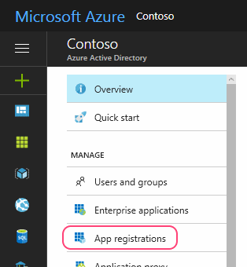
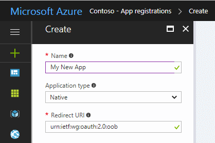
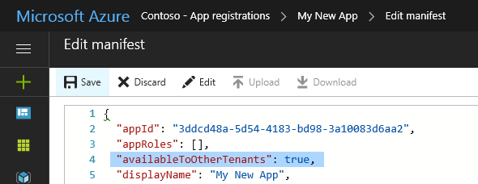
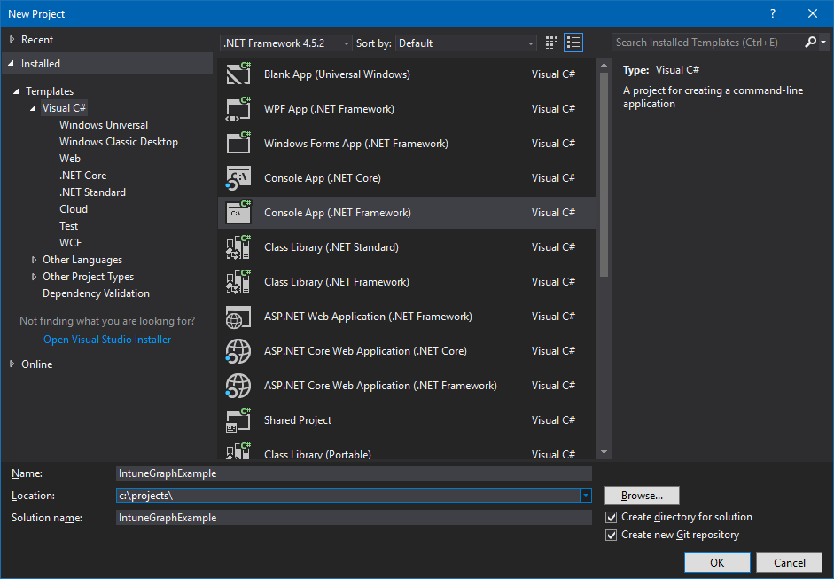
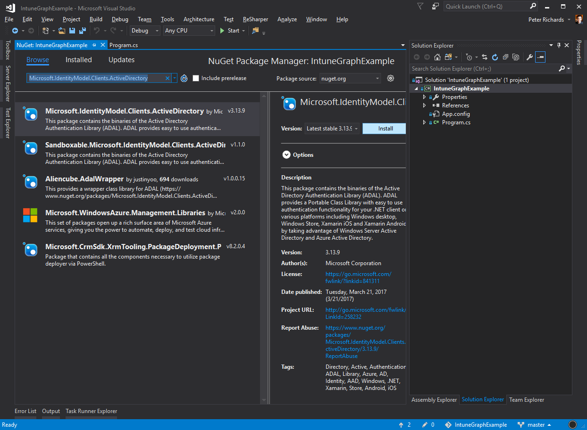
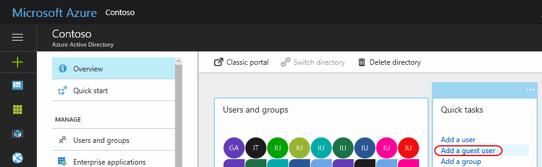
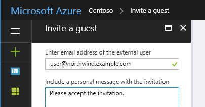
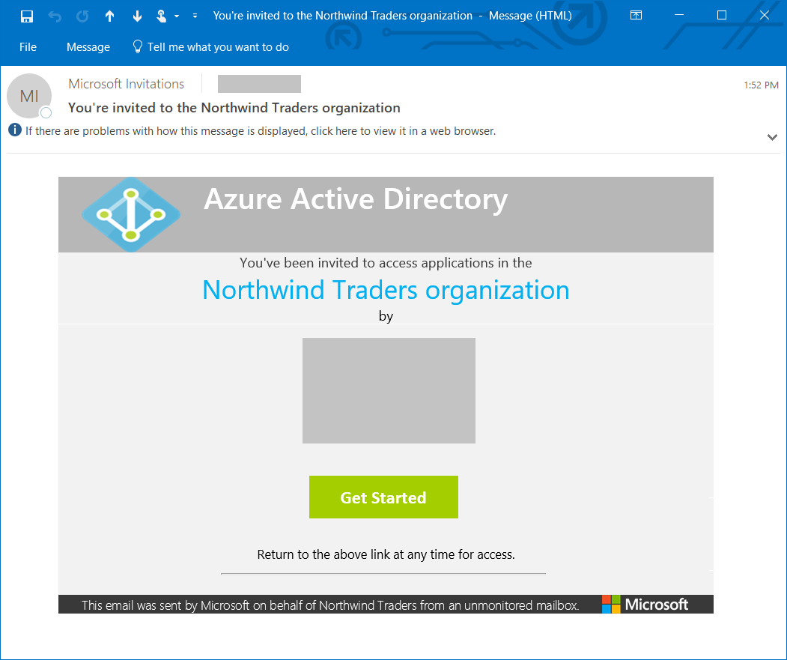

---
# required metadata

title: How to use Azure AD to access Intune APIs in Microsoft Graph
titleSuffix: Microsoft Intune
description: Describes steps needed for apps to use Azure AD to access the Intune APIs in Microsoft Graph.
keywords: intune graphapi c# powershell permission roles
author: dougeby
manager: dougeby
ms.author: dougeby
ms.date: 02/28/2022
ms.topic: overview
ms.service: microsoft-intune
ms.subservice: developer
ms.localizationpriority: medium
ms.technology:
ms.assetid: 79A67342-C06D-4D20-A447-678A6CB8D70A

# optional metadata

#ROBOTS:
#audience:

#ms.reviewer: jamiesil
ms.suite: ems
search.appverid: MET150
#ms.tgt_pltfrm:
ms.custom: intune-azure, has-adal-ref
ms.collection: M365-identity-device-management
---
# How to use Azure AD to access the Intune APIs in Microsoft Graph

The [Microsoft Graph API](https://developer.microsoft.com/graph/) now supports Microsoft Intune with specific APIs and permission roles.  The Microsoft Graph API uses Azure Active Directory (Azure AD) for authentication and access control.  
Access to the Intune APIs in Microsoft Graph requires:

- An application ID with:

  - Permission to call Azure AD and the Microsoft Graph APIs.
  - Permission scopes relevant to the specific application tasks.

- User credentials with:

  - Permission to access the Azure AD tenant associated with the application.
  - Role permissions required to support the application permission scopes.

- The end user to grant permission to the app to perform applications tasks for their Azure tenant.

This article:

- Shows how to register an application with access to the Microsoft Graph API and relevant permission roles.

- Describes the Intune API permission roles.

- Provides Intune API authentication examples for C# and PowerShell.

- Describes how to support multiple tenants.

To learn more, see:

- [Authorize access to web applications using OAuth 2.0 and Azure Active Directory](/azure/active-directory/develop/active-directory-protocols-oauth-code)
- [Getting start with Azure AD authentication](/azure/devops/integrate/get-started/authentication/oauth)
- [Integrating applications with Azure Active Directory](/azure/active-directory/develop/active-directory-integrating-applications)
- [Understand OAuth 2.0](https://oauth.net/2/)

## Register apps to use the Microsoft Graph API

To register an app to use Microsoft Graph API:

1. Sign in to the [Microsoft Endpoint Manager admin center](https://go.microsoft.com/fwlink/?linkid=2109431) using administrative credentials.

    As appropriate, you may use:
    - The tenant admin account.
    - A tenant user account with the **Users can register applications** setting enabled.

2. Select **All services** > **M365 Azure Active Directory** > **Azure Active Directory** > **App registrations**.

    

3. Either choose **New registration** to create a new application or choose an existing application.  (If you choose an existing application, skip the next step.)

4. In the **Register an application** pane, specify the following:

    - A **Name** for the application (displayed when users sign in).
    - The **Supported account type**.
    - A **Redirect URI** value. *This value is option.*

        > [!NOTE]
        > Azure Active Directory (Azure AD) Authentication Library (ADAL) and Azure AD Graph API will be deprecated. For more information, see [Update your applications to use Microsoft Authentication Library (MSAL) and Microsoft Graph API](https://techcommunity.microsoft.com/t5/azure-active-directory-identity/update-your-applications-to-use-microsoft-authentication-library/ba-p/1257363).


        

        To learn more, see [Authentication Scenarios for Azure AD](/azure/active-directory/develop/active-directory-authentication-scenarios).

5. From the application pane:

    1. Note the **Application (client) ID** value.

    2. Select **API permissions**.

6. From the **API permissions** pane, choose **Add a permission** > **Microsoft APIs** >  **Microsoft Graph**. Then, select the type of permissions your application requires. 

    Choose the roles required for your app by placing a checkmark to the left of the relevant names.  To learn about specific Intune permission scopes, see [Intune permission scopes](#intune-permission-scopes).  To learn about other Graph API permission scopes, see [Microsoft Graph permissions reference](/graph/permissions-reference).

    For best results, choose the fewest roles needed to implement your application.

### Data warehouse and reporting permissions

When you add an application through the Azure Active Directory admin center, you can choose the Intune API permissions based on the requirements of your application. 

  - **get_data_warehouse** - Use this API permission to grant access to the Intune data warehouse API from Microsoft Intune. For more information, see [Using the Microsoft Intune Data Warehouse](./reports-nav-create-intune-reports.md).

### Partner solution APIs  

The following Intune API permissions are available when adding an application through the Azure Active Directory admin center:

  - **get_device_compliance** - This API permission is used to get device state and compliance information from Microsoft Intune. This API permission is used by Network Access Control partners. For more information, see [Network Access Control integration with Intune](../protect/network-access-control-integrate.md).
  - **manage_partner_compliance_policy** - This API permission is used to manage partner compliance policies with Microsoft Intune. This API permission allows the app to send partner compliance policies and its Azure AD Group assignment to Microsoft Intune without a signed-in user. It is used by device compliance partners. For more information, see [Third party device compliance partners](../protect/device-compliance-partners.md).
  - **pfx_cert_provider** - This API permission is used to send PFX certificates to Intune for a specific user. Intune delivers the certificate to all devices enrolled by the user. For more information, see [PFX Import Powershell](https://github.com/microsoft/Intune-Resource-Access/tree/develop/src/PFXImportPowershell).
  - **scep_challenge_provider** - This API permission is used to send SCEP challenges to Intune for certificate request validation. It is used by Certification Authority partners. For more information, see [Partner Certification Authority](../protect/certificate-authority-add-scep-overview.md).
  - **send_data_usage** - This API permission is used to trigger policy changes for devices based on telecom expense management thresholds. It is used for telecom expense management partner integrations. For more information, see [Telecom expense management in Intune](../configuration/telecom-expenses-monitor.md).
  - **update_device_attributes** - This API permission is used to send device information to Intune from device compliance and mobile threat defense partners. For more information, see [Mobile Threat Defense integration with Intune](../protect/mobile-threat-defense.md) and [Third party device compliance partners](../protect/device-compliance-partners.md).
  - **update_device_health** - This API permission is used to send device health and threat status information to Intune from mobile threat defense partners. For more information, see [Mobile Threat Defense integration with Intune](../protect/mobile-threat-defense.md).

If you are a partner interested in integrating with Intune using these API permissions, contact the [Microsoft Intelligent Security Association](https://www.microsoft.com/security/business/intelligent-security-association)] team for information.

When finished, choose **Add permissions** to save your changes.

At this point, you may also:

- Choose to grant permission for all tenant accounts to use the app without providing credentials.  

    To do so, you can grant permissions and accept the confirmation prompt.

    When you run the application for the first time, you're prompted to grant the app permission to perform the selected roles.

- Make the app available to users outside your tenant.  (This is typically only required for partners supporting multiple tenants/organizations.)  

    To do so:

  1. Choose **Manifest** from the application pane.

     

  2. Change the value of the `availableToOtherTenants` setting to `true`.

  3. Save your changes.

## Intune permission scopes

Azure AD and Microsoft Graph use permission scopes to control access to corporate resources.  

Permission scopes (also called the _OAuth scopes_) control access to specific Intune entities and their properties. This section summarizes the permission scopes for Intune API features.

To learn more:
- [Azure AD authentication](/azure/active-directory/connect/active-directory-aadconnect-pass-through-authentication)
- [Application permission scopes](/azure/active-directory/develop/active-directory-v2-scopes)

When you grant permission to Microsoft Graph, you can specify the following scopes to control access to Intune features:
The following table summarizes the Intune API permission scopes.  The first column shows the name of the feature as displayed in the [Microsoft Endpoint Manager admin center](https://go.microsoft.com/fwlink/?linkid=2109431) and the second column provides the permission scope name.

_Enable Access_ setting | Scope name
:--|---
__Perform user-impacting remote actions on Microsoft Intune devices__ | [DeviceManagementManagedDevices.PrivilegedOperations.All](#mgd-po)
__Read and write Microsoft Intune devices__ | [DeviceManagementManagedDevices.ReadWrite.All](#mgd-rw)
__Read Microsoft Intune devices__ | [DeviceManagementManagedDevices.Read.All](#mgd-ro)
__Read and write Microsoft Intune RBAC settings__ | [DeviceManagementRBAC.ReadWrite.All](#rac-rw)
__Read Microsoft Intune RBAC settings__ | DeviceManagementRBAC.Read.All
__Read and write Microsoft Intune apps__ | [DeviceManagementApps.ReadWrite.All](#app-rw)
__Read Microsoft Intune apps__ | [DeviceManagementApps.Read.All](#app-ro)
__Read and write Microsoft Intune Device Configuration and Policies__ | DeviceManagementConfiguration.ReadWrite.All
__Read Microsoft Intune Device Configuration and Policies__ | [DeviceManagementConfiguration.Read.All](#cfg-ro)
__Read and write Microsoft Intune configuration__ | [DeviceManagementServiceConfig.ReadWrite.All](#svc-rw)
__Read Microsoft Intune configuration__ | DeviceManagementServiceConfig.Read.All

The table lists the settings as they appear in the [Microsoft Endpoint Manager admin center](https://go.microsoft.com/fwlink/?linkid=2109431). The following sections describe the scopes in alphabetical order.

At this time, all Intune permission scopes require administrator access.  This means you need corresponding credentials when running apps or scripts that access Intune API resources.

### <a name="app-ro"></a>DeviceManagementApps.Read.All

- **Enable Access** setting: __Read Microsoft Intune apps__

- Permits read access to the following entity properties and status:
  - Client Apps
  - Mobile App Categories
  - App Protection Policies
  - App Configurations

### <a name="app-rw"></a>DeviceManagementApps.ReadWrite.All

- **Enable Access** setting: __Read and write Microsoft Intune apps__

- Allows the same operations as __DeviceManagementApps.Read.All__

- Also permits changes to the following entities:

  - Client Apps
  - Mobile App Categories
  - App Protection Policies
  - App Configurations

### <a name="cfg-ro"></a>DeviceManagementConfiguration.Read.All

- **Enable Access** setting: __Read Microsoft Intune device configuration and policies__

- Permits read access to the following entity properties and status:
  - Device Configuration
  - Device Compliance Policy
  - Notification Messages

### <a name="cfg-ra"></a>DeviceManagementConfiguration.ReadWrite.All

- **Enable Access** setting: __Read and write Microsoft Intune device configuration and policies__

- Allows the same operations as __DeviceManagementConfiguration.Read.All__

- Apps can also create, assign, delete, and change the following entities:
  - Device Configuration
  - Device Compliance Policy
  - Notification Messages

### <a name="mgd-po"></a>DeviceManagementManagedDevices.PrivilegedOperations.All

- **Enable Access** setting: __Perform user-impacting remote actions on Microsoft Intune devices__

- Permits the following remote actions on a managed device:
  - Retire
  - Wipe
  - Reset/Recover Passcode
  - Remote Lock
  - Enable/Disable Lost Mode
  - Clean PC
  - Reboot
  - Delete User from Shared Device

### <a name="mgd-ro"></a>DeviceManagementManagedDevices.Read.All

- **Enable Access** setting: __Read Microsoft Intune devices__

- Permits read access to the following entity properties and status:
  - Managed Device
  - Device Category
  - Detected App
  - Remote actions
  - Malware information

### <a name="mgd-rw"></a>DeviceManagementManagedDevices.ReadWrite.All

- **Enable Access** setting: __Read and write Microsoft Intune devices__

- Allows the same operations as __DeviceManagementManagedDevices.Read.All__

- Apps can also create, delete, and change the following entities:
  - Managed Device
  - Device Category

- The following remote actions are also allowed:
  - Locate devices
  - Disable Activation Lock
  - Request remote assistance

### <a name="rac-ro"></a>DeviceManagementRBAC.Read.All

- **Enable Access** setting: __Read Microsoft Intune RBAC settings__

- Permits read access to the following entity properties and status:
  - Role Assignments
  - Role Definitions
  - Resource Operations

### <a name="rac-rw"></a>DeviceManagementRBAC.ReadWrite.All

- **Enable Access** setting: __Read and write Microsoft Intune RBAC settings__

- Allows the same operations as __DeviceManagementRBAC.Read.All__

- Apps can also create, assign, delete, and change the following entities:
  - Role Assignments
  - Role Definitions

### <a name="svc-ro"></a>DeviceManagementServiceConfig.Read.All

- **Enable Access** setting: __Read Microsoft Intune configuration__

- Permits read access to the following entity properties and status:
  - Device Enrollment
  - Apple Push Notification Certificate
  - Apple Device Enrollment Program
  - Apple Volume Purchase Program
  - Exchange Connector
  - Terms and Conditions
  - Telecoms Expense Management
  - Cloud PKI
  - Branding
  - Mobile Threat Defense

### <a name="svc-rw"></a>DeviceManagementServiceConfig.ReadWrite.All

- **Enable Access** setting: __Read and write Microsoft Intune configuration__

- Allows the same operations as DeviceManagementServiceConfig.Read.All_

- Apps can also configure the following Intune features:
  - Device Enrollment
  - Apple Push Notification Certificate
  - Apple Device Enrollment Program
  - Apple Volume Purchase Program
  - Exchange Connector
  - Terms and Conditions
  - Telecoms Expense Management
  - Cloud PKI
  - Branding
  - Mobile Threat Defense

## Azure AD authentication examples

This section shows how to incorporate Azure AD into your C# and PowerShell projects.

In each example, you'll need to specify an application ID that has at least the `DeviceManagementManagedDevices.Read.All` permission scope (discussed earlier).

When testing either example, you may receive HTTP status 403 (Forbidden) errors similar to the following:

```json
{
  "error": {
    "code": "Forbidden",
    "message": "Application is not authorized to perform this operation - Operation ID " +
       "(for customer support): 00000000-0000-0000-0000-000000000000 - " +
       "Activity ID: cc7fa3b3-bb25-420b-bfb2-1498e598ba43 - " +
       "Url: https://example.manage.microsoft.com/" +
       "Service/Resource/RESTendpoint?" +
       "api-version=2017-03-06 - CustomApiErrorPhrase: ",
    "innerError": {
      "request-id": "00000000-0000-0000-0000-000000000000",
      "date": "1980-01-0112:00:00"
    }
  }
}
```

If this happens, verify that:

- You've updated the application ID to one authorized to use the Microsoft Graph API and the `DeviceManagementManagedDevices.Read.All` permission scope.

- Your tenant credentials support administrative functions.

- Your code is similar to the displayed samples.


### Authenticate Azure AD in C\#

This example shows how to use C# to retrieve a list of devices associated with your Intune account.

 > [!NOTE]
 > Azure Active Directory (Azure AD) Authentication Library (ADAL) and Azure AD Graph API will be deprecated. For more information, see [Update your applications to use Microsoft Authentication Library (MSAL) and Microsoft Graph API](https://techcommunity.microsoft.com/t5/azure-active-directory-identity/update-your-applications-to-use-microsoft-authentication-library/ba-p/1257363).

1. Start Visual Studio and then create a new Visual C# Console app (.NET Framework) project.

2. Enter a name for your project and provide other details as desired.

    

3. Use the Solution Explorer to add the Microsoft MSAL NuGet package to the project:

    1. Right-click the Solution Explorer.
    1. Choose **Manage NuGet Packages…** &gt; **Browse**.
    1. Select `Microsoft.IdentityModel.Clients.ActiveDirectory` and then choose **Install**.

    

4. Add the following statements to the top of **Program.cs**:

    ``` csharp
    using Microsoft.IdentityModel.Clients.ActiveDirectory;
    using System.Net.Http;
    ```

5. Add a method to create the authorization header:

    ``` csharp
    private static async Task<string> GetAuthorizationHeader()
    {
        string applicationId = "<Your Application ID>";
        string authority = "https://login.microsoftonline.com/common/";
        Uri redirectUri = new Uri("urn:ietf:wg:oauth:2.0:oob");
        AuthenticationContext context = new AuthenticationContext(authority);
        AuthenticationResult result = await context.AcquireTokenAsync(
            "https://graph.microsoft.com",
            applicationId, redirectUri,
            new PlatformParameters(PromptBehavior.Auto));
        return result.CreateAuthorizationHeader();
    ```

    Remember to change the value of `application_ID` to match one granted at least the `DeviceManagementManagedDevices.Read.All` permission scope, as described earlier.

6. Add a method to retrieve the list of devices:

    ``` csharp
    private static async Task<string> GetMyManagedDevices()
    {
        string authHeader = await GetAuthorizationHeader();
        HttpClient graphClient = new HttpClient();
        graphClient.DefaultRequestHeaders.Add("Authorization", authHeader);
        return await graphClient.GetStringAsync(
            "https://graph.microsoft.com/beta/me/managedDevices");
    }
    ```

7. Update **Main** to call **GetMyManagedDevices**:

    ``` csharp
    string devices = GetMyManagedDevices().GetAwaiter().GetResult();
    Console.WriteLine(devices);
    ```

8. Compile and run your program.  

When you first run your program, you should receive two prompts.  The first requests your credentials and the second grants permissions for the `managedDevices` request.  

For reference, here's the completed program:

``` csharp
using Microsoft.IdentityModel.Clients.ActiveDirectory;
using System;
using System.Net.Http;
using System.Threading.Tasks;

namespace IntuneGraphExample
{
    class Program
    {
        static void Main(string[] args)
        {
            string devices = GetMyManagedDevices().GetAwaiter().GetResult();
            Console.WriteLine(devices);
        }

        private static async Task<string> GetAuthorizationHeader()
        {
            string applicationId = "<Your Application ID>";
            string authority = "https://login.microsoftonline.com/common/";
            Uri redirectUri = new Uri("urn:ietf:wg:oauth:2.0:oob");
            AuthenticationContext context = new AuthenticationContext(authority);
            AuthenticationResult result = await context.AcquireTokenAsync("https://graph.microsoft.com", applicationId, redirectUri, new PlatformParameters(PromptBehavior.Auto));
            return result.CreateAuthorizationHeader();
        }

        private static async Task<string> GetMyManagedDevices()
        {
            string authHeader = await GetAuthorizationHeader();
            HttpClient graphClient = new HttpClient();
            graphClient.DefaultRequestHeaders.Add("Authorization", authHeader);
            return await graphClient.GetStringAsync("https://graph.microsoft.com/beta/me/managedDevices");
        }
    }
}
```

### Authenticate Azure AD (PowerShell)

PowerShell scripts can use the AzureAD PowerShell module for authentication.  To learn more, see [Azure Active Directory PowerShell Version 2](/powershell/azure/active-directory/install-adv2) and the [Intune PowerShell examples](https://github.com/microsoftgraph/powershell-intune-samples).

## Support multiple tenants and partners

If your organization supports organizations with their own Azure AD tenants, you may want to permit your clients to use your application with their respective tenants.

To do so:

1. Verify that the client account exists in the target Azure AD tenant.

2. Verify that your tenant account allows users to register applications (see **User settings**).

3. Establish a relationship between each tenant.  

    To do so, either:

    a. Use the [Microsoft Partner Center](https://partnercenter.microsoft.com/) to define a relationship with your client and their email address.

    b. Invite the user to become a guest of your tenant.

To invite the user to be a guest of your tenant:

1. Choose **Add a guest user** from the **Quick tasks** panel.

    

2. Enter the client's email address and (optionally) add a personalized message for the invite.

    

3. Choose **Invite**.

This sends an invite to the user.

   

   The user needs to choose the **Get Started** link to accept your invitation.

When the relationship is established (or your invitation has been accepted), add the user account to the **Directory role**.

Remember to add the user to other roles as needed. For example, to allow the user to manage Intune settings, they need to be either a **Global Administrator** or an **Intune Service administrator**.

Also:

- Use https://admin.microsoft.com to assign an Intune license to your user account.

- Update application code to authenticate to the client's Azure AD tenant domain, rather than your own.

    For example, suppose your tenant domain is `contosopartner.onmicrosoft.com` and your client's tenant domain is `northwind.onmicrosoft.com`, you would update your code to authenticate to your client's tenant.

    To do so in a C# application based on the earlier example, you'd change the value of the `authority` variable:

    ``` csharp
    string authority = "https://login.microsoftonline.com/common/";
    ```

    to

    ``` csharp
    string authority = "https://login.microsoftonline.com/northwind.onmicrosoft.com/";
    ```
