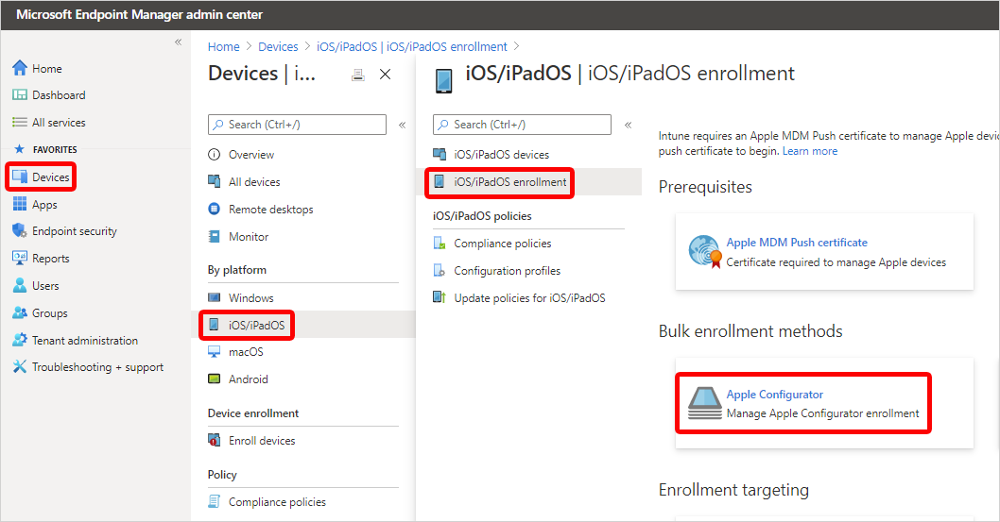
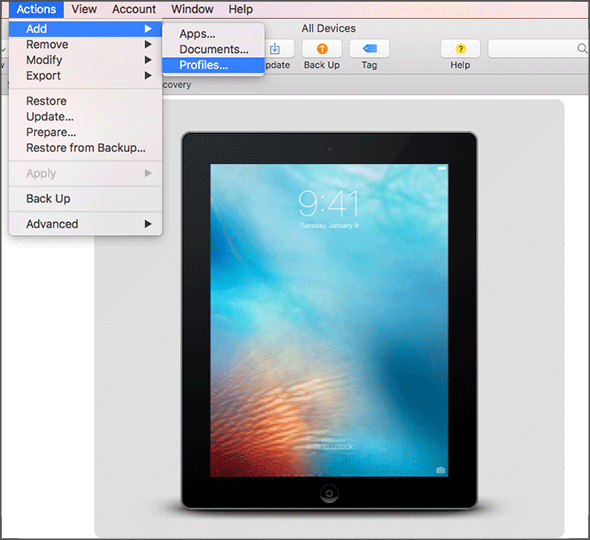

---
# required metadata

title: iOS/iPadOS device enrollment - Apple Configurator-Setup Assistant
titleSuffix: Microsoft Intune
description: Learn how to use the Apple Configurator to enroll corporate-owned iOS/iPadOS devices with Setup Assistant.
keywords:
author: Lenewsad
ms.author: lanewsad
manager: dougeby
ms.date: 05/04/2018
ms.topic: how-to
ms.service: microsoft-intune
ms.subservice: enrollment
ms.localizationpriority: high
ms.technology:
ms.assetid: 671e4d76-0c61-11e8-ba89-0ed5f89f718b

# optional metadata

#ROBOTS:
#audience:

ms.reviewer: tisilver
ms.suite: ems
search.appverid: MET150
#ms.tgt_pltfrm:
ms.custom: intune-azure;seodec18
ms.collection:
  - M365-identity-device-management
  - highpri
---

# Set up iOS/iPadOS device enrollment with Apple Configurator

[!INCLUDE [azure_portal](../includes/azure_portal.md)]

Intune supports the enrollment of iOS/iPadOS devices using [Apple Configurator](https://itunes.apple.com/app/apple-configurator-2/id1037126344) running on a Mac computer. Enrolling with Apple Configurator requires that you USB-connect each iOS/iPadOS device to a Mac computer to set up corporate enrollment. You can enroll devices into Intune with Apple Configurator in two ways:  

- **Setup Assistant enrollment** - Wipes the device and prepares it to enroll during Setup Assistant.
- **Direct enrollment** - Does not wipe the device and enrolls the device through iOS/iPadOS settings. This method only supports devices with **no user affinity**.

Apple Configurator enrollment methods can't be used with the [device enrollment manager](device-enrollment-manager-enroll.md).  

## Prerequisites

- Physical access to iOS/iPadOS devices
- [Set MDM authority](../fundamentals/mdm-authority-set.md)
- [An Apple MDM push certificate](apple-mdm-push-certificate-get.md)
- Device serial numbers (Setup Assistant enrollment only)
- USB connection cables
- macOS computer running [Apple Configurator 2.0](https://itunes.apple.com/app/apple-configurator-2/id1037126344)

## Create an Apple Configurator profile for devices

A device enrollment profile defines the settings applied during enrollment. These settings are applied only once. Follow these steps to create an enrollment profile to enroll iOS/iPadOS devices with Apple Configurator.

1. In the [Microsoft Endpoint Manager admin center](https://go.microsoft.com/fwlink/?linkid=2109431), choose **Devices** > **iOS/iPadOS** > **iOS/iPadOS enrollment** > **Apple Configurator**.

    

2. Choose **Profiles** > **Create**.

3. Under **Create Enrollment Profile**, on the **Basics** tab, type a **Name** and **Description** for the profile for administrative purposes. Users do not see these details. You can use this Name field to create a dynamic group in Azure Active Directory. Use the profile name to define the enrollmentProfileName parameter to assign devices with this enrollment profile. Learn more about Azure Active Directory dynamic groups.

    :::image type="content" source="./media/apple-configurator-enroll-ios/apple-configurator-profile-create.png" alt-text="Screenshot of the create enrollment profile pane with the Basics tab selected.":::

4. Click **Next** to display the **Settings** page.

5. For **User Affinity**, choose whether devices with this profile must enroll with or without an assigned user.

    - **Enroll with user affinity** - Choose this option for devices that belong to users and that want to use the company portal for services like installing apps. The device must be affiliated with a user with Setup Assistant and can then access company data and email. Only supported for Setup Assistant enrollment. User affinity requires [WS-Trust 1.3 Username/Mixed endpoint](/previous-versions/windows/it-pro/windows-server-2008-R2-and-2008/ff608241(v=ws.10)). [Learn more](/powershell/module/adfs/get-adfsendpoint).

    - **Enroll without User Affinity** - Choose this option for devices unaffiliated with a single user. Use this for devices that perform tasks without accessing local user data. Apps requiring user affiliation (including the Company Portal app used for installing line-of-business apps) won't work. Required for direct enrollment.

     > [!NOTE]
     > When **Enroll with user affinity** is selected, make sure that the device is affiliated with a user with Setup Assistant within the first 24 hours of the device being enrolled. Otherwise enrollment might fail, and a factory reset will be needed to enroll the device.

6. If you chose **Enroll with User Affinity**, you have the option to let users authenticate with Company Portal instead of the Apple Setup Assistant.

    > [!NOTE]
    > If you want do any of the following, set **Authenticate with Company Portal instead of Apple Setup Assistant** to **Yes**.
    >    - use multifactor authentication
    >    - prompt users who need to change their password when they first sign in
    >    - prompt users to reset their expired passwords during enrollment
    >
    > These are not supported when authenticating with Apple Setup Assistant.

7. Choose **Create** to save the profile.

## Setup Assistant enrollment

### Add Apple Configurator serial numbers

1. Create a two-column, comma-separated value (.csv) list without a header. Add the serial number in the left column, and the details in the right column. The current maximum for the list is 5,000 rows. In a text editor, the .csv list looks like this:

    F7TLWCLBX196,device details 
    DLXQPCWVGHMJ,device details

   Learn [how to find an iOS/iPadOS device serial number](https://support.apple.com/HT204073).
2. In the [Microsoft Endpoint Manager admin center](https://go.microsoft.com/fwlink/?linkid=2109431), choose **Devices** > **iOS/iPadOS** > **iOS/iPadOS enrollment** > **Apple Configurator** > **Devices** > **Add**.

5. Select an **Enrollment profile** to apply to the serial numbers you're importing. If you want the new serial number details to overwrite any existing details, choose **Overwrite details for existing identifiers**.
6. Under **Import Devices**, browse to the csv file of serial numbers, and select **Add**.

### Reassign a profile to device serial numbers

You can assign an enrollment profile when you import iOS/iPadOS serial numbers for Apple Configurator enrollment. You can also assign profiles from two places in the Azure portal:
- **Apple Configurator devices**
- **AC profiles**

#### Assign from Apple Configurator devices
1. In the [Microsoft Endpoint Manager admin center](https://go.microsoft.com/fwlink/?linkid=2109431), choose **Devices** > **iOS/iPadOS** > **iOS/iPadOS enrollment** > **Apple Configurator** > **Devices** > choose the serial numbers > **Assign profile**.
2. Under **Assign Profile**, choose the **New profile** you want to assign, and then choose **Assign**.

#### Assign from profiles
1. In the [Microsoft Endpoint Manager admin center](https://go.microsoft.com/fwlink/?linkid=2109431), choose **Devices** > **iOS/iPadOS** > **iOS/iPadOS enrollment** > **Apple Configurator** > **Profiles** > choose a profile.
2. In the profile, choose **Devices assigned**, and then choose **Assign**.
3. Filter to find device serial numbers you want to assign to the profile, select the devices, and then choose **Assign**.

### Export the profile
After you create the profile and assign serial numbers, you must export the profile from Intune as a URL. You then import it into Apple Configurator on a Mac for deployment to devices.

1. In the [Microsoft Endpoint Manager admin center](https://go.microsoft.com/fwlink/?linkid=2109431), choose **Devices** > **iOS/iPadOS** > **iOS/iPadOS enrollment** > **Apple Configurator** > **Profiles** >  choose the profile to export.
2. On the profile, select **Export Profile**.
3. Copy the **Profile URL**. You can then add it in Apple Configurator to define the Intune profile used by iOS/iPadOS devices.

   Next you import this profile to Apple Configurator in the following procedure to define the Intune profile used by iOS/iPadOS devices.

### Enroll devices with Setup Assistant

1. On a Mac computer, open **Apple Configurator 2**. In the menu bar, choose **Apple Configurator 2**, and then choose **Preferences**.
    > [!WARNING]
    > Devices are reset to factory configurations during the enrollment process. As a best practice, reset the device and turn it on. Devices should be at the **Hello** screen when you connect the device.
    > If the device was already registered with the Apple ID account, the device must be deleted from the Apple iCloud before starting the enrollment process. The prompt error appears as "Unable to activate [Device name]".

2. In the **preferences** pane, select **Servers** and choose the plus symbol (+) to launch the MDM Server wizard. Choose **Next**.
3. Enter the **Host name or URL** and **enrollment URL** for the MDM server under Setup Assistant enrollment for iOS/iPadOS devices with Microsoft Intune. For the Enrollment URL, enter the enrollment profile URL exported from Intune. Choose **Next**.  
    You can safely disregard a warning stating "server URL is not verified." To continue, choose **Next** until the wizard is finished.
4. Connect the iOS/iPadOS mobile devices to the Mac computer with a USB adapter.
5. Select the iOS/iPadOS devices you want to manage, and then choose **Prepare**. On the **Prepare iOS/iPadOS Device** pane, select **Manual**, and then choose **Next**.
6. On the **Enroll in MDM Server** pane, select the server name you created, and then choose **Next**.
7. On the **Supervise Devices** pane, select the level of supervision, and then choose **Next**.
8. On the **Create an Organization** pane, choose the **Organization** or create a new organization, and then choose **Next**.
9. On the **Configure iOS/iPadOS Setup Assistant** pane, choose the steps to be presented to the user, and then choose **Prepare**. If prompted, authenticate to update trust settings.  
10. When the iOS/iPadOS device finishes preparing, disconnect the USB cable.  

### Distribute devices
The devices are now ready for corporate enrollment. Turn off the devices and distribute them to users. When users turn on their devices, Setup Assistant starts.

After users receive their devices, they must complete Setup Assistant. Devices configured with user affinity can install and run the Company Portal app to download apps and manage devices.

## Direct enrollment
When you directly enroll iOS/iPadOS devices with Apple Configurator, you can enroll a device without acquiring the device's serial number. You can also name the device for identification purposes before Intune captures the device name during enrollment. The Company Portal app is not supported for directly enrolled devices. This method does not wipe the device.

Apps requiring user affiliation, including the Company Portal app used for installing line-of-business apps, cannot be installed.

### Export the profile as .mobileconfig to iOS/iPadOS devices

1. In the [Microsoft Endpoint Manager admin center](https://go.microsoft.com/fwlink/?linkid=2109431), choose **Devices** > **iOS/iPadOS** > **iOS/iPadOS enrollment** > **Apple Configurator** > **Profiles** >  choose the profile to export > **Export Profile**.
2. Under **Direct enrollment**, choose **Download profile**, and save the file. An enrollment profile file is only valid for two weeks at which time you must re-create it.
3. Transfer the file to a Mac computer running [Apple Configurator](https://itunes.apple.com/us/app/apple-configurator-2/id1037126344?mt=12) to push directly as a management profile to iOS/iPadOS devices.
4. Prepare the device with Apple Configurator by using the following steps:
    1. On a Mac computer, open Apple Configurator 2.0.
    2. Connect the iOS/iPadOS device to the Mac computer with a USB cord. Close Photos, iTunes, and other apps that open for the device when the device is detected.
    3. In Apple Configurator, choose the connected iOS/iPadOS device, and then choose the **Add** button. Options that can be added to the device appear in the drop-down list. Choose **Profiles**.

        

    4. Use the file picker to select the .mobileconfig file that you exported from Intune, and then choose **Add**. The profile is added to the device. If the device is Unsupervised, the installation requires acceptance on the device.
5. Use the following steps to install the profile on the iOS/iPadOS device. The device must have already completed the Setup Assistant and be ready to use. If enrollment entails app deployments, the device should have an Apple ID set up because the app deployment requires that you have an Apple ID signed in for the App Store.
    1. Unlock the iOS/iPadOS device.
    2. In the **Install profile** dialog box for **Management profile**, choose **Install**.
    3. Provide the Device Passcode or Apple ID, if necessary.
    4. Accept the **Warning**, and choose **Install**.
    5. Accept the **Remote Warning**, and choose **Trust**.
    6. When the **Profile Installed** box confirms the profile as Installed, choose **Done**.

6. On the iOS/iPadOS device, open **Settings** and go to **General** > **Device Management** > **Management Profile**. Confirm that the profile installation is listed, and check the iOS/iPadOS policy restrictions and installed apps. Policy restrictions and apps might take up to 10 minutes to appear on the device.

7. Distribute devices. The iOS/iPadOS device is now enrolled in Intune and managed.  

## Next steps  

* Manage enrolled devices in Microsoft Endpoint Manager by using the actions and features available in the admin center. For more information about accessing device management actions and device details in the admin center, see [What is Microsoft Intune device management?](../remote-actions/device-management)  

* For information about enrolling macOS devices via device enrollment, see [Use Direct Enrollment for macOS devices](device-enrollment-direct-enroll-macos.md).
