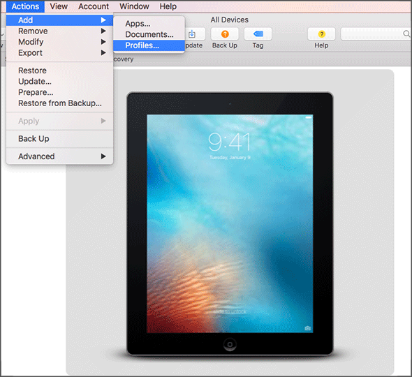

---
# required metadata

title: Set up Apple device management in Intune for corporate-owned userless devices 
titleSuffix: Microsoft Intune
description: Set up Intune for corporate-owned userless iOS/iPadOS devices. 
keywords:
author: lenewsad
ms.author: lanewsad
manager: dougeby
ms.date: 02/17/2025
ms.topic: how-to
ms.service: microsoft-intune
ms.subservice: enrollment
ms.localizationpriority: high
ms.assetid: 

# optional metadata

#ROBOTS:
#audience:

ms.reviewer: tranamst
ms.suite: ems
search.appverid:
#ms.tgt_pltfrm:
ms.custom: intune-azure
ms.collection:
- tier1
- M365-identity-device-management
---

# Set up Intune enrollment for Apple corporate-owned userless devices    

Intune supports the enrollment of iOS/iPadOS devices using [Apple Configurator](https://itunes.apple.com/app/apple-configurator-2/id1037126344) running on a Mac computer. This procedure differs from what's shown in [the Apple Configurator enrollment process](apple-configurator-enroll-ios.md) because it only enrolls devices without user affinity. Enrolling with Apple Configurator requires that you USB-connect each iOS/iPadOS device to a Mac computer to set up corporate enrollment. 

You can enroll devices into Intune as a userless device with Apple Configurator by *direct enrollment*. This method doesn't wipe the device, and enrolls the device through iOS/iPadOS settings. This method only supports devices with **no user affinity**.

This article describes how to set up iOS/iPadOS device management and enroll userless devices for use at work. 

## Certificates  
Apple Configurator enrollment supports the Automated Certificate Management Environment (ACME) protocol. When new devices enroll, the management profile on the device receives an ACME certificate. The ACME protocol provides better protection than the SCEP protocol against unauthorized certificate issuance through robust validation mechanisms and automated processes, which helps reduce errors in certificate management.

Devices that are already enrolled do not get an ACME certificate on unless they re-enroll into Microsoft Intune. ACME is supported on devices running: 

- iOS 16.0 or later  

- iPadOS 16.1 or later  

## Prerequisites

- Physical access to iOS/iPadOS devices
- [Set MDM authority](../fundamentals/mdm-authority-set.md)
- [An Apple MDM push certificate](apple-mdm-push-certificate-get.md)
- Device serial numbers (Setup Assistant enrollment only)
- USB connection cables
- macOS computer running [Apple Configurator 2.0](https://itunes.apple.com/app/apple-configurator-2/id1037126344) 

## Create an Apple Configurator profile for devices

A device enrollment profile defines the settings applied during enrollment. These settings are applied only once. Follow these steps to create an enrollment profile to enroll iOS/iPadOS devices with Apple Configurator.  

1. Sign in to the [Microsoft Intune admin center](https://go.microsoft.com/fwlink/?linkid=2109431).  
1. Go to **Devices**.
1. Expand **Device onboarding**, and then select **Enrollment**.  
1. Select the **Apple** tab.  
1. Under **Bulk Enrollment Methods**, select **Apple Configurator**.  
1. Go to **Profiles** > **Create**.  
1. Under **Create Enrollment Profile**, on the **Basics** tab, type a **Name** and **Description** for the profile. Users don't see these details. You can use the name to create a dynamic group in Microsoft Entra ID. Use the profile name to define the enrollmentProfileName parameter to assign devices with this enrollment profile. For more information about how to create a dynamic group with rules, see [Create a group membership rule](/azure/active-directory/enterprise-users/groups-create-rule#to-create-a-group-membership-rule).  
    
    :::image type="content" source="./media/apple-configurator-enroll-ios/apple-configurator-profile-create.png" alt-text="Screenshot of the create enrollment profile pane with the Basics tab selected.":::

1. Select **Next** to go to the **Settings** page.

1. For **User Affinity**, choose whether devices with this profile must enroll with or without an assigned user.

    - **Enroll without User Affinity** - Choose this option for devices unaffiliated with a single user and enroll as a userless device. Use this for devices that perform tasks without accessing local user data. Apps requiring user affiliation (including the Company Portal app used for installing line-of-business apps) won't work. Required for direct enrollment.

1. Choose **Create** to save the profile.
 
## Create a device group  
You can create *assigned device groups* or *dynamic device groups* in Intune. For more information about both groups, see [Add groups to organize users and devices](../fundamentals/groups-add.md).

Dynamic device groups are configured to automatically add and remove devices based on a set of rules and parameters. For example, you can group devices by enrollment profile name. 

Complete the following steps to create a dynamic Microsoft Entra device group for devices enrolled with an Apple corporate-owned, userless enrollment profile.  

1. In the [admin center](https://go.microsoft.com/fwlink/?linkid=2109431), go to **Groups** > **All groups** > **New group**.  
2. Enter the required fields as follows:  
    - **Group type**: Security  
    - **Group name**: Type an intuitive name (like Factory 1 devices)  
    - **Membership type**: Dynamic device  
3. Choose **Add dynamic query**.
4. In the **Dynamic membership rules** blade, fill out the fields as follows:
    - **Add dynamic membership rule**: Simple rule
    - **Add devices where**: enrollmentProfileName
    - In the middle box, choose **Equals**.
    - In the last field, enter the enrollment profile name that you created in [Create an Apple Configurator profile for devices](#create-an-apple-configurator-profile-for-devices).  

    For more information about dynamic membership rules, see [Dynamic membership rules for groups in Microsoft Entra ID](/azure/active-directory/users-groups-roles/groups-dynamic-membership). 
5. Choose **Add query** > **Create**.  

## Export the profile as .mobileconfig to iOS/iPadOS devices  

1. In the [Microsoft Intune admin center](https://go.microsoft.com/fwlink/?linkid=2109431), go to **Devices** .
1. Expand **Device onboarding**, and then select **Enrollment**.  
1. Select the **Apple** tab.  
1. Under **Bulk Enrollment Methods**, select **Apple Configurator**.  
1. Go to **Profiles**. Choose a profile to export. 
    - Choose either the SCEP or the ACME profile based on your operating system. 
1. Select **Export Profile**.  
1. Copy the **Profile URL**. You can then add it in Apple Configurator to define the Intune profile used by iOS/iPadOS devices.   
1. Under **Direct enrollment**, choose **Download profile**, and save the file. An enrollment profile file is only valid for two weeks at which time you must re-create it.
1. Transfer the file to a Mac computer running [Apple Configurator](https://itunes.apple.com/us/app/apple-configurator-2/id1037126344?mt=12) to push directly as a management profile to iOS/iPadOS devices.
1. Prepare the device with Apple Configurator by using the following steps:
    1. On a Mac computer, open Apple Configurator 2.0.
    2. Connect the iOS/iPadOS device to the Mac computer with a USB cord. Close Photos, iTunes, and other apps that open for the device when the device is detected.
    3. In Apple Configurator, choose the connected iOS/iPadOS device, and then choose the **Add** button. Options that can be added to the device appear in the drop-down list. Choose **Profiles**.

        

    4. Use the file picker to select the .mobileconfig file that you exported from Intune, and then choose **Add**. The profile is added to the device. If the device is Unsupervised, the installation requires acceptance on the device.
1. Use the following steps to install the profile on the iOS/iPadOS device. The device must have already completed the Setup Assistant and be ready to use. If enrollment entails app deployments, the device should have an Apple ID set up because the app deployment requires that you have an Apple ID signed in for the App Store.
    1. Unlock the iOS/iPadOS device.
    2. In the **Install profile** dialog box for **Management profile**, choose **Install**.
    3. Provide the Device Passcode or Apple ID, if necessary.
    4. Accept the **Warning** and choose **Install**.
    5. Accept the **Remote Warning** and choose **Trust**.
    6. When the **Profile Installed** box confirms the profile as Installed, choose **Done**.

1. On the iOS/iPadOS device, open **Settings** and go to **General** > **Device Management** > **Management Profile**. Confirm that the profile installation is listed, and check the iOS/iPadOS policy restrictions and installed apps. Policy restrictions and apps might take up to 10 minutes to appear on the device.

1. Distribute devices. The iOS/iPadOS device is now enrolled in Intune and managed.

## After enrollment 

### App updates    
The Microsoft Intune app automatically installs available app updates for itself, Authenticator, and Company Portal. When an update becomes available, the Intune app closes and installs the update. The app must be closed completely to install the update.   

### Manage devices remotely    

The following remote actions are available for Apple devices:     

* Retire
* Wipe  
* Delete
* Remote lock
* Sync
* Remove passcode
* Revoke licenses

You can take action on one device at a time. For more information about where to find remote actions in Intune, see [Remove devices by using wipe, retire, or manually unenrolling the device](../remote-actions/devices-wipe.md).

### Troubleshooting + Support     

Go to **Troubleshooting + Support** in the Microsoft Intune admin center to:

* See a list of iOS/iPadOS devices enrolled by a user.
* Enable troubleshooting of Apple devices the same way you can troubleshoot other user devices. 

## Known limitations  

The ACME profile can sometimes fail to install on iOS/iPadOS 16 or later even though this is correct operating system. If this happens, use the SCEP profile instead. 
Follow steps from [Export the profile as .mobileconfig to iOS/iPadOS devices](#export-the-profile-as-mobileconfig-to-iosipados-devices) to install the SCEP profile onto your device. If it fails to install once, retry until installation is successful.  

## Next steps  

* [Create an iOS/iPadOS MDM app configuration policy](../apps/app-configuration-policies-use-ios.md) to restrict settings on devices with specific users. 
* For information about enrolling macOS devices via direct enrollment with Apple Configurator, see [Use Direct Enrollment for macOS devices](device-enrollment-direct-enroll-macos.md).
