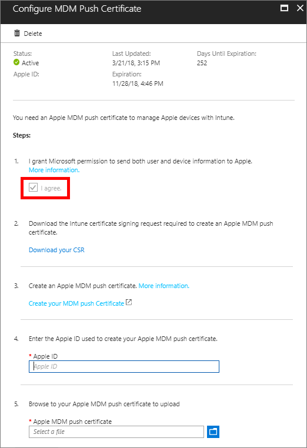

---
# required metadata

title: Get an Apple MDM Push certificate for Intune
titleSuffix: 
description: Get an Apple MDM Push certificate to manage iOS/iPadOS devices with Intune.
keywords:
author: Lenewsad
ms.author: lanewsad
manager: dougeby
ms.date: 07/11/2022
ms.topic: how-to
ms.service: microsoft-intune
ms.subservice: enrollment
ms.localizationpriority: high
ms.technology:
ms.assetid: 6f67fcd2-5682-4f9c-8d74-d4ab69dc978c

# optional metadata

#ROBOTS:
#audience:

ms.reviewer: tisilver
ms.suite: ems
search.appverid: MET150
#ms.tgt_pltfrm:
ms.custom: intune-azure;seodec18
ms.collection:
  - M365-identity-device-management
  - highpri
---

# Get an Apple MDM push certificate

[!INCLUDE [azure_portal](../includes/azure_portal.md)]

Upload and renew your Apple MDM push certificates in Microsoft Intune. An Apple MDM Push certificate is required to manage iOS/iPadOS and macOS devices in Microsoft Intune, and enables devices to enroll via: 

- The Intune Company Portal app.
- Apple bulk enrollment methods, such as the Device Enrollment Program, Apple School Manager, and Apple Configurator.

Certificates must be renewed annually. 

This article describes how to use Intune to create and renew an Apple MDM push certificate.  

## Steps to get your certificate
Sign in to the [Microsoft Endpoint Manager admin center](https://go.microsoft.com/fwlink/?linkid=2109431), choose **Devices** > **Enroll devices** > **Apple enrollment** > **Apple MDM Push Certificate**, and then follow these steps.

### Step 1. Grant Microsoft permission to send user and device information to Apple
Select **I agree.** to give Microsoft permission to send data to Apple.

### Step 2. Download the Intune certificate signing request required to create an Apple MDM push certificate
Select **Download your CSR** to download and save the request file locally. The file is used to request a trust relationship certificate from the Apple Push Certificates Portal.

### Step 3. Create an Apple MDM push certificate
1. Select **Create your MDM push Certificate** to go to the Apple Push Certificates Portal. 
2. Sign in with your organization's Apple ID. 
3. Select **Create a Certificate**. 
4. Read and agree to the terms and conditions. Then select **Accept**.  
5. Select **Choose File** and then select the CSR file you downloaded in Intune.  
6. Select **Upload**. 
7. On the confirmation page, select **Download**.  The certificate file (.pem) downloads to your device. Save this file for later.   

> [!NOTE]
> The certificate is associated with the Apple ID used to create it. As a best practice, use a company email address as your Apple ID and make sure the mailbox is monitored by more than one person, such as by a distribution list. Avoid using a personal Apple ID.  

#### Managed Apple ID  
If you plan to federate your existing Azure AD accounts with Apple to use Managed Apple ID, contact Apple to have the existing APNS certificate migrated to your new Managed Apple ID. For more information, see the Apple Support [user guide for Apple School Manager](https://support.apple.com/guide/apple-school-manager/apd6603d9206/web).  

### Step 4. Enter the Apple ID used to create your Apple MDM push certificate
Return to the admin center and enter your Apple ID as a reminder for when you need to renew the certificate.  

### Step 5. Browse to your Apple MDM push certificate to upload
1. Select the **Folder** icon. 
2. Select the certificate file you downloaded in the Apple portal. 
3. Select **Upload** to finish configuring the MDM push certificate. 

## Renew Apple MDM push certificate
The Apple MDM push certificate is valid for 365 days. You must renew it annually to maintain iOS/iPadOS and macOS device management. Once the certificate expires, there is a 30-day grace period to renew it.  

Renew the MDM push certificate with the same Apple ID you used to create it.  

1. Sign in to the [Microsoft Endpoint Manager admin center](https://go.microsoft.com/fwlink/?linkid=2109431).
2. Select **Devices** > **Enroll devices** > **Apple enrollment** > **Apple MDM Push Certificate**.
3. Select **Download your CSR** to download and save the request file locally. The file is used to request a trust relationship certificate from the Apple Push Certificates Portal.
4. Select **Create your MDM push Certificate** to go to the Apple Push Certificates Portal. 
5. Find the certificate you want to renew and select **Renew**.
6. Select **Choose File** and select the new CSR file you downloaded.
7. In the provided field, enter a unique note about the certificate so that you can easily identify it later.  
   > [!TIP]
   > Each certificate has a unique UID. To find it, look for the subject ID, which shows the GUID portion of the UID, in the certificate details. You can also find this information on the enrolled iOS/iPadOS device. Go to **Settings** > **General** > **Device Management** > **Management Profile** > **More Details** > **Management Profile**. The **Topic** value contains the unique GUID that you can match up to the certificate in the Apple Push Certificates portal.  
8. Select **Upload**.    
9. On the **Confirmation** screen, select **Download**.  
10. Return to the admin center > **Configure MDM Push Certificate** page, and upload your certificate file. 

Renewal is complete when your Apple MDM push certificate status appears active in both the admin center and Apple portal. 

## Next steps  

For more information about enrollment options, see [Choose how to enroll iOS/iPadOS devices](ios-enroll.md).
