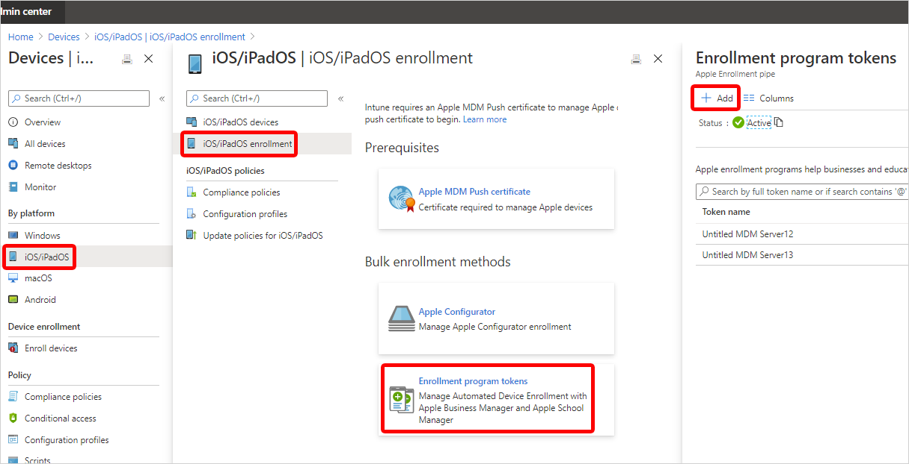
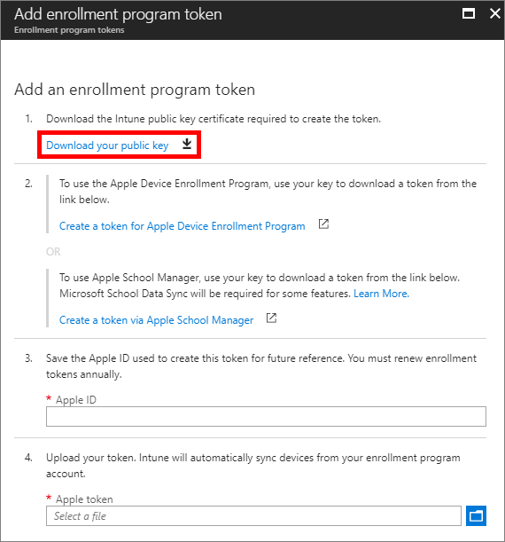
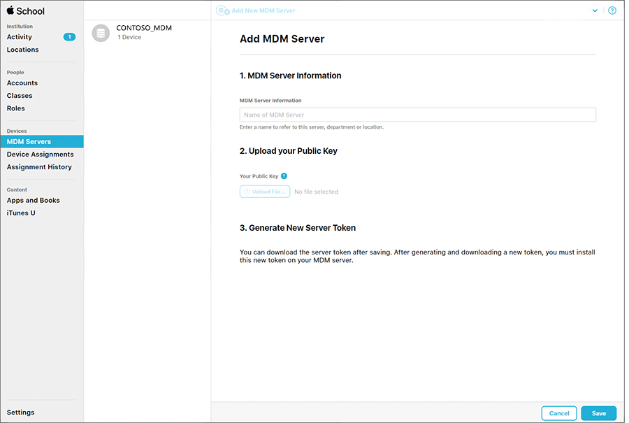
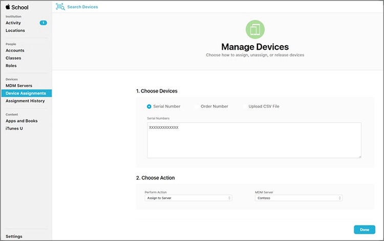
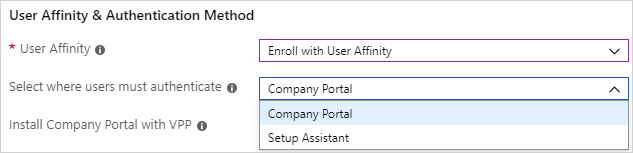
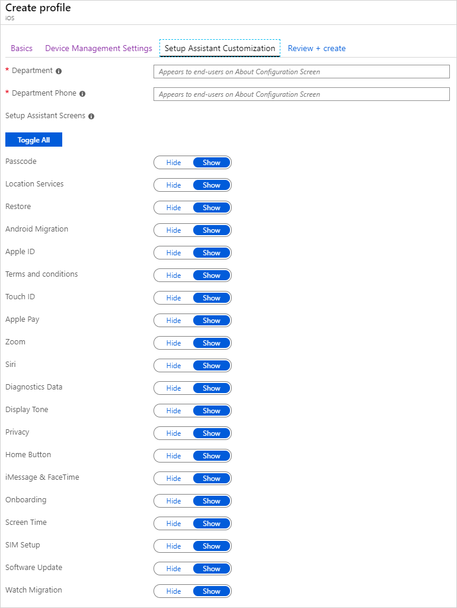

---
# required metadata

title: Apple School Manager Program enrollment for iOS/iPadOS devices
titleSuffix: Microsoft Intune
description: Learn how to set up Apple School Manager program enrollment for corporate-owned iOS/iPadOS devices with Intune.
keywords:
author: Lenewsad
ms.author: lanewsad
manager: dougeby
ms.date: 06/17/2020
ms.topic: how-to
ms.service: microsoft-intune
ms.subservice: enrollment
ms.localizationpriority: high
ms.technology:
ms.assetid: 4c35a23e-0c61-11e8-ba89-0ed5f89f718b

# optional metadata

#ROBOTS:
#audience:

ms.reviewer: tisilver
ms.suite: ems
search.appverid: MET150
#ms.tgt_pltfrm:
ms.custom: seodec18
ms.collection: M365-identity-device-management
---

# Set up iOS/iPadOS device enrollment with Apple School Manager

[!INCLUDE [azure_portal](../includes/azure_portal.md)]

You can set up Intune to enroll iOS/iPadOS devices purchased through the [Apple School Manager](https://school.apple.com/) program. Using Intune with Apple School Manager, you can enroll large numbers of iOS/iPadOS devices without ever touching them. When a student or teacher turns on the device, Setup Assistant runs with preconfigured settings and the device enrolls into management.

To enable Apple School Manager enrollment, you use both the Intune and Apple School Manager portals. A list of serial numbers or a purchase order number is required so you can assign devices to Intune for management. You create Automated Device Enrollment (ADE) enrollment profiles containing settings that applied to devices during enrollment.

Apple School Manager enrollment can't be used with [Apple's Automated Device Enrollment ](device-enrollment-program-enroll-ios.md) or the [device enrollment manager](device-enrollment-manager-enroll.md).

**Prerequisites**
- [Apple Mobile Device Management (MDM) Push certificate](apple-mdm-push-certificate-get.md)
- [MDM Authority](../fundamentals/mdm-authority-set.md)
- If using ADFS, user affinity requires [WS-Trust 1.3 Username/Mixed endpoint](/previous-versions/windows/it-pro/windows-server-2008-R2-and-2008/ff608241(v=ws.10)). [Learn more](/powershell/module/adfs/get-adfsendpoint).
- Devices purchased from the [Apple School Management](http://school.apple.com) program

## Get an Apple token and assign devices

Before you can enroll corporate-owned iOS/iPadOS devices with Apple School Manager, you need a token (.p7m) file from Apple. This token lets Intune sync information about Apple School Manager-participating devices. It also permits Intune to perform enrollment profile uploads to Apple and to assign devices to those profiles. While you are in the Apple portal, you can also assign device serial numbers to manage.

### Step 1. Download the Intune public key certificate required to create an Apple token

1. In the [Microsoft Endpoint Manager admin center](https://go.microsoft.com/fwlink/?linkid=2109431), choose **Devices** > **iOS/iPadOS** > **iOS/iPadOS enrollment** > **Enrollment Program Tokens** > **Add**.

   

2. In the **Enrollment program token** blade, choose **Download your public key** to download and save the encryption key (.pem) file locally. The .pem file is used to request a trust-relationship certificate from the Apple School Manager portal.
     

### Step 2. Download a token and assign devices
1. Choose **Create a token via Apple School Manager**, and sign in to Apple School with your company Apple ID. You can use this Apple ID to renew your Apple School Manager token.
2. In the [Apple School Manager portal](https://school.apple.com), go to **MDM Servers**, and then choose **Add MDM Server** (upper right).
3. Enter the **MDM Server Name**. The server name is for your reference to identify the mobile device management (MDM) server. It isn't the name or URL of the Microsoft Intune server.
   

4. Choose **Upload File...** in the Apple portal, browse to the .pem file, and choose **Save MDM Server** (lower right).
5. Choose **Get Token** and then download the server token (.p7m) file to your computer.
6. Go to  **Device Assignments**, and **Choose Device** by manual entry of **Serial Numbers**, **Order Number**, or **Upload CSV File**.
     
7. Choose the action **Assign to Server**, and choose the **MDM Server** you created.
8. Specify how to **Choose Devices**, then provide device information and details.
9. Choose **Assign to Server** and choose the &lt;ServerName&gt; specified for Microsoft Intune, and then choose **OK**.

### Step 3. Save the Apple ID used to create this token

In the [Microsoft Endpoint Manager admin center](https://go.microsoft.com/fwlink/?linkid=2109431), provide the Apple ID for future reference.

### Step 4. Upload your token
In the **Apple token** box, browse to the certificate (.pem) file, choose **Open**, and then choose **Create**. With the push certificate, Intune can enroll and manage iOS/iPadOS devices by pushing policy to enrolled mobile devices. Intune automatically synchronizes your Apple School Manager devices from Apple.

## Create an Apple enrollment profile
Now that you've installed your token, you can create an enrollment profile for Apple School devices. A device enrollment profile defines the settings applied to a group of devices during enrollment.

1. In the [Microsoft Endpoint Manager admin center](https://go.microsoft.com/fwlink/?linkid=2109431), choose **Devices** > **iOS/iPadOS** > **iOS/iPadOS enrollment** > **Enrollment program tokens**.
2. Select a token, choose **Profiles**, and then choose **Create profile**.

3. Under **Create Profile**, enter a **Name** and **Description** for the profile for administrative purposes. Users don't see these details. You can use this **Name** field to create a dynamic group in Azure Active Directory. Use the profile name to define the enrollmentProfileName parameter to assign devices with this enrollment profile. Learn more about [Azure Active Directory dynamic groups](/azure/active-directory/active-directory-groups-dynamic-membership-azure-portal#rules-for-devices).

    

4. For **User Affinity**, choose whether devices with this profile must enroll with or without an assigned user.
    - **Enroll with User Affinity** - Choose this option for devices that belong to users and that want to use the company portal for services like installing apps. This option also lets users authenticate their devices by using the company portal. If using ADFS, user affinity requires [WS-Trust 1.3 Username/Mixed endpoint](/previous-versions/windows/it-pro/windows-server-2008-R2-and-2008/ff608241(v=ws.10)). [Learn more](/powershell/module/adfs/get-adfsendpoint).   Apple School Manager's Shared iPad mode requires user enroll without user affinity.

    - **Enroll without User Affinity** - Choose this option for devices unaffiliated with a single user, such as a shared device. Use this option for devices that perform tasks without accessing local user data. Apps like the Company Portal app don't work.

5. If you chose **Enroll with User Affinity**, you can let users authenticate with Company Portal instead of the Apple Setup Assistant.

    

    > [!NOTE]
    > If you want do any of the following, set **Authenticate with Company Portal instead of Apple Setup Assistant** to **Yes**.
    >    - use multifactor authentication
    >    - prompt users who need to change their password when they first sign in
    >    - prompt users to reset their expired passwords during enrollment
    >
    > These aren't supported when authenticating with Apple Setup Assistant.

6. Choose **Device Management Settings** and choose if you want devices using this profile to be supervised.
    **Supervised** devices give you more management options and disabled Activation Lock by default. Microsoft recommends using ADE as the mechanism for enabling Intune's supervised mode, especially for organizations that are deploying large numbers of iOS/iPadOS devices.

    Users are notified that their devices are supervised in two ways:

   - The lock screen says: "This iPhone is managed by Contoso."
   - The **Settings** > **General** > **About** screen says: "This iPhone is supervised. Contoso can monitor your Internet traffic and locate this device."

     > [!NOTE]
     > A device enrolled without supervision can only be reset to supervised by using the Apple Configurator. Resetting the device in this manner requires connecting an iOS/iPadOS device to a Mac with a USB cable. Learn more about this on [Apple Configurator docs](https://support.apple.com/guide/apple-configurator-mac).

7. Choose if you want locked enrollment for devices using this profile. **Locked enrollment** disables iOS/iPadOS settings that allow the management profile to be removed from the **Settings** menu. After device enrollment, you can't change this setting without wiping the device. Such devices must have the **Supervised** Management Mode set to *Yes*. 

8. You can let multiple users sign on to enrolled iPads by using a managed Apple ID. To do so, choose **Yes** under **Shared iPad** (this option requires **Enroll without User Affinity** and **Supervised** mode set to **Yes**.) Managed Apple IDs are created in the Apple School Manager portal. Learn more about [shared iPad](../fundamentals/education-settings-configure-ios-shared.md) and [Apple's shared iPad requirements](https://help.apple.com/classroom/ipad/2.0/#/cad7e2e0cf56).

9. Choose if you want the devices using this profile to be able to **Sync with computers**. **Deny All** means that all devices using this profile won't be able to sync with any data on any computer. If you choose **Allow Apple Configurator by certificate**, you must choose a certificate under **Apple Configurator Certificates**.

10. If you chose **Allow Apple Configurator by certificate** in the previous step, choose an Apple Configurator Certificate to import.

11. You can specify a naming format for devices that is automatically applied when they enroll. To do so, select **Yes** under **Apply device name template**. Then, in the **Device Name Template** box, enter the template to use for the names using this profile. You can specify a template format that includes the device type and serial number.

12. Choose **OK**.

13. Choose **Setup Assistant Settings** to configure the following profile settings:
    

    |                 Setting                  |                                                                                               Description                                                                                               |
    |------------------------------------------|---------------------------------------------------------------------------------------------------------------------------------------------------------------------------------------------------------|
    |     <strong>Department Name</strong>     |                                                             Appears when users tap <strong>About Configuration</strong> during activation.                                                              |
    |    <strong>Department Phone</strong>     |                                                          Appears when the user clicks the <strong>Need Help</strong> button during activation.                                                          |
    | <strong>Setup Assistant Options</strong> |                                                     The following optional settings can be set up later in the iOS/iPadOS <strong>Settings</strong> menu.                                                      |
    |        <strong>Passcode</strong>         | Prompt for passcode during activation. Always require a passcode for unsecured devices unless access is controlled in some other manner (like kiosk mode that restricts the device to one app). |
    |    <strong>Location Services</strong>    |                                                                 If enabled, Setup Assistant prompts for the service during activation.                                                                  |
    |         <strong>Restore</strong>         |                                                                If enabled, Setup Assistant prompts for iCloud backup during activation.                                                                 |
    |   <strong>iCloud and Apple ID</strong>   |                         If enabled, Setup Assistant prompts the user to sign in an Apple ID and the Apps & Data screen will allow the device to be restored from iCloud backup.                         |
    |  <strong>Terms and Conditions</strong>   |                                                   If enabled, Setup Assistant prompts users to accept Apple's terms and conditions during activation.                                                   |
    |        <strong>Touch ID</strong>         |                                                                 If enabled, Setup Assistant prompts for this service during activation.                                                                 |
    |        <strong>Apple Pay</strong>        |                                                                 If enabled, Setup Assistant prompts for this service during activation.                                                                 |
    |          <strong>Zoom</strong>           |                                                                 If enabled, Setup Assistant prompts for this service during activation.                                                                 |
    |          <strong>Siri</strong>           |                                                                 If enabled, Setup Assistant prompts for this service during activation.                                                                 |
    |     <strong>Diagnostic Data</strong>     |                                                                 If enabled, Setup Assistant prompts for this service during activation.                                                                 |

14. Choose **OK**.

15. To save the profile, choose **Create**.

## Connect School Data Sync
(Optional) Apple School Manager supports synchronizing class roster data to the Azure Active Directory (AD) using Microsoft School Data Sync (SDS). You can only sync one token with SDS. If you set up another token with School Data Sync, SDS will be removed from the token that previously had it. A new connection will replace the current token. Complete the following steps to use SDS to sync school data.

1. In the [Microsoft Endpoint Manager admin center](https://go.microsoft.com/fwlink/?linkid=2109431), choose **Devices** > **iOS/iPadOS** > **iOS/iPadOS enrollment** > **Enrollment program tokens**.
2. Select an Apple School Manager token and then choose **School Data Sync**.
3. Under **School Data Sync**, choose **Allow**. This setting allows Intune to connect with SDS in Microsoft 365.
4. To enable a connection between Apple School Manager and Azure AD, choose **Set up Microsoft School Data Sync**. Learn more about [how to set up School Data Sync](/schooldatasync/how-to-deploy-sds-using-sds-v2.1-csv-files).
5. Click **Save** > **OK**.

## Sync managed devices

After Intune has been assigned permission to manage your Apple School Manager devices, synchronize Intune with the Apple service to see your managed devices in Intune.

In the [Microsoft Endpoint Manager admin center](https://go.microsoft.com/fwlink/?linkid=2109431)), choose **Devices** > **iOS/iPadOS** > **iOS/iPadOS enrollment** > **Enrollment program tokens** > choose a token in the list > **Devices** > **Sync**.

To follow Apple's terms for acceptable enrollment program traffic, Intune imposes the following restrictions:
- A full sync can run no more than once every seven days. During a full sync, Intune refreshes every Apple serial number assigned to Intune. If a full sync is attempted within seven days of the previous full sync, Intune only refreshes serial numbers that aren't already listed in Intune.
- Any sync request is given 15 minutes to finish. During this time or until the request succeeds, the **Sync** button is disabled.
- Intune syncs new and removed devices with Apple every 24 hours.

>[!NOTE]
>You can also assign Apple School Manager serial numbers to profiles from the **Enrollment Program Devices** blade.

## Assign a profile to devices
Apple School Manager devices managed by Intune must be assigned an enrollment profile before they're enrolled.

1. In the [Microsoft Endpoint Manager admin center](https://go.microsoft.com/fwlink/?linkid=2109431), choose **Devices** > **iOS/iPadOS** > **iOS/iPadOS enrollment** > **Enrollment program tokens** > choose a token in the list.
2. Choose **Devices** > choose devices in the list > **Assign profile**.
3. Under **Assign profile**, choose a profile for the devices, and then choose **Assign**.

## Distribute devices to users

You have enabled management and syncing between Apple and Intune, and assigned a profile to  let your Apple School devices enroll. You can now distribute devices to users. When an iOS/iPadOS Apple School Manager device is turned on, it's enrolled for management by Intune. Profiles can't be applied to activated devices currently in use until the device is wiped.
