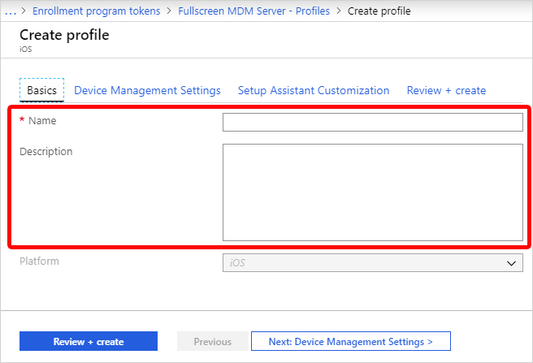

---
# required metadata

title: Apple School Manager - create enrollment profile
titleSuffix: Microsoft Intune
description: Learn how to create the enrollment profile in Intune for Apple School Manager enrollment.
keywords:
author: Lenewsad
ms.author: lanewsad
manager: dougeby
ms.date: 01/07/2025
ms.topic: how-to
ms.service: microsoft-intune
ms.subservice: enrollment
ms.localizationpriority: high
ms.assetid: 4c35a23e-0c61-11e8-ba89-0ed5f89f718b

# optional metadata

#ROBOTS:
#audience:

ms.reviewer: annovich
ms.suite: ems
search.appverid: MET150
#ms.tgt_pltfrm:
ms.collection:
- tier1
- M365-identity-device-management
---

# Create an Apple enrollment profile for school devices  
After you get your Apple token, you can create an enrollment profile for school devices. An essential part of setup is creating enrollment profiles. The profiles contain the settings that apply to devices during device enrollment. 

## Create a profile  

1. In the [Microsoft Intune admin center](https://go.microsoft.com/fwlink/?linkid=2109431), go to **Devices**.
1. Expand **Device onboarding**, and then select **Enrollment**.    
1. Select the **Apple** tab.  
1. Under **Bulk Enrollment Methods**, Choose **Enrollment program tokens**.  
1. Choose a token, and then select **Profiles**. 
1. Select **Create profile** > **iOS/iPadOS**.  

1. For **Basics**, give the profile a **Name** and **Description** for administrative purposes. Users don't see these details. 

   

   You can use the name you enter here to create a dynamic group in Microsoft Entra ID. To assign devices with this enrollment profile to a group, for example, enter the name in the *enrollmentProfileName* parameter in your dynamic group rules. For more information, see [Microsoft Entra dynamic groups](/azure/active-directory/active-directory-groups-dynamic-membership-azure-portal#rules-for-devices).  

1. For **User Affinity**, decide if devices with this profile must enroll with an assigned user or without an assigned user.  
    - **Enroll with User Affinity** - Choose this option for devices that belong to users and that want to use the company portal for services like installing apps. This option also lets users authenticate their devices by using the company portal. If using Active Directory Federation Services (AD FS), user affinity requires [WS-Trust 1.3 Username/Mixed endpoint](/previous-versions/windows/it-pro/windows-server-2008-R2-and-2008/ff608241(v=ws.10)). [Learn more](/powershell/module/adfs/get-adfsendpoint).   Apple School Manager's Shared iPad mode requires user enroll without user affinity.

    - **Enroll without User Affinity** - Choose this option for devices unaffiliated with a single user, such as a shared device. Use this option for devices that perform tasks without accessing local user data. Apps like the Company Portal app don't work.

1. If you chose **Enroll with User Affinity**, select how users must authenticate: Company Portal, Setup Assistant (legacy), or Setup Assistant with modern authentication. For more information about authentication methods, see [Authentication methods for automated device enrollment in Intune](automated-device-enrollment-authentication.md).  

    > [!NOTE]
    > If you want any of the following features, set **Authenticate with Company Portal instead of Apple Setup Assistant** to **Yes**.
    >    - use multifactor authentication
    >    - prompt users who need to change their password when they first sign in
    >    - prompt users to reset their expired passwords during enrollment
    >
    > These features aren't supported when authenticating with Apple Setup Assistant.

1. Choose **Device Management Settings**. Decide if you want devices using this profile to be supervised. *Supervision* gives you more management options and disables Apple Activation Lock by default. Microsoft recommends using ADE as the mechanism for enabling Intune's supervised mode, especially for organizations that are deploying large numbers of iOS/iPadOS devices.

    Users are notified that their devices are supervised in two ways:

   - The lock screen says: "This iPhone is managed by Contoso."
   - The **Settings** > **General** > **About** screen says: "This iPhone is supervised. Contoso can monitor your Internet traffic and locate this device."

     > [!NOTE]
     > A device enrolled without supervision can only be reset to supervised by using the Apple Configurator. Resetting the device in this manner requires connecting an iOS/iPadOS device to a Mac with a USB cable. For more information, see the [Apple Configurator docs](https://support.apple.com/guide/apple-configurator-mac) (opens Apple Support).  

1. Choose if you want locked enrollment for devices using this profile. **Locked enrollment** disables iOS/iPadOS settings that allow the management profile to be removed from the **Settings** menu. After device enrollment, you can't change this setting without wiping the device. Such devices must have the supervised management mode set to *yes*. 

1. You can let multiple users sign on to enrolled iPads by using a managed Apple ID. To do so, choose **Yes** under **Shared iPad** (this option requires **Enroll without User Affinity** and **Supervised** mode set to **Yes**.) Managed Apple IDs are created in the Apple School Manager portal. Learn more about [shared iPad](../fundamentals/education-settings-configure-ios-shared.md) and [shared iPad requirements for Apple](https://help.apple.com/classroom/ipad/2.0/#/cad7e2e0cf56).

1. Choose if you want the devices using this profile to be able to **Sync with computers**. **Deny All** means that devices using this profile can't sync with any data on any computer. 

1. If you chose **Allow Apple Configurator by certificate** in the previous step, choose an Apple Configurator Certificate to import.

1. You can specify a naming format for devices that is automatically applied when they enroll. To do so, select **Yes** under **Apply device name template**. Then, in the **Device Name Template** box, enter the template to use for the names using this profile. You can specify a template format that includes the device type and serial number.

1. Select **OK**.

1. Select **Setup Assistant Settings** to configure the following profile settings:  

    |Setting |Description  |
    |------------------------------------------|---------------------------------------------------------------------------------------------------------------------------------------------------------------------------------------------------------|
    |**Department Name**    |  Appears when users tap <strong>About Configuration</strong> during activation. |
    | **Department Phone**  | Appears when the user selects the <strong>Need Help</strong> button during activation.                                                          |
    |**Setup Assistant Options** | The following optional settings can be set up later in the iOS/iPadOS <strong>Settings</strong> menu. |
    |**Passcode** | Prompt for passcode during activation. Always require a passcode for unsecured devices unless access is controlled in some other manner (like kiosk mode that restricts the device to one app). |
    |**Location Services**   | If enabled, Setup Assistant prompts for the service during activation. |
    |**Restore** |If enabled, Setup Assistant prompts for iCloud backup during activation.                                                                 |
    | **iCloud and Apple ID**  | If enabled, Setup Assistant prompts the user to sign in with an Apple ID, and the Apps & Data screen allows the device to be restored from iCloud backup.                         |
    | **Terms and Conditions**|If enabled, Setup Assistant prompts users to accept Apple's terms and conditions during activation.|
    |**Touch ID**|If enabled, Setup Assistant prompts for this service during activation. |
    |**Apple Pay** | If enabled, Setup Assistant prompts for this service during activation.                                                                 |
    | **Zoom**  |If enabled, Setup Assistant prompts for this service during activation. |
    | **Siri**|If enabled, Setup Assistant prompts for this service during activation.  |
    | **Diagnostic Data** |If enabled, Setup Assistant prompts for this service during activation. |

1. Choose **OK**.

1. To save the profile, choose **Create**.  

## Next steps  
This series of articles describes how to set up Microsoft Intune for devices purchased through Apple School Manager. 

1. [Prerequisites](apple-school-manager-set-up-ios.md)
1. [Get an Apple token for school devices](apple-school-manager-step-1.md)  
1. 🡺 Create an Apple enrollment profile (*You are here*)  
1. [Sync and distribute devices](apple-school-manager-step-3.md) 

