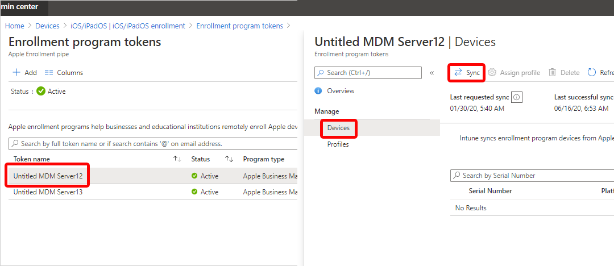

---
# required metadata

title: Apple School Manager - sync and distribute devices  
titleSuffix: Microsoft Intune
description: Sync and distribute Apple School Manager devices enrolled in Microsoft Intune.  
keywords:
author: Lenewsad
ms.author: lanewsad
manager: dougeby
ms.date: 01/06/2025
ms.topic: how-to
ms.service: microsoft-intune
ms.subservice: enrollment
ms.localizationpriority: high
ms.assetid: 4c35a23e-0c61-11e8-ba89-0ed5f89f718b

# optional metadata

#ROBOTS:
#audience:

ms.reviewer: annovich
ms.suite: ems
search.appverid: MET150
#ms.tgt_pltfrm:
ms.collection:
- tier1
- M365-identity-device-management
---

# Sync and distribute school devices 

After you assign Microsoft Intune permission to manage your Apple School Manager devices, sync Intune with the Apple service to see your managed devices in the admin center.  

## Start a sync    

1. In the [Microsoft Intune admin center](https://go.microsoft.com/fwlink/?linkid=2109431), return to **Enrollment program tokens**.  
1. Select a token in the list. 
1. Select **Devices** > **Sync**.  

   > [!div class="mx-imgBorder"]
   >  

To follow Apple's terms for acceptable enrollment program traffic, Intune imposes the following restrictions:
- A full sync can run no more than once every seven days. During a full sync, Intune refreshes every Apple serial number assigned to Intune. If a full sync is attempted within seven days of the previous full sync, Intune only refreshes serial numbers that aren't already listed in Intune.
- Any sync request is given 15 minutes to finish. During this time or until the request succeeds, the **Sync** button is disabled.
- Intune syncs new and removed devices with Apple every 24 hours.  

## Assign a profile to devices
Apple School Manager devices managed by Intune must be assigned an enrollment profile before they're enrolled.

1. Return to **Enrollment program tokens**.
1. Select a token in the list.  
1. Select **Devices**, and then choose your devices.  
1. Select **Assign profile**. Then select a profile for the devices.  
1. Select **Assign**.  

## Distribute devices to users

You enabled management and syncing between Apple and Intune, and assigned a profile that lets Apple School devices enroll. You can now distribute devices to users. When an iOS/iPadOS Apple School Manager device is turned on, it enrolls in Microsoft Intune. Profiles can't be applied to activated devices currently in use until the device is wiped.

## Connect School Data Sync
Microsoft Education is transitioning to a new School Data Sync (SDS) experience with enhanced features, starting August 2024 for the Northern Hemisphere and January 2025 for the Southern Hemisphere. The current Apple School Manager support will be retired by December 31, 2024. This new experience offers various enhancements over SDS (Classic) including:  

- Decoupled data ingestion
- Faster syncs with fewer errors
- Support for larger organizations
- A modern user interface  

Please contact Microsoft Education support with questions regarding the transition to the new School Data Sync experience.  

## Next steps  
This series of articles describes how to set up Microsoft Intune for devices purchased through Apple School Manager. 

1. [Prerequisites](apple-school-manager-set-up-ios.md)
1. [Get an Apple token for school devices](apple-school-manager-step-1.md)  
1. [Create an Apple enrollment profile](apple-school-manager-step-2.md)  
1. 🡺 Sync and distribute devices (*You are here*)  
