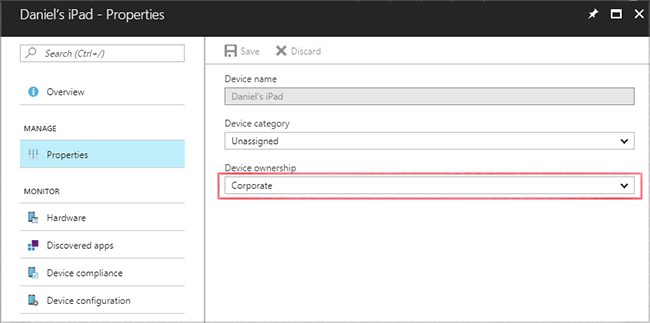

---
# required metadata

title: Add corporate identifiers to Intune
titleSuffix: 
description: Learn how to add corporate identifiers (enrollment method, IMEI, and serial numbers) to Microsoft Intune.
keywords:
author: Lenewsad
ms.author: lanewsad
manager: dougeby
ms.date: 8/16/2021
ms.topic: how-to
ms.service: microsoft-intune
ms.subservice: enrollment
ms.localizationpriority: high
ms.technology:
ms.assetid: 566ed16d-8030-42ee-bac9-5f8252a83012

# optional metadata

#ROBOTS:
#audience:
ms.reviewer: spshumwa
ms.suite: ems
search.appverid: MET150
#ms.tgt_pltfrm:
ms.custom: intune-azure;seodec18
ms.collection:
  - M365-identity-device-management
  - highpri
---

# Identify devices as corporate-owned

As an Intune admin, you can identify devices as corporate-owned to refine management and identification. Intune can perform additional management tasks and collect additional information such as the full phone number and an inventory of apps from corporate-owned devices. You can also set device restrictions to block enrollment by devices that aren't corporate-owned.

At the time of enrollment, Intune automatically assigns corporate-owned status to devices that are:

- Enrolled with a [device enrollment manager](device-enrollment-manager-enroll.md) account (all platforms)
- Enrolled with the Apple [Device Enrollment Program](device-enrollment-program-enroll-ios.md), [Apple School Manager](apple-school-manager-set-up-ios.md), or [Apple Configurator](apple-configurator-enroll-ios.md) (iOS/iPadOS only)
- [Identified as corporate-owned before enrollment](#identify-corporate-owned-devices-with-imei-or-serial-number) with a serial number (iOS/iPadOS and Android)
- Joined to Azure Active Directory with work or school credentials. [Devices that are Azure Active Directory registered](/azure/active-directory/devices/overview) will be marked as personal.
- Set as corporate in the [device's properties list](#change-device-ownership)

After enrollment, you can [change the ownership setting](#change-device-ownership) between **Personal** and **Corporate**.

## Identify corporate-owned devices with IMEI or serial number

As an Intune admin, you can create and import a comma-separated value (.csv) file that lists 14-digit IMEI numbers or serial numbers. Intune uses these identifiers to specify device ownership as corporate during device enrollment. Each IMEI or serial number can have details specified in the list for administrative purposes.

This feature is supported for the following platforms:

| Platform | IMEI numbers | Serial numbers |
|---|---|---|
| Windows | Not supported | Not supported |
| iOS/iPadOS | Supported in some cases. See Important below.  | Supported |
| macOS | Not supported | Supported |
| Android device administrator, before Android v10 | Supported | Supported |
| Android device administrator, Android v10 and later | Not supported | Not supported |
| Android Enterprise personally-owned work profile, before Android 12 | Supported | Supported |
| Android Enterprise personally-owned work profile, Android 12 and later | Not supported | Not supported |
| Android Enterprise corporate-owned work profile | Not supported | Not Supported |
| Android Enterprise fully managed | Not supported | Not Supported |
| Android Enterprise dedicated devices | Not supported | Not supported |

<!-- When you upload serial numbers for corporate-owned iOS/iPadOS devices, they must be paired with a corporate enrollment profile. Devices must then be enrolled using either Apple's Automated Device Enrollment or Apple Configurator to have them appear as corporate-owned. -->

[Learn how to find an Apple device serial number](https://support.apple.com/HT204308).<br>
[Learn how to find your Android device serial number](https://support.google.com/store/answer/3333000).

## Add corporate identifiers by using a .csv file
To create the list, create a two-column, comma-separated value (.csv) list without a header. Add the 14-digit IMEI or serial numbers in the left column, and the details in the right column. Only one type of ID, IMEI or serial number, can be imported in a single .csv file. Details are limited to 128 characters and are for administrative use only. Details aren't displayed on the device. The current limit is 5,000 rows per .csv file.

**Upload a .csv file that has serial numbers** – Create a two-column, comma-separated value (.csv) list without a header, and limit the list to 5,000 devices or 5 MB per .csv file.

This .csv file when viewed in a text editor appears as:

```
01234567890123,device details
02234567890123,device details
```

> [!IMPORTANT]
> Some Android and iOS/iPadOS devices have multiple IMEI numbers. Intune only reads one IMEI number per enrolled device. If you import an IMEI number but it is not the IMEI inventoried by Intune, the device is classified as a personal device instead of a corporate-owned device. If you import multiple IMEI numbers for a device, uninventoried numbers display **Unknown** for enrollment status.<br>
>Also note:
>Serial Numbers are the recommended form of identification for iOS/iPadOS devices.
>Android Serial numbers are not guaranteed to be unique or present. Check with your device supplier to understand if serial number is a reliable device ID.
>Serial numbers reported by the device to Intune might not match the displayed ID in the Android Settings/About menus on the device. Verify the type of serial number reported by the device manufacturer.
>Attempting to upload a file with serial numbers containing dots (.) will cause the upload to fail. Serial numbers with dots are not supported.

### Upload a .csv list of corporate identifiers

1. Sign in to the [Microsoft Endpoint Manager admin center](https://go.microsoft.com/fwlink/?linkid=2109431), choose **Devices** > **Enroll devices** > **Corporate device identifiers** > **Add** > **Upload CSV file**.

2. In the **Add identifiers** blade, specify the identifier type: **IMEI** or **Serial**.

3. Click the folder icon and specify the path to the list you want to import. Navigate to the .csv file, and choose **Add**. 

4. If the .csv file contains corporate identifiers that are already in Intune, but have different details, the **Review duplicate identifiers** popup appears. Select the identifiers that you want to overwrite into Intune and choose **Ok** to add the identifiers. For each identifier, only the first duplicate will be compared.

## Manually enter corporate identifiers

1. Sign in to the [Microsoft Endpoint Manager admin center](https://go.microsoft.com/fwlink/?linkid=2109431), choose **Devices** > **Enroll devices** > **Corporate device identifiers** > **Add** > **Enter manually**.

2. In the **Add identifiers** blade, specify the identifier type: **IMEI** or **Serial**.

3. Enter the **Identifier** and **Details** for each identifier you want to add. When you're done entering identifiers, choose **Add**.

5. If you entered corporate identifiers that are already in Intune, but have different details, the **Review duplicate identifiers** popup appears. Select the identifiers that you want to overwrite into Intune and choose **Ok** to add the identifiers. For each identifier, only the first duplicate will be compared.

You can click **Refresh** to see new device identifiers.

Imported devices are not necessarily enrolled. Devices can have a state of either **Enrolled** or **Not contacted**. **Not contacted** means that the device has never communicated in with the Intune service.

## Delete corporate identifiers

1. Sign in to the [Microsoft Endpoint Manager admin center](https://go.microsoft.com/fwlink/?linkid=2109431), choose **Devices** > **Enroll devices** > **Corporate device identifiers**.
2. Select the device identifiers you want to delete, and choose **Delete**.
3. Confirm the deletion.

Deleting a corporate identifier for an enrolled device does not change the device's ownership. To change a device's ownership, go **Devices**, select the device, choose **Properties**, and change **Device ownership**.

## IMEI specifications
For detailed specifications about International Mobile Equipment Identifiers, see [3GGPP TS 23.003](https://portal.3gpp.org/desktopmodules/Specifications/SpecificationDetails.aspx?specificationId=729).

## Change device ownership

Devices properties display **Ownership** for each device records in Intune. As an admin, you can specify devices as **Personal** or **Corporate**. When a device's ownership type is changed from Corporate to Personal, Intune deletes all app information previously collected from that device within 7 days. If applicable, Intune will also delete the phone number on record. 

**To change device ownership:**
1. Sign in to the [Microsoft Endpoint Manager admin center](https://go.microsoft.com/fwlink/?linkid=2109431), choose **Devices** > **All devices** > choose the device.
2. Choose **Properties**.
3. Specify **Device ownership** as **Personal** or **Corporate**.

   

You can configure a push notification to send to both your Android and iOS/iPadOS Company Portal users when their device ownership type has been changed from **Personal** to **Corporate** as a privacy courtesy. 

When a device's ownership type is changed from Corporate to Personal, Intune deletes all app information previously collected from that device within 7 days. If applicable, Intune will also delete the phone number on record. Intune will still collect an inventory of apps installed by the IT admin on the device and will still collect a partial phone number for the device after it is marked as personal.

This setting can be found in the Microsoft Endpoint Manager by selecting **Tenant administration** > **Customization**. For more information, see [Company Portal - Configuration](../apps/company-portal-app.md#configuration).
