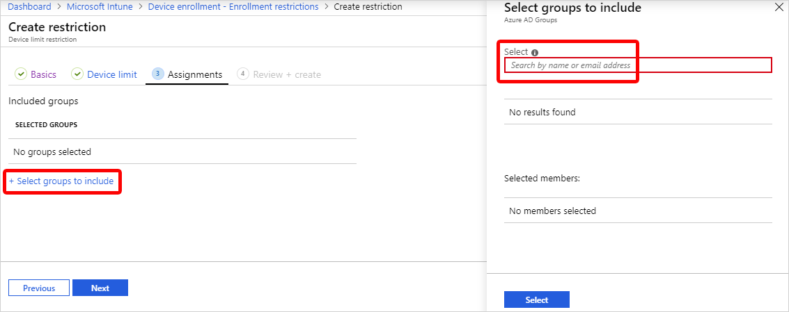
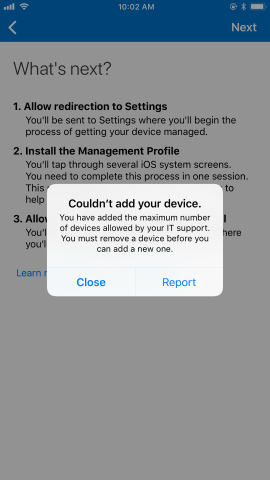

---
# required metadata

title: Create device limit restrictions  
titleSuffix: Microsoft Intune
description: Restrict the number of devices allowed to enroll in Microsoft Intune.  
keywords:
author: Lenewsad
ms.author: lanewsad
manager: dougeby
ms.date: 08/08/2022
ms.topic: how-to
ms.service: microsoft-intune
ms.subservice: enrollment
ms.localizationpriority: 
ms.technology:
ms.assetid: 

# optional metadata

#ROBOTS:
#audience:

ms.reviewer: maholdaa
ms.suite: ems
search.appverid: MET150
#ms.tgt_pltfrm:
ms.custom: intune-azure
ms.collection:
  - M365-identity-device-management
  - highpri
---

# Create device limit restrictions in Intune

**Applies to**
* Android  
* iOS
* macOS 
* Windows 10
* Windows 11 

[!INCLUDE [azure_portal](../includes/azure_portal.md)]  

Use device limit enrollment restrictions to restrict the number of devices allowed to enroll in Microsoft Intune. Device limit restrictions work on devices that meet the following criteria:  

  * Microsoft Intune-managed  
  * Established contact with Intune within last 90 days  
  * Not in a registration-pending state for more than 24 hours  
  * Hasn't failed Apple enrollment  
  * Hasn't been deleted from Microsoft Intune  
  * Enrollment type is not in shared mode (check DeviceCountsForDeviceCap for detail)  

You can create a new device limit-enrollment restriction policy in the Microsoft Endpoint Manager admin center or use the default policy that's already available. You can have up to 25 device limit restriction policies. 

This article describes how to create and configure a device limit-enrollment restriction policy in the admin center. 

## Default policy 
Microsoft Intune provides one default policy for device limit restrictions. You can edit and customize it as needed. Intune applies the default policy to all user and userless enrollments until you assign a higher-priority policy.  

## Create a device limit restriction  

1. Sign in to the [Microsoft Endpoint Manager admin center](https://go.microsoft.com/fwlink/?linkid=2109431) > **Devices** > **Enrollment restrictions** > **Create restriction** > **Device limit restriction**.
2. On the **Basics** page, give the restriction a **Name** and optional **Description**.
3. Choose **Next** to go to the **Device limit** page.
4. For **Device limit**, select the maximum number of devices that a user can enroll.
    
5. Choose **Next** to go to the **Scope tags** page.
6. On the **Scope tags** page, optionally add the scope tags you want to apply to this restriction. For more information about scope tags, see [Use role-based access control and scope tags for distributed IT](../fundamentals/scope-tags.md). 
7. Choose **Next** to go to the **Assignments** page.
8. Choose **Select groups to include** and then use the search box to find groups that you want to include in this restriction. The restriction applies only to groups to which it's assigned. If you don't assign a restriction to at least one group, it won't have any effect. Then choose **Select**. 
    
9. Select **Next** to go to the **Review + create** page.
10. Select **Create** to create the restriction. The new restriction appears in your list of restrictions and is given a higher priority than the default policy. For information about changing the priority level, see [Change restriction priority](create-device-limit-restrictions.md#change-restriction-priority)(in this article).  

## Edit enrollment restrictions    

Edits are applied to new enrollments and don't affect devices that are already enrolled.  

1. Go to **Enrollment device limit restrictions** to bring up the list of your policies. 
2. Select the name of the policy you want to change.
3. Select **Properties**.  
4. Select **Edit**. 
5. Make your changes and select **Review + save**. 
6. Review your changes and select **Save**.  

## Change restriction priority  

When a group is assigned multiple restrictions, the priority level determines which policy gets applied. The restriction with highest priority (*1* being the highest priority position) is applied and the other restrictions are disregarded. For example:  

1. Joe belongs to two user groups in Intune: Group A and Group B. 
2. Group A is assigned a restriction policy. Its priority level is 5.
3. Group B is assigned a restriction policy. The priority level is 2.
4. Joe is subject only to the priority 2 restrictions.

When you create a restriction, it's added to the list just above the default. You can change the priority of non-default restrictions.  

1. Go to**Enrollment device limit restrictions**.
2. Select **Device limit restrictions** to bring up the list of your policies.               
3. Hover over the policy in the **Priority** column,and then select and drag the priority to the desired position in the list.   

## Device user experience   
BYOD users who reach their device limit receive a message during enrollment explaining the restriction. To continue enrolling, the device user must unenroll an existing device. Alternatively, as the admin you can increase the device limit in the admin center. For more information about troubleshooting enrollment errors such as this one, see [Troubleshoot device enrollment](/troubleshoot/mem/intune/troubleshoot-device-enrollment-in-intune#device-cap-reached).  

  

 

