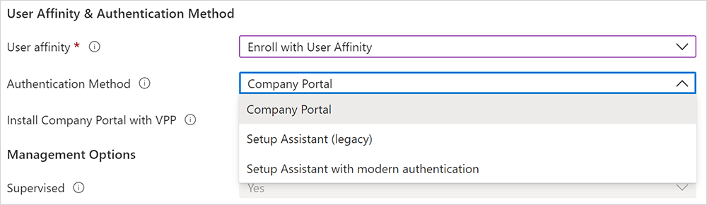

---
# required metadata

title: Enroll iOS/iPadOS devices with Apple ADE
titleSuffix: Microsoft Intune
description: Learn how to enroll corporate-owned iOS/iPadOS devices by using Automated Device Enrollment (ADE).  
keywords:
author: Lenewsad
ms.author: lanewsad
manager: dougeby
ms.date: 01/26/2023
ms.topic: how-to
ms.service: microsoft-intune
ms.subservice: enrollment
ms.localizationpriority: high
ms.technology:
ms.assetid: 7ddbf360-0c61-11e8-ba89-0ed5f89f718b

# optional metadata

#ROBOTS:
#audience:

ms.reviewer: annovich
ms.suite: ems
search.appverid: MET150
#ms.tgt_pltfrm:
ms.custom: seodec18
ms.collection:
- tier1
- M365-identity-device-management
- highpri
---

# Set up automated device enrollment in Intune  

*Applies to iOS/iPadOS*  

Corporate-owned devices purchased through Apple Business Manager or Apple School Manager can be enrolled in Intune via automated device enrollment. This enrollment option applies your organization's settings from Apple Business Manager and Apple School Manager and enrolls devices without you needing to touch them. iPhones and iPads can be shipped directly to employees and students. When they turn on their devices, Apple Setup Assistant guides them through setup and enrollment. 

This article describes how to prepare and set up automated device enrollment in Microsoft Intune.    

## Overview of features    
The following table shows the features and scenarios supported with automated device enrollment.  

| Feature | Use this enrollment option when |
| --- | --- |
| You want supervised mode. | ✔️    Supervised mode deploys software updates, restricts features, allows and blocks apps, and more.|
| Devices are owned by the organization or school. | ✔️ |
| You have new devices. | ✔️ |
| Need to enroll a few devices, or a large number of devices (bulk enrollment). | ✔️ |
| Devices are associated with a single user. | ✔️ |
| Devices are user-less, such as kiosk or dedicated device. | ✔️ |
| Devices are personal or BYOD. | ❌    Not recommended. Applications on BYOD or personal devices can be managed using [MAM](../fundamentals/deployment-guide-enrollment-mamwe.md), or [User and Device enrollment](../enrollment/ios-user-enrollment.md). |
| Devices are managed by another MDM provider. | ❌    To be fully managed by Intune, users must unenroll from the current MDM provider, and then enroll in Intune. Or, you can use MAM to manage specifics apps on the device. Since these devices are owned by the organization, we recommend enrolling them in Intune. |  
| You use the device enrollment manager (DEM) account. | ❌    The DEM account isn't supported. |  

## Prerequisites 
Before you create the enrollment profile, you must have:       

* Access to [Apple Business Manager portal](https://business.apple.com/) or [Apple School Manager portal](https://school.apple.com/). 
* An active Apple token (.p7m file). 
    * For steps, see [Get an Apple Automated Device Enrollment token](device-enrollment-program-enroll-ios.md#get-an-apple-automated-device-enrollment-token) (in this article).  
* An [Apple MDM push certificate in Intune](../enrollment/apple-mdm-push-certificate-get.md).  
* New or wiped devices purchased from Apple Business Manager or Apple School Manager.  
     >[!Tip]
     >Automated device enrollment applies device configurations that a device user may not be able to remove. Wipe all devices prior to enrollment to return them to an out-of-box state.  
## Before you begin      
Read through these enrollment requirements and best practices to prepare for a successful setup and deployment.    

### Choose an authentication method  
Before you create the enrollment profile, decide how you want users to authenticate on their devices: via the Intune Company Portal app, Setup Assistant (legacy), or Setup Assistant with modern authentication. Using the Company Portal app or Setup Assistant with modern authentication is considered modern authentication, and has features like multi-factor authentication. 

Intune also supports Just in Time Registration for Setup Assistant with modern authentication, which eliminates the need for the Company Portal app for Azure AD registration and compliance. To use JIT Registration, you'll need to create a device configuration policy *before* you create the Apple enrollment profile and configure Setup Assistant with modern authentication. For how-to steps, see [Set up Just in Time Registration](automated-device-enrollment-authentication.md#set-up-just-in-time-registration).  

  > [!IMPORTANT]
  > JIT Registration is in public preview. For more information, see [Public preview in Microsoft Intune](../fundamentals/public-preview.md).     

Setup Assistant with modern authentication is supported on devices running iOS/iPadOS 13.0 and later. Older iOS/iPadOS devices given this profile will instead use Setup Assistant (legacy) for authentication.  

For more information about your authentication options, see [Authentication methods for automated device enrollment](automated-device-enrollment-authentication.md).  

### What is supervised mode?  
Supervised mode provides more management control over corporate-owned devices, so you can do things like block screen captures and restrict AirDrop. 

Corporate-owned devices running iOS/iPadOS 11+ and enrolled via automated device enrollment should always be in supervised mode, which you can turn on in the enrollment profile. For more information about supervised mode, see [Turn on iOS/iPadOS supervised mode](../remote-actions/device-supervised-mode.md). Microsoft Intune ignores the *is_supervised* flag for devices running iOS/iPadOS 13.0 and later because these devices are automatically put in supervised mode at the time of enrollment. 

### Deploying the Company Portal app  

> [!IMPORTANT]
> We don't recommend using the App Store version of the Company Portal app because it isn't compatible with automated device enrollment and doesn't provide the automatic updates and availability like deployment does. 

Deploying the Intune Company Portal app through Intune is the best way to provide the app to users and the only way to: 

* Ensure all ADE devices, including already-enrolled ones, receive the app. 
* Enable automatic app updates for Company Portal on ADE devices. 

Deploy the app as a required, VPP app [with device licensing](../apps/vpp-apps-ios.md#how-are-purchased-apps-licensed). For information about how to sync, assign, and manage a VPP app, see [assign a volume-purchased app](../apps/vpp-apps-ios.md#assign-a-volume-purchased-app). 

To enable automatic app updates for Company Portal, go to your app token settings in the admin center and change **Automatic app updates** to **Yes**. See [Upload an Apple VPP or Apple Business Manager location token](../apps/vpp-apps-ios.md#upload-an-apple-vpp-or-apple-business-manager-location-token) for the steps to access your token settings. If you don't enable automatic updates, the device user will need to manually check for them on their own.  

*Device staging* is used to transition a device without user affinity, to a device with user affinity. To stage a device, set up VPP deployment as described earlier in this section. Then configure and deploy an [app configuration policy](../apps/app-configuration-policies-use-ios.md#configure-the-company-portal-app-to-support-ios-and-ipados-devices-enrolled-with-automated-device-enrollment). Make sure the policy only targets those ADE devices without user affinity.  

> [!IMPORTANT]
> During initial enrollment, Intune automatically pushes the app configuration policy settings for devices enrolled with Setup Assistant with modern authentication, configured in [Configure the Company Portal app to support iOS and iPadOS devices enrolled with Automated Device Enrollment](../apps/app-configuration-policies-use-ios.md#configure-the-company-portal-app-to-support-ios-and-ipados-devices-enrolled-with-automated-device-enrollment), when the enrollment profile setting **Install Company Portal** is set to yes. This configuration should not be deployed manually to users because it will cause a conflict with the configuration sent during the initial enrollment. If both are deployed, Intune will incorrectly prompt device users to sign in to Company Portal and download a management profile they've already installed. 

### Limits     
- Maximum enrollment profiles per token: 1,000   
- Maximum Automated Device Enrollment devices per profile: 200,000 (same as the maximum number of devices per token).
- Maximum Automated Device Enrollment tokens per Intune account: 2,000  
- Maximum Automated Device Enrollment devices per token: 200,000
    - We recommend that you don't exceed 200,000 devices per token. Otherwise you might have sync problems. If you have more than 200,000 devices, split the devices into multiple ADE tokens.  
    - Apple Business Manager and Apple School Manager sync about 3,000 devices over to Intune per minute. We recommend that you hold off manually syncing from the admin center again until enough time has passed for all of the devices to finish syncing (total number of devices/3,000 devices per minute).  

### Troubleshoot enrollment   
If you experience sync problems during the enrollment process, you can look for solutions at [Troubleshoot iOS/iPadOS device enrollment problems](/troubleshoot/mem/intune/troubleshoot-ios-enrollment-errors#error-messages). 

## Get an Apple automated device enrollment token

Before you can enroll iOS/iPadOS devices with ADE, you need an automated device enrollment token (.p7m file) from Apple. This token lets Intune sync information about ADE devices that your organization owns. It also allows Intune to upload enrollment profiles to Apple and to assign devices to those profiles.

Use [Apple Business Manager (ABM)](https://business.apple.com/) or [Apple School Manager (ASM)](https://school.apple.com/) to create a token and assign devices to Intune for management.

> [!NOTE]
> You can use either the ABM portal or the ASM portal to enable ADE. The rest of this article refers to the ABM portal, but the steps are the same for both portals. 

### Step 1: Download the Intune public key certificate

1. In [Microsoft Intune admin center](https://go.microsoft.com/fwlink/?linkid=2109431), select **Devices** > **iOS/iPadOS** > **iOS/iPadOS enrollment**:

    :::image type="content" source="./media/device-enrollment-program-enroll-ios/ios-enroll.png" alt-text="Screenshot that shows Microsoft Intune admin center.":::

2. Select **Enrollment Program Tokens** > **Add**.

3. On the **Basics** tab:

    1. Select **I agree** to give permission to Microsoft to send user and device information to Apple:

        :::image type="content" source="./media/device-enrollment-program-enroll-ios/add-enrollment-program-token-pane.png" alt-text="Screenshot that shows the Add enrollment program token screen.":::

    2. Select **Download the Intune public key certificate required to create the token**. This step downloads and saves the encryption key (.pem) file locally. The .pem file is used to request a trust-relationship certificate from the Apple Business Manager portal.

        You'll upload this .pem file in Apple Business Manager in [Step 2: Go to the Apple Business Manager portal](#step-2-go-to-the-apple-business-manager-portal) (in this article).

    3. Keep this web browser tab and page open. If you close the tab:

        - The certificate you downloaded is invalidated.
        - You have to repeat steps.
        - On the **Review + create** tab, the **Create** button isn't available, and you can't complete this procedure.

### Step 2: Go to the Apple Business Manager portal

Use the Apple Business Manager portal to create and renew your ADE token (MDM server). This token is added to Intune and communicates between Intune and Apple.

> [!NOTE]
> The following steps describe what you need to do in Apple Business Manager. For the specific steps, refer to Apple's documentation. [Apple Business Manager User Guide](https://support.apple.com/guide/apple-business-manager/welcome/web) (on Apple's website) might be helpful.

#### Download the Apple token

1. In [Apple Business Manager](https://business.apple.com), sign in with your company's Apple ID.
2. In this portal, complete the following steps.

    - In settings, all tokens are shown. Add an MDM server, and upload the public key certificate (.pem file) that you downloaded from Intune in [Step 1: Download the Intune public key certificate](#step-1-download-the-intune-public-key-certificate) (in this article).

      Use the server name to identify the mobile device management (MDM) server. It isn't the name or URL of the Microsoft Intune service.

    - After you save the MDM server, select it, and then download the token (.p7m file). You'll upload this .p7m token in Intune in [Step 4: Upload your token and finish](#step-4-upload-your-token-and-finish) (in this article).

#### Assign devices to the Apple token (MDM server)

1. In [Apple Business Manager](https://business.apple.com) > **Devices**, select the devices you want to assign to this token. You can sort by various device properties, like serial number. You can also select multiple devices simultaneously.
2. Edit device management, and select the MDM server you just added. This step assigns devices to the token.

### Step 3: Save the Apple ID

1. In your web browser, go back to the **Add enrollment program token** page in Intune. You should have kept this page open, as noted in [Step 1: Download the Intune public key certificate](#step-1-download-the-intune-public-key-certificate) (in this article).
2. In **Apple ID**, enter your ID. This step saves the ID. The ID can be used in the future.

    :::image type="content" source="./media/device-enrollment-program-enroll-ios/image03.png" alt-text="Sreenshot that shows the Apple ID box on the Basics tab.":::

### Step 4: Upload your token and finish

1. In **Apple token**, browse to the .p7m certificate file, and then select **Open**.

    You downloaded this .p7m token in [Step 2: Go to the Apple Business Manager portal](#step-2-go-to-the-apple-business-manager-portal).

2. Select **Next**.

3. (Optional.) If you want to apply [scope tags](../fundamentals/scope-tags.md) to this ADE token, click **Select scope tags**, and then select existing scope tags. Scope tags applied to a token are inherited by profiles and ADE enrolled devices added to the token. The devices that are being referred to are the devices that have synced over from ABM/ASM, and are enrolled through Automated Device Enrollment and show up within the specific token. 

    For more information on scope tags, see [Use role-based access control (RBAC) and scope tags for distributed IT](../fundamentals/scope-tags.md).

    Select **Next**.

4. On the **Review + create** tab, select **Create**.

With the push certificate, Intune can enroll and manage iOS/iPadOS devices by pushing policies to enrolled mobile devices. Intune automatically synchronizes with Apple to access your enrollment program account.

## Create an Apple enrollment profile

Now that you've installed your token, you can create an enrollment profile for ADE devices. A device enrollment profile defines the settings applied to a group of devices during enrollment. There's a limit of 1,000 enrollment profiles per ADE token.

> [!NOTE]
> Devices will be blocked if there aren't enough Company Portal licenses for a VPP token or if the token is expired. Intune alerts you when a token is about to expire or licenses are running low.

1. In [Microsoft Intune admin center](https://go.microsoft.com/fwlink/?linkid=2109431), select **Devices** > **iOS/iPadOS** > **iOS/iPadOS enrollment** > **Enrollment program tokens**.
2. Select a token, and then select **Profiles**.
3. Select **Create profile** > **iOS/iPadOS**.
4. For **Basics**, give the profile a **Name** and **Description** for administrative purposes. Users don't see these details.
5. Select **Next**.

    > [!IMPORTANT]
    > If you make changes to existing enrollment profile settings, the new changes won't take effect on assigned devices until devices are reset back to factory settings and reactivated. Reactivation occurs when the Remote Management Payload is received on ADE devices. Renaming the device name template is the only change you can make that doesn't require a factory reset.  

6. In the **User Affinity** list, select an option that determines whether devices with this profile must enroll with or without an assigned user.

    - **Enroll with User Affinity**. Select this option for devices that belong to users who want to use Company Portal for services like installing apps.
    - **Enroll without User Affinity**. Select this option for devices that aren't affiliated with a single user. Use this option for devices that don't access local user data. This option is typically used for kiosk, point of sale (POS), or shared-utility devices.

      In some situations, you might want to associate a primary user on devices enrolled without user affinity. To do this task, you can send the `IntuneUDAUserlessDevice` key to the Company Portal app in an app configuration policy for managed devices. The first user that signs in to the Company Portal app is established as the primary user. If the first user signs out and a second user signs in, the first user remains the primary user of the device. For more information, see [Configure the Company Portal app to support iOS and iPadOS ADE devices](../apps/app-configuration-policies-use-ios.md#configure-the-company-portal-app-to-support-ios-and-ipados-devices-enrolled-with-automated-device-enrollment).

7. If you selected **Enroll with User Affinity** for the **User Affinity** field, you now have the option to choose the authentication method employees must use. For more information about each authentication method, see [Authentication methods for automated device enrollment](automated-device-enrollment-authentication.md).   

   

    Your options:

     - **Company Portal**  
     - **Setup Assistant (legacy)**
     - **Setup Assistant with modern authentication**  

8. If you selected **Setup Assistant (legacy)** for the authentication method but you also want to use Conditional Access or deploy company apps on the devices, you need to install Company Portal on the devices and sign in to complete the Azure AD registration. To do so, select **Yes** for **Install Company Portal**. If you want users to receive Company Portal without having to authenticate in to the App Store, in **Install Company Portal with VPP**, select a VPP token. Make sure the token doesn't expire and that you have enough device licenses for the Company Portal app to deploy correctly.

9. If you select a token for **Install Company Portal with VPP**, you can lock the device in Single App Mode (specifically, the Company Portal app) right after the Setup Assistant completes. Select **Yes** for **Run Company Portal in Single App Mode until authentication** to set this option. To use the device, the user must first authenticate by signing in with Company Portal.

    > [!NOTE]
    > Multifactor authentication isn't supported on a single device locked in Single App Mode. This limitation exists because the device can't switch to a different app to complete the second factor of authentication. If you want multifactor authentication on a Single App Mode device, the second factor must be on a different device.

    This feature is supported only for iOS/iPadOS 11.3.1 and later.

   :::image type="content" source="./media/device-enrollment-program-enroll-ios/single-app-mode.png" alt-text="Screenshot that shows the Run Company Portal in Single App Mode option.":::

10. If you want devices using this profile to be supervised, select **Yes** in the **Supervised** list:

    :::image type="content" source="./media/device-enrollment-program-enroll-ios/supervisedmode.png" alt-text="Screenshot that shows the Supervised option.":::

    Supervised devices give you more management options and disabled Activation Lock by default. Microsoft recommends that you use ADE as the mechanism for enabling supervised mode, especially if you're deploying large numbers of iOS/iPadOS devices. Apple Shared iPad for Business devices must be supervised.

    Users are notified that their devices are supervised in two ways:

    - The lock screen says: **This iPhone is managed by *company name*.**
    - The **Settings** > **General** > **About** screen says: **This iPhone is supervised. *Company name* can monitor your Internet traffic and locate this device.**

     > [!NOTE]
     > If a device is enrolled without supervision, you need to use Apple Configurator if you want to set it to supervised. To reset the device in this way, you need to connect it to a Mac with a USB cable. For more information, see [Apple Configurator Help](https://support.apple.com/guide/apple-configurator-mac).

11. In the **Locked enrollment** list, select **Yes** or **No**. Locked enrollment disables iOS/iPadOS settings that allow the management profile to be removed. If you enable locked enrollment, the button in the Settings app that lets users remove a management profile will be hidden and users won't be able to unenroll their device.   

    Locked enrollment works a little differently, at first, on devices not originally purchased through Apple Business Manager but later added to be a part of automated device enrollment: users on these devices will see the remove management button in the Settings app for the first 30 days after activating their device. After that provisional period, the option will be hidden. For more information, see [Prepare devices manually](https://help.apple.com/configurator/mac/2.8/#/cad99bc2a859) (opens Apple Configurator Help docs). 
  
       > [!IMPORTANT]  
       > This setting is different from the remove and reset options in the Company Portal app. Regardless of how you configure locked enrollment, the **Remove Device** or **Factory Reset** options in the Company Portal app remain unavailable on devices enrolled through automated device enrollment. Users won't be able to remove the device on the Company Portal website either. For more information about the self-service actions available on enrolled devices, see [Self-service actions](../apps/company-portal-app.md#self-service-actions).  

12. If you selected **Enroll without User Affinity** and **Supervised** in the previous steps, you need to decide whether to configure the devices to be [Apple Shared iPad for Business devices](https://support.apple.com/guide/mdm/shared-ipad-overview-cad7e2e0cf56/web). Select **Yes** for **Shared iPad** to enable multiple users to sign in to a single device. Users will authenticate by using their Managed Apple IDs and federated authentication accounts or by using a temporary session (like the Guest account). This option requires iOS/iPadOS 13.4 or later. With Shared iPad, all Setup Assistant panes after activation are automatically skipped. 

    > [!NOTE]
    >
    > - A device wipe will be required if an iOS/iPadOS enrollment profile with Shared iPad enabled is sent to an unsupported device. Unsupported devices include any iPhone models, and iPads running iPadOS/iOS 13.3 and earlier. Supported devices include iPads running iPadOS 13.3 and later.  
    > - To set up Apple Shared iPad for Business, configure these settings:
    >   - In the **User Affinity** list, select **Enroll without User Affinity**.
    >   - In the **Supervised** list, select **Yes**.
    >   - In the **Shared iPad** list, select **Yes**.

    If you're setting up Apple Shared iPad for Business devices, also configure:  

    * **Maximum cached users**: Enter the number of users that you expect to use the shared iPad. You can cache up to 24 users on a 32-GB or 64-GB device. If you choose a low number, it might take a while for your users' data to appear on their devices after they sign in. If you choose a high number, your users could run out of disk space.  

    * **Maximum seconds after screen lock before password is required**: Enter the number of seconds from 0 to 14,400. If the screen lock exceeds this amount of time, a device password will be required to unlock the device. Available for devices in Shared iPad mode running iPadOS 13.0 and later.  

    * **Maximum seconds of inactivity until user session logs out**: The minimum allowed value for this setting is 30. If there isn't any activity after the defined period, the user session ends and signs the user out. If you leave the entry blank or set it to zero (0), the session won't end due to inactivity. Available for devices in Shared iPad mode running iPadOS 14.5 and later.  

    * **Require Shared iPad temporary session only**: Configures the device so that users only see the guest version of the sign-in experience and must sign in as guests. They can't sign in with a Managed Apple ID. Available for devices in Shared iPad mode running iPadOS 14.5 and later.  

        When set to **Yes**, this setting cancels out the following shared iPad settings, because they aren't applicable in temporary sessions:  

        - Maximum cached users
        - Maximum seconds after screen lock before password is required 
        - Maximum seconds of inactivity until user session logs out 

    * **Maximum seconds of inactivity until temporary session logs out**: The minimum allowed value for this setting is 30. If there isn't any activity after the defined period, the temporary session ends and signs the user out. If you leave the entry blank or set it to zero (0), the session won't end due to inactivity. Available for devices in Shared iPad mode running iPadOS 14.5 and later.  

        This setting is available when **Require Shared iPad temporary session only** is set to **Yes**.  

    > [!NOTE]
    >
    > - If temporary sessions are enabled, all of the user's data is deleted when they sign out of the session. This means that all targeted policies and apps will come down to the user when they sign-in, and they'll be erased when the user sign outs.  
    > -  To alter a Shared iPads configuration to not have temporary sessions, the device will need to be fully reset and a new enrollment profile with the updated configurations will need to be sent down to the iPad.

13. In the **Sync with computers** list, select an option for the devices that use this profile. If you select **Allow Apple Configurator by certificate**, you need to choose a certificate under **Apple Configurator Certificates**.

    > [!NOTE]
    > If you set **Sync with computers** to **Deny all**, the port will be limited on iOS and iPadOS devices. The port will be limited to only charging. It will be blocked from using iTunes or Apple Configurator 2.
    >
    > If you set **Sync with computers** to **Allow Apple Configurator by certificate**, make sure you have a local copy of the certificate that you can use later. You won't be able to make changes to the uploaded copy, and it's important to retain an copy of this certificate. If you want to connect to the iOS/iPadOS device from a macOS device or PC, the same certificate must be installed on the device making the connection to the iOS/iPadOS device.

14. If you selected **Allow Apple Configurator by certificate** in the previous step, choose an Apple Configurator certificate to import.  

15. For **Await final configuration**, your options are:  

     * **Yes**: Enable a locked experience at the end of Setup Assistant to ensure your most critical device configuration policies are installed on the device. Just before the home screen loads, Setup Assistant pauses and lets Intune check in with the device. The end-user experience locks while users await final configurations. The amount of time it takes to release the device to the home screen varies, and depends on the total number of policies and apps applied to the device. The experience times out after five minutes.   
    
         This setting is applied once during the out-of-box automated device enrollment experience.  The device user doesn't experience it again unless they re-enroll their device. **Yes** is the default setting for new enrollment profiles. **No** is the default setting for existing enrollment profiles.  

     * **No**: The device is released to the home screen when Setup Assistant ends, regardless of policy installation status. Device users may be able to access the home screen or change device settings before all policies are installed.   

    The locked experience works on devices targeted with new and existing enrollment profiles. Supported devices include:      
    * iOS/iPadOS 13+ devices enrolling with Setup Assistant with modern authentication  
    * iOS/iPadOS 13+ devices enrolling without user affinity   
    * iOS/iPadOS 13+ devices enrolling with Azure AD shared mode  

16. You can specify a naming format for devices that's automatically applied when they're enrolled and upon each successive check-in. To create a naming template, select **Yes** under **Apply device name template**. Then, in the **Device Name Template** box, enter the template to use for the names that use this profile. You can specify a template format that includes the device type and serial number. This feature supports iPhone, iPad, and iPod Touch. The device name template entry cannot exceed the length of 63 characters, including the variables.

17. You can activate a cellular data plan. This setting applies to devices running iOS/iPadOS 13.0 and later. Configuring this option will send a command to activate cellular data plans for your eSim-enabled cellular devices. Your carrier must provision activations for your devices before you can activate data plans using this command. To activate cellular data plan, click **Yes** and then enter your carrier’s activation server URL.  

18. Select **Next**.

19. On the **Setup Assistant** tab, configure the following profile settings:

    | Department setting | Description |
    |---|---|
    | **Department** | Appears when users tap **About Configuration** during activation. |
    |    **Department Phone**     | Appears when users tap the **Need Help** button during activation. |

    You can hide Setup Assistant screens on the device during user setup. For a description of all screens, see [Setup Assistant screen reference](#setup-assistant-screen-reference) (in this article).  
    - If you select **Hide**, the screen won't be displayed during setup. After setting up the device, the user can still go to the **Settings** menu to set up the feature.
    - If you select **Show**, the screen will be displayed during setup, but only if there are steps to complete after the restore or after the software update. Users can sometimes skip the screen without taking action. They can then later go to the device's **Settings** menu to set up the feature.
    - With Shared iPad, all Setup Assistant panes after activation are automatically skipped regardless of the configuration.   

20. Select **Next**.

21. To save the profile, select **Create**.  

### Dynamic groups in Azure Active Directory

You can use the enrollment **Name** field to create a dynamic group in Azure Active Directory (Azure AD). For more information, see [Azure Active Directory dynamic groups](/azure/active-directory/users-groups-roles/groups-dynamic-membership).

You can use the profile name to define the [enrollmentProfileName parameter](/azure/active-directory/users-groups-roles/groups-dynamic-membership#rules-for-devices) to assign devices with this enrollment profile.

Prior to device setup, and to ensure quick delivery to devices with user affinity, make sure the enrolling user is a member of an Azure AD user group.   

If you assign dynamic groups to enrollment profiles, there might be a delay in delivering applications and policies to devices after the enrollment.

### Setup Assistant screen reference  
The following table describes the Setup Assistant screens shown during automated device enrollment for iOS/iPadOS. You can show or hide these screens on supported devices during enrollment.       

| Setup Assistant screen | What happens when visible |
|------------------------------------------|------------------------------------------|
| **Passcode** | Prompt the user for a passcode. Always require a passcode for unsecured devices unless access is controlled in some other way. (For example, a kiosk mode configuration that restricts the device to one app.) For iOS/iPadOS 7.0 and later. |
| **Location Services** | Prompt the user for their location. For macOS 10.11 and later, and iOS/iPadOS 7.0 and later. |
| **Restore** | Display the Apps & Data screen. This screen gives users the option to restore or transfer data from iCloud Backup when they set up the device. For macOS 10.9 and later, and iOS/iPadOS 7.0 and later. |
| **Apple ID** | Give the user the options to sign in with their Apple ID and use iCloud. For iOS/iPadOS 7.0 and later.   |
| **Terms and conditions** | Require the user to accept Apple's terms and conditions. For macOS 10.9 and later, and iOS/iPadOS 7.0 and later. |
| **Touch ID and Face ID** | Give the user the option to set up fingerprint or facial identification on their device. For macOS 10.12.4 and later, and iOS/iPadOS 8.1 and later. On iOS/iPadOS 14.5 and later, the Passcode and Touch ID Setup Assistant screens during device setup aren’t working. If you use version 14.5+, then don't configure the Passcode or Touch ID Setup Assistant screens. If you require a passcode on devices, then use a device configuration policy or a compliance policy. After the user enrolls and they receive the policy, they're prompted for a passcode. |
| **Apple Pay** | Give the user the option to set up Apple Pay on the device. For macOS 10.12.4 and later, and iOS/iPadOS 7.0 and later. |
| **Zoom** | Give the user to the option to zoom the display when they set up the device. For iOS/iPadOS 8.3 and later. |
| **Siri** | Give the user the option to set up Siri. For macOS 10.12 and later, and iOS/iPadOS 7.0 and later. |
| **Diagnostics Data** | Display the Diagnostics screen. This screen gives the user the option to send diagnostic data to Apple. For macOS 10.9 and later, and iOS/iPadOS 7.0 and later. |  
| **Display Tone** | Give the user the option to turn on Display Tone. For macOS 10.13.6 and later, and iOS/iPadOS 9.3.2 and later. |  
| **Privacy** | Display the Privacy screen. For macOS 10.13.4 and later, and iOS/iPadOS 11.3 and later. |  
| **Android Migration** | Give the user the option to migrate data from an Android device. For iOS/iPadOS 9.0 and later.|
| **iMessage & FaceTime** | Give the user the option to set up iMessage and FaceTime. For iOS/iPadOS 9.0 and later. |  
| **Onboarding** | Display onboarding informational screens for user education, like Cover Sheet and Multitasking and Control Center. For iOS/iPadOS 11.0 and later. |
| **Screen Time** | Display the Screen Time screen. For macOS 10.15 and later, and iOS/iPadOS 12.0 and later. |  
| **SIM Setup** | Give the user the option to add a cellular plan. For iOS/iPadOS 12.0 and later. |
| **Software Update** | Display the mandatory software update screen. For iOS/iPadOS 12.0 and later. |  
| **Watch Migration** | Give the user the option to migrate data from a watch device. For iOS/iPadOS 11.0 and later.|
| **Appearance** | Display the Appearance screen. For macOS 10.14 and later, and iOS/iPadOS 13.0 and later. |  
| **Device to Device Migration** | Give the user the option to migrate data from an old device to this device. This feature isn't available for ADE devices running iOS 13 and later, so this screen won't appear on those devices.  |
| **Restore Completed** | Shows users the Restore Completed screen after a backup and restore is performed during Setup Assistant. |  
| **Software Update Completed** | Shows the user all software updates that happen during Setup Assistant.|  
| **Get Started**| Shows users the Get Started welcome screen.  |
| **Terms of Address**| Give the user the option to choose how they want to be addressed throughout the system: feminine, masculine, or neutral. This Apple feature is available for select languages. For more information, see [Key Features and Enhancements](https://www.apple.com/ios/ios-16/features/)(opens Apple website). For iOS/iPadOS 16.0 and later.  |

## Sync managed devices  

Now that Intune has permission to manage your devices, you can synchronize Intune with Apple to see your managed devices in Intune in the Azure portal.

1. In [Microsoft Intune admin center](https://go.microsoft.com/fwlink/?linkid=2109431), select **Devices** > **iOS/iPadOS** > **iOS/iPadOS enrollment** > **Enrollment Program Tokens**.

2. Select a token in the list, and then select **Devices** > **Sync**:

    :::image type="content" source="./media/device-enrollment-program-enroll-ios/image06.png" alt-text="Screenshot that shows how to sync iOS and iPadOS devices to an enrollment program token." lightbox="./media/device-enrollment-program-enroll-ios/image06.png":::

   To follow Apple's terms for acceptable enrollment program traffic, Intune imposes the following restrictions:

   - A full sync can run no more than once every seven days. During a full sync, Intune fetches the complete updated list of serial numbers assigned to the Apple MDM server connected to Intune.  
      > [!IMPORTANT]
      > If a device is deleted from Intune, but remains assigned to the ADE enrollment token in the ASM/ABM portal, it will reappear in Intune on the next full sync. If you don't want the device to reappear in Intune, unassign it from the Apple MDM server in the ABM/ASM portal.
   - If a device is released from ABM/ASM, it can take up to 45 days for it to be automatically deleted from the devices page in Intune. You can manually delete released devices from Intune one by one if needed. Released devices will be accurately reported as being Removed from ABM/ASM in Intune until they're automatically deleted within 30-45 days.
   - A delta sync is run automatically every 12 hours. You can also trigger a delta sync by selecting the **Sync** button (no more than once every 15 minutes). All sync requests are given 15 minutes to finish. The **Sync** button is disabled until a sync is completed. This sync will refresh existing device status and import new devices assigned to the Apple MDM server. If a delta sync fails for any reason, the next sync will be a full sync to hopefully resolve any issues.  

## Assign an enrollment profile to devices

Before devices can be enrolled, you need to assign an enrollment program profile to them.

>[!NOTE]
>You can also assign serial numbers to profiles in the **Apple Serial Numbers** pane.

1. In [Microsoft Intune admin center](https://go.microsoft.com/fwlink/?linkid=2109431), select **Devices** > **iOS/iPadOS** > **iOS/iPadOS enrollment** > **Enrollment Program Tokens**. Select a token in the list.
2. Select **Devices**. Select devices in the list, and then select **Assign profile**.
3. Under **Assign profile**, choose a profile for the devices, and then select **Assign**.

### Assign a default profile

You can pick a default profile to be applied to all devices that enroll with a specific token.

1. In [Microsoft Intune admin center](https://go.microsoft.com/fwlink/?linkid=2109431), select **Devices** > **iOS/iPadOS** > **iOS/iPadOS enrollment** > **Enrollment Program Tokens**. Select a token in the list.
2. Select **Set Default Profile**, select a profile in the list, and then select **Save**. The profile will be applied to all devices that enroll with the token.

> [!NOTE]
> Ensure that **Device Type Restrictions** under **Enrollment Restrictions** does not have the default **All Users** policy set to block the iOS/iPadOS platform. This setting will cause automated enrollment to fail and your device will show as Invalid Profile, regardless of user attestation. To permit enrollment only by company-managed devices, block only personally owned devices, which will permit corporate devices to enroll. Microsoft defines a corporate device as a device that's enrolled via a Device Enrollment Program or a device that's manually entered under **Corporate device identifiers**.
  
## Distribute devices

You enabled management and syncing between Apple and Intune and assigned a profile so your ADE devices can be enrolled. You're now ready to distribute devices to users. Some things to know:

- Devices enrolled with user affinity require that each user be assigned an Intune license.
- Devices enrolled without user affinity typically don't have any associated users. These devices need to have an Intune device license. If devices enrolled without user affinity will be used by an Intune-licensed user, a device license isn't needed.

  To summarize, if a device has a user, the user needs to have an assigned Intune license. If the device doesn't have an Intune-licensed user, the device needs to have an Intune device license.

  For more information on Intune licensing, see [Microsoft Intune licensing](../fundamentals/licenses.md) and the [Intune planning guide](../fundamentals/intune-planning-guide.md).

- A device that's been activated needs to be wiped before it can enroll properly using ADE in Intune. After it's been wiped but before activating it again, you can apply the enrollment profile. See [Set up an existing iPhone, iPad, or iPod touch](https://support.apple.com/en-us/HT207516)

- If you're enrolling with ADE and user affinity, the following error can happen during setup:

  `The SCEP server returned an invalid response.`

   You can resolve this error by trying to download the management again within 15 minutes. If it's been more than 15 minutes, to resolve this error you'll need to factory reset the device. This error occurs because of a 15-minute time limit on SCEP certificates, which is enforced for security.
  
For information on the end-user experience, see [Enroll your iOS/iPadOS device in Intune by using ADE](../user-help/enroll-your-device-dep-ios.md).

## Re-enroll a device  
Complete these steps to re-enroll a device that already went through automated device enrollment.     

1. There are two options for resetting the device:  
    * Wipe the device in the Microsoft Intune admin center.  
    * Retire the device in the admin center, and then reset the device to factory settings using the Settings app, Apple Configurator 2, or iTunes.  
2. Turn on the device and follow the onscreen steps in Setup Assistant to retrieve the remote management profile.    

## Renew an Automated Device Enrollment token  

You'll sometimes need to renew your tokens:

- Renew your ADE token yearly. The Intune admin center shows the expiration date.
- If the Apple ID password changes for the user who set up the token in Apple Business Manager, renew your enrollment program token in Intune and Apple Business Manager.
- If the user who set up the token in Apple Business Manager leaves the organization, renew your enrollment program token in Intune and Apple Business Manager.
- If you change the Apple ID used to create the ADE token, the change will not affect currently enrolled devices.

### Renew your tokens

1. Go to [business.apple.com](http://business.apple.com) and sign in with an account that has an Administrator or Device Enrollment Manager role.
2. Select **Settings**. Under **MDM Servers**, select the MDM server associated with the token file that you want to renew. Select **Download Token**:

    :::image type="content" source="./media/device-enrollment-program-enroll-macos/download-token.png" alt-text="Screenshot that shows how to renew and download an Apple token in Apple Business Manager.":::

3. Select **Download Server Token**.

    > [!NOTE]
    > As it says in the prompt, don't select **Download Server Token** if you don't intend to renew the token. Doing so will invalidate the token being used by Intune (or any other MDM solution). If you already downloaded the token, be sure to continue with the next steps until the token is renewed.

4. After you download the token, go to [Microsoft Intune admin center](https://go.microsoft.com/fwlink/?linkid=2109431). Select **Devices** > **iOS/iPadOS** > **iOS/iPadOS enrollment** > **Enrollment program tokens**. Select the token.

5. Select **Renew token**. Enter the **Apple ID** used to create the original token (if it's not automatically populated):  

    :::image type="content" source="./media/device-enrollment-program-enroll-ios/renewtoken.png" alt-text="Screenshot that shows the Renew token page." lightbox="./media/device-enrollment-program-enroll-ios/renewtoken.png":::

6. Upload the newly downloaded token.

7. Select **Next** to go to the **Scope tags** page. Assign scope tags if you want to.

8. Select **Renew token**. You'll see a confirmation that the token is renewed:

    :::image type="content" source="./media/device-enrollment-program-enroll-ios/confirmation.png" alt-text="Screenshot that shows the confirmation message.":::

## Delete an Automated Device Enrollment token from Intune

You can delete an enrollment profile token from Intune as long as:

- No devices are assigned to the token.
- No devices are assigned to the default profile.
- There are no enrollment profiles under that token. 

To delete an enrollment profile token:

1. In [Microsoft Intune admin center](https://go.microsoft.com/fwlink/?linkid=2109431), select **Devices** > **iOS/macOS** > **iOS/macOS enrollment** > **Enrollment Program Tokens**. Select the token, and then select **Devices**.
2. Delete all the devices assigned to the token.
3. Go to **Devices** > **iOS/macOS** > **iOS/macOS enrollment** > **Enrollment Program Tokens**. Select the token, and then select **Profiles**.
4. If there's a default profile or any other enrollment profile, they must all be deleted. 
5. Go to **Devices** > **iOS/macOS** > **iOS/macOS enrollment** > **Enrollment Program Tokens**. Select the token, and then select **Delete**.  

## Next steps
For an overview of what's required of device users, see [ADE end user tasks](../fundamentals/deployment-guide-enrollment-ios-ipados.md#ade-end-user-tasks).   
