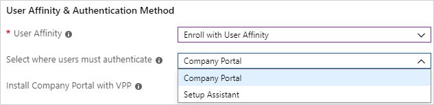
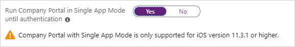

---
# required metadata

title: Enroll iOS/iPadOS devices - Device Enrollment Program
titleSuffix: Microsoft Intune
description: Learn how to enroll corporate-owned iOS/iPadOS devices using the Device Enrollment Program.
keywords:
author: ErikjeMS
ms.author: erikje
manager: dougeby
ms.date: 02/04/2020
ms.topic: conceptual
ms.service: microsoft-intune
ms.subservice: enrollment
ms.localizationpriority: high
ms.technology:
ms.assetid: 7ddbf360-0c61-11e8-ba89-0ed5f89f718b

# optional metadata

#ROBOTS:
#audience:

ms.reviewer: tisilver
ms.suite: ems
search.appverid: MET150
#ms.tgt_pltfrm:
ms.custom: seodec18
ms.collection: M365-identity-device-management
---

# Automatically enroll iOS/iPadOS devices with Apple's Automated Device Enrollment

> [!IMPORTANT]
> Apple recently changed from using the Apple Device Enrollment Program (DEP) to Apple Automated Device Enrollment (ADE). Intune is in the process of updating the Intune user interface to reflect that. Until such changes are complete, you'll continue to see *Device Enrollment Program* in the Intune portal. Wherever that is shown, it now uses Automated Device Enrollment.

You can set up Intune to enroll iOS/iPadOS devices purchased through Apple's [Automated Device Enrollment (ADE)](https://deploy.apple.com) (formerly Device Enrollment Program). Automated Device Enrollment lets you enroll large numbers of devices without ever touching them. Devices like iPhones, iPads, and MacBooks can be shipped directly to users. When the user turns on the device, Setup Assistant, which includes the typical out-of-box-experience for Apple products, runs with preconfigured settings and the device enrolls into management.

To enable ADE, you use both the Intune and [Apple Business Manager (ABM)](https://business.apple.com/) or [Apple School Manager (ASM)](https://school.apple.com/) portals. A list of serial numbers or a purchase order number is required so you can assign devices to Intune for management in either Apple portal. You create ADE enrollment profiles in Intune containing settings that are applied to devices during enrollment. Note that ADE cannot be used with a [device enrollment manager](device-enrollment-manager-enroll.md) account.

> [!NOTE]
> ADE sets device configurations that can't necessarily be removed by the end user. Therefore, before [migrating to ADE](../fundamentals/migration-guide-considerations.md), the device must be wiped to return it to an out-of-box (new) state.

## Automated Device Enrollment and the Company Portal

ADE enrollments aren't compatible with the app store version of the Company Portal app. You can give users access to the Company Portal app on a ADE device. You may want to provide this access to let users choose which corporate apps they wish to use on their device or to use modern authentication to complete the enrollment process. 

To enable modern authentication during enrollment, push the app to the device using **Install Company Portal with VPP** (Volume Purchase Program) in the ADE profile. For more information, see [Automatically enroll iOS/iPadOS devices with Apple's ADE](device-enrollment-program-enroll-ios.md#create-an-apple-enrollment-profile).

To enable the Company Portal to update automatically and provide the Company Portal app on devices already enrolled with ADE, deploy the Company Portal app through Intune as a required Volume Purchase Program (VPP) app with an [Application Configuration policy](../apps/app-configuration-policies-use-ios.md) applied.

> [!NOTE]
> During automated device enrollment, while the Company Portal is running in single app mode, clicking the **Learn more** link results in an error message because of single app mode. After enrollment is completed, you can view more information in the CP when the device is no longer in single app mode. 

## What is supervised mode?

Apple introduced supervised mode in iOS/iPadOS 5. An iOS/iPadOS device in supervised mode can be managed with more controls, such as block screen capture and block installing apps from App Store. As such, it's especially useful for corporate-owned devices. Intune supports configuring devices for supervised mode as part of ADE.

Support for unsupervised ADE devices was deprecated in iOS/iPadOS 11. In iOS/iPadOS 11 and later, ADE configured devices should always be supervised. The ADE *is_supervised* flag will be ignored in a future iOS/iPadOS release.

<!--
**Steps to enable enrollment programs from Apple**
1. [Get an Apple DEP token and assign devices](#get-the-apple-dep-token)
2. [Create an enrollment profile](#create-an-apple-enrollment-profile)
3. [Synchronize DEP-managed devices](#sync-managed-device)
4. [Assign DEP profile to devices](#assign-an-enrollment-profile-to-devices)
5. [Distribute devices to users](#end-user-experience-with-managed-devices)
-->
## Prerequisites
- Devices purchased in [Apple's ADE](https://deploy.apple.com)
- [Mobile Device Management (MDM) Authority](../fundamentals/mdm-authority-set.md)
- [Apple MDM Push certificate](apple-mdm-push-certificate-get.md)

## Get an Apple ADE token

Before you can enroll iOS/iPadOS devices with ADE, you need a ADE token (.p7m) file from Apple. This token lets Intune sync information about ADE devices that your corporation owns. It also permits Intune to upload enrollment profiles to Apple and to assign devices to those profiles.

You use the [Apple Business Manager (ABM)](https://business.apple.com/) or [Apple School Manager (ASM)](https://school.apple.com/) portal to create a token. You also use the ABM/ASM portal to assign devices to Intune for management.

> [!NOTE]
> If you delete the token from the Intune classic portal before migrating to Azure, Intune might restore a deleted Apple ADE token. You can delete the ADE token again from the Azure portal.

### Step 1. Download the Intune public key certificate required to create the token.

1. In the [Microsoft Endpoint Manager admin center](https://go.microsoft.com/fwlink/?linkid=2109431), choose **Devices** > **iOS** > **iOS enrollment** > **Enrollment Program Tokens** > **Add**.

    

2. Grant permission to Microsoft to send user and device information to Apple by selecting **I agree**.

   > [!NOTE]
   > Once you progress beyond step 2 to download the Intune public key certificate, do not close the wizard or navigate away from this page. Doing so will invalidate the certificate you have downloaded, and you will need to repeat this process again. If you encounter this situation, you will typically note that the **Create** button on the **Review + create** tab is greyed out, and you cannot complete the process.

   

3. Choose **Download your public key** to download and save the encryption key (.pem) file locally. The .pem file is used to request a trust-relationship certificate from the Apple portal.

### Step 2. Use your key to download a token from Apple.

1. Choose **Create a token for Apple's Device Enrollment Program** to open Apple's Business portal, and sign in with your company Apple ID. You can use this Apple ID to renew your ADE token.
2. In Apple's [Business portal](https://business.apple.com), choose **Get Started** for **Device Enrollment Program**.

3. On the **Manage Servers** page, choose **Add MDM Server**.
4. Enter the **MDM Server Name**, and then choose **Next**. The server name is for your reference to identify the mobile device management (MDM) server. It isn't the name or URL of the Microsoft Intune server.

5. The **Add &lt;ServerName&gt;** dialog box opens, stating **Upload Your Public Key**. Select **Choose File…** to upload the .pem file, and then choose **Next**.

6. Go to  **Deployment Programs** &gt; **Device Enrollment Program** &gt; **Manage Devices**.
7. Under **Choose Devices By**, specify how devices are identified:
    - **Serial Number**
    - **Order Number**
    - **Upload CSV File**.

   

8. For **Choose Action**, choose **Assign to Server**, choose the &lt;ServerName&gt; specified for Microsoft Intune, and then choose **OK**. The Apple portal assigns the specified devices to the Intune server for management and then displays **Assignment Complete**.

   In the Apple portal, go to **Deployment Programs** &gt; **Device Enrollment Program** &gt; **View Assignment History** to see a list of devices and their MDM server assignment.

### Step 3. Save the Apple ID used to create this token.

In the [Microsoft Endpoint Manager admin center](https://go.microsoft.com/fwlink/?linkid=2109431), provide the Apple ID for future reference.

### Step 4. Upload your token and choose scope tags.

1. In the **Apple token** box, browse to the certificate (.p7m) file, choose **Open**.
2. If you want to apply [scope tags](../fundamentals/scope-tags.md) to this DEP token, choose **Scope (tags)**, and select the scope tags that you want. Scope tags applied to a token will be inherited by profiles and devices added to this token.
3. Choose **Create**.

With the push certificate, Intune can enroll and manage iOS/iPadOS devices by pushing policy to enrolled mobile devices. Intune automatically synchronizes with Apple to see your enrollment program account.

## Create an Apple enrollment profile

Now that you've installed your token, you can create an enrollment profile for ADE devices. A device enrollment profile defines the settings applied to a group of devices during enrollment. There is a limit of 100 enrollment profiles per ADE token.

> [!NOTE]
> Devices will be blocked if there aren't enough Company Portal licenses for a VPP token, or if the token has expired. Intune will display an alert when a token is about to expire or licenses are running low.
 

1. In the [Microsoft Endpoint Manager admin center](https://go.microsoft.com/fwlink/?linkid=2109431), choose **Devices** > **iOS** > **iOS enrollment** > **Enrollment Program Tokens**.
2. Select a token, choose **Profiles** > **Create profile** > **iOS**.

    

3. On the **Basics** page, enter a **Name** and **Description** for the profile for administrative purposes. Users don't see these details. You can use this **Name** field to create a dynamic group in Azure Active Directory. Use the profile name to define the enrollmentProfileName parameter to assign devices with this enrollment profile. Learn more about [Azure Active Directory dynamic groups](https://docs.microsoft.com/azure/active-directory/users-groups-roles/groups-dynamic-membership#rules-for-devices).

    

4. Select **Next: Device Management Settings**.

5. For **User Affinity**, choose whether devices with this profile must enroll with or without an assigned user.
    - **Enroll with User Affinity** - Choose this option for devices that belong to users and that want to use the Company Portal for services like installing apps. If you're using ADFS and you're using Setup Assistant to authenticate, [WS-Trust 1.3 Username/Mixed endpoint](https://technet.microsoft.com/library/adfs2-help-endpoints) [Learn more](https://technet.microsoft.com/itpro/powershell/windows/adfs/get-adfsendpoint) is required.

    - **Enroll without User Affinity** - Choose this option for device unaffiliated with a single user. Use this option for devices that don't access local user data. Apps like the Company Portal app don't work.

5. If you chose **Enroll with User Affinity**, you can let users authenticate with Company Portal instead of the Apple Setup Assistant.

    

    > [!NOTE]
    > If you want do any of the following, set **Select where users must authenticate** to **Company Portal**.
    >    - use multifactor authentication
    >    - prompt users who need to change their password when they first sign in
    >    - prompt users to reset their expired passwords during enrollment
    >
    > These aren't supported when authenticating with Apple Setup Assistant.

6. If you chose **Company Portal** for **Select where users must authenticate**, you can use a VPP token to automatically install the Company Portal on the device. In this case, the user doesn't have to supply an Apple ID. To install the Company Portal with a VPP token, choose a token under **Install Company Portal with VPP**. Requires that the Company Portal has already been added to the VPP token. To ensure that the Company Portal app continue to be updated after enrollment, make sure that you have configured an app deployment in Intune (Intune>Client Apps). So that user interaction is not required, you'll most likely want to have the Company Portal as a iOS/iPadOS VPP app, make it a required app, and use device licensing for the assignment. Make sure that the token doesn't expire and that you have enough device licenses for the Company Portal app. If the token expires or runs out of licenses, Intune installs the App Store Company Portal instead and prompts for an Apple ID. 

    > [!NOTE]
    > When **Select where users must authenticate** is to **Company Portal**, make sure that the device enrollment process is performed within the first 24 hours of the company portal being downloaded to the ADE device. Otherwise enrollment might fail, and a factory reset will be needed to enroll the device.
    
    

7. If you chose **Setup Assistant** for **Select where users must authenticate**, but you also want to use Conditional Access or deploy company apps on the devices, you must install the Company Portal on the devices. To do so, choose **Yes** for **Install Company Portal**.  If you would like users to receive the Company Portal without having to authenticate into the app store, choose to **Install Company Portal with VPP** and select a VPP token. Make sure that the token doesn't expire and that you have enough device licenses for the Company Portal app to deploy correctly.

8. If you chose a token for **Install Company Portal with VPP**, you can lock the device in Single App Mode (specifically, the Company Portal app) right after the Setup Assistant completes. Choose **Yes** for **Run Company Portal in Single App Mode until authentication** to set this option. To use the device, the user must first authenticate by signing in using the Company Portal.

    Multi-factor authentication isn't supported on a single device locked in Single App Mode. This limitation exists because the device can't switch to a different app to complete the second factor of authentication. Therefore, if you want multifactor authentication on a Single App Mode device, the second factor must be on a different device.

    This feature is only supported for iOS/iPadOS 11.3.1 and later.

   

9. If you want devices using this profile to be supervised, choose **Yes** for **Supervised**.

    

    **Supervised** devices give you more management options and disabled Activation Lock by default. Microsoft recommends using ADE as the mechanism for enabling supervised mode, especially if you're deploying large numbers of iOS/iPadOS devices.

    Users are notified that their devices are supervised in two ways:

   - The lock screen says: "This iPhone is managed by Contoso."
   - The **Settings** > **General** > **About** screen says: "This iPhone is supervised. Contoso can monitor your Internet traffic and locate this device."

     > [!NOTE]
     > A device enrolled without supervision can only be reset to supervised by using the Apple Configurator. Resetting the device in this manner requires connecting an iOS/iPadOS device to a Mac with a USB cable. Learn more about this on [Apple Configurator docs](http://help.apple.com/configurator/mac/2.3).

10. Choose if you want locked enrollment for devices using this profile. **Locked enrollment** disables iOS/iPadOS settings that allow the management profile to be removed from the **Settings** menu. After device enrollment, you can't change this setting without wiping the device. Such devices must have the **Supervised** Management Mode set to *Yes*. 

    > [!NOTE]
    > After the device is enrolled with **Locked enrollment**, users will not be able to use **Remove Device** or **Factory Reset** by in the Company Portal app. The options will be unavailable to the user. The user also won't be able to remove the device in the Company Portal website (https://portal.manage.microsoft.com).
    > Also, if a BYOD device is convereted to an Apple Automated Device Enrollment device and enrolled with a **Locked enrollment** enabled profile, the user will be allowed to use **Remove Device** and **Factory Reset** for 30 days, and then the options will be disabled or unavailable. Reference: https://help.apple.com/configurator/mac/2.8/#/cad99bc2a859.

11. Choose if you want the devices using this profile to be able to **Sync with computers**. If you choose **Allow Apple Configurator by certificate**, you must choose a certificate under **Apple Configurator Certificates**.

     > [!NOTE]
     > If **Sync with computers** is set to **Deny all**, the port will be limited on iOS and iPadOS devices. The port can only be used for charging and nothing else. The port will be blocked from using iTunes or Apple Configurator.

12. If you chose **Allow Apple Configurator by certificate** in the previous step, choose an Apple Configurator Certificate to import.

13. You can specify a naming format for devices that is automatically applied when they enroll and upon each successive checkin. To create a naming template, select **Yes** under **Apply device name template**. Then, in the **Device Name Template** box, enter the template to use for the names using this profile. You can specify a template format that includes the device type and serial number. 

14. Choose **Next: Setup Assistant Customization**.

15. On the **Setup Assistant customization** page, configure the following profile settings:
    

    | Department settings | Description |
    |---|---|
    | <strong>Department Name</strong> | Appears when users tap <strong>About Configuration</strong> during activation. |
    |    <strong>Department Phone</strong>     | Appears when the user clicks the <strong>Need Help</strong> button during activation. |

    You can choose to hide Setup Assistant screens on the device during user setup.
    - If you choose **Hide**, the screen won't be displayed during setup. After setting up the device, the user can still go in to the **Settings** menu to set up the feature.
    - If you choose **Show**, the screen will be displayed during setup. The user can sometimes skip the screen without taking action. But they can then later go into the device's **Settings** menu to set up the feature. 

    | Setup Assistant screen settings | If you choose **Show**, during setup the device will... |
    |------------------------------------------|------------------------------------------|
    | <strong>Passcode</strong> | Prompt the user for a passcode. Always require a passcode for unsecured devices unless access is controlled in some other manner (like kiosk mode that restricts the device to one app). |
    | <strong>Location Services</strong> | Prompt the user for their location. |
    | <strong>Restore</strong> | Display the Apps & Data screen. This screen gives the user the option to restore or transfer data from iCloud Backup when they set up the device. |
    | <strong>iCloud and Apple ID</strong> | Give the user the options to sign in with their Apple ID and use iCloud.                         |
    | <strong>Terms and Conditions</strong> | Require the user to accept Apple's terms and conditions. |
    | <strong>Touch ID</strong> | Give the user the option to set up fingerprint identification for the device. |
    | <strong>Apple Pay</strong> | Give the user the option to set up Apple Pay on the device. |
    | <strong>Zoom</strong> | Give the user to the option to zoom the display when they set up the device. |
    | <strong>Siri</strong> | Give the user the option to set up Siri. |
    | <strong>Diagnostic Data</strong> | Display the Diagnostics screen to the user. This screen gives the user the option to send diagnostic data to Apple. |
    | <strong>Display Tone</strong> | Give the user the option to turn on Display Tone. |
    | <strong>Privacy</strong> | Display the Privacy screen to the user. |
    | <strong>Android Migration</strong> | Give the user the option to migrate date from an Android device. |
    | <strong>iMessage and FaceTime</strong> | Give the user the option to set up iMessage and FaceTime. |
    | <strong>Onboarding</strong> | Display onboarding informational screens for user education, such as Cover Sheet and Multitasking and Control Center. |
    | <strong>Watch Migration</strong> | Give the user the option to migrate data from a watch device. |
    | <strong>Screen Time</strong> | Display the Screen Time screen. |
    | <strong>Software Update</strong> | Display the mandatory software update screen. |
    | <strong>SIM Setup</strong> | Give the user the option to add a cellular plan. |
    | <strong>Appearance</strong> | Display the Appearance screen to the user. |
    | <strong>Express Language</strong>| Display the Express Language screen to the user. |
    | <strong>Preferred Language</strong> | Give the user the option to choose their  **Preferred Language**. |
    | <strong>Device to Device Migration</strong> | Give the user the option to migrate data from their old device to this device.|
    

16. Choose **Next** to go to the **Review + Create** page.

17. To save the profile, choose **Create**.

## Sync managed devices
Now that Intune has permission to manage your devices, you can synchronize Intune with Apple to see your managed devices in Intune in the Azure portal.

1. In the [Microsoft Endpoint Manager admin center](https://go.microsoft.com/fwlink/?linkid=2109431), choose **Devices** > **iOS** > **iOS enrollment** > **Enrollment Program Tokens** > choose a token in the list > **Devices** > **Sync**.
   

   To follow Apple's terms for acceptable enrollment program traffic, Intune imposes the following restrictions:
   - A full sync can run no more than once every seven days. During a full sync, Intune fetches the complete updated list of serial numbers assigned to the Apple MDM server connected to Intune. If an ADE device is deleted from the Intune portal, it should be unassigned from the Apple MDM server in the ADE portal. If it's not unassigned, it won't be reimported to Intune until the full sync is run.   
   - A sync is run automatically every 24 hours. You can also sync by clicking the **Sync** button (no more than once every 15 minutes). All sync requests are given 15 minutes to finish. The **Sync** button is disabled until a sync is completed. This sync will refresh existing device status and import new devices assigned to the Apple MDM server.   

## Assign an enrollment profile to devices
You must assign an enrollment program profile to devices before they can enroll.

>[!NOTE]
>You can also assign serial numbers to profiles from the **Apple Serial Numbers** blade.

1. In the [Microsoft Endpoint Manager admin center](https://go.microsoft.com/fwlink/?linkid=2109431), choose **Devices** > **iOS** > **iOS enrollment** > **Enrollment Program Tokens** > choose a token in the list.
2. Choose **Devices** > choose devices in the list > **Assign profile**.
3. Under **Assign profile**, choose a profile for the devices > **Assign**.

### Assign a default profile

You can pick a default profile to be applied to all devices enrolling with a specific token.

1. In the [Microsoft Endpoint Manager admin center](https://go.microsoft.com/fwlink/?linkid=2109431), choose **Devices** > **iOS** > **iOS enrollment** > **Enrollment Program Tokens** > choose a token in the list.
2. Choose **Set Default Profile**, choose a profile in the drop-down list, and then choose **Save**. This profile will be applied to all devices that enroll with the token.

## Distribute devices
You have enabled management and syncing between Apple and Intune, and assigned a profile to  let your ADE devices enroll. You can now distribute devices to users. Devices with user affinity require each user be assigned an Intune license. Devices without user affinity require a device license. An activated device can't apply an enrollment profile until the device is wiped.

See [Enroll your iOS/iPadOS device in Intune with the Device Enrollment Program](../user-help/enroll-your-device-dep-ios.md).

## Renew an ADE token  

> [!NOTE]
> In addition to renewing your ADE token yearly, you will need to renew your enrollment program token within Intune and Apple Business Manager when the Managed Apple ID password changes for the user who set up the token in Apple business Manager or that user leaves your Apple Business Manager organization.

1. Go to business.apple.com.  
2. Under **Manage Servers**, choose your MDM server associated with the token file that you want to renew.
3. Choose **Generate New Token**.

    

4. Choose **Your Server Token**.  
5. In the [Microsoft Endpoint Manager admin center](https://go.microsoft.com/fwlink/?linkid=2109431), choose **Devices** > **iOS** > **iOS enrollment** > **Enrollment Program Tokens** > choose the token.
    

6. Choose **Renew token** and enter the Apple ID used to create the original token.  
    

8. Upload the newly downloaded token.  
9. Choose **Renew token**. You'll see the confirmation that the token was renewed.   
    
