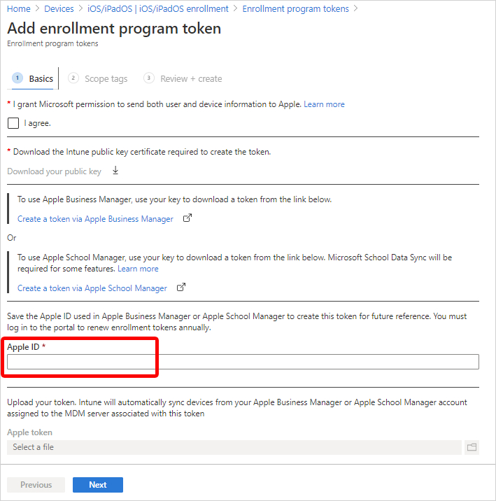
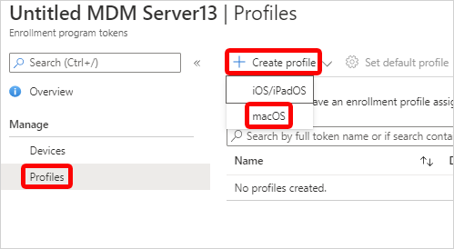
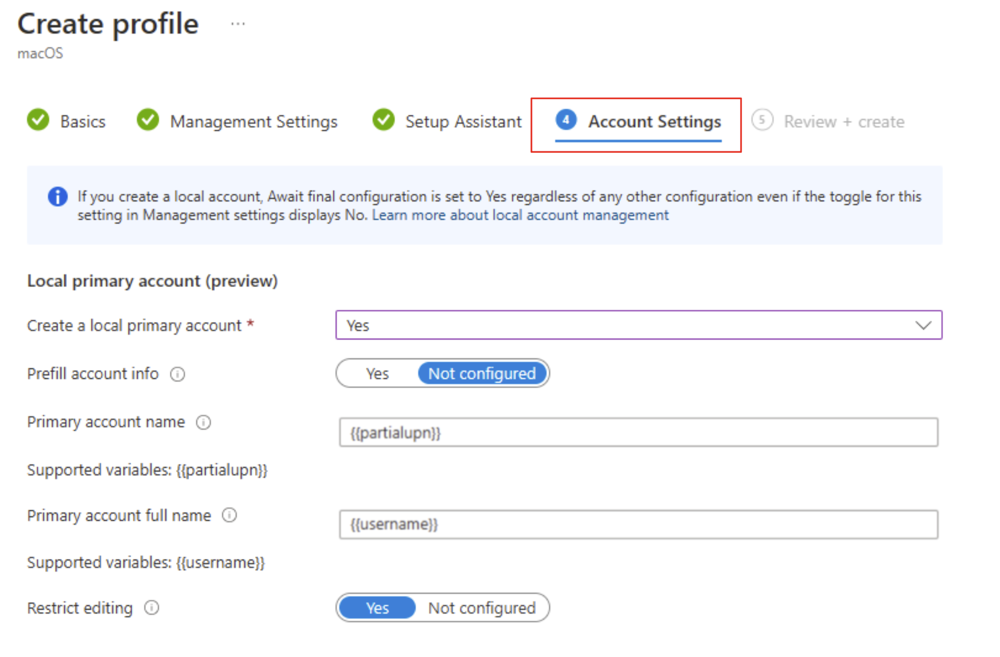
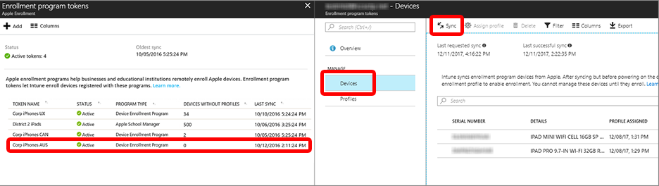

---
# required metadata

title: Set up automated device enrollment (ADE) for macOS 
description: Learn how to enroll corporate-owned Macs into Microsoft Intune with Apple Automated Device Enrollment (ADE). 
keywords:
author: Lenewsad
ms.author: lanewsad
manager: dougeby
ms.date: 09/18/2024
ms.topic: how-to
ms.service: microsoft-intune
ms.subservice: enrollment
ms.localizationpriority: high

# optional metadata

#ROBOTS:
#audience:

ms.reviewer: annovich  
ms.suite: ems
search.appverid: MET150
#ms.tgt_pltfrm:
ms.collection:
- tier1
- M365-identity-device-management
---

# Set up automated device enrollment (ADE) for macOS 

Set up automated device enrollment in Intune for new or wiped Macs purchased through an Apple enrollment program, such as Apple Business Manager or Apple School Manager. With this method, you don't need to have the devices with you to configure them. Intune automatically syncs with Apple to obtain device info from your enrollment program account, and deploys your preconfigured enrollment profiles to Macs over-the-air. Prepared devices can be shipped directly to employees or students. Setup Assistant and device enrollment begin when someone turns on the Mac.     

This article describes how to set up an automated device enrollment profile for corporate-owned Macs. 

>[!NOTE]
> The steps in this article are the same whether you're using Apple Business Manager or Apple School Manager. For brevity, we refer to *Apple Business Manager* only throughout the steps in this article, except where clarification is necessary.     

<!--
**Steps to enable enrollment programs from Apple**
1. [Get an Apple DEP token and assign devices](#get-the-apple-dep-token)
2. [Create an enrollment profile](#create-an-apple-enrollment-profile)
3. [Synchronize DEP-managed devices](#sync-managed-device)
4. [Assign DEP profile to devices](#assign-an-enrollment-profile-to-devices)
5. [Distribute devices to users](#end-user-experience-with-managed-devices)
-->  

## Limitations  
Automated device enrollment via Apple Business Manager and Apple School Manager isn't supported with [device enrollment manager accounts](device-enrollment-manager-enroll.md).    

## Prerequisites 

Access to [Apple School Manager](https://school.apple.com/) or [Apple Business Manager](http://business.apple.com) is required. You must also have a list of device serial numbers or a purchase order number for the devices you purchased through Apple.  

Before you begin, ensure the following tasks are complete:    

- Set the [mobile device management authority](../fundamentals/mdm-authority-set.md) in your tenant.  
- Get an [Apple MDM Push certificate](../enrollment/apple-mdm-push-certificate-get.md).    

## Create enrollment program token  

This section describes how to create an enrollment program token in Intune. The *enrollment program token* (sometimes referred to as an automated device enrollment token) is a necessary component of automated device enrollment. It enables the communication and device management capabilities between Intune and your chosen Apple enrollment program. It allows Intune to sync information from your Apple Business Manager or Apple School Manager account, and apply profiles to devices.  

### Step 1: Download the Intune public key certificate   

The public key certificate is needed to request a trust-relationship certificate from Apple Business Manager.     

1. In the [Microsoft Intune admin center](https://go.microsoft.com/fwlink/?linkid=2109431), go to **Devices** > **Enrollment**.  
1. Select the **Apple** tab.  
1. Under **Bulk Enrollment Methods**, select **Enrollment program tokens**.  
1. Select **Add**.  
1. Select **I agree** to grant permission to Microsoft to send user and device information to Apple.  
1. Select **Download your public key** and save the key as a PEM file locally. The key will be used to get the MDM server token in the next step.  

### Step 2: Add MDM server and download server token   

Add a mobile device management (MDM) server for Intune to Apple Business Manager, and then download the server token for it.   

1. In the admin center, select the link that corresponds with the Apple portal you use. Your options: 
    * **Create a token via Apple Business Manager** 
    * **Create a token via Apple School Manager**  

    The selected portal opens in a new browser tab. You can safely switch to the new tab, but keep the tab with Microsoft Intune open for later.     
2. Sign in to the Apple portal with your company Apple ID. Remember, this ID is the Apple ID you and your org must use to renew and manage the token going forward, so don't use a personal ID.      
3. Go to your account profile > **Preferences**.  
4. Go to your MDM server assignments.  
5. Select the option to add an MDM server.  
6. Name the MDM server. The name is for identification purposes only while in Apple Business Manager, and doesn't have to be the actual name or URL of the Microsoft Intune server. 
7. Upload your public key file, and then save your changes. 
8. Download the server token (.p7m file).   

### Step 3: Assign devices to MDM server   

Optionally, after you create the MDM server in Apple Business Manager, you can start assigning devices to it. We recommend assigning them now since you're already in Apple Business Manager, but you can come back later if you're not ready. You can use available features like *filters* and *bulk assignment* to simplify assignment selection. For more information and steps, see [Assign, reassign, or unassign devices in Apple Business Manager](https://support.apple.com/guide/apple-business-manager/axmf500c0851/web)(opens Apple Business Manager User Guide).  

### Step 4: Save Apple ID 

Return to the [admin center](https://go.microsoft.com/fwlink/?linkid=2109431) and enter the Apple ID used to download the server token. This ID is the Apple ID you need to use to renew the token every year. Make sure future Intune admins are aware of the Apple ID used, in case you leave your organization and need to transition token management to them. 

  

### Step 5: Upload server token and finish     
Upload the server token file to Intune to finish creating the enrollment program token.   

1. Return to the admin center > **Apple token** field. Browse to the server token (.p7m file) on your device. 
2. Choose **Open**, and then select **Create**. 

Intune will automatically connect with Apple Business Manager to sync device information from your enrollment program account. For information about how to manually sync the token, see [Sync managed devices](#sync-managed-devices) (in this article).      

## Create an Apple enrollment profile

Create an automated device enrollment profile in the admin center. The profile defines the enrollment experience for your organization's Mac devices, and enforces enrollment policies and settings on enrolling devices. The profile is deployed to assigned devices over-the-air.     

At the end of this procedure, you can assign this profile to Microsoft Entra device groups. 

>[!IMPORTANT]
>To create the profile, you must have an enrollment program token setup in Intune. If you haven't done that yet, see [Create enrollment program token](#create-enrollment-program-token) at the beginning of this article.     

1. In the [admin center](https://go.microsoft.com/fwlink/?linkid=2109431), go to **Devices** > **Enrollment**.  
1. Select the **Apple** tab.  
1. Under **Bulk Enrollment Methods**, select **Enrollment program tokens**.   
1. Select an enrollment program token.  
1. Select **Profiles** > **Create profile** > **macOS**.  

      

1. For **Basics**, enter a name and description for the profile so that you can distinguish it from other enrollment profiles. These details aren't visible to device users.  

     >[!TIP]
     > You can use the name field to create a dynamic group in Microsoft Entra ID, and assign devices to the enrollment profile automatically. Use the profile name to define the *enrollmentProfileName* parameter. For more information, see [Microsoft Entra dynamic groups](/azure/active-directory/users-groups-roles/groups-dynamic-membership#rules-for-devices).  

1. Select **Next**. 

1. On the **Management Settings** page, configure **User Affinity**. *User affinity* determines whether devices enroll with or without an assigned user. Your options: 

    * **Enroll without User Affinity**:  Enroll devices that aren't associated with a single user. Choose this option for shared devices and devices that don't need to access local user data. The Company Portal app doesn't work on these types of devices.  
    * **Enroll with User Affinity**: Enroll devices that are associated with an assigned user. Choose this option for work devices that belong to users, and if you want to require users to have the Company Portal app to install apps. Multifactor authentication (MFA) is available with this option.     

      Option 2 requires more configurations. Users must authenticate themselves before enrollment to confirm their identity. Select one of the following authentication methods:   

      - **Setup Assistant with modern authentication**: This method requires users to complete all Setup Assistant screens and sign in to the Company Portal app with their Microsoft Entra credentials before they can access resources. After they sign in to Company Portal, the device:   

        - Registers with Microsoft Entra ID.  
        - Is added to the user's device record in Microsoft Entra ID.  
        - Can be evaluated for device compliance.  
        - Gains access to resources protected by conditional access.

        If the user doesn't sign in to the Company Portal to complete registration, they'll be redirected to the Company Portal app each time they try to open a managed app with conditional access protection.  

        Devices running macOS 10.15 and later can use this method. Older macOS devices fall back to using the legacy Setup Assistant method. For more information about how to get the Company Portal app to Mac users, see [Add the Company Portal for macOS app](../apps/apps-company-portal-macos.md).    

      - **Setup Assistant (legacy)**: Use the legacy Setup Assistant if you want users to experience the typical out-of-box-experience for Apple products. This method installs standard preconfigured settings when the device enrolls with Intune management. If you're using Active Directory Federation Services and you're using Setup Assistant to authenticate, a [WS-Trust 1.3 Username/Mixed endpoint](/previous-versions/windows/it-pro/windows-server-2008-R2-and-2008/ff608241(v=ws.10)) is required. For more information about retrieving the ADFS endpoint, see [Get-ADfsEndpoint] (/powershell/module/adfs/get-adfsendpoint?view=win10-ps&preserve-view=true).   

 1. **Await final configuration** enables a locked experience at the end of Setup Assistant to ensure your most critical device configuration policies are installed on the device. This setting is applied once during the out-of-box Apple automated device enrollment experience in Setup Assistant. The device user doesn't experience it again unless they re-enroll their Mac. 
 
    Your options:  
       * **Yes**:  Just before the home screen loads, Setup Assistant pauses and lets Intune check in with the device. The end-user experience locks while users await final configurations. This option is the default configuration for new enrollment profiles.      

       * **No**: The device is released to the home screen when Setup Assistant ends, regardless of policy installation status. Device users might be able to access the home screen or change device settings before all policies are installed. This option is the default configuration for existing enrollment profiles.  
      
    The amount of time that users are held on the Awaiting final configuration screen varies, and depends on the total number of policies and apps you assign to the device. Users can see the device configuration profiles downloading in Setup Assistant as they wait. The more policies and apps assigned, the longer the waiting time. Setup Assistant and Intune don't enforce a minimum or maximum time limit during this portion of setup. During product validation, most devices we tested were released and able to access the home screen within 15 minutes. If you enable this feature and are working with a Microsoft partner or non-Microsoft service to help you provision devices, tell them about the potential for increased provisioning time.  

    The locked experience is supported on Macs running macOS 10.11 or later. It works on Macs targeted with new or existing enrollment profiles set up for these scenarios:    
       * Enrollment via Setup Assistant with modern authentication  
       * Enrollment with Setup Assistant (legacy)  
       * Enrollment without user device affinity  

1. You can enforce **Locked enrollment** to prevent users from unenrolling their devices from Intune. Select **Yes** to disable the Mac settings in System Preferences and Terminal that allow users to remove the management profile. After the device enrolls, you can't change this setting without wiping the device.  

1. Select **Next**.   

1. Optionally, on the **Account Settings** page, you can configure the local primary account on targeted Macs. 

   > [!div class="mx-imgBorder"]
   >   

   These settings are supported on devices running macOS 10.11 or later. Keep in mind while you configure the primary account that this account is going to be an *admin* account. Having at least one admin account is a Mac setup requirement.  

   Your options:  

   * **Create a local primary account**: Select **Yes** to configure local primary account settings for targeted Macs. Select **Not configured** to skip all account setting configurations.     
   * **Prefill account info**: The default configuration, **Not configured**, requires the device user to enter their account username and full name in Setup Assistant. To prefill the account information for them instead, select **Yes**. Then enter the primary account name and full name:   
     * **Primary account name**: Enter the username for the account. `{{partialupn}}` is the supported token variable for *account name*.    
     * **Primary account full name**: Enter the full name of the account.   `{{username}}` is the supported token variable for *full name*.   
   * **Restrict editing**: The default configuration is set to **Yes** so that device users can't edit the account name and full name configured for them. To allow device users to edit the account name and full name, select **Not configured**. If you're only using Setup Assistant (legacy) to enroll devices running macOS 10.15 and later, you can expect the following end user experience:   
     * **Yes**: The account creation screen in Setup Assistant never appears. Instead, the local primary account is automatically created based on the other setting configurations, and the password is automatically populated from the Microsoft Entra authentication screen. The device user can't edit these fields.           
     * **Not configured**: The local primary account screen is shown to the end user in Setup Assistant and is populated with the configured account values, and the password from the Microsoft Entra authentication screen. The device user can edit these fields during Setup Assistant.   

   For account settings to work as intended, your enrollment profile must have the following configurations:      
   * **User affinity**: Select **Enroll with User affinity**.     
   * **Authentication method**: Select **Setup Assistant with modern authentication** or **Setup Assistant (legacy)**.   
   * **Await final configuration**: Select **Yes**.       

   Local accounts depend on the *await final configuration* feature when they're being created. As a result, if you configure any local primary account settings, this setting is always enabled. Even if you don't touch the *await final configuration* setting, it's enabled in the background and applied to the enrollment profile.  

1. Select **Next**.  

1. On the **Setup Assistant** page, configure the Setup Assistant experience.      
    1. Enter your department information so that users know who to contact for support:  
        * **Department Name**: This name appears when device users select **About Configuration** during activation.  
        * **Department Phone**: This phone number appears when device users select **Need Help** during activation.   
    2. Select the Setup Assistant screens you want to show or hide during device setup. For a description of all screens, [see Setup Assistant screen reference](#setup-assistant-screen-reference) (in this article). Your options:  
        * **Hide**: The screen doesn't appear to users during device setup. After device setup, the user can go to their device settings to set up the feature.  
        * **Show**: The screen appears to users during device setup. The user can still skip screens that don't require immediate action. After device setup, the user can go to their device settings to set up the feature.  
1. Select **Next**.
1. Review the summary of changes, and then select **Create** to finish creating the profile.   

### Setup Assistant screen reference 
The following table describes the Setup Assistant screens shown during automated device enrollment for Macs. You can show or hide these screens on supported devices during enrollment. For more information about how each Setup Assistant screen affects the user experience, see these Apple resources: 

- [Apple Platform Deployment guide: Manage Setup Assistant for Apple devices](https://support.apple.com/en-mide/guide/deployment/depdeff4a547/web) 
- [Apple Developer documentation: ShipKeys](https://developer.apple.com/documentation/devicemanagement/skipkeys)  
-   

| Setup Assistant screen | What happens when visible  |
|------------------------------------------|------------------------------------------|
| **Location Services** | Shows the location services setup pane, where users can enable location services on their device. For macOS 10.11 and later. |
| **Restore** | Shows the apps and data setup pane. On this screen, users setting up devices can restore or transfer data from iCloud Backup. For macOS 10.9 and later. |
| **Apple ID** | Shows the Apple ID setup pane, which gives users to the option to sign in with their Apple ID and use iCloud. For macOS 10.9 and later.   |
| **Terms and conditions** |Shows the Apple terms and conditions pane, and requires users to accept them. For macOS 10.9 and later. |
| **Touch ID and Face ID** | Shows the biometric setup pane, which gives users the option to set up fingerprint or facial identification on their devices. For macOS 10.12.4 and later. |
| **Apple Pay** | Shows the Apple Pay setup pane, which gives users the option to set up Apple Pay on their devices. For macOS 10.12.4 and later. |
| **Siri** | Shows the Siri setup pane to users. For macOS 10.12 and later. |
| **Diagnostics Data** | Shows the diagnostics pane where users can opt-in to send diagnostic data to Apple. For macOS 10.9 and later. |  
| **Display Tone** |Shows the setup pane for the display tone. This screen gives users the option to turn on true tone display. For macOS 10.13.6 and later. |
| **FileVault** | Shows the FileVault 2 encryption screen to users. For macOS 10.10 and later. |
| **iCloud Diagnostics** | Shows the iCloud Analytics screen to users. For macOS 10.12.4 and later. |  
| **Registration** | Shows the registration screen to users. For macOS 10.9 and later. |  
| **iCloud Storage** | Shows the iCloud Documents and Desktop screen to the user. For macOS 10.13.4 and later. |
| **Appearance** | Shows the appearance pane where users can select an appearance mode. For macOS 10.14 and later. |    
| **Screen Time** | Shows the macOS Screen Time setup pane, a feature users can enable to gain insight on screen-time, and app and website activity. For macOS 10.15 and later. |
| **Privacy** | Shows the privacy setup pane to the user. For macOS 10.13.4 and later. |
| **Accessibility** | Shows the accessibility setup screen to the user. If this screen is hidden, the user can't use the macOS Voice Over feature. Voice Over is supported on devices that: - Run macOS 11. - Are connected to the internet using Ethernet. - Have a serial number in Apple School Manager or Apple Business Manager. |  
| **Auto unlock with Apple Watch**| Shows the macOS Unlock with Apple Watch pane, where users can configure their Apple Watch to unlock their Mac. For macOS 12.0 and later.  
| **Terms of Address**| Shows the terms of address pane, which gives users the option to choose how they want to be addressed throughout the system: feminine, masculine, or neutral. This Apple feature is available for select languages. For more information, see [Change Language & Region settings on Mac](https://support.apple.com/guide/mac-help/intl163/mac)(opens Apple website). For macOS 13.0 and later.   
| **Wallpaper**| Shows the macOS Sonoma wallpaper setup pane after devices complete a software upgrade. If you hide this screen, devices get the default macOS Sonoma wallpaper. For macOS 14.1 and later. 
| **Lockdown mode**| Shows the lockdown mode setup pane to users who set up an Apple ID. For macOS 14.0 and later. 
| **Intelligence**| Shows the Apple Intelligence setup pane, where users can configure Apple Intelligence features. For macOS 15.0 and later.    

## Sync managed devices  
Syncing refreshes existing device status and imports new devices assigned to the Apple MDM server. To see all associated Apple devices and device info, sync your enrollment program token in the admin center.     

1. Return to **Enrollment program tokens** and choose your enrollment program token. 

2. Select **Devices** > **Sync**.  

     

### Sync restrictions  
To comply with Apple's terms for acceptable enrollment program traffic, Microsoft Intune imposes the following restrictions:  
 - A *full sync* can run no more than once every seven days. During a full sync, Intune fetches the most recent, updated list of serial numbers assigned to the connected Apple MDM server. If you delete a device from Intune without unassigning it from the MDM server in Apple Business Manager or Apple School Manager, it won't be reimported to Intune until the full sync runs. 
 - If a device is released from either of the Apple enrollment programs, it can take up to 45 days for it to be automatically deleted from the Devices page in Intune. You can manually delete released devices in Intune one-by-one, if needed. Intune reports released devices as being removed from Apple Business Manager or Apple School Manager until they're automatically deleted, which occurs within 30-45 days.  
 - A sync is run automatically every 24 hours. You can initiate a sync no more than once every 15 minutes. All sync requests are given 15 minutes to finish. The **Sync** button becomes inactive until syncing is complete. 

## Assign an enrollment profile to devices

Assign an enrollment profile to Apple devices.    

1. Return to **Enrollment program tokens** and select a token.  
1. Select **Devices**. 
1. Choose your devices from the list, and then select **Assign profile**.  
1. Choose a profile to assign, and then select **Assign**.  

Optionally, you can select a default enrollment profile. The default profile is deployed to all enrolling devices associated with the token.  

1. Return to **Enrollment program tokens** and select a token.  
1. Select **Set Default Profile**.
1. Choose a profile, and then select **Save**.  

## Distribute devices

>[!IMPORTANT]
> Users associated with devices that have user affinity must be assigned an Intune license. Devices without user affinity require a device license.  

Distribute prepared devices throughout your organization.  

* New or wiped Macs: New or wiped Macs configured in Apple Business Manager or Apple School Manager automatically enroll in Microsoft Intune during Setup Assistant when someone turns on the device. If you assigned the device to a macOS enrollment profile with user affinity, the device user must sign in to the Company Portal after Setup Assistant is done to finish Microsoft Entra registration and conditional access requirements.  

* Existing Macs: You can enroll devices that already went through Setup Assistant. Complete these steps to enroll corporate-owned Macs running macOS 10.13 and later.    

  1. Ensure that: 
     * The device is imported to Apple Business Manager or Apple School Manager.  
     * The device is assigned a macOS enrollment profile in the admin center. 
  1. Sign in to the device with a local administrator account.  
  1. To trigger enrollment, from the **Home** page open **Terminal**, and run the following command:  

     `sudo profiles renew -type enrollment`  
  1. Enter the device password for the local administrator account.    
  1. On **Device enrollment**, select **Details**.  
  1. On **System preferences**, select **Profiles**.
  1. Follow the onscreen prompts to download the Microsoft Intune management profile, certificates, and policies. 
     >[!TIP]
     > You can confirm which profiles are on the device anytime by returning to **System Preferences** > **Profiles**.  
  1. If you assigned the device to a macOS enrollment profile with user affinity, sign in to the Company Portal app to complete Microsoft Entra registration and conditional access requirements, and finish enrollment.  

## Renew enrollment program token    
Complete these steps to renew a server token that's about to expire. This procedure ensures that the associated enrollment program token in Intune remains active.         

1. Sign in to Apple Business Manager or Apple School Manager and follow these steps to download a new MDM server token: 
    * [Download token in Apple Business Manager](https://support.apple.com/guide/apple-business-manager/axme0f8659ec/web)
    * [Download token in Apple School Manager](https://support.apple.com/guide/apple-school-manager/axme0f8659ec/web),
1. In the [admin center](https://go.microsoft.com/fwlink/?linkid=2109431), go to **Devices** > **Enrollment**.  
1. Select the **Apple** tab.  
1. Under **Bulk Enrollment Methods**, select **Enrollment program tokens**.   
1. Choose the enrollment program token you want to renew.  
1. Select **Renew token** and enter the Apple ID used to create the original token.  
1. Upload the new token.  
1. Select **Next**. You can update scope tags at this time if you want. Otherwise, continue to **Review + create**.   
1. Select **Create** to save your changes.  

## Next steps

Use [Microsoft Intune remote actions](../remote-actions/device-management.md) to remotely manage enrolled Macs.  
