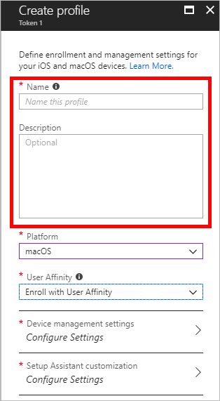
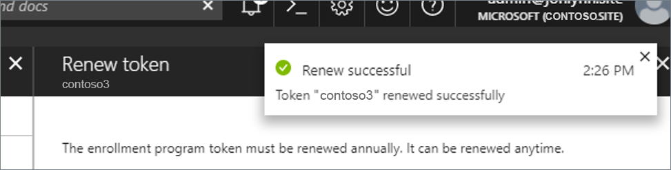

---
# required metadata

title: Enroll macOS devices - Apple Business Manager or Apple School Manager
titleSuffix: 
description: Learn how to enroll macOS devices purchased through Apple Business Manager and Apple School Manager.
keywords:
author: Lenewsad
ms.author: lanewsad
manager: dougeby
ms.date: 07/11/2022
ms.topic: how-to
ms.service: microsoft-intune
ms.subservice: enrollment
ms.localizationpriority: high
ms.technology:
ms.assetid: 

# optional metadata

#ROBOTS:
#audience:

ms.reviewer: benflamm
ms.suite: ems
search.appverid: MET150
#ms.tgt_pltfrm:
ms.custom: seodec18
ms.collection: M365-identity-device-management
---

# Automatically enroll macOS devices with the Apple Business Manager or Apple School Manager

> [!IMPORTANT]
> Apple recently changed from using the Apple Device Enrollment Program (DEP) to Apple Automated Device Enrollment (ADE). Intune is in the process of updating the Intune user interface to reflect that. Until such changes are complete, you'll continue to see *Device Enrollment Program* in the Intune portal. Wherever that is shown, it now uses Automated Device Enrollment.

You can set up Intune enrollment for macOS devices purchased through Apple's [Apple Business Manager](https://business.apple.com/) or [Apple School Manager](https://school.apple.com/). You can use either of these enrollments for large numbers of devices without ever touching them. You can ship macOS devices directly to users. When the user turns on the device, Setup Assistant runs with preconfigured settings and the device enrolls into Intune management.

To set up enrollment, you use both the Intune and Apple portals. You create enrollment profiles containing settings that applied to devices during enrollment.

Neither Apple Business Manager enrollment or Apple School Manager work with the [device enrollment manager](device-enrollment-manager-enroll.md).

<!--
**Steps to enable enrollment programs from Apple**
1. [Get an Apple DEP token and assign devices](#get-the-apple-dep-token)
2. [Create an enrollment profile](#create-an-apple-enrollment-profile)
3. [Synchronize DEP-managed devices](#sync-managed-device)
4. [Assign DEP profile to devices](#assign-an-enrollment-profile-to-devices)
5. [Distribute devices to users](#end-user-experience-with-managed-devices)
-->

## Prerequisites

- Devices purchased in [Apple School Manager](https://school.apple.com/) or [Apple's Automated Device Enrollment](http://deploy.apple.com)
- A list of serial numbers or a purchase order number.
- [MDM Authority](../fundamentals/mdm-authority-set.md)
- [Apple MDM Push certificate](../enrollment/apple-mdm-push-certificate-get.md)

## Get an Apple ADE token

Before you can enroll macOS devices with ADE or Apple School Manager, you need a token (.p7m) file from Apple. This token lets Intune sync information about the devices that your organization owns. It also lets Intune upload enrollment profiles to Apple and assign these profiles to devices.

You use the Apple portal to create a token. You also use the Apple portal to assign devices to Intune for management.

### Step 1. Download the Intune public key certificate required to create the token

1. In the [Microsoft Endpoint Manager admin center](https://go.microsoft.com/fwlink/?linkid=2109431), choose **Devices** > **macOS** > **macOS enrollment** > **Enrollment Program Tokens** > **Add**.

    

2. Grant permission to Microsoft to send user and device information to Apple by selecting **I agree**.

   

3. Choose **Download your public key** to download and save the encryption key (.pem) file locally. The PEM file is used to request a trust-relationship certificate from the Apple portal.

### Step 2. Use your key to download a token from Apple  

1. Choose **Create a token via Apple Business Manager** or **Create a token via Apple School Manager** to open the Apple portal used by your organization. 
2. Sign in to the portal with your company Apple ID. You can use this Apple ID to renew your token.
3. Select your account name to open the portal menu, and then choose **Preferences**. 
4. Go to your MDM server assignments.
5. Select the option to add an MDM server.  
6. Enter the **MDM Service Name**. The purpose of the server name is to help identify your mobile device management (MDM) server in the portal. It doesn't have to be the acttual name or URL of the Microsoft Intune server. 
7. Upload your public key file and then save your changes. Then you can download the server token.  

### Best practices  

While you're in the Apple portal, you can also apply device filters and assign devices to the MDM server.   

   * Apply filters: To filter devices before assigning them to your MDM server, go to **Devices** > **Filter**. You can filter devices by:  

        * Device management    
        * Source  
        * Order number 
        * Device type  
        * Storage size  

   * Bulk assign devices: You can assign all eligible devices to your new MDM servers at the same time.     
        1. Go to **Devices** > **All Devices** or select the devices you want to assign. 
        2. Select **Edit MDM Server**.  
        3. Select the MDM server you want to use. 
        4. Select **Continue**. 
        5. When prompted to, confirm your changes. A notification appears to confirm that the devices have been assigned to the new MDM server.  

The Apple portal keeps track of your activity and changes. Select **Activity** to view assignment results and download logs.   

### Step 3. Save the Apple ID used to create this token

Return to the [Microsoft Endpoint Manager admin center](https://go.microsoft.com/fwlink/?linkid=2109431) and enter your Apple ID so that you have record of it for future reference. 

### Step 4. Upload your token

In the **Apple token** box, browse to the certificate (.pem) file, choose **Open**, and then choose **Create**. With the push certificate, Intune can enroll and manage macOS devices by pushing policy to enrolled devices. Intune automatically synchronizes with Apple to see your enrollment program account.

## Create an Apple enrollment profile

Now that you've installed your token, you can create an enrollment profile for devices. A device enrollment profile defines the settings applied to a group of devices during enrollment.

1. In the [Microsoft Endpoint Manager admin center](https://go.microsoft.com/fwlink/?linkid=2109431), choose **Devices** > **macOS** > **macOS Enrollment** > **Enrollment program tokens**.
2. Select a token, choose **Profiles**, and then choose **Create profile** > **macOS**.

    

3. On the **Basics** page, enter a **Name** and **Description** for the profile for administrative purposes. Users do not see these details. You can use this **Name** field to create a dynamic group in Azure Active Directory. Use the profile name to define the enrollmentProfileName parameter to assign devices with this enrollment profile. Learn more about [Azure Active Directory dynamic groups](/azure/active-directory/users-groups-roles/groups-dynamic-membership#rules-for-devices).

    

4. For **Platform**, choose **macOS**.

5. Select **Next** to go to the **Management Settings** page.

6. For **User Affinity**, choose whether or not devices with this profile must enroll with or without an assigned user.
    - **Enroll with User Affinity** - Choose this option for devices that belong to users and that want to use the Company Portal app for services like installing apps. If using ADFS, user affinity requires [WS-Trust 1.3 Username/Mixed endpoint](/previous-versions/windows/it-pro/windows-server-2008-R2-and-2008/ff608241(v=ws.10)). [Learn more](/powershell/module/adfs/get-adfsendpoint?view=win10-ps&preserve-view=true). Choose this option if you need multi-factor authentication (MFA).

    - **Enroll without User Affinity** - Choose this option for device unaffiliated with a single user. Use this for devices that perform tasks without accessing local user data. Apps like the Company Portal app don't work.

7. If you selected **Enroll with User Affinity** for the **User Affinity** field, you now have the option to choose the authentication method to use when authenticating users. For **Authentication method**, select one of the following options:

    - **Setup Assistant (legacy)**: Use the legacy Setup Assistant if you want users to experience the typical, out-of-box-experience for Apple products. This installs standard preconfigured settings when the device enrolls with Intune management. If you're using Active Directory Federation Services and you're using Setup Assistant to authenticate, a [WS-Trust 1.3 Username/Mixed endpoint](/previous-versions/windows/it-pro/windows-server-2008-R2-and-2008/ff608241(v=ws.10)) is required. [Learn more](/powershell/module/adfs/get-adfsendpoint?view=win10-ps&preserve-view=true).
    - **Setup Assistant with modern authentication**: Devices running macOS 10.15 and later can use this method (older macOS devices in this profile will fall back to using the **Setup Assistant (legacy)** process).

        If a conditional access policy that requires [multi-factor authentication (MFA) applies](multi-factor-authentication.md) at enrollment or at enrollment and during Company Portal sign in, then MFA is required. However, MFA is optional based on the Azure AD settings in the targeted Conditional Access policy.

        After completing all the Setup Assistant screens, the end user lands on the home page (at which point their user affinity is established). However, until the user signs in to the Company Portal using their Azure AD credentials, the device:

        - Won’t be fully registered with Azure AD.
        - Won’t show up in the user’s device list in the Azure AD portal.
        - Won’t have access to resources protected by conditional access.
        - Won’t be evaluated for device compliance.
        - Will be redirected to the Company Portal from other apps if the user tries to open any managed applications that are protected by conditional access.

        For more information on how to get the macOS Company Portal on the users device, see [Add the Company Portal for macOS app](../apps/apps-company-portal-macos.md).

8. For **Locked enrollment**, choose whether or not you want locked enrollment for devices using this profile. **Yes** disables macOS settings that allow the management profile to be removed from the **System Preferences** menu or through the **Terminal**. After device enrollment, you cannot change this setting without wiping the device.

9. Select **Next** to go to the **Setup Assistant** page.

10. On the **Setup Assistant** page, configure the following profile settings:

    | Department settings | Description |
    |---|---|
    | **Department Name** | Appears when users tap **About Configuration** during activation. |
    | **Department Phone** | Appears when the user clicks the **Need Help** button during activation. |

    You can choose to show or hide a variety of Setup Assistant screens on the device when the user sets it up.
    - If you choose **Hide**, the screen won't be displayed during setup. After setting up the device, the user can still go in to the **Settings** menu to set up the feature.
    - If you choose **Show**, the screen will be displayed during setup. The user can sometimes skip the screen without taking action. But they can then later go into the device's **Settings** menu to set up the feature.

    | Setup Assistant screen settings | If you choose **Show**, during setup the device will... |
    |------------------------------------------|------------------------------------------|
    | **Location Services** | Prompt the user for their location. For macOS 10.11 and later and iOS/iPadOS 7.0 and later. |
    | **Restore** | Display the Apps & Data screen. This screen gives the user the option to restore or transfer data from iCloud Backup when they set up the device. For macOS 10.9 and later, and iOS/iPadOS 7.0 and later. |
    | **Apple ID** | Give the user the options to sign in with their Apple ID and use iCloud. For macOS 10.9 and later, and iOS/iPadOS 7.0 and later.   |
    | **Terms and Conditions** | Require the user to accept Apple's terms and conditions. For macOS 10.9 and later, and iOS/iPadOS 7.0 and later. |
    | **Touch ID and Face ID** | Give the user the option to set up fingerprint identification for the device. For macOS 10.12.4 and later, and iOS/iPadOS 8.1 and later. |
    | **Apple Pay** | Give the user the option to set up Apple Pay on the device. For macOS 10.12.4 and later, and iOS/iPadOS 7.0 and later. |
    | **Siri** | Give the user the option to set up Siri. For macOS 10.12 and later, and iOS/iPadOS 7.0 and later. |
    | **Diagnostics Data** | Display the Diagnostics screen to the user. This screen gives the user the option to send diagnostic data to Apple. For macOS 10.9 and later, and iOS/iPadOS 7.0 and later. |  
    | **Display Tone** | Give the user the option to turn on Display Tone. For macOS 10.13.6 and later, and iOS/iPadOS 9.3.2 and later. |
    | **FileVault** | Display the FileVault 2 encryption screen to the user. For macOS 10.10 and later. |
    | **iCloud diagnostics** | Display the iCloud Analytics screen to the user. For macOS 10.12.4 and later. |  
    | **Registration** | Display the registration screen. For macOS 10.9 and later. |  
    | **iCloud Storage** | Display the iCloud Documents and Desktop screen to the user. For macOS 10.13.4 and later. |
    | **Appearance** | Display the Appearance screen to the user. For macOS 10.14 and later, and iOS/iPadOS 13.0 and later. |    
    | **Screen Time** | Display the Screen Time screen. For macOS 10.15 and later, and iOS/iPadOS 12.0 and later. |
    | **Privacy** | Display the Privacy screen to the user. For macOS 10.13.4 and later, and iOS/iPadOS 11.3 and later. |
    | **Accessibility** | Display the Accessibility screen to the user. If this screen is hidden, the user won't be able to use the Voice Over feature. Voice Over is supported on devices that: - Run macOS 11. - Are connected to the internet using Ethernet. - Have the serial number appear in Apple School Manager or Apple Business Manager. |  
    | **Auto unlock with Apple Watch**| Give the user an option to use their Apple Watch to unlock their Mac. For macOS 12.0 and later.  

11. Select **Next** to go to the **Review + create** page.

12. To save the profile, choose **Create**.

## Sync managed devices

Now that Intune has permission to manage your devices, you can synchronize Intune with Apple to see your managed devices in Intune in the Azure portal.

1. In the [Microsoft Endpoint Manager admin center](https://go.microsoft.com/fwlink/?linkid=2109431), choose **Devices** > **macOS** > **macOS Enrollment** > **Enrollment program tokens**.

2. Choose a token in the list > **Devices** > **Sync**.
   

   To comply with Apple's terms for acceptable enrollment program traffic, Intune imposes the following restrictions:
   - A full sync can run no more than once every seven days. During a full sync, Intune fetches the complete updated list of serial numbers assigned to the Apple MDM server connected to Intune. After an Enrollment Program device is deleted from Intune portal without being unassigned from the Apple MDM server in the Apple portal, it won't be re-imported to Intune until the full sync is run.
   - If a device is released from ABM/ASM, it can take up to 45 days for it to be automatically deleted from the devices page in Intune. You can manually delete released devices from Intune one by one if needed. Released devices will be accurately reported as being Removed from ABM/ASM in Intune until they are automatically deleted within 30-45 days.
   - A sync is run automatically every 24 hours. You can also sync by clicking the **Sync** button (no more than once every 15 minutes). All sync requests are given 15 minutes to finish. The **Sync** button is disabled until a sync is completed. This sync will refresh existing device status and import new devices assigned to the Apple MDM server.

## Assign an enrollment profile to devices

You must assign an enrollment program profile to devices before they can enroll.

1. In the [Microsoft Endpoint Manager admin center](https://go.microsoft.com/fwlink/?linkid=2109431), choose **Devices** > **macOS** > **macOS Enrollment** > **Enrollment program tokens** > choose a token in the list.
2. Choose **Devices** > choose devices in the list > **Assign profile**.
3. Under **Assign profile**, choose a profile for the devices > **Assign**.

### Assign a default profile

You can pick a default macOS and iOS/iPadOS profile to be applied to all devices enrolling with a specific token.

1. In the [Microsoft Endpoint Manager admin center](https://go.microsoft.com/fwlink/?linkid=2109431), choose **Devices** > **macOS** > **macOS Enrollment** > **Enrollment program tokens** > choose a token in the list.
2. Choose **Set Default Profile**, choose a profile in the drop-down list, and then choose **Save**. This profile will be applied to all devices that enroll with the token.

## Distribute devices

You have enabled management and syncing between Apple and Intune, and assigned a profile to let your devices enroll. You can now distribute devices to users. Devices with user affinity require each user be assigned an Intune license. Devices without user affinity require a device license.

Devices registered with ABM/ASM and assigned a profile in Intune can be enrolled:

- During Setup Assistant for new devices or wiped devices.
- After Setup Assistant using the profiles command.

### Enroll your macOS device registered in ABM/ASM with Automated Device Enrollment during Setup Assistant

Devices configured in ABM/ASM will automatically enroll into management with Intune during Setup Assistant with a Remote Management prompt.

> [!NOTE]
> If the device was assigned to a macOS enrollment profile with user affinity, you must sign in to the Company Portal for Azure AD registration and Conditional Access.

### Enroll your macOS device registered in ABM/ASM with Automated Device Enrollment after Setup Assistant

For macOS 10.13 and later devices, you can follow these steps to enroll.

1. In the Apple Business Manager or Apple School Manager portal, import the device.
2. In the [Microsoft Endpoint Manager admin center](https://go.microsoft.com/fwlink/?linkid=2109431), make sure that the device is assigned a macOS enrollment profile with or without user affinity.
3. Log in to the device as a local administrator account.
4. To trigger enrollment, on the **Home** page, open **Terminal** and run the following command:
    sudo profiles renew -type enrollment
5. Enter your device password for the local administrator account.
6. In the **Device enrollment** window, choose **Details**.
7. In the **System preferences** window, choose **Profiles**.
8. Follow the prompts that will download the management profile, certs, and policies from Intune. You can view the profiles on the device anytime by going to **System Preferences** > **Profiles**.
9. If the device was assigned to a macOS enrollment profile with user affinity, you must sign in to the Company Portal for Azure AD registration and Conditional Access.

## Renew an ADE token

1. Go to [business.apple.com](http://business.apple.com) and sign in with an account that has the role of Administrator or Device Enrollment Manager.
2. Choose **Settings** > under **MDM Servers** choose your MDM server associated with the token file that you want to renew > **Download Token**.

    

3. Choose **Download Server Token**.
4. In the [Microsoft Endpoint Manager admin center](https://go.microsoft.com/fwlink/?linkid=2109431), choose **Device enrollment** > **Apple Enrollment** > **Enrollment program tokens** > choose the token.
    

5. Choose **Renew token** and enter the Apple ID used to create the original token.  
    

6. Upload the newly downloaded token.  
7. Choose **Renew token**. You'll see the confirmation that the token was renewed.
    

## Next steps

After enrolling macOS devices, you can start [managing them](../remote-actions/device-management.md).
