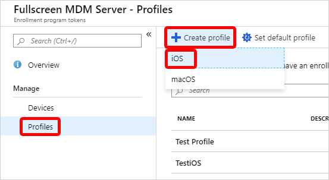

---
# required metadata

title: Enroll macOS devices - Apple Business Manager or Apple School Manager
titleSuffix: 
description: Prepare Macs purchased through Apple Business Manager and Apple School Manager for Intune enrollment.    
keywords:
author: Lenewsad
ms.author: lanewsad
manager: dougeby
ms.date: 01/25/2023
ms.topic: how-to
ms.service: microsoft-intune
ms.subservice: enrollment
ms.localizationpriority: high
ms.technology:
ms.assetid: 

# optional metadata

#ROBOTS:
#audience:

ms.reviewer: benflamm
ms.suite: ems
search.appverid: MET150
#ms.tgt_pltfrm:
ms.custom: seodec18
ms.collection:
- tier2
- M365-identity-device-management
---

# Automatically enroll Macs with Apple Business Manager or Apple School Manager  

Set up automated device enrollment in Intune for new or wiped Macs purchased through an Apple enrollment program, such as Apple Business Manager or Apple School Manager. With this method, you don't need to have the devices with you to configure them. Intune automatically syncs with Apple to obtain device info from your enrollment program account, and deploys your preconfigured enrollment profiles to Macs over-the-air. Prepared devices can be shipped directly to employees or students. Setup Assistant and device enrollment begin when someone turns on the Mac.     

This article describes how to set up an automated device enrollment profile for corporate-owned Macs. 

>[!NOTE]
> The steps in this article are the same whether you're using Apple Business Manager or Apple School Manager. For brevity, we refer to *Apple Business Manager* only throughout the steps in this article, except where clarification is necessary.     

<!--
**Steps to enable enrollment programs from Apple**
1. [Get an Apple DEP token and assign devices](#get-the-apple-dep-token)
2. [Create an enrollment profile](#create-an-apple-enrollment-profile)
3. [Synchronize DEP-managed devices](#sync-managed-device)
4. [Assign DEP profile to devices](#assign-an-enrollment-profile-to-devices)
5. [Distribute devices to users](#end-user-experience-with-managed-devices)
-->  

## Limitations  
Automated device enrollment via Apple Business Manager and Apple School Manager is not supported with [device enrollment manager accounts](device-enrollment-manager-enroll.md).    

## Prerequisites 

- Access to [Apple School Manager](https://school.apple.com/) or [Apple Business Manager](http://business.apple.com)  
- A list of device serial numbers or a purchase order number for devices purchased through Apple.    
- [MDM authority](../fundamentals/mdm-authority-set.md)
- [Apple MDM Push certificate](../enrollment/apple-mdm-push-certificate-get.md)  

## Create enrollment program token  

This section describes how to create an enrollment program token in Intune. The *enrollment program token* (sometimes referred to as an automated device enrollment token) is a necessary component of automated device enrollment because it enables the communication and device management capabilities between Intune and your chosen Apple enrollment program. It allows Intune to sync information from your Apple Business Manager or Apple School Manager account, and apply profiles to devices.  

### Step 1. Download the Intune public key certificate   

The public key certificate is needed to request a trust-relationship certificate from Apple Business Manager.     

1. In the [Microsoft Endpoint Manager admin center](https://go.microsoft.com/fwlink/?linkid=2109431), go to **Devices** > **macOS** > **macOS enrollment**. 
2. Select **Enrollment program tokens**. 
3. Select **Add**.  
4. Select **I agree** to grant permission to Microsoft to send user and device information to Apple. 
3. Select **Download your public key** and save the key as a PEM file locally. The key will be used to get the MDM server token in the next step.  

### Step 2. Add MDM server and download server token   

Add an MDM server for Intune to Apple Business Manager or Apple School Manager, and then download the server token for it.   

1. In the admin center, select the link that corresponds with the Apple portal you use. Your options: 
    * **Create a token via Apple Business Manager** 
    * **Create a token via Apple School Manager**  

    The selected portal opens in a new browser tab. You can safely switch to the new tab, but keep the tab with Microsoft Endpoint Manager open for access later.    
2. Sign in to the Apple portal with your company Apple ID. Remember, this is the Apple ID you and your org will use to renew and manage the token going forward, so don't use a personal ID.      
3. Go to your account profile > **Preferences**.  
4. Go to your MDM server assignments.  
5. Select the option to add an MDM server.  
6. Name the MDM server. The name is for identification purposes only while in Apple Business Manager, and doesn't have to be the actual name or URL of the Microsoft Intune server. 
7. Upload your public key file, and then save your changes. 
8. Download the server token (.p7m file).   

### Step 3. Assign devices to MDM server   

Optionally, after you create the MDM server in Apple Business Manager, you can start assigning devices to it. We recommend assigning them now since you're already in Apple Business Manager, but you can come back later if you're not ready. You can use available features like *filters* and *bulk assignment* to simplify assignment selection. For more information and steps, see [Assign, reassign, or unassign devices in Apple Business Manager](https://support.apple.com/guide/apple-business-manager/axmf500c0851/web)(opens Apple Business Manager User Guide).  

### Step 4. Save Apple ID 

Return to the [admin center](https://go.microsoft.com/fwlink/?linkid=2109431) and enter the Apple ID used to download the server token. This is the Apple ID you need to use to renew the token every year. Make sure future Intune admins are aware of the Apple ID used, in case you leave your organization and need to transition token management to them. 

  

### Step 5. Upload server token and finish     
Upload the server token file to Intune to finish creating the enrollment program token.   

1. Return to the admin center > **Apple token** field. Browse to the server token (.p7m file) on your device. 
2. Choose **Open**, and then select **Create**. 

Intune will automatically connect with Apple Business Manager to sync device information from your enrollment program account. For information about how to manually sync the token, see [Sync managed devices](#sync-managed-devices) (in this article).      

## Create an Apple enrollment profile

Create an automated device enrollment profile in the admin center. The profile defines the enrollment experience for your organization's Mac devices, and enforces enrollment policies and settings on enrolling devices. The profile is deployed to assigned devices over-the-air.     

At the end of this procedure, you will assign this profile to Azure AD device groups. 

>[!IMPORTANT]
>To create the profile, you must have an enrollment program token setup in Intune. If you haven't done that yet, see [Create enrollment program token](#create-enrollment-program-token) at the beginning of this article.     

1. In the [admin center](https://go.microsoft.com/fwlink/?linkid=2109431), go to **Devices** > **macOS** **macOS enrollment** > **Enrollment program tokens**.  
2. Select an enrollment program token.  
3. Select **Profiles** > **Create profile** > **macOS**.  

      

4. For **Basics**, enter a name and description for the profile so that you can distinguish it from other enrollment profiles. These details aren't visible to device users.  

     >[!TIP]
     > You can use the name field to create a dynamic group in Azure Active Directory, and assign devices to the enrollment profile automatically. Use the profile name to define the *enrollmentProfileName* parameter. For more information, see [Azure Active Directory dynamic groups](/azure/active-directory/users-groups-roles/groups-dynamic-membership#rules-for-devices).  

5. Select **Next**. 

5. On the **Management Settings** page, configure **User Affinity**. *User affinity* determines whether devices enroll with or without an assigned user.  Your options: 

    * Option 1 - **Enroll without User Affinity**:  Enroll devices that aren't associated with a single user. Use this for shared devices and devices that don't need to access local user data. The Company Portal app doesn't work on these types of devices.  
    * Option 2 - **Enroll with User Affinity**: Enroll devices that are associated with an assigned user. Choose this option for work devices that belong to users, and if you want to require users to have the Company Portal app to install apps. Multifactor authentication (MFA) is available with this option.     

      Option 2 requires additional configuration. Users must authenticate themselves before enrollment to confirm their identity. Select one of the following authentication methods:   

      - **Setup Assistant with modern authentication**: This method requires users to complete all Setup Assistant screens and sign in to the Company Portal app with their Azure AD credentials before they can access resources.  After they sign in to Company Portal, the device:   

        - Registers with Azure AD.  
        - Is added to the user's device record in Azure AD.  
        - Can be evaluated for device compliance.  
        - Gains access to resources protected by conditional access.

        If the user doesn't sign in to the Company Portal to complete registration, they'll be redirected to the Company Portal app each time they try to open a managed app that's protected by conditional access.  

        Devices running macOS 10.15 and later can use this method. Older macOS devices will fall back to using the legacy Setup Assistant method. For more information about how to get the Company Portal app to Mac users, see [Add the Company Portal for macOS app](../apps/apps-company-portal-macos.md).    

      - **Setup Assistant (legacy)**: Use the legacy Setup Assistant if you want users to experience the typical out-of-box-experience for Apple products. This method installs standard preconfigured settings when the device enrolls with Intune management. If you're using Active Directory Federation Services and you're using Setup Assistant to authenticate, a [WS-Trust 1.3 Username/Mixed endpoint](/previous-versions/windows/it-pro/windows-server-2008-R2-and-2008/ff608241(v=ws.10)) is required. For more information about retrieving the ADFS endpoint, see [Get-ADfsEndpoint] (/powershell/module/adfs/get-adfsendpoint?view=win10-ps&preserve-view=true).   

8. You can enforce **Locked enrollment** to prevent users from unenrolling their devices from Intune. Select **Yes** to disable the Mac settings in System Preferences and Terminal that allow users to remove the management profile. After the device enrolls, you cannot change this setting without wiping the device.  

9. Select **Next**.   

10. On the **Setup Assistant** page, configure the Setup Assistant experience.      
    1. Enter your department information so that users know who to contact for support:  
        * **Department Name**: This name appears when device users select **About Configuration** during activation.  
        * **Department Phone**: This phone number appears when device users select **Need Help** during activation.   
    2. Select the Setup Assistant screens you want to show or hide during device setup. For a description of all screens, see Setup Assistant screen reference (in this article). Your options:  
        * **Hide**: The screen doesn't appear to users during device setup. After device setup, the user can go to their device settings to set up the feature.  
        * **Show**: The screen appears to users during device setup. The user can still skip screens that don't require immediate action. After device setup, the user can go to their device settings to set up the feature.  
11. Select **Next**.
12. Review the summary of changes, and then select **Create** to finish creating the profile.   

### Setup Assistant screen reference 
The following table describes the Setup Assistant screens shown during automated device enrollment for Macs. You can show or hide these screens on supported devices during enrollment.    

| Setup Assistant screen | What happens when visible  |
|------------------------------------------|------------------------------------------|
| **Location Services** | Prompt the user for their location. For macOS 10.11 and later and iOS/iPadOS 7.0 and later. |
| **Restore** | Display the Apps & Data screen. This screen gives the user the option to restore or transfer data from iCloud Backup when they set up the device. For macOS 10.9 and later, and iOS/iPadOS 7.0 and later. |
| **Apple ID** | Give the user the options to sign in with their Apple ID and use iCloud. For macOS 10.9 and later, and iOS/iPadOS 7.0 and later.   |
| **Terms and Conditions** | Require the user to accept Apple's terms and conditions. For macOS 10.9 and later, and iOS/iPadOS 7.0 and later. |
| **Touch ID and Face ID** | Give the user the option to set up fingerprint identification for the device. For macOS 10.12.4 and later, and iOS/iPadOS 8.1 and later. |
| **Apple Pay** | Give the user the option to set up Apple Pay on the device. For macOS 10.12.4 and later, and iOS/iPadOS 7.0 and later. |
| **Siri** | Give the user the option to set up Siri. For macOS 10.12 and later, and iOS/iPadOS 7.0 and later. |
| **Diagnostics Data** | Display the Diagnostics screen to the user. This screen gives the user the option to send diagnostic data to Apple. For macOS 10.9 and later, and iOS/iPadOS 7.0 and later. |  
| **Display Tone** | Give the user the option to turn on Display Tone. For macOS 10.13.6 and later, and iOS/iPadOS 9.3.2 and later. |
| **FileVault** | Display the FileVault 2 encryption screen to the user. For macOS 10.10 and later. |
| **iCloud diagnostics** | Display the iCloud Analytics screen to the user. For macOS 10.12.4 and later. |  
| **Registration** | Display the registration screen. For macOS 10.9 and later. |  
| **iCloud Storage** | Display the iCloud Documents and Desktop screen to the user. For macOS 10.13.4 and later. |
| **Appearance** | Display the Appearance screen to the user. For macOS 10.14 and later, and iOS/iPadOS 13.0 and later. |    
| **Screen Time** | Display the Screen Time screen. For macOS 10.15 and later, and iOS/iPadOS 12.0 and later. |
| **Privacy** | Display the Privacy screen to the user. For macOS 10.13.4 and later, and iOS/iPadOS 11.3 and later. |
| **Accessibility** | Display the Accessibility screen to the user. If this screen is hidden, the user won't be able to use the Voice Over feature. Voice Over is supported on devices that: - Run macOS 11. - Are connected to the internet using Ethernet. - Have the serial number appear in Apple School Manager or Apple Business Manager. |  
| **Auto unlock with Apple Watch**| Give the user an option to use their Apple Watch to unlock their Mac. For macOS 12.0 and later.  
| **Terms of Address**| Give the user the option to choose how they want to be addressed throughout the system: feminine, masculine, or neutral. This Apple feature is available for select languages. For more information, see [Change Language & Region settings on Mac](https://support.apple.com/guide/mac-help/intl163/mac)(opens Apple website). For macOS 13.0 and later.    

## Sync managed devices  
Sync your enrollment program token in the admin center to see all associated Apple devices and device info. Syncing refreshes existing device status and imports new devices assigned to the Apple MDM server.       

1. Return to **Enrollment program tokens** and choose your enrollment program token. 

2. Select **Devices** > **Sync**.  

     

### Sync restrictions  
To comply with Apple's terms for acceptable enrollment program traffic, Microsoft Intune imposes the following restrictions:  
 - A *full sync* can run no more than once every seven days. During a full sync, Intune fetches the most recent, updated list of serial numbers assigned to the connected Apple MDM server. If you delete a device from Intune without unassigning it from the MDM server in Apple Business Manager or Apple School Manager, it won't be reimported to Intune until the full sync is run. 
 - If a device is released from either of the Apple enrollment programs, it can take up to 45 days for it to be automatically deleted from the Devices page in Intune. You can manually delete released devices in Intune one-by-one, if needed. Intune reports released devices as being removed from Apple Business Manager or Apple School Manager until they are automatically deleted, which occurs within 30-45 days.  
 - A sync is run automatically every 24 hours. You can initiate a sync no more than once every 15 minutes. All sync requests are given 15 minutes to finish. The **Sync** button becomes inactive until syncing is complete. 

## Assign an enrollment profile to devices

Assign an enrollment profile to Apple devices.    

1. Return to **Enrollment program tokens** and select a token.  
2. Select **Devices**. 
3. Choose your devices from the list, and then select **Assign profile**.  
3. Choose a profile to assign, and then select **Assign**.  

Optionally, you can select a default enrollment profile. The default profile is deployed to all enrolling devices associated with the token.  

1. Return to **Enrollment program tokens** and select a token.  
2. Select **Set Default Profile**.
3. Choose a profile, and then select **Save**.  

## Distribute devices

>[!IMPORTANT]
> Users associated with devices that have user affinity must be assigned an Intune license. Devices without user affinity require a device license.  

Distribute prepared devices throughout your organization.  

* New or wiped Macs: New or wiped Macs configured in Apple Business Manager or Apple School Manager will automatically enroll in Microsoft Intune during Setup Assistant when someone turns on the device. If you assigned the device to a macOS enrollment profile with user affinity, the device user must sign in to the Company Portal after Setup Assistant is done to finish Azure AD registration and conditional access requirements.  

* Existing Macs: You can enroll devices that have already gone through Setup Assistant. Complete these steps to enroll corporate-owned Macs running macOS 10.13 and later.    

  1. Ensure that: 
     * The device has been imported to Apple Business Manager or Apple School Manager.  
     * The device has been assigned a macOS enrollment profile in the admin center. 
  1. Sign in to the device with a local administrator account.  
  2. To trigger enrollment, from the **Home** page open **Terminal**, and run the following command:  

     `sudo profiles renew -type enrollment`  
  5. Enter the device password for the local administrator account.    
  6. On **Device enrollment**, select **Details**.  
  7. On **System preferences**, select **Profiles**.
  8. Follow the onscreen prompts to download the Microsoft Intune management profile, certificates, and policies. 
     >[!TIP]
     > You can confirm which profiles are on the device anytime by returning to **System Preferences** > **Profiles**.  
  9. If you assigned the device to a macOS enrollment profile with user affinity, sign in to the Company Portal app to complete Azure AD registration and conditional access requirements, and finish enrollment.  

## Renew enrollment program token    
Complete these steps to renew a server token that's about to expire. This procedure ensures that the associated enrollment program token in Intune remains active.         

1. Sign in to Apple Business Manager or Apple School Manager and follow these step to download a new MDM server token: 
    * [Download token in Apple Business Manager](https://support.apple.com/guide/apple-business-manager/axme0f8659ec/web)
    * [Download token in Apple School Manager](https://support.apple.com/guide/apple-school-manager/axme0f8659ec/web)
2. Sign in to the [Microsoft Endpoint Manager admin center](https://go.microsoft.com/fwlink/?linkid=2109431) and go to **Device enrollment** > **Apple Enrollment** > **Enrollment program tokens**. Select the enrollment program token you want to renew.  

3. Select **Renew token** and enter the Apple ID used to create the original token.  
4. Upload the new token.  
5. Select **Next**. You can update scope tags at this time if you want. Otherwise, continue to **Review + create**.   
6. Select **Create** to save your changes.  

## Next steps

Use [Microsoft Intune remote actions](../remote-actions/device-management.md) to remotely manage enrolled Macs.  
