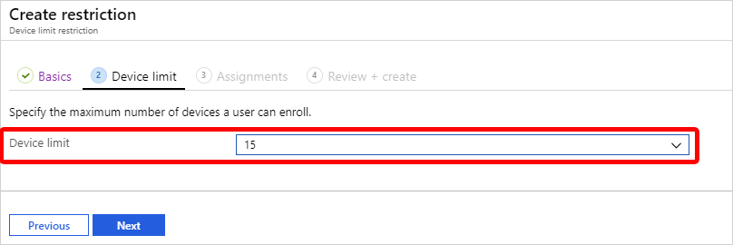
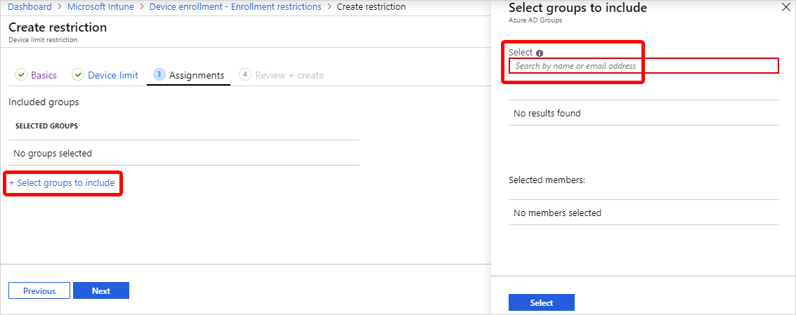
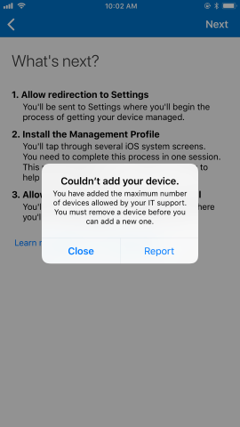
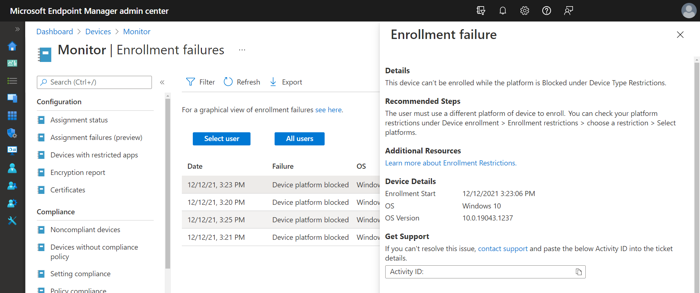

---
# required metadata

title: Set enrollment restrictions in Microsoft Intune
titleSuffix:
description: Restrict enrollment by platform and set a device enrollment limit in Intune.
keywords:
author: Lenewsad
ms.author: lanewsad
manager: dougeby
ms.date: 04/14/2022
ms.topic: how-to
ms.service: microsoft-intune
ms.subservice: enrollment
ms.localizationpriority: high
ms.technology:
ms.assetid: 9691982c-1a03-4ac1-b7c5-73087be8c5f2

# optional metadata

#ROBOTS:
#audience:

ms.reviewer: maholdaa
ms.suite: ems
search.appverid: MET150
#ms.tgt_pltfrm:
ms.custom: intune-azure
ms.collection:
  - M365-identity-device-management
  - highpri
---

# Set enrollment restrictions  

[!INCLUDE [azure_portal](../includes/azure_portal.md)]  

As an Intune administrator, you can create and manage enrollment restrictions that define what devices can enroll into management with Intune, including the:
- Number of devices.
- Operating systems and versions.

You can create multiple restrictions and apply them to different user groups. You can set the [priority order](#change-enrollment-restriction-priority) for your different restrictions.

>[!NOTE]
>Enrollment restrictions are not security features. Compromised devices can misrepresent their character. These restrictions are a best-effort barrier for non-malicious users. Additionally, for each type of enrollment restriction policy (device limit or device platform), there is a limit of maximum 25 policies per tenant. If you try to create more than 25, the creation will fail with a "Resouce limit reached" error. 

The specific enrollment restrictions that you can create include:

- Maximum number of enrolled devices.
- Device platforms that can enroll:
  - Android device administrator
  - Android Enterprise work profile
  - iOS/iPadOS
  - macOS
  - Windows
- Platform operating system version for iOS/iPadOS, Android device administrator, Android Enterprise work profile, and Windows.
  - Minimum version.
  - Maximum version.
- Restrict [personally owned devices](device-enrollment.md#bring-your-own-device) (iOS, Android device administrator, Android Enterprise work profile, macOS, and Windows).

## Default restrictions  

Default policies are available in Intune for both device type and device limit enrollment restrictions. The defaults apply to all user and userless enrollments. You can edit and change the defaults. You can also override the default restrictions by creating new restriction policies with higher priority.    

 
## Create a device platform restriction   

1. Sign in to the [Microsoft Endpoint Manager admin center](https://go.microsoft.com/fwlink/?linkid=2109431).  
2. Go to **Devices** > **Enroll devices** > **Enrollment device platform restrictions**.  
3. Select the tab along the top of the page that corresponds with the platform you're configuring. Your options:  

    * **Android restrictions**
    * **Windows restrictions**
    * **MacOS restrictions**
    * **iOS restrictions**  

4. Select **Create restriction**.  
5. On the **Basics** page, give the restriction a name and optional description. 
6. Select **Next**.  
7. On the **Platform settings** page, configure the restrictions for your selected platform. Your options:       
    - **Platform** (Android only): Select **Allow** to permit devices running the Android or Android Enterprise platforms to enroll in Intune.  
    - **MDM** (Windows, macOS, and iOS/iPadOS): Select **Allow** to permit devices running the selected platform to enroll in Intune. 
    - **Allow min/max range** (Android, Windows, iOS/iPadOS only): Enter the minimum and maximum OS versions allowed to enroll. For iOS and Android, version restrictions only apply to devices enrolled through the Company Portal. Supported version formats include:  
        - Android device administrator and Android Enterprise work profile support major.minor.rev.build.
        - iOS/iPadOS supports major.minor.rev. Operating system versions don't apply to Apple devices that enroll with the Device Enrollment Program, Apple School Manager, or the Apple Configurator app.
        - Windows supports major.minor.build.rev for Windows 10 and Windows 11 only.
    - **Personally-owned**: Select **Allow** to permit devices to enroll and operate as personal devices.  
    - **Device manufacturer**: Enter a comma-separated list of the manufacturers that you want to block.  

8. Select **Next**. 
9. Optionally, add scope tags to the restriction. For more information about scope tags, see [Use role-based access control and scope tags for distributed IT](../fundamentals/scope-tags.md). 

      > [!NOTE]
      >  When using scope tags with enrollment restrictions, users can only re-order policies for which they have scope. Also, they can only reorder for the policy positions for which they have scope. Users see the true policy priority number on each policy. A scoped user can tell the relative priority of their policies even if they can't see all the other policies. 
10. Select **Next**. 
11. On the **Assignments** page, select **Add groups** and then use the search box to find and select groups. To assign the restriction to all device users, select **Add all users**. If you don't assign a restriction to at least one group, the restriction won't take effect.  
12. Optionally, after you assign groups, select **Edit filter** to restrict the policy assignment further with filters. Filters are available for macOS, iOS, and Windows policies. For more information, see [Using filters with enrollment restriction and ESP policies](enrollment-restrictions-set.md#using-filters-with-enrollment-restriction-and-esp-policies) (in this article).  
13. Select **Next**. 
14. On the **Review + create** page, select **Create** to save and create your restriction.  

You can view the new restriction and access its properties from the **Device type restrictions** table. Select and drag the restriction to reposition it in the table and change its priority.  

### Applying Android restrictions  
Neither work profile nor device administrator enrollment will work unless the appropriate prerequisites for Android erollment are complete. The Android Enterprise work profile and Android device administrator platforms have the following behavior when restrictions are applied:  

* If you allow both OS platforms for the same group, users on supported devices will enroll with a work profile. Devices that aren't supported will enroll under Android device administrator, without a profile. 
* If you allow both OS platforms for the same group and refine it for specific and non-overlapping versions, devices will go through the enrollment throw that's selected for their version.   
* If you allow both platforms, but block the same versions, devices running blocked versions will go through the Android device administrator enrollment flow, get blocked from enrollment, and be prompted to sign out.  

## Create a device limit restriction

1. Sign in to the [Microsoft Endpoint Manager admin center](https://go.microsoft.com/fwlink/?linkid=2109431) > **Devices** > **Enrollment restrictions** > **Create restriction** > **Device limit restriction**.
2. On the **Basics** page, give the restriction a **Name** and optional **Description**.
3. Choose **Next** to go to the **Device limit** page.
4. For **Device limit**, select the maximum number of devices that a user can enroll.
    
5. Choose **Next** to go to the **Scope tags** page.
6. On the **Scope tags** page, optionally add the scope tags you want to apply to this restriction. For more information about scope tags, see [Use role-based access control and scope tags for distributed IT](../fundamentals/scope-tags.md). When using scope tags with enrollment restrictions, users can only re-order policies for which they have scope. Also, they can only reorder for the policy positions for which they have scope. Users see the true policy priority number on each policy. A scoped user can tell the relative priority of their policies even if they can't see all the other policies.
7. Choose **Next** to go to the **Assignments** page.
8. Choose **Select groups to include** and then use the search box to find groups that you want to include in this restriction. The restriction applies only to groups to which it's assigned. If you don't assign a restriction to at least one group, it won't have any effect. Then choose **Select**. 
    
9. Select **Next** to go to the **Review + create** page.
10. Select **Create** to create the restriction.
11. The new restriction is created with a priority just above the default. You can [change the priority](#change-enrollment-restriction-priority).

During BYOD enrollments, users see a notification that tells them when they've met their limit of enrolled devices. For example, on iOS:

> [!IMPORTANT]
> Device limit restrictions don't apply for the following Windows enrollment types:
> - Co-managed enrollments
> - GPO enrollments
> - Azure Active Directory joined enrollments
> - Bulk Azure Active Directory joined enrollments
> - Autopilot enrollments
> - Device Enrollment Manager enrollments
>
> Device limit restrictions are not enforced for these enrollment types because they're considered shared device scenarios.
> You can set hard limits for these enrollment types [in Azure Active Directory](/azure/active-directory/devices/device-management-azure-portal#configure-device-settings).

## Change enrollment restrictions

You can change the settings for an enrollment restriction by following the steps below. These restrictions don't affect devices that have already been enrolled. 

1. Sign in to the [Microsoft Endpoint Manager admin center](https://go.microsoft.com/fwlink/?linkid=2109431) > **Devices** > **Enrollment restrictions** > choose the restriction that you want to change > **Properties**.
2. Choose **Edit** next to the settings that you want to change.
3. On the **Edit** page, make the changes that you want and proceed to the **Review + save** page, then choose **Save**.  

## Using filters with enrollment restriction and ESP policies 

You can use assignment filters to include and exclude additional devices from certain group-targeted policies. For example, to allow personal Windows devices to enroll while still blocking Windows 10 Home edition: 

1. Create an enrollment restriction policy for Windows.
2. Configure the platform settings to allow devices to enroll as personally owned devices. 
3. Select assignments and then apply a preconfigured filter with the `operatingSystemSKU` property to an assigned group to block devices running Windows 10 Home edition. 

For more information about creating filters, see [Create a filter](../fundamentals/filters.md). 

Enrollment restrictions support fewer filter properties than other group-targeted policies. This is because devices are not yet enrolled, so Intune doesn't have the device info to support all properties. You'll see the limited selection of properties when you:  

* Configure a device platform restriction policy for Apple and Windows devices. 
* Configure an enrollment status page (ESP) policy for Windows. 
* Edit a filter that's in-use in an enrollment restriction or ESP profile. 

The following filter properties are always available to use with enrollment policies:    

**Windows** 

* OS version 
* Operating System SKU 
* Enrollment profile name

**iOS/iPadOS and macOS**  
* Manufacturer 
* Model 
* OS version 
* Ownership 
* Enrollment profile name 

For more information about these properties, see [device properties](../fundamentals/filters-device-properties.md#device-properties). Filters cannot be used with Android enrollment restrictions.

## Blocking personal Android devices
- If you block personally owned Android device administrator devices from enrollment, personally-owned Android Enterprise work profile devices can still enroll.
- By default, your Android Enterprise work profile devices settings are the same as your settings for your Android device administrator devices. After you change your Android Enterprise personally-owned work profile or your Android device administrator settings, that's no longer the case.
- If you block Android Enterprise personal work profile enrollment, only corporate-owned Android devices can enroll with [Android Enterprise personally-owned work profiles](../apps/android-deployment-scenarios-app-protection-work-profiles.md#android-enterprise-personally-owned-work-profiles).

## Blocking personal Windows devices
If you block personally owned Windows devices from enrollment, Intune checks to make sure that each new Windows enrollment request has been authorized as a corporate enrollment. Unauthorized enrollments will be blocked.

The following methods qualify as being authorized as a Windows corporate enrollment:
- The enrolling user is using a [device enrollment manager account]( device-enrollment-manager-enroll.md).
- The device enrolls through [Windows Autopilot](../../autopilot/enrollment-autopilot.md).
- The device is registered with Windows Autopilot but isn't an MDM enrollment only option from Windows Settings.
- The device enrolls through a [bulk provisioning package](windows-bulk-enroll.md).
- The device enrolls through GPO, or [automatic enrollment from Configuration Manager for co-management](/configmgr/comanage/quickstart-paths#bkmk_path1).
 
The following enrollments are marked as corporate by Intune. But since they don't offer the Intune administrator per-device control, they'll be blocked:
- [Automatic MDM enrollment](windows-enroll.md#enable-windows-automatic-enrollment) with [Azure Active Directory join during Windows setup](/azure/active-directory/device-management-azuread-joined-devices-frx)\*.
- [Automatic MDM enrollment](windows-enroll.md#enable-windows-automatic-enrollment) with [Azure Active Directory join from Windows Settings](/azure/active-directory/user-help/user-help-register-device-on-network)\*.
 
The following personal enrollment methods will also be blocked:
- [Automatic MDM enrollment](windows-enroll.md#enable-windows-automatic-enrollment) with [Add Work Account from Windows Settings](/azure/active-directory/user-help/user-help-join-device-on-network)\*.
- [MDM enrollment only]( /windows/client-management/mdm/mdm-enrollment-of-windows-devices#connecting-personally-owned-devices-bring-your-own-device) option from Windows Settings.

\* These won't be blocked if registered with Autopilot.

## Blocking personal iOS/iPadOS devices
By default, Intune classifies iOS/iPadOS devices as personally-owned. To be classified as corporate-owned, an iOS/iPadOS device must fulfill one of the following conditions:
- [Registered with a serial number](corporate-identifiers-add.md).
- Enrolled by using Automated Device Enrollment (formerly Device Enrollment Program)

> [!NOTE]
> An iOS User Enrollment profile overrides an enrollment restriction policy. For more information, see [Set up iOS/iPadOS and iPadOS User Enrollment (preview)](ios-user-enrollment.md).
>

## Change enrollment restriction priority

Priority is used when a user exists in multiple groups that are assigned restrictions. Users are subject only to the highest priority restriction assigned to a group that they are in. For example, Joe is in group A assigned to priority 5 restrictions and also in group B assigned to priority 2 restrictions. Joe is subject only to the priority 2 restrictions.

When you create a restriction, it's added to the list just above the default.

Device enrollment includes default restrictions for both device type and device limit restrictions. These two restrictions apply to all users unless they're overridden by higher-priority restrictions.  

>[!NOTE]
>Enrollment restrictions are applied to users. In enrollment scenarios that are not user-driven (e.g. Windows Autopilot self-deploying mode or white glove provisioning), only the Default priority restrictions (targeted to "All Users") will be enforced.

You can change the priority of any non-default restriction.  

1. Sign in to the [Microsoft Endpoint Manager admin center](https://go.microsoft.com/fwlink/?linkid=2109431) and select **Devices** > **Enroll devices** > **Enrollment restrictions**.
2. Select **Device type restrictions** or **Device limit restrictions** to view the priority list.               
3. In the list, hover over any restriction in the **Priority** column. When you see three vertical dots appear, select and drag the priority to the desired position in the list.    
## Enrollment reports
You can use the following reports to troubleshoot issues with enrollment restrictions and enrollment status page assignments:  
- Enrollment failures report  
- Troubleshooting + support page  
- Device enrollment page  

### Enrollment failures report  
Use the enrollment failures report to view enrollment failures for all users or for select users. This report shows each failed enrollment attempt along with the date it occurred, reason for failure, OS, OS version, username, and enrollment method.  

1. Sign in to the [Microsoft Endpoint Manager admin center](https://go.microsoft.com/fwlink/?linkid=2109431) and select **Devices** > **Monitor** > **Enrollment failures**.
2. Select **All users** or **Select user**, depending on the scenario you are troubleshooting.
3. Select a row in the table for more details about the failure and recommended remediation steps.  

    > [!div class="mx-imgBorder"]
    >   

### Troubleshooting + support page  
Use the enrollment failures report on the Troubleshooting + support page to view enrollment failures for a select user. This report shows every failed enrollment attempt the user encountered along with the date it occurred, reason for failure, OS, OS version, username, and enrollment method. You can also view other data about the user on this page, including all assignments, devices, and app protection statuses they're associated with.    

1. Sign in to the [Microsoft Endpoint Manager admin center](https://go.microsoft.com/fwlink/?linkid=2109431) and select **Troubleshooting + support** > **Select user**.
2. Choose a user > **Select**. 
3. Under **Enrollment failures**, select a row to view more details about the failure and recommended remediation steps.  

### Device enrollment page
The device enrollment page shows the enrollment policies (both enrollment restriction and enrollment status page policies) applied to a device when it was first enrolled in Microsoft Intune. Use this report to help pinpoint the source of the failure, such as an unexpected policy, target, or filter. Data is available for iOS/iPadOS, macOS, and Windows devices, and includes: 

  * Profile name
  * User principal name
  * Profile type (either enrollment status page or device type enrollment restriction)
  * Priority
  * Target (either user or device) 
  * Filters, with a link to the filter evaluation results (only available if the enrollment policy was assigned using an assignment filter)  

To access the device enrollment page:  

1. Sign in to the [Microsoft Endpoint Manager admin center](https://go.microsoft.com/fwlink/?linkid=2109431) and select **Devices** > **All devices**.
2. Select an enrolled iOS/iPadOS, macOS, or Windows device.  
3. Under **Monitor**, select **Enrollment**.  
4. Review the report data. 

    > [!div class="mx-imgBorder"]
    >   

>[!NOTE]
>Report data is only available for devices enrolled after the Microsoft Intune 2112 service release. No results are available for devices enrolled prior to that release.
>This page is not available for Android devices. 

