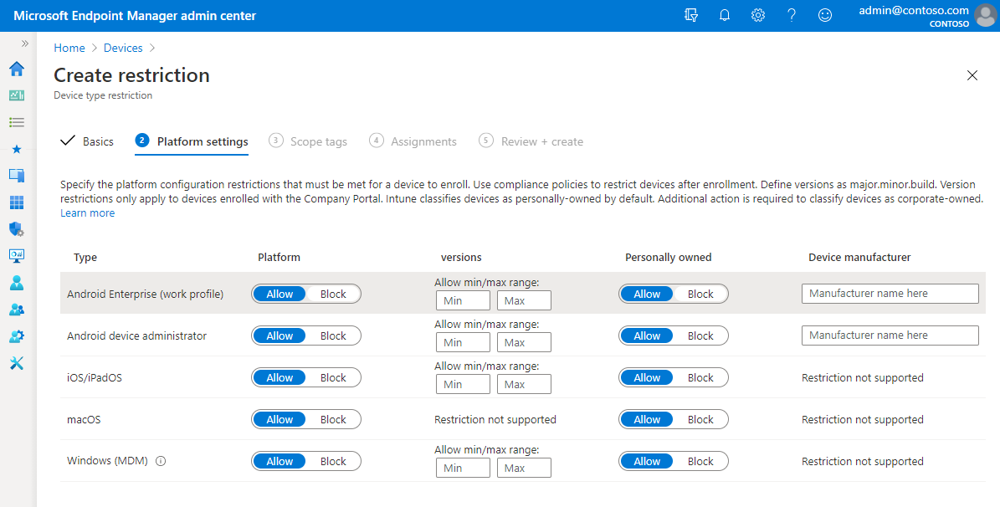

---
# required metadata

title: Set enrollment restrictions in Microsoft Intune
titleSuffix:
description: Restrict enrollment by platform and set a device enrollment limit in Intune.
keywords:
author: ErikjeMS
ms.author: erikje
manager: dougeby
ms.date: 08/17/2018
ms.topic: conceptual
ms.service: microsoft-intune
ms.subservice: enrollment
ms.localizationpriority: high
ms.technology:
ms.assetid: 9691982c-1a03-4ac1-b7c5-73087be8c5f2

# optional metadata

#ROBOTS:
#audience:
#ms.devlang:
ms.reviewer: dagerrit
ms.suite: ems
search.appverid: MET150
#ms.tgt_pltfrm:
ms.custom: intune-azure
ms.collection: M365-identity-device-management
---

# Set enrollment restrictions

[!INCLUDE [azure_portal](../includes/azure_portal.md)]

As an Intune administrator, you can create and manage enrollment restrictions that define what devices can enroll into management with Intune, including the:
- Number of devices.
- Operating systems and versions.

You can create multiple restrictions and apply them to different user groups. You can set the [priority order](#change-enrollment-restriction-priority) for your different restrictions.

>[!NOTE]
>Enrollment restrictions are not security features. Compromised devices can misrepresent their character. These restrictions are a best-effort barrier for non-malicious users.

The specific enrollment restrictions that you can create include:

- Maximum number of enrolled devices.
- Device platforms that can enroll:
  - Android device administrator
  - Android Enterprise work profile
  - iOS/iPadOS
  - macOS
  - Windows
  - Windows Mobile
- Platform operating system version for iOS/iPadOS, Android device administrator, Android Enterprise work profile, Windows, and Windows Mobile. (Only Windows 10 versions can be used. Leave this blank if Windows 8.1 is allowed.)
  - Minimum version.
  - Maximum version.
- Restrict [personally owned devices](device-enrollment.md#bring-your-own-device) (iOS, Android device administrator, Android Enterprise work profile, macOS, Windows, and Windows Mobile only).

## Default restrictions

Default restrictions are automatically provided for both device type and device limit enrollment restrictions. You can change the options for the defaults. Default restrictions apply to all user and userless enrollments. You can override these defaults by creating new restrictions with higher priorities.

## Create a device type restriction

1. Sign in to the [Microsoft Endpoint Manager Admin Center](https://go.microsoft.com/fwlink/?linkid=2109431) > **Devices** > **Enrollment restrictions** > **Create restriction** > **Device type restriction**.
2. On the **Basics** page, give the restriction a **Name** and optional **Description**.
3. Choose **Next** to go to the **Platform settings** page.
4. Under **Platform**, choose **Allow** for the platforms that you want this restriction to allow.
    
5. Under **Versions**, choose the minimum and maximum versions that you want the allowable platforms to support. Version restrictions only apply to devices enrolled with the Company Portal.
     Supported version formats include:
    - Android device administrator and Android Enterprise work profile support major.minor.rev.build.
    - iOS/iPadOS supports major.minor.rev. Operating system versions don't apply to Apple devices that enroll with the Device Enrollment Program, Apple School Manager, or the Apple Configurator app.
    - Windows supports major.minor.build.rev for Windows 10 only.
    
    > [!IMPORTANT]
    > Android Enterprise (work profile) and Android device administrator platforms have the following behavior:
    > - If both platforms are allowed for the same group, then users will be enrolled with a work profile if their device supports it, otherwise they will enroll as DA. 
    > - If both platforms are allowed for the group and refined for specific and non-overlapping versions, then users will receive the enrollment flow defined for their OS version. 
    > - If both platforms are allowed, but blocked for the same versions, then users on devices with the blocked versions will be taken down the Android device administrator enrollment flow and then get blocked from enrollment and prompted to sign out. 
    >
    > Worth noting that neither work profile or device administrator enrollment will work unless the appropriate prequisites have been completed in Android Enrollment. 
    
   > [!Note]
   > Windows 10 does not provide the rev number during enrollment so for instance if you enter in 10.0.17134.100 and the device is 10.0.17134.174 it will be blocked during enrollment.

6. Under **Personally owned**, choose **Allow** for the platforms that you want to permit as personally owned devices.
7. Under **Device manufacturer**, enter a comma-separated list of the manufacturers that you want to block.
8. Choose **Next** to go to the **Assignments** page.
9. Choose **Select groups to include** and then use the search box to find groups that you want to include in this restriction. The restriction applies only to groups to which it's assigned. If you don't assign a restriction to at least one group, it won't have any effect. Then choose **Select**. 
    
10. Select **Next** to go to the **Review + create** page.
11. Select **Create** to create the restriction.
12. The new restriction is created with a priority just above the default. You can [change the priority](#change-enrollment-restriction-priority).

## Create a device limit restriction

1. Sign in to the [Microsoft Endpoint Manager Admin Center](https://go.microsoft.com/fwlink/?linkid=2109431) > **Devices** > **Enrollment restrictions** > **Create restriction** > **Device limit restriction**.
2. On the **Basics** page, give the restriction a **Name** and optional **Description**.
3. Choose **Next** to go to the **Device limit** page.
4. For **Device limit**, select the maximum number of devices that a user can enroll.
    
5. Choose **Next** to go to the **Assignments** page.
6. Choose **Select groups to include** and then use the search box to find groups that you want to include in this restriction. The restriction applies only to groups to which it's assigned. If you don't assign a restriction to at least one group, it won't have any effect. Then choose **Select**. 
    
7. Select **Next** to go to the **Review + create** page.
8. Select **Create** to create the restriction.
9. The new restriction is created with a priority just above the default. You can [change the priority](#change-enrollment-restriction-priority).

During BYOD enrollments, users see a notification that tells them when they've met their limit of enrolled devices. For example, on iOS:

> [!IMPORTANT]
> Device limit restrictions don't apply for the following Windows enrollment types:
> - Co-managed enrollments
> - GPO enrollments
> - Azure Active Directory joined enrollments
> - Bulk Azure Active Directory joined enrollments
> - Autopilot enrollments
> - Device Enrollment Manager enrollments
>
> Device limit restrictions are not enforced for these enrollment types because they're considered shared device scenarios.
> You can set hard limits for these enrollment types [in Azure Active Directory](https://docs.microsoft.com/azure/active-directory/devices/device-management-azure-portal#configure-device-settings).

## Change enrollment restrictions

You can change the settings for an enrollment restriction by following the steps below. These restrictions don't effect devices that have already been enrolled. Devices enrolled with [Intune PC agent](../intune/fundamentals/manage-windows-pcs-with-microsoft-intune.md) can't be blocked with this feature.

1. Sign in to the [Microsoft Endpoint Manager Admin Center](https://go.microsoft.com/fwlink/?linkid=2109431) > **Devices** > **Enrollment restrictions** > choose the restriction that you want to change > **Properties**.
2. Choose **Edit** next to the settings that you want to change.
3. On the **Edit** page, make the changes that you want and proceed to the **Review + save** page, then choose **Save**.

## Blocking personal Android devices
- If you block personally owned Android device administrator devices from enrollment, personally owned Android Enterprise work profile devices can still enroll.
- By default, your Android Enterprise work profile devices settings are the same as your settings for your Android device administrator devices. After you change your Android Enterprise work profile or your Android device administrator settings, that's no longer the case.
- If you block personal Android Enterprise work profile enrollment, only corporate-owned Android devices can enroll with Android Enterprise work profiles.

## Blocking personal Windows devices
If you block personally owned Windows devices from enrollment, Intune checks to make sure that each new Windows enrollment request has been authorized as a corporate enrollment. Unauthorized enrollments will be blocked.

The following methods qualify as being authorized as a Windows corporate enrollment:
- The enrolling user is using a [device enrollment manager account]( device-enrollment-manager-enroll.md).
- The device enrolls through [Windows Autopilot](enrollment-autopilot.md).
- The device is registered with Windows Autopilot but isn't an MDM enrollment only option from Windows Settings.
- The device’s IMEI number is listed in **Device enrollment** > **[Corporate device identifiers](corporate-identifiers-add.md)**. (Not supported for Windows Phone 8.1.)
- The device enrolls through a [bulk provisioning package](windows-bulk-enroll.md).
- The device enrolls through GPO, or [automatic enrollment from Configuration Manager for co-management](https://docs.microsoft.com/configmgr/comanage/quickstart-paths#bkmk_path1).
 
The following enrollments are marked as corporate by Intune. But since they don't offer the Intune administrator per-device control, they'll be blocked:
- [Automatic MDM enrollment](windows-enroll.md#enable-windows-10-automatic-enrollment) with [Azure Active Directory join during Windows setup](https://docs.microsoft.com/azure/active-directory/device-management-azuread-joined-devices-frx)\*.
- [Automatic MDM enrollment](windows-enroll.md#enable-windows-10-automatic-enrollment) with [Azure Active Directory join from Windows Settings](https://docs.microsoft.com/azure/active-directory/user-help/user-help-register-device-on-network)*.
 
The following personal enrollment methods will also be blocked:
- [Automatic MDM enrollment](windows-enroll.md#enable-windows-10-automatic-enrollment) with [Add Work Account from Windows Settings](https://docs.microsoft.com/azure/active-directory/user-help/user-help-join-device-on-network)\*.
- [MDM enrollment only]( https://docs.microsoft.com/windows/client-management/mdm/mdm-enrollment-of-windows-devices#connecting-personally-owned-devices-bring-your-own-device) option from Windows Settings.

\* These won't be blocked if registered with Autopilot.

## Blocking personal iOS/iPadOS devices
By default, Intune classifies iOS/iPadOS devices as personally-owned. To be classified as corporate-owned, an iOS/iPadOS device must fulfill one of the following conditions:
- Registered with a serial number or IMEI.
- Enrolled by using Automated Device Enrollment (formerly Device Enrollment Program)

## Change enrollment restriction priority

Priority is used when a user exists in multiple groups that are assigned restrictions. Users are subject only to the highest priority restriction assigned to a group that they are in. For example, Joe is in group A assigned to priority 5 restrictions and also in group B assigned to priority 2 restrictions. Joe is subject only to the priority 2 restrictions.

When you create a restriction, it's added to the list just above the default.

Device enrollment includes default restrictions for both device type and device limit restrictions. These two restrictions apply to all users unless they're overridden by higher-priority restrictions.

You can change the priority of any non-default restriction.

1. Sign in to the Azure portal.
2. Select **More Services**, search for **Intune**, and then choose **Intune**.
3. Select **Device enrollment** > **Enrollment restrictions**.
4. Hover over the restriction in the priority list.
5. Using the three vertical dots, drag the priority to the desired position in the list.
