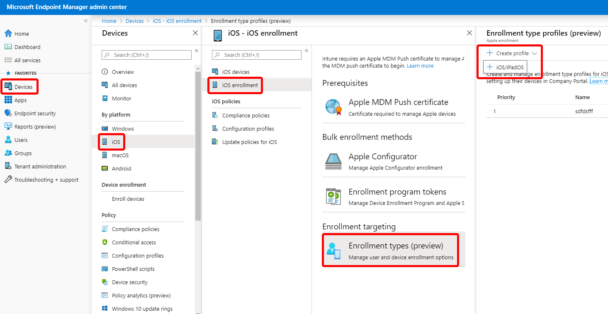
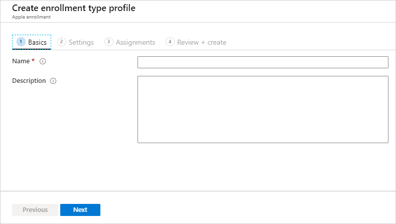
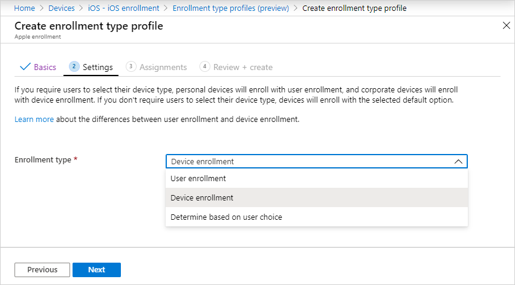
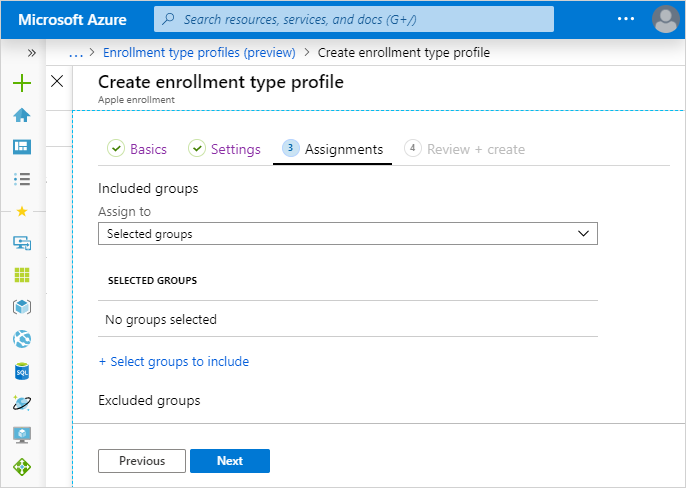

---
# required metadata

title: Enroll iOS/iPadOS devices with user enrollment in Microsoft Intune | Microsoft Docs
titleSuffix: Microsoft Intune
description: Learn how to set up iOS/iPadOS and iPadOS User Enrollment.
keywords:
author: Lenewsad
ms.author: lanewsad
manager: dougeby
ms.date: 12/21/2020
ms.topic: how-to
ms.service: microsoft-intune
ms.subservice: enrollment
ms.localizationpriority: high
ms.technology:
ms.assetid: 

# optional metadata

#ROBOTS:
#audience:

ms.reviewer: tisilver
ms.suite: ems
search.appverid: MET150
#ms.tgt_pltfrm:
ms.custom: intune-azure;seodec18
ms.collection:
  - M365-identity-device-management
  - highpri
---

# Set up iOS/iPadOS and iPadOS User Enrollment (preview)

You can set up Intune to enroll iOS/iPadOS and iPadOS devices using Apple's User Enrollment process. User Enrollment gives admins a streamlined subset of management options compared to other enrollment methods.

For more information about the options available with User Enrollment, see [User Enrollment supported actions, passwords, and other options](ios-user-enrollment-supported-actions.md).

> [!NOTE]
> Support for Apple's User Enrollment in Intune is currently in preview.

## Prerequisites
- [Mobile Device Management (MDM) Authority](../fundamentals/mdm-authority-set.md)
- [Apple MDM Push certificate](apple-mdm-push-certificate-get.md)
- [Managed Apple ID](https://support.apple.com/en-us/HT210737)
- [iOS 13 or later](https://support.apple.com/en-au/guide/security/sec38eb8731b/web)
- [Federated Authentication with Apple Business Manager](https://support.apple.com/en-euro/guide/apple-business-manager/welcome/web)

> [!NOTE]
> Apple released iPadOS in September 2019, which introduced a change that can affect Microsoft Azure Active Directory (Azure AD) and Intune customers who use Conditional Access policies in their organization. For more information about how this affects your policies and what actions to take, see [Evaluate and update Conditional Access policies after new iPadOS release](https://support.microsoft.com/topic/action-required-evaluate-and-update-conditional-access-policies-after-new-ipados-release-23795067-9048-62ad-a5bd-ad63995fc488).  

## Create a User Enrollment profile in Intune

An enrollment profile defines the settings applied to a group of devices during enrollment. 

1. Federate your Azure AD instance with Apple Business Manager or Apple School Manager. For more information, see [Intro to federated authentication with Apple Business Manager](https://support.apple.com/en-euro/guide/apple-business-manager/welcome/web).

2. In the [Microsoft Endpoint Manager admin center](https://go.microsoft.com/fwlink/?linkid=2109431), choose **Devices** > **iOS/iPadOS** > **iOS enrollment** > **Enrollment types (preview)** > **Create profile** > **iOS/iPadOS**. This profile is where you'll indicate what enrollment experience your iOS/iPadOS and iPadOS end users will have on devices not enrolled through a corporate Apple method. If you'd like to make changes, you can edit this profile after you've created it.

    

3. On the **Basics** page, enter a **Name** and **Description** for the profile for administrative purposes. Users don't see these details. You can use this **Name** field to create a dynamic group in Azure Active Directory. Use the profile name to define the enrollmentProfileName parameter to assign devices with this enrollment profile. Learn more about [Azure Active Directory dynamic groups](/azure/active-directory/active-directory-groups-dynamic-membership-azure-portal#rules-for-devices).

    

4. Select **Next**.

5. On the **Settings** page, select one of the following options for **Enrollment type**:

    

    - **Device enrollment**: All the users in this profile will use Device Enrollment.
    - **User enrollment**: All the users in this profile will use User Enrollment.
    - **Determine based on user choice**: All users in this group will be given the choice of which enrollment type to use. When users enroll their devices, they'll see an option to choose between **I own this device** and **(Company) owns this device**. If they choose the latter, the device will be enrolled by using Device Enrollment. If the user chooses **I own this device**, they'll get another option to secure the entire device or only secure work-related apps and data. The end user's selection of whether they own the device determines which enrollment type is implemented on their device. This user choice is also reflected in the Device Ownership attribute in Intune. To learn more about the user experience, see [Set up iOS/iPadOS device access to your company resources](../user-help/enroll-your-device-in-intune-ios.md).
    
6. Select **Next**.

7. On the **Assignments** page, choose the user groups containing the users to which you want this profile assigned. You can choose to assign the profile to all users or specific groups. All users in the selected groups will use the enrollment type chosen above. Device groups aren't supported for User Enrollment scenarios because the feature is based on user identities, rather than devices. You can choose to assign the profile to all users or specific groups.

    

8. Select **Next**.

9. On the **Review and Create** page, review your choices, and then select **Create** to assign the profile to the users.

    

## Profile priority

After you've created more than one enrollment type profile, you can change the priority order in which they're applied.

1. In the [Microsoft Endpoint Manager admin center](https://go.microsoft.com/fwlink/?linkid=2109431), choose **Devices** > **iOS/iPadOS** > **iOS enrollment** > **Enrollment types (preview)**.
2. Drag and drop the profiles in the list in the order you want them applied.

In case of conflicts between profiles for any user, the higher priority profile is applied for the user.
