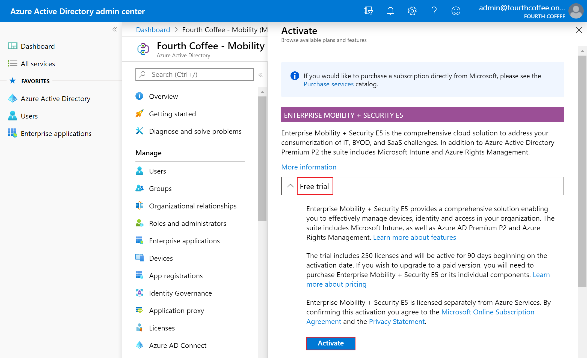
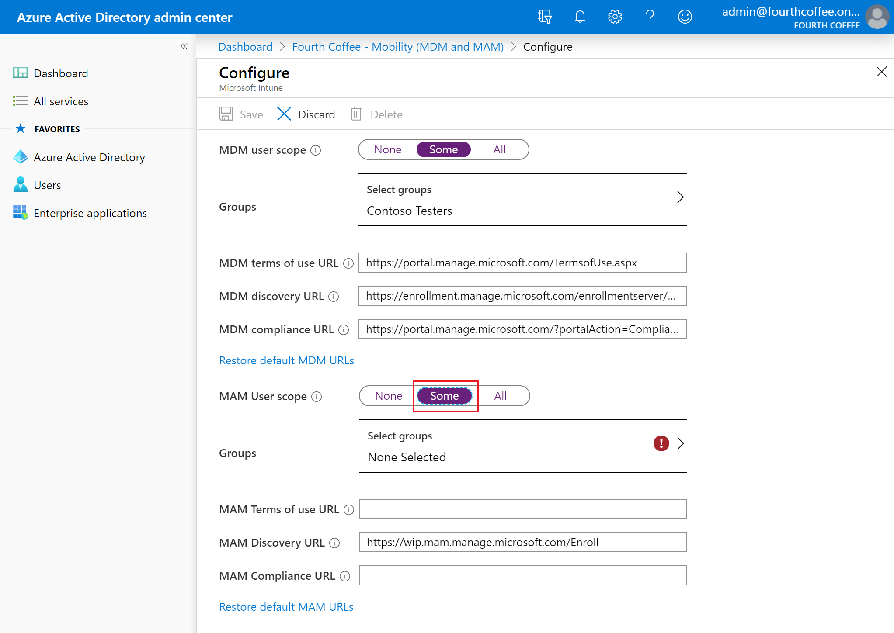

---
# required metadata

title: Quickstart - Set up automatic enrollment in Intune
description: Quickstart - Set up automatic enrollment for Windows 10/11 devices in Intune.
services: microsoft-intune
author: Lenewsad
ms.author: lanewsad
ms.service: microsoft-intune
ms.subservice: enrollment
ms.localizationpriority: high
ms.topic: quickstart
ms.date: 09/22/2020

# optional metadata

#ROBOTS:
#audience:

ms.reviewer: 
ms.suite: ems
search.appverid: MET150
#ms.tgt_pltfrm:
ms.custom: intune-classic
ms.collection:
  - M365-identity-device-management
  - highpri
---

# Quickstart: Set up automatic enrollment for Windows 10/11 devices

In this quickstart, you'll set up Microsoft Intune to automatically enroll devices when specific users sign in to Windows 10/11 devices.

If you don't have an Intune subscription, [sign up for a free trial account](../fundamentals/free-trial-sign-up.md).

## Prerequisites

- Microsoft Intune subscription - [sign up for a free trial account](../fundamentals/free-trial-sign-up.md).
- To complete this quickstart, you must first [create a user](../fundamentals/quickstart-create-user.md) and [create a group](../fundamentals/quickstart-create-group.md).

## Sign in to Intune in the Microsoft Endpoint Manager

Sign in to the [Microsoft Endpoint Manager admin center](https://go.microsoft.com/fwlink/?linkid=2109431) as a Global Administrator. If you have created an Intune Trial subscription, the account you created the subscription with is the Global administrator.

## Set up Windows 10/11 automatic enrollment

For this example, you'll use MDM enrollment so that both corporate and bring-your-own-devices can be automatically enrolled. You will sign up for a free Azure Active Directory Premium subscription.

1. In the [Microsoft Endpoint Manager admin center](https://go.microsoft.com/fwlink/?linkid=2109431), choose **All services** > **M365 Azure Active Directory** > **Azure Active Directory** > **Mobility (MDM and MAM)**.
2. Select **Get a free Premium trial to use this feature**. Selecting this option will allow auto enrollment using the Azure Active Directory free Premium trial. 

    

3. Choose the **Enterprise Mobility + Security E5** free trial option. 
4. Click **Free trial** > **Activate** the free trial.

    

    > [!NOTE]
    > It may take a minute to activate. 

3. Select **Microsoft Intune** to configure Intune. 

    

4. Select **Some** from the **MDM user scope** to use MDM auto-enrollment to manage enterprise data on your employees' Windows devices. MDM auto-enrollment will be configured for AAD joined devices and bring your own device scenarios.

    

5. Click **Select groups** > **Contoso Testers** > **Select** as the assigned group.

    

6. Select **Some** from the **MAM Users scope** to manage data on your workforce's devices.

    

7. Choose **Select groups** > **Contoso Testers** > **Select** as the assigned group. 
8. Use the default values for the remaining configuration values.
9. Choose **Save**.

## Clean up resources

To reconfigure Intune automatic enrollment, check out [Set up enrollment for Windows devices](windows-enroll.md).

## Next steps

In this quickstart, you learned how to set up auto-enrollment for devices running Windows 10/11. For more information about device enrollment, see [What is device enrollment?](device-enrollment.md)

To follow this series of Intune quickstarts, continue to the next quickstart.

> [!div class="nextstepaction"]
> [Quickstart: Enroll your Windows 10/11 device](quickstart-enroll-windows-device.md)
